# tw (GBMM) - Integrated Architecture Analysis

**Document Version:** 1.0
**Generated:** December 2025
**Project:** Global Business Management and ML Platform
**Analysis Scope:** 4 specification documents (8,860 lines)

---

## Table of Contents

1. [Executive Summary](#1-executive-summary)
2. [Complete Service Catalog](#2-complete-service-catalog)
3. [Unified System Architecture](#3-unified-system-architecture)
4. [Integration Point Matrix](#4-integration-point-matrix)
5. [Dependency Graph](#5-dependency-graph)
6. [Implementation Sequence & Roadmap](#6-implementation-sequence--roadmap)
7. [Infrastructure Requirements](#7-infrastructure-requirements)
8. [Data Flow Diagrams](#8-data-flow-diagrams)
9. [Security Architecture](#9-security-architecture)
10. [Observability & Monitoring](#10-observability--monitoring)
11. [Development & Deployment Guidelines](#11-development--deployment-guidelines)
12. [Risk Assessment & Mitigation](#12-risk-assessment--mitigation)
13. [Appendices](#13-appendices)

---

## 1. Executive Summary

### 1.1 System Overview

The **tw (GBMM)** platform is an enterprise-grade distributed system designed to provide comprehensive capabilities in:
- **Distributed Computing & ML Operations**: GPU/TPU-enabled task scheduling, distributed training, model serving
- **Data Management**: Columnar storage, SQL query execution, data cataloging with governance
- **Security & Compliance**: Authentication, authorization, secrets management, encryption (SOC 2, HIPAA, PCI-DSS, GDPR)
- **Real-time Stream Processing**: Ultra-low-latency (<1ms p99) SIMD acceleration with complex event processing

**System Composition:**
- **5 Core Services**: UCCP, NCCS, USP, UDPS, Stream Compute Service
- **Multi-Language Architecture**: Go, Rust, .NET 8, Scala, Java, Python (language choice optimized per service)
- **8,860 Lines of Specifications**: Analyzed across 4 comprehensive specification documents
- **Production-Grade Infrastructure**: PostgreSQL, Redis, Kafka, MinIO (USP service provides secrets management)

### 1.2 Key Architectural Decisions

#### 1.2.1 Security-First Design
- **mTLS Everywhere**: All inter-service communication encrypted with mutual TLS
- **Zero Trust Model**: No implicit trust between services, every call authenticated
- **Foundational Security Service**: USP provides auth, secrets, encryption to all services
- **Compliance Built-In**: SOC 2, HIPAA, PCI-DSS, GDPR requirements embedded in architecture

#### 1.2.2 Distributed Coordination
- **Raft Consensus**: UCCP uses Raft for distributed state management and leader election
- **Service Discovery**: Centralized service registry with health checking
- **Distributed Locking**: Lease-based locks for coordination across services

#### 1.2.3 Multi-Language Strategy
- **Go**: UCCP control plane (concurrency, performance, Raft implementation)
- **Rust**: Stream compute SIMD engine (zero-cost abstractions, memory safety)
- **.NET 8**: USP and NCCS (enterprise integration, C# 12 features, SignalR)
- **Scala/Java**: UDPS (JVM ecosystem, Apache Calcite, Arrow, Parquet)
- **Python**: ML operations in UCCP (TensorFlow, PyTorch, JAX integration)

#### 1.2.4 Observability by Default
- **Structured Logging**: JSON logs with correlation IDs across all services
- **Distributed Tracing**: OpenTelemetry/Jaeger spans for all requests
- **Metrics**: Prometheus endpoints on all services (ports 909X)
- **Health Checks**: `/health` and `/ready` endpoints on every service

### 1.3 Technology Stack Summary

| Layer | Technologies |
|-------|-------------|
| **Frontend** | Web, Mobile, Console, Desktop clients |
| **API Gateway** | NCCS (.NET 8) - REST + SignalR |
| **Control Plane** | UCCP (Go 1.24, Rust, Python 3.11+) |
| **Security** | USP (.NET 8, C# 12, Vault, HSM) |
| **Data Platform** | UDPS (Scala 2.13, Java 17, Calcite, Arrow, Parquet) |
| **Stream Processing** | Rust (SIMD engine), Scala 2.12 (Apache Flink), Kafka |
| **Databases** | PostgreSQL 15+, Redis 7+ |
| **Message Broker** | Apache Kafka, RabbitMQ |
| **Object Storage** | MinIO/S3 (ML artifacts, checkpoints, Parquet files) |
| **Secrets Management** | USP (Unified Security Platform) |
| **Observability** | Prometheus, Jaeger, Elasticsearch, Grafana |
| **Orchestration** | Kubernetes, Docker |

### 1.4 System Scale & Complexity

**Service Metrics:**
- **Total Services**: 5 core services + infrastructure components
- **Total Ports**: 15+ distinct service ports (gRPC, HTTPS, metrics, health)
- **Total Integration Points**: 30+ (service-to-service, databases, queues, caches)
- **Programming Languages**: 5 languages (Go, Rust, .NET/C#, Scala, Python)

**Deployment Complexity:**
- **Infrastructure Dependencies**: PostgreSQL, Redis, Kafka, MinIO, Vault, Certificate Authority
- **Network Security**: mTLS certificates for all services, TLS 1.3 required
- **Multi-Tenancy**: Namespace isolation, quota management, RBAC/ABAC
- **High Availability**: Service replication, distributed consensus, automatic failover

### 1.5 Critical Success Factors

1. **Infrastructure First**: PostgreSQL, Redis, Kafka must be operational before any service
2. **USP as Foundation**: All services depend on USP for authentication and secrets
3. **UCCP as Backbone**: Service discovery and coordination depends on UCCP stability
4. **mTLS Non-Negotiable**: Cannot bypass TLS - security is architectural, not optional
5. **Observability from Day 1**: Metrics, logs, traces required for distributed debugging

---

## 2. Complete Service Catalog

### 2.1 Service Overview Table

| Service | Dependency Level | Technology Stack | Primary Ports | Role |
|---------|-----------------|------------------|---------------|------|
| **Infrastructure** | Level 0 | PostgreSQL, Redis, Kafka, MinIO | Various | Foundation layer |
| **USP** | Level 1 | .NET 8, C# 12 | 8443, 5001, 50005, 9090 | Security foundation |
| **UCCP** | Level 2 | Go 1.24, Rust, Python 3.11+ | 50000, 8443, 50061, 9100 | Control plane |
| **UDPS** | Level 3 | Scala 2.13, Java 17 | 50060, 8443, 9090, 8081 | Data platform |
| **Stream Compute** | Level 3 | Rust, Scala 2.12 | 50060, 8081, 9096, 8082 | Stream processing |
| **NCCS** | Level 4 | .NET 8, C# 12 | 5001, 5002, 9200 | .NET client SDK |

### 2.2 Service Details

#### 2.2.1 Unified Compute & Coordination Platform (UCCP)

**Purpose**: Central control plane for distributed computing, service coordination, and ML operations.

**Technology Stack**:
- **Primary Languages**: Go 1.24, Rust, Python 3.11+
- **Frameworks**:
  - Go: gRPC, Raft (etcd/raft), Prometheus client
  - Rust: High-performance task execution
  - Python: TensorFlow, PyTorch, JAX, XGBoost, scikit-learn
- **ML Frameworks**: Ray, Horovod, DeepSpeed

**Ports**:
- **50000**: gRPC with TLS (primary API)
- **8443**: HTTPS (REST API)
- **50061**: Raft consensus protocol
- **9100**: Prometheus metrics

**Core Capabilities**:
1. **Service Coordination**
   - Service discovery and registration
   - Health checking and monitoring
   - Leader election
   - Distributed locking (lease-based, configurable TTL)

2. **Distributed Computing**
   - Task scheduling and execution
   - GPU/TPU resource management
   - Multi-node job orchestration
   - Resource quota enforcement

3. **ML Operations**
   - Distributed training (TensorFlow, PyTorch, JAX)
   - Model serving and versioning
   - Feature store with online/offline features
   - AutoML pipelines
   - Hyperparameter tuning
   - Model registry and lineage

4. **Raft Consensus**
   - 3-node minimum cluster (5-node recommended for production)
   - Leader election with configurable lease duration
   - Log replication and state machine
   - Snapshot creation and restoration

**Database Dependencies**:
- **PostgreSQL**: Service registry, task metadata, ML model registry
- **Redis**: Distributed lock state, leader election cache
- **MinIO**: ML artifacts, model checkpoints, training data

**Integration Points**:
- **Upstream**: USP (authentication, secrets), PostgreSQL, Redis, MinIO
- **Downstream**: All services register with UCCP for discovery

**Key APIs**:
- `RegisterService()`: Service registration with health check callback
- `DiscoverService()`: Service discovery by name/namespace
- `AcquireLock()`: Distributed lock acquisition
- `ScheduleTask()`: Task scheduling with resource requirements
- `TrainModel()`: Distributed ML training
- `ServeModel()`: Model serving endpoint creation

---

#### 2.2.2 .NET Compute Client Service (NCCS)

**Purpose**: .NET client interface to UCCP, providing REST API gateway and SignalR real-time communication for .NET applications.

**Technology Stack**:
- **Primary Language**: C# 12, .NET 8
- **Frameworks**:
  - ASP.NET Core 8.0
  - SignalR (real-time communication)
  - Entity Framework Core 8
  - Polly (resilience patterns)
- **NuGet SDK**: Published client library for .NET developers

**Ports**:
- **5001**: HTTPS (REST API + OpenAPI/Swagger)
- **5002**: gRPC with TLS (inter-service)
- **9200**: Prometheus metrics

**Core Capabilities**:
1. **REST API Gateway**
   - OpenAPI/Swagger documentation
   - RESTful interface to UCCP functionality
   - Request validation and transformation
   - Response caching

2. **Real-Time Communication**
   - SignalR hubs for push notifications
   - Event streaming to clients
   - Task status updates
   - Training progress notifications

3. **Client SDK**
   - NuGet package for .NET developers
   - Strongly-typed client
   - Async/await patterns
   - Automatic retries with Polly

4. **Resilience**
   - Circuit breaker patterns
   - Retry with exponential backoff
   - Timeout policies
   - Bulkhead isolation

**Database Dependencies**:
- **PostgreSQL**: Request logs, client sessions
- **Redis**: Response caching, SignalR backplane, session storage
- **RabbitMQ**: Asynchronous job processing

**Integration Points**:
- **Upstream**: UCCP (primary), USP (authentication), Redis, PostgreSQL, RabbitMQ
- **Downstream**: .NET applications, web clients, mobile apps

**Key APIs**:
- `POST /api/v1/tasks`: Submit task for execution
- `GET /api/v1/tasks/{id}`: Get task status
- `POST /api/v1/ml/train`: Train ML model
- `POST /api/v1/ml/serve`: Deploy model for serving
- `GET /api/v1/services`: List registered services
- `/hubs/tasks`: SignalR hub for real-time task updates

---

#### 2.2.3 Unified Security Platform (USP)

**Purpose**: Authentication, authorization, secrets management, and encryption for all services.

**Technology Stack**:
- **Primary Language**: C# 12, .NET 8
- **Frameworks**:
  - ASP.NET Core 8.0
  - IdentityServer4 / OpenIddict
  - Entity Framework Core 8
- **Security**:
  - Vault API compatibility (KV v2 engine)
  - HSM support (PKCS#11)
  - WebAuthn/FIDO2

**Ports**:
- **8443**: HTTPS (primary authentication API)
- **5001**: HTTPS (admin API)
- **50005**: gRPC with TLS (inter-service secrets API)
- **9090**: Prometheus metrics

**Core Capabilities**:
1. **Authentication**
   - JWT token issuance and validation
   - Multi-factor authentication (MFA)
   - WebAuthn/FIDO2 passwordless auth
   - OAuth 2.0 / OpenID Connect
   - SAML 2.0 federation

2. **Authorization**
   - Role-Based Access Control (RBAC)
   - Attribute-Based Access Control (ABAC)
   - Policy evaluation engine
   - Dynamic permission assignment

3. **Secrets Management** (Native USP Features)
   - Vault API compatible KV engine (KV v2)
   - Dynamic secrets generation
   - Secret rotation (automatic)
   - Lease management
   - Seal/unseal with Shamir's Secret Sharing

4. **Encryption**
   - AES-256-GCM encryption
   - HSM integration for key management
   - Transparent Data Encryption (TDE)
   - Column-level encryption
   - Encryption as a Service

5. **Privileged Access Management (PAM)**
   - Just-In-Time (JIT) access
   - Session recording
   - Access approval workflows
   - Break-glass procedures

6. **Compliance**
   - SOC 2 Type II controls
   - HIPAA safeguards
   - PCI-DSS requirements
   - GDPR data protection
   - NIST Cybersecurity Framework

**Database Dependencies**:
- **PostgreSQL**: User accounts, roles, policies, audit logs, encrypted secrets (AES-256-GCM)
- **Redis**: Token cache, session storage

**Integration Points**:
- **Upstream**: PostgreSQL, Redis, HSM (optional)
- **Downstream**: All services (authentication, secrets retrieval)

**Key APIs**:
- `POST /api/v1/auth/login`: User authentication
- `POST /api/v1/auth/token`: Token issuance
- `POST /api/v1/auth/validate`: Token validation
- `POST /api/v1/secrets`: Store secret
- `GET /api/v1/secrets/{path}`: Retrieve secret
- `POST /api/v1/encrypt`: Encrypt data
- `POST /api/v1/decrypt`: Decrypt data
- `POST /api/v1/rotate`: Rotate secret

---

#### 2.2.4 Unified Data Platform Service (UDPS)

**Purpose**: Columnar storage, SQL query execution, data cataloging, and governance.

**Technology Stack**:
- **Primary Languages**: Scala 2.13, Java 17
- **Frameworks**:
  - Apache Calcite (SQL query engine)
  - Apache Arrow (columnar in-memory)
  - Apache Parquet (columnar storage)
  - Akka (actor system)
- **Build**: SBT 1.9+, Maven 3.9+

**Ports**:
- **50060**: gRPC with TLS (primary query API)
- **8443**: HTTPS (REST API, catalog)
- **9090**: Prometheus metrics
- **8081**: Health check endpoint

**Core Capabilities**:
1. **Columnar Storage**
   - Parquet file format
   - Multi-codec compression (ZSTD, Snappy, LZ4, GZIP)
   - Partitioning (range, hash, list)
   - Data compaction and optimization

2. **SQL Query Engine**
   - Apache Calcite cost-based optimizer
   - Vectorized query execution (Arrow)
   - Predicate pushdown
   - Column pruning
   - Join optimization (broadcast, shuffle)

3. **Data Catalog**
   - Schema registry
   - Table metadata management
   - Data lineage tracking
   - Column-level statistics
   - Usage analytics

4. **Data Governance**
   - PII detection (regex, ML-based)
   - Data classification (public, internal, confidential, restricted)
   - Access policies per column
   - Data retention policies
   - GDPR compliance (right to erasure)

5. **ACID Transactions**
   - Snapshot isolation
   - Time travel queries (query historical data)
   - MVCC (Multi-Version Concurrency Control)

6. **Real-Time Ingest**
   - Streaming ingest from Kafka
   - Micro-batch processing
   - Schema evolution

**Database Dependencies**:
- **PostgreSQL**: Metadata catalog, schema registry, lineage graph
- **MinIO**: Parquet file storage, data lake
- **Kafka**: Real-time data ingestion

**Integration Points**:
- **Upstream**: USP (authentication), UCCP (service discovery), PostgreSQL, MinIO, Kafka
- **Downstream**: Analytics clients, BI tools, NCCS

**Key APIs**:
- `ExecuteQuery()`: SQL query execution
- `CreateTable()`: Table creation with schema
- `InsertData()`: Batch data insertion
- `GetLineage()`: Data lineage retrieval
- `ClassifyData()`: PII detection and classification
- `QueryHistory()`: Time travel queries

---

#### 2.2.5 Stream Compute Service

**Purpose**: Ultra-low-latency stream processing with SIMD acceleration and complex event processing.

**Technology Stack**:
- **Primary Languages**: Rust (SIMD engine), Scala 2.12 (Flink integration)
- **Frameworks**:
  - Rust: tokio (async runtime), rayon (parallelism)
  - Apache Flink 1.18+ (stream processing)
  - Apache Kafka (event streaming)
- **SIMD**: AVX2, AVX-512 instruction sets

**Ports**:
- **50060**: gRPC with TLS (stream management API)
- **8081**: Flink JobManager UI
- **9096**: Prometheus metrics
- **8082**: Health check endpoint

**Core Capabilities**:
1. **SIMD-Accelerated Processing**
   - Ultra-low latency (<1ms p99)
   - Vectorized operations (AVX2/AVX-512)
   - Zero-copy data processing
   - Lock-free data structures

2. **Apache Flink Integration**
   - Stateful stream processing
   - Event-time processing
   - Watermarking
   - Exactly-once semantics
   - Savepoints and checkpoints

3. **Complex Event Processing (CEP)**
   - Pattern matching on event streams
   - Temporal relationships
   - Event correlation
   - Sliding windows, tumbling windows, session windows

4. **Stream Joins**
   - Stream-stream joins
   - Stream-table joins
   - Temporal joins
   - Windowed joins

5. **Anomaly Detection**
   - Statistical anomaly detection
   - ML-based anomaly detection (integration with UCCP)
   - Outlier detection
   - Change point detection

6. **Backpressure Management**
   - Automatic backpressure propagation
   - Buffer management
   - Rate limiting

**Database Dependencies**:
- **Kafka**: Event source and sink
- **Redis**: State storage for Rust engine
- **MinIO**: Flink checkpoints and savepoints

**Integration Points**:
- **Upstream**: USP (authentication), UCCP (service discovery), Kafka, Redis, MinIO
- **Downstream**: Real-time analytics clients, UDPS (stream-to-batch)

**Key APIs**:
- `CreateStream()`: Define stream processing pipeline
- `StartJob()`: Start Flink job
- `StopJob()`: Stop Flink job with savepoint
- `DefinePattern()`: CEP pattern definition
- `ConfigureWindow()`: Window configuration
- `GetMetrics()`: Stream processing metrics

---

### 2.3 Service Interaction Matrix

| From Service | To Service | Protocol | Purpose | Criticality |
|--------------|------------|----------|---------|-------------|
| **All Services** | USP | gRPC/mTLS | Authentication, secrets | High (blocking) |
| **All Services** | UCCP | gRPC/mTLS | Service discovery | High (blocking) |
| NCCS | UCCP | gRPC/mTLS | Task submission, ML ops | High (blocking) |
| NCCS | Redis | TLS | Response caching | Medium (degraded) |
| NCCS | RabbitMQ | AMQPS | Async job processing | Medium (queued) |
| UDPS | Kafka | SSL/SASL | Real-time ingest | Medium (buffered) |
| UDPS | MinIO | HTTPS | Parquet storage | High (blocking) |
| UDPS | PostgreSQL | TLS | Metadata catalog | High (blocking) |
| Stream Compute | Kafka | SSL/SASL | Event source/sink | High (blocking) |
| Stream Compute | Redis | TLS | State storage | Medium (degraded) |
| Stream Compute | MinIO | HTTPS | Checkpoints | Medium (recovery) |
| UCCP | PostgreSQL | TLS | Service registry, task metadata | High (blocking) |
| UCCP | Redis | TLS | Lock state, leader cache | High (blocking) |
| UCCP | MinIO | HTTPS | ML artifacts, checkpoints | High (blocking) |
| USP | PostgreSQL | TLS | User accounts, audit logs, encrypted secrets | High (blocking) |
| USP | Redis | TLS | Token cache | Medium (degraded) |

**Criticality Levels**:
- **High (blocking)**: Service cannot function without this dependency
- **Medium (degraded)**: Service can function with reduced performance
- **Medium (queued)**: Requests are queued and processed later
- **Medium (buffered)**: Data is buffered locally and retried
- **Medium (recovery)**: Service can recover from this dependency failure

### 2.4 Service Communication Patterns

**Synchronous (Request-Response)**:
- Client → NCCS → UCCP: Task submission
- All Services → USP: Authentication
- NCCS → UCCP: Service discovery
- Query Client → UDPS: SQL execution

**Asynchronous (Event-Driven)**:
- NCCS → RabbitMQ → Workers: Long-running jobs
- Kafka → Stream Compute: Event processing
- Kafka → UDPS: Real-time ingest

**Publisher-Subscriber**:
- NCCS SignalR: Real-time notifications to clients
- Service events → Monitoring: Metrics, logs, traces

---

## 3. Unified System Architecture

### 3.1 High-Level Architecture Diagram

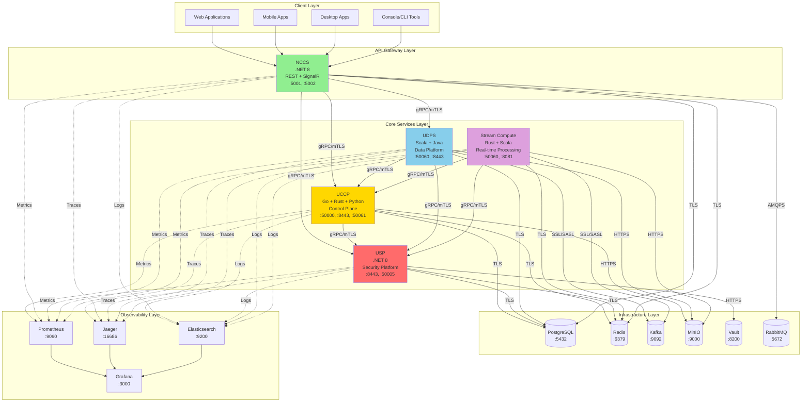

### 3.2 Service Dependency Hierarchy

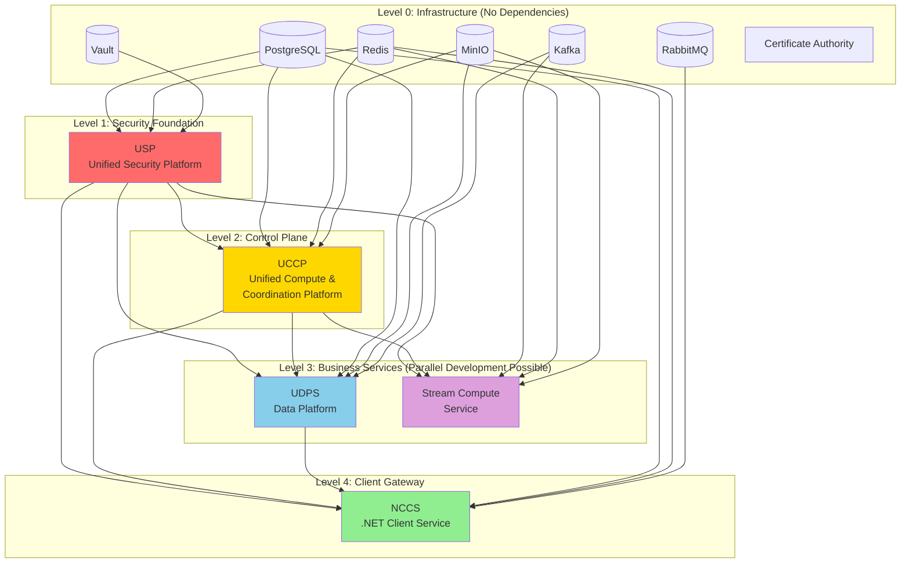

**Dependency Levels Explained:**
- **Level 0**: Pure infrastructure - no code dependencies, can be set up first
- **Level 1**: USP depends only on infrastructure, provides security to all other services
- **Level 2**: UCCP depends on USP + infrastructure, provides coordination to all other services
- **Level 3**: UDPS and Stream Compute can be developed in parallel (both depend on USP + UCCP)
- **Level 4**: NCCS depends on all other services (client gateway)

### 3.3 Security Architecture (mTLS Boundaries)

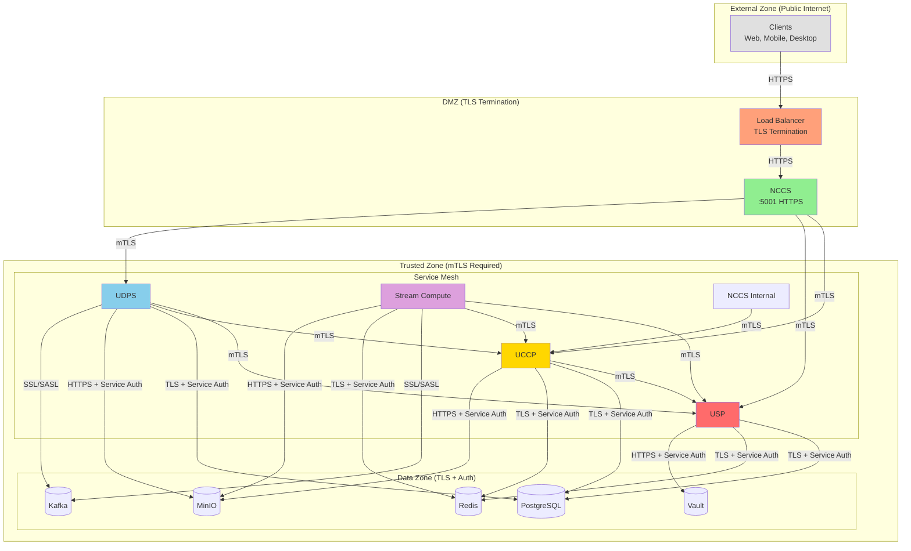

**Security Zones:**
1. **External Zone**: Public internet, untrusted
2. **DMZ**: TLS termination, NCCS exposed via HTTPS
3. **Trusted Zone**: All inter-service communication via mTLS, certificate-based authentication
4. **Data Zone**: Infrastructure services with TLS + service authentication

### 3.4 Data Flow Architecture

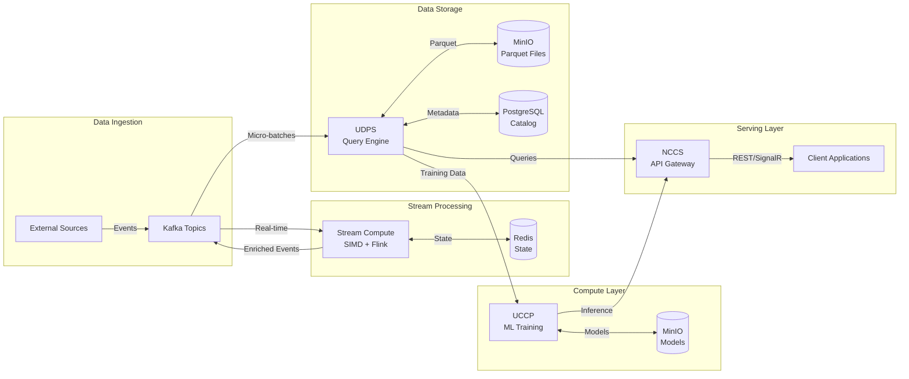

### 3.5 Multi-Tenancy Architecture

All services support multi-tenancy through **namespace isolation**:

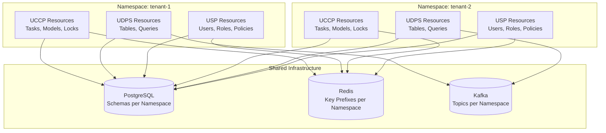

**Multi-Tenancy Features:**
- **Namespace Isolation**: All resources scoped to namespaces (e.g., `tenant-1/model-xyz`)
- **Quota Management**: CPU, memory, GPU, storage limits per namespace
- **Access Control**: RBAC/ABAC policies scoped to namespaces
- **Data Isolation**: PostgreSQL schemas, Redis key prefixes, MinIO buckets per namespace
- **Network Isolation**: Optional VPC peering per tenant

### 3.6 High Availability Architecture

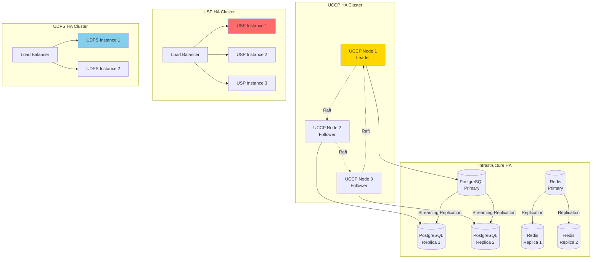

**HA Characteristics:**
- **UCCP**: Raft-based HA with leader election, minimum 3 nodes, tolerates 1 node failure
- **USP**: Active-active load balanced, stateless (state in PostgreSQL/Redis), tolerates N-1 failures
- **UDPS**: Active-active load balanced, query routing to healthy nodes
- **Stream Compute**: Flink HA with JobManager standby, savepoints for recovery
- **PostgreSQL**: Streaming replication, automatic failover with Patroni/pgpool
- **Redis**: Redis Sentinel for automatic failover, 3-node setup
- **Kafka**: Multi-broker cluster, replication factor 3, min in-sync replicas 2

---

## 4. Integration Point Matrix

### 4.1 Service-to-Service Integration Points

#### 4.1.1 UCCP Integration Points

**Outbound Integrations (UCCP → Other Services):**

| Target Service | Protocol | Port | Purpose | Data Exchanged | Frequency | SLA |
|----------------|----------|------|---------|----------------|-----------|-----|
| USP | gRPC/mTLS | 50005 | Authentication, secrets retrieval | JWT tokens, secrets | Every request | <10ms |
| PostgreSQL | TLS | 5432 | Service registry, task metadata, ML model registry | SQL queries, task data | High | <50ms |
| Redis | TLS | 6379 | Distributed locks, leader election cache | Lock state, cache data | Very High | <5ms |
| MinIO | HTTPS | 9000 | ML artifacts, model checkpoints, training data | Binary objects (models, datasets) | Medium | <100ms |

**Inbound Integrations (Other Services → UCCP):**

| Source Service | Protocol | Port | API Endpoints | Purpose | Rate Limit |
|----------------|----------|------|---------------|---------|------------|
| NCCS | gRPC/mTLS | 50000 | `RegisterService`, `DiscoverService`, `ScheduleTask`, `TrainModel` | Task submission, service discovery | 10,000 req/s |
| UDPS | gRPC/mTLS | 50000 | `RegisterService`, `DiscoverService` | Service registration | 100 req/s |
| Stream Compute | gRPC/mTLS | 50000 | `RegisterService`, `DiscoverService` | Service registration | 100 req/s |
| USP | gRPC/mTLS | 50000 | `RegisterService`, `DiscoverService` | Service registration | 100 req/s |

---

#### 4.1.2 USP Integration Points

**Outbound Integrations (USP → Other Services):**

| Target Service | Protocol | Port | Purpose | Data Exchanged | Frequency | SLA |
|----------------|----------|------|---------|----------------|-----------|-----|
| PostgreSQL | TLS | 5432 | User accounts, roles, policies, audit logs, encrypted secrets | SQL queries, user data, secrets storage | High | <50ms |
| Redis | TLS | 6379 | Token cache, session storage | Cached tokens, sessions | Very High | <5ms |
| HSM (optional) | PKCS#11 | - | Hardware key management | Cryptographic operations | Low | <100ms |

**Inbound Integrations (Other Services → USP):**

| Source Service | Protocol | Port | API Endpoints | Purpose | Rate Limit |
|----------------|----------|------|---------------|---------|------------|
| All Services | gRPC/mTLS | 50005 | `Authenticate`, `ValidateToken`, `GetSecret`, `RotateSecret` | Authentication, secrets | 50,000 req/s |
| Client Apps | HTTPS | 8443 | `/api/v1/auth/login`, `/api/v1/auth/token`, `/api/v1/encrypt` | User authentication | 5,000 req/s |
| Admin | HTTPS | 5001 | Admin APIs (user management, policy mgmt) | Administration | 100 req/s |

---

#### 4.1.3 NCCS Integration Points

**Outbound Integrations (NCCS → Other Services):**

| Target Service | Protocol | Port | Purpose | Data Exchanged | Frequency | SLA |
|----------------|----------|------|---------|----------------|-----------|-----|
| UCCP | gRPC/mTLS | 50000 | Task submission, ML operations, service discovery | Task requests, model training requests | High | <50ms |
| USP | gRPC/mTLS | 50005 | Authentication, token validation | JWT tokens | Very High | <10ms |
| UDPS | gRPC/mTLS | 50060 | SQL queries, data catalog access | SQL queries, metadata | Medium | <200ms |
| PostgreSQL | TLS | 5432 | Request logs, client sessions | SQL queries | Medium | <50ms |
| Redis | TLS | 6379 | Response caching, SignalR backplane, session storage | Cache data, SignalR messages | Very High | <5ms |
| RabbitMQ | AMQPS | 5672 | Asynchronous job processing | Job messages | Medium | <20ms |

**Inbound Integrations (Other Services → NCCS):**

| Source Service | Protocol | Port | API Endpoints | Purpose | Rate Limit |
|----------------|----------|------|---------------|---------|------------|
| Client Apps | HTTPS | 5001 | REST APIs, SignalR hubs | Task submission, real-time updates | 20,000 req/s |
| Other Services | gRPC/mTLS | 5002 | Inter-service communication | Service integration | 5,000 req/s |

---

#### 4.1.4 UDPS Integration Points

**Outbound Integrations (UDPS → Other Services):**

| Target Service | Protocol | Port | Purpose | Data Exchanged | Frequency | SLA |
|----------------|----------|------|---------|----------------|-----------|-----|
| USP | gRPC/mTLS | 50005 | Authentication, secrets | JWT tokens, database credentials | High | <10ms |
| UCCP | gRPC/mTLS | 50000 | Service registration, discovery | Service metadata | Low | <50ms |
| PostgreSQL | TLS | 5432 | Metadata catalog, schema registry, lineage graph | SQL queries, metadata | High | <50ms |
| MinIO | HTTPS | 9000 | Parquet file storage, data lake | Binary files (Parquet) | Very High | <100ms |
| Kafka | SSL/SASL | 9092 | Real-time data ingestion | Event streams | Very High | <10ms |

**Inbound Integrations (Other Services → UDPS):**

| Source Service | Protocol | Port | API Endpoints | Purpose | Rate Limit |
|----------------|----------|------|---------------|---------|------------|
| NCCS | gRPC/mTLS | 50060 | `ExecuteQuery`, `GetLineage`, `ClassifyData` | SQL queries, data governance | 10,000 req/s |
| BI Tools | HTTPS | 8443 | REST API for queries and catalog | Data analysis | 1,000 req/s |
| Analytics Clients | gRPC/mTLS | 50060 | Query execution, metadata access | Data retrieval | 5,000 req/s |

---

#### 4.1.5 Stream Compute Integration Points

**Outbound Integrations (Stream Compute → Other Services):**

| Target Service | Protocol | Port | Purpose | Data Exchanged | Frequency | SLA |
|----------------|----------|------|---------|----------------|-----------|-----|
| USP | gRPC/mTLS | 50005 | Authentication, secrets | JWT tokens, Kafka credentials | High | <10ms |
| UCCP | gRPC/mTLS | 50000 | Service registration, ML model access for anomaly detection | Service metadata, ML models | Medium | <50ms |
| Kafka | SSL/SASL | 9092 | Event source and sink | Event streams | Very High | <1ms |
| Redis | TLS | 6379 | State storage for Rust engine | State data | Very High | <5ms |
| MinIO | HTTPS | 9000 | Flink checkpoints and savepoints | Binary checkpoint data | Low | <100ms |

**Inbound Integrations (Other Services → Stream Compute):**

| Source Service | Protocol | Port | API Endpoints | Purpose | Rate Limit |
|----------------|----------|------|---------------|---------|------------|
| Analytics Clients | gRPC/mTLS | 50060 | `CreateStream`, `StartJob`, `DefinePattern` | Stream pipeline management | 100 req/s |
| Flink UI Users | HTTPS | 8081 | Flink JobManager UI | Monitoring, job management | N/A (UI) |

---

### 4.2 Database Integration Points

#### 4.2.1 PostgreSQL Integrations

| Service | Schema/Database | Primary Tables | Access Pattern | Connection Pool Size |
|---------|-----------------|----------------|----------------|---------------------|
| **UCCP** | `uccp_db` | `services`, `tasks`, `ml_models`, `locks`, `raft_log` | Read-heavy (service discovery), Write-heavy (task logs) | 50 connections |
| **USP** | `usp_db` | `users`, `roles`, `policies`, `audit_logs`, `secrets_metadata` | Read-heavy (auth), Write-heavy (audit) | 100 connections |
| **NCCS** | `nccs_db` | `request_logs`, `client_sessions` | Write-heavy (logging) | 30 connections |
| **UDPS** | `udps_db` | `catalog_tables`, `catalog_columns`, `lineage`, `data_classifications` | Read-heavy (metadata), Write-moderate (lineage) | 40 connections |

**Total PostgreSQL Load:**
- **Peak Connections**: ~220 connections
- **QPS**: ~50,000 queries/second (mostly reads)
- **Storage**: ~500 GB (metadata, logs, state)

**PostgreSQL Configuration Requirements:**
- `max_connections`: 300+
- `shared_buffers`: 16 GB
- `effective_cache_size`: 48 GB
- `wal_level`: `replica`
- SSL/TLS: Required
- Authentication: Certificate-based

---

#### 4.2.2 Redis Integrations

| Service | Key Patterns | Data Types | TTL | Access Pattern | Est. Size |
|---------|--------------|------------|-----|----------------|-----------|
| **UCCP** | `lock:*`, `leader:*`, `cache:service:*` | Strings, Hashes | Lock: 30s, Cache: 5min | Very High (read/write) | 5 GB |
| **USP** | `token:*`, `session:*` | Strings, Hashes | Token: 1hr, Session: 24hr | Very High (read) | 10 GB |
| **NCCS** | `cache:response:*`, `signalr:*` | Strings, Pub/Sub | 10 min | Very High (read/write) | 5 GB |
| **Stream Compute** | `state:*` | Hashes | None (persistent) | Very High (write) | 20 GB |

**Total Redis Load:**
- **Peak Connections**: ~150 connections
- **OPS**: ~100,000 operations/second
- **Storage**: ~40 GB (in-memory)

**Redis Configuration Requirements:**
- `maxmemory`: 64 GB
- `maxmemory-policy`: `allkeys-lru` (for caches), `noeviction` (for state)
- TLS: Required
- Authentication: ACL with passwords from USP
- Persistence: RDB + AOF

---

#### 4.2.3 Kafka Integrations

| Service | Role | Topics | Partitions | Replication Factor | Consumer Groups |
|---------|------|--------|------------|-------------------|-----------------|
| **UDPS** | Consumer | `raw-events`, `data-ingestion` | 32 | 3 | `udps-ingest-group` |
| **Stream Compute** | Producer + Consumer | `raw-events`, `enriched-events`, `anomalies`, `alerts` | 64 | 3 | `stream-compute-group`, `flink-job-*` |

**Total Kafka Load:**
- **Topics**: ~10 topics
- **Total Partitions**: ~200 partitions
- **Throughput**: ~500,000 messages/second
- **Retention**: 7 days
- **Storage**: ~5 TB (raw event data)

**Kafka Configuration Requirements:**
- **Brokers**: Minimum 5 brokers
- **Zookeeper**: 3-node ensemble (or KRaft mode)
- `min.insync.replicas`: 2
- `acks`: `all` (for critical topics)
- SSL/SASL: Required
- Authentication: SASL/SCRAM from USP

---

#### 4.2.4 MinIO Integrations

| Service | Buckets | Object Types | Access Pattern | Est. Size |
|---------|---------|--------------|----------------|-----------|
| **UCCP** | `ml-models`, `ml-artifacts`, `checkpoints`, `training-data` | Model files, datasets, checkpoints | Write-moderate, Read-high | 10 TB |
| **UDPS** | `data-lake`, `parquet-files`, `exports` | Parquet files, exports | Write-high, Read-high | 50 TB |
| **Stream Compute** | `flink-checkpoints`, `flink-savepoints` | Checkpoint data | Write-low, Read-low (recovery only) | 2 TB |

**Total MinIO Load:**
- **Total Storage**: ~62 TB
- **Throughput**: ~5 GB/s (write), ~10 GB/s (read)
- **IOPS**: ~50,000 IOPS

**MinIO Configuration Requirements:**
- **Nodes**: Minimum 4 nodes (distributed mode)
- **Disks**: 16+ drives per node
- **Erasure Coding**: EC:4 (4 parity drives)
- TLS: Required
- Authentication: IAM policies from USP

---

#### 4.2.5 RabbitMQ Integrations

| Service | Role | Exchanges | Queues | Message Rate | Message Size |
|---------|------|-----------|--------|--------------|--------------|
| **NCCS** | Producer + Consumer | `nccs.direct`, `nccs.fanout` | `long-running-jobs`, `notifications` | 10,000 msg/s | 10 KB avg |

**Total RabbitMQ Load:**
- **Exchanges**: 2 exchanges
- **Queues**: 5 queues
- **Throughput**: ~10,000 messages/second
- **Storage**: ~100 GB (persistent messages)

**RabbitMQ Configuration Requirements:**
- **Nodes**: 3-node cluster
- `vm_memory_high_watermark`: 0.6
- TLS: Required
- Authentication: Username/password from USP

---

### 4.3 Secrets & Configuration Integration Points

#### 4.3.1 Vault Secret Paths

| Service | Secret Paths | Secret Types | Rotation Frequency |
|---------|--------------|--------------|-------------------|
| **UCCP** | `secret/uccp/postgres`, `secret/uccp/redis`, `secret/uccp/minio` | Database credentials, API keys | Weekly |
| **USP** | `secret/usp/postgres`, `secret/usp/master-key`, `secret/usp/hsm` | Database credentials, master key | Weekly (credentials), Never (master key) |
| **NCCS** | `secret/nccs/postgres`, `secret/nccs/redis`, `secret/nccs/rabbitmq` | Database credentials, queue credentials | Weekly |
| **UDPS** | `secret/udps/postgres`, `secret/udps/minio`, `secret/udps/kafka` | Database credentials, S3 credentials, Kafka credentials | Weekly |
| **Stream Compute** | `secret/stream/kafka`, `secret/stream/redis`, `secret/stream/minio` | Kafka credentials, Redis credentials, S3 credentials | Weekly |

**Vault Access Pattern:**
- **Requests/second**: ~1,000 (mostly reads)
- **Lease TTL**: 1 hour (auto-renewed)
- **Auth Method**: AppRole (service authentication)

---

### 4.4 Observability Integration Points

#### 4.4.1 Prometheus Metrics Endpoints

| Service | Metrics Port | Key Metrics Exposed | Scrape Interval |
|---------|-------------|---------------------|-----------------|
| **UCCP** | 9100 | `uccp_tasks_total`, `uccp_service_registry_size`, `uccp_raft_leader`, `uccp_locks_active` | 15s |
| **USP** | 9090 | `usp_auth_requests_total`, `usp_token_validations_total`, `usp_secrets_accessed` | 15s |
| **NCCS** | 9200 | `nccs_http_requests_total`, `nccs_signalr_connections`, `nccs_cache_hit_rate` | 15s |
| **UDPS** | 9090 | `udps_queries_total`, `udps_query_duration`, `udps_parquet_files_written` | 15s |
| **Stream Compute** | 9096 | `stream_events_processed`, `stream_processing_latency`, `stream_flink_jobs` | 15s |

**Prometheus Load:**
- **Total Metrics**: ~5,000 time series per service (25,000 total)
- **Scrape Rate**: 15 seconds
- **Retention**: 30 days
- **Storage**: ~200 GB

---

#### 4.4.2 Jaeger Tracing Integration

| Service | Trace Sampling Rate | Span Tags | Trace Propagation |
|---------|---------------------|-----------|-------------------|
| **All Services** | 1% (production), 100% (dev) | `service.name`, `namespace`, `user.id`, `trace.id` | gRPC metadata, HTTP headers |

**Jaeger Load:**
- **Spans/second**: ~100,000 spans/second (1% sampling)
- **Storage**: ~500 GB (7-day retention)
- **Backend**: Elasticsearch

---

#### 4.4.3 Logging Integration

| Service | Log Level (Production) | Log Format | Destination | Log Rate |
|---------|----------------------|------------|-------------|----------|
| **All Services** | `INFO` | JSON (structured) | Elasticsearch | ~50,000 logs/s |

**Elasticsearch Load:**
- **Indices**: Daily indices per service
- **Storage**: ~1 TB (30-day retention)
- **Shards**: 5 primary shards per index

---

### 4.5 Integration Summary Statistics

**Total Integration Points:** 47 integration points

**By Category:**
- **Service-to-Service**: 10 gRPC/mTLS endpoints
- **Database**: 4 databases (PostgreSQL, Redis, Kafka, MinIO), 1 queue (RabbitMQ), 1 vault (Vault)
- **Secrets**: 5 services × ~3 secret paths = 15 secret paths
- **Observability**: 5 metrics endpoints, 1 tracing backend, 1 logging backend

**By Protocol:**
- **gRPC/mTLS**: 10 integrations (inter-service)
- **HTTPS/TLS**: 8 integrations (MinIO, Vault, external APIs)
- **PostgreSQL/TLS**: 4 integrations
- **Redis/TLS**: 4 integrations
- **Kafka SSL/SASL**: 2 integrations
- **RabbitMQ AMQPS**: 1 integration

**Critical Path Integrations (High Priority):**
1. All Services → USP (authentication) - **Blocking**
2. All Services → UCCP (service discovery) - **Blocking**
3. UCCP → PostgreSQL (service registry) - **Blocking**
4. USP → Vault (secrets) - **Blocking**

---

## 5. Dependency Graph

### 5.1 Complete Dependency Graph

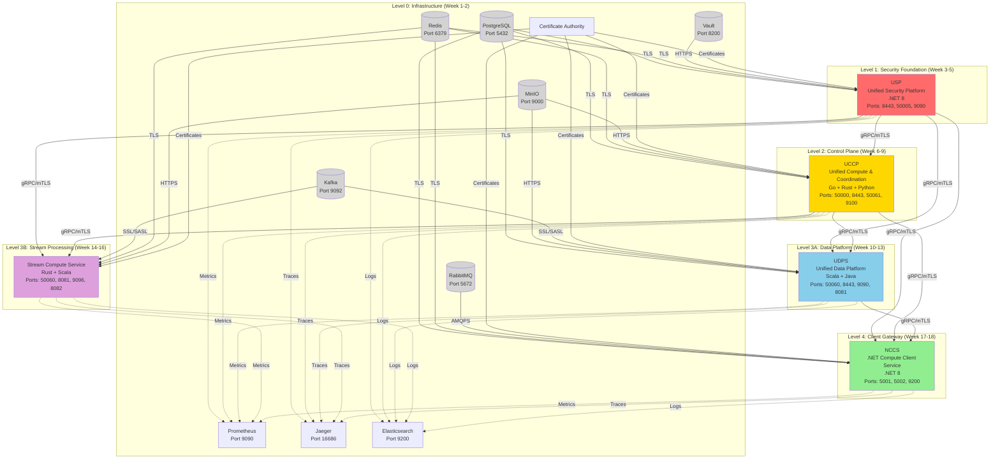

### 5.2 Dependency Levels Analysis

#### Level 0: Infrastructure (No Code Dependencies)

**Components:**
1. **PostgreSQL** - Relational database
2. **Redis** - In-memory cache and state store
3. **Kafka** - Event streaming platform
4. **MinIO** - Object storage
5. **Vault** - Secrets management
6. **RabbitMQ** - Message broker
7. **Certificate Authority** - mTLS certificate issuance
8. **Prometheus** - Metrics collection
9. **Jaeger** - Distributed tracing
10. **Elasticsearch** - Log aggregation

**Implementation Timeline:** Week 1-2

**Can Start Immediately:** Yes - no dependencies

**Parallel Development:** All infrastructure components can be set up in parallel

---

#### Level 1: Security Foundation

**Service:** USP (Unified Security Platform)

**Dependencies:**
- PostgreSQL (user accounts, roles, audit logs)
- Redis (token cache, sessions)
- Certificate Authority (mTLS certificates)

**Blocks:** All other services (they depend on USP for authentication)

**Implementation Timeline:** Week 3-5

**Can Start After:** Infrastructure (Level 0) is operational

**Critical Path:** YES - All services block on USP

---

#### Level 2: Control Plane

**Service:** UCCP (Unified Compute & Coordination Platform)

**Dependencies:**
- **Level 1**: USP (authentication, secrets)
- **Level 0**: PostgreSQL, Redis, MinIO, CA

**Blocks:** UDPS, Stream Compute, NCCS (they depend on UCCP for service discovery)

**Implementation Timeline:** Week 6-9

**Can Start After:** USP is operational

**Critical Path:** YES - Most services block on UCCP

---

#### Level 3: Business Services (Parallel Development Possible)

**Services:** UDPS, Stream Compute Service

##### Level 3A: UDPS (Unified Data Platform Service)

**Dependencies:**
- **Level 2**: UCCP (service discovery)
- **Level 1**: USP (authentication)
- **Level 0**: PostgreSQL, MinIO, Kafka, CA

**Blocks:** NCCS (optional - NCCS can expose UDPS APIs)

**Implementation Timeline:** Week 10-13

**Can Start After:** UCCP is operational

**Parallel with:** Stream Compute Service

##### Level 3B: Stream Compute Service

**Dependencies:**
- **Level 2**: UCCP (service discovery, ML model access)
- **Level 1**: USP (authentication)
- **Level 0**: Kafka, Redis, MinIO, CA

**Blocks:** None

**Implementation Timeline:** Week 14-16

**Can Start After:** UCCP is operational

**Parallel with:** UDPS (if team capacity allows)

---

#### Level 4: Client Gateway

**Service:** NCCS (.NET Compute Client Service)

**Dependencies:**
- **Level 3**: UDPS (optional - for data queries)
- **Level 2**: UCCP (task submission, ML operations)
- **Level 1**: USP (authentication)
- **Level 0**: PostgreSQL, Redis, RabbitMQ, CA

**Blocks:** None (top-level client gateway)

**Implementation Timeline:** Week 17-18

**Can Start After:** UCCP is operational (UDPS optional)

**Critical Path:** NO - Does not block other services

---

### 5.3 Critical Path Analysis

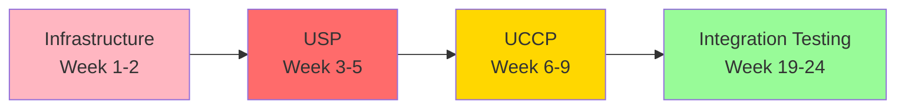

**Critical Path: Infrastructure → USP → UCCP → Integration**

**Total Critical Path Duration:** 18 weeks minimum

**Explanation:**
1. **Infrastructure (Week 1-2)**: Must complete before any service
2. **USP (Week 3-5)**: Blocks all services that need authentication (all of them)
3. **UCCP (Week 6-9)**: Blocks all services that need service discovery (UDPS, Stream, NCCS)
4. **Integration (Week 19-24)**: Cannot start until at least UCCP + one business service is ready

**Services NOT on Critical Path:**
- UDPS (Level 3A) - Can delay without blocking NCCS
- Stream Compute (Level 3B) - Can delay without blocking other services
- NCCS (Level 4) - Client gateway, does not block other services

**Risk Mitigation:**
- If USP is delayed by 1 week, entire project delays by 1 week
- If UCCP is delayed by 1 week, entire project delays by 1 week
- If UDPS is delayed, only affects data query functionality in NCCS

---

### 5.4 Dependency Matrix

| Service | Level | Depends On (Blocking) | Depends On (Non-Blocking) | Blocks |
|---------|-------|----------------------|---------------------------|--------|
| **Infrastructure** | 0 | None | None | All services |
| **USP** | 1 | PostgreSQL, Redis, Vault, CA | None | UCCP, UDPS, Stream Compute, NCCS |
| **UCCP** | 2 | USP, PostgreSQL, Redis, MinIO, CA | None | UDPS, Stream Compute, NCCS |
| **UDPS** | 3A | USP, UCCP, PostgreSQL, MinIO, Kafka, CA | None | NCCS (optional) |
| **Stream Compute** | 3B | USP, UCCP, Kafka, Redis, MinIO, CA | None | None |
| **NCCS** | 4 | USP, UCCP, PostgreSQL, Redis, RabbitMQ, CA | UDPS | None |

**Blocking Dependency:** Service cannot function without this dependency

**Non-Blocking Dependency:** Service has reduced functionality without this dependency

---

### 5.5 Circular Dependency Analysis

**Result:** ✅ No circular dependencies detected

**Validation:**
- USP → UCCP ✅ (one-way)
- UCCP → USP ❌ (UCCP depends on USP, not vice versa)
- UDPS → UCCP ✅ (one-way)
- UDPS → USP ✅ (one-way)
- Stream Compute → UCCP ✅ (one-way)
- NCCS → All ✅ (one-way, top-level gateway)

**Graph Properties:**
- **Type:** Directed Acyclic Graph (DAG)
- **Levels:** 5 levels (0-4)
- **Max Path Length:** 4 (Infrastructure → USP → UCCP → UDPS → NCCS)

---

### 5.6 Parallel Development Opportunities

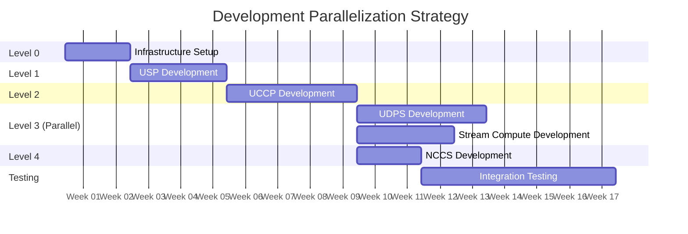

**Parallel Development Groups:**

**Group 1 (Week 1-2):** Infrastructure Team
- Set up PostgreSQL, Redis, Kafka, MinIO, Vault, RabbitMQ
- Configure Certificate Authority
- Deploy observability (Prometheus, Jaeger, Elasticsearch)

**Group 2 (Week 3-5):** USP Team
- Develop USP service (single team, critical path)
- Cannot be parallelized

**Group 3 (Week 6-9):** UCCP Team
- Develop UCCP service (single team, critical path)
- Cannot be parallelized

**Group 4 (Week 10-16):** **PARALLEL DEVELOPMENT**
- **Team A (Week 10-13):** UDPS development
- **Team B (Week 14-16):** Stream Compute development
- **Team C (Week 10-16):** NCCS development (can start after UCCP, does not need UDPS/Stream)

**Group 5 (Week 17-24):** Integration Team
- Cross-service integration testing
- End-to-end workflows
- Performance testing

**Maximum Parallelization:**
- Week 10-16: Up to 3 teams can work in parallel (UDPS, Stream Compute, NCCS)

---

### 5.7 Dependency Risk Assessment

| Dependency | Criticality | Risk Level | Mitigation |
|------------|-------------|-----------|------------|
| Infrastructure → All Services | **Critical** | High | Set up infrastructure first, use docker-compose for local dev |
| All Services → USP | **Critical** | High | USP is on critical path, use mock auth for local dev/testing |
| All Services → UCCP | **Critical** | High | UCCP is on critical path, use mock discovery for local dev |
| UCCP → PostgreSQL | **Critical** | Medium | Use connection pooling, implement retry logic |
| USP → Vault | **Critical** | Medium | Implement fallback to local secrets in dev, monitor Vault health |
| UDPS → Kafka | **High** | Medium | Implement buffering, graceful degradation on Kafka failure |
| Stream → Kafka | **High** | Medium | Implement backpressure, use Flink checkpoints for recovery |
| NCCS → RabbitMQ | **Medium** | Low | Queue is for async jobs, can tolerate temporary failures |

**Risk Mitigation Strategies:**
1. **Infrastructure**: Docker Compose for local development, Terraform for production
2. **USP/UCCP Critical Path**: Prioritize these services, allocate senior engineers
3. **Database Failures**: Connection pooling, circuit breakers, retry with exponential backoff
4. **Kafka Failures**: Local buffering, backpressure management
5. **Vault Failures**: Local dev secrets, health monitoring with alerts

---

### 5.8 Dependency Validation Checklist

Before starting service development, validate dependencies:

**For USP (Level 1):**
- [ ] PostgreSQL operational (can connect, create schemas)
- [ ] Redis operational (can set/get keys)
- [ ] Vault operational (can store/retrieve secrets)
- [ ] CA operational (can issue certificates)

**For UCCP (Level 2):**
- [ ] USP operational (can authenticate, get secrets)
- [ ] PostgreSQL operational
- [ ] Redis operational
- [ ] MinIO operational (can upload/download objects)

**For UDPS (Level 3A):**
- [ ] USP operational
- [ ] UCCP operational (service discovery working)
- [ ] PostgreSQL operational
- [ ] MinIO operational
- [ ] Kafka operational (can produce/consume messages)

**For Stream Compute (Level 3B):**
- [ ] USP operational
- [ ] UCCP operational
- [ ] Kafka operational
- [ ] Redis operational
- [ ] MinIO operational

**For NCCS (Level 4):**
- [ ] USP operational
- [ ] UCCP operational
- [ ] PostgreSQL operational
- [ ] Redis operational
- [ ] RabbitMQ operational

---

## 6. Implementation Sequence & Roadmap

### 6.1 Overall Timeline

**Total Duration:** 24 weeks (6 months)

**Phases:**
1. **Phase 0:** Infrastructure Setup (Week 1-2)
2. **Phase 1:** Security Foundation (Week 3-5)
3. **Phase 2:** Control Plane (Week 6-9)
4. **Phase 3:** Data Platform (Week 10-13)
5. **Phase 4:** Stream Processing (Week 14-16)
6. **Phase 5:** Client Gateway (Week 17-18)
7. **Phase 6:** Integration & Testing (Week 19-24)

---

### 6.2 Phase 0: Infrastructure Setup (Week 1-2)

**Goal:** Deploy and configure all infrastructure components for local development and production environments.

**Team:** Infrastructure/DevOps Team (2-3 engineers)

#### Week 1: Core Infrastructure

**Tasks:**
1. **PostgreSQL Setup**
   - Install PostgreSQL 15+ (3-node cluster for production)
   - Configure streaming replication
   - Enable TLS/SSL
   - Create databases: `uccp_db`, `usp_db`, `nccs_db`, `udps_db`
   - Set up connection pooling (PgBouncer/Pgpool)
   - Configure backup strategy (daily full + hourly incremental)

2. **Redis Setup**
   - Install Redis 7+ (3-node cluster with Sentinel)
   - Configure persistence (RDB + AOF)
   - Enable TLS/SSL
   - Configure `maxmemory` policies
   - Set up monitoring

3. **Certificate Authority Setup**
   - Deploy private CA (e.g., Smallstep, CFSSL, or Vault PKI)
   - Generate root CA certificate
   - Create intermediate CA for service certificates
   - Set up certificate lifecycle management

**Deliverables:**
- [ ] PostgreSQL cluster operational, all databases created
- [ ] Redis cluster operational with Sentinel
- [ ] CA operational, can issue certificates
- [ ] Local development `docker-compose.yml` with PostgreSQL, Redis
- [ ] Documentation: connection strings, credentials management

**Validation Criteria:**
- PostgreSQL: Can connect, create tables, replicate data
- Redis: Can SET/GET keys, failover works
- CA: Can issue and revoke certificates

---

#### Week 2: Messaging, Storage & Observability

**Tasks:**
1. **Kafka Setup**
   - Install Apache Kafka 3.6+ (5-broker cluster)
   - Configure SSL/SASL authentication
   - Create topics: `raw-events`, `enriched-events`, `data-ingestion`, `anomalies`, `alerts`
   - Configure replication factor: 3, min in-sync replicas: 2
   - Set up monitoring (JMX metrics)

2. **MinIO Setup**
   - Install MinIO (4-node distributed setup)
   - Configure erasure coding (EC:4)
   - Enable TLS/SSL
   - Create buckets: `ml-models`, `ml-artifacts`, `checkpoints`, `training-data`, `data-lake`, `parquet-files`, `flink-checkpoints`
   - Set up lifecycle policies

3. **RabbitMQ Setup**
   - Install RabbitMQ 3.12+ (3-node cluster)
   - Enable TLS/SSL
   - Create exchanges: `nccs.direct`, `nccs.fanout`
   - Create queues: `long-running-jobs`, `notifications`

5. **Observability Setup**
   - Deploy Prometheus (with persistent storage)
   - Deploy Jaeger (with Elasticsearch backend)
   - Deploy Elasticsearch (for logs and traces)
   - Deploy Grafana (with Prometheus, Jaeger datasources)
   - Create initial dashboards

**Deliverables:**
- [ ] Kafka cluster operational, topics created
- [ ] MinIO cluster operational, buckets created
- [ ] RabbitMQ cluster operational
- [ ] Prometheus scraping itself
- [ ] Jaeger accepting traces
- [ ] Elasticsearch indexing data
- [ ] Grafana dashboards accessible
- [ ] Updated `docker-compose.infra.yml` with all infrastructure

**Note**: USP service (secrets management) is deployed separately as an application service.

**Validation Criteria:**
- Kafka: Can produce/consume messages, SSL/SASL working
- MinIO: Can upload/download objects, erasure coding working
- Vault: Can store/retrieve secrets, AppRole auth working
- RabbitMQ: Can publish/consume messages, clustering working
- Observability: Metrics collected, traces visualized, logs searchable

---

### 6.3 Phase 1: Security Foundation (Week 3-5)

**Goal:** Implement USP (Unified Security Platform) to provide authentication, authorization, and secrets management for all services.

**Team:** USP Team (3-4 .NET engineers)

**Critical Path:** YES - Blocks all other services

#### Week 3: USP Core Authentication

**Tasks:**
1. **Project Setup**
   - Initialize .NET 8 solution
   - Configure ASP.NET Core project
   - Set up Entity Framework Core with PostgreSQL
   - Configure logging (structured JSON logs to Elasticsearch)
   - Configure metrics (Prometheus endpoint on port 9090)
   - Set up unit test project (xUnit)

2. **Database Schema**
   - Design schema: `users`, `roles`, `policies`, `audit_logs`, `secrets_metadata`
   - Create EF Core migrations
   - Apply migrations to PostgreSQL

3. **Authentication Implementation**
   - JWT token issuance (HS256/RS256)
   - User login endpoint (`POST /api/v1/auth/login`)
   - Token validation endpoint (`POST /api/v1/auth/validate`)
   - Password hashing (BCrypt/Argon2)
   - Token refresh mechanism

4. **gRPC Service**
   - Define `.proto` file for authentication services
   - Implement gRPC server (port 50005)
   - Implement `Authenticate()` RPC
   - Implement `ValidateToken()` RPC

**Deliverables:**
- [ ] USP solution structure created
- [ ] Database schema applied
- [ ] JWT authentication working (REST + gRPC)
- [ ] Unit tests for authentication (>80% coverage)
- [ ] Metrics endpoint operational
- [ ] Structured logs flowing to Elasticsearch

**Validation Criteria:**
- Can create user, login, get JWT token
- Can validate JWT token via gRPC
- Prometheus metrics exposed and scraped

---

#### Week 4: USP Authorization & Secrets

**Tasks:**
1. **Authorization Implementation**
   - RBAC implementation (roles, permissions)
   - ABAC policy engine
   - Policy evaluation endpoint
   - Role assignment APIs

2. **Secrets Management**
   - Vault integration (KV v2 engine)
   - Secret storage endpoint (`POST /api/v1/secrets`)
   - Secret retrieval endpoint (`GET /api/v1/secrets/{path}`)
   - Secret rotation mechanism
   - Lease management

3. **gRPC Secrets API**
   - Implement `GetSecret()` RPC
   - Implement `StoreSecret()` RPC
   - Implement `RotateSecret()` RPC

4. **mTLS Support**
   - Configure mTLS for gRPC server
   - Certificate-based service authentication
   - Service identity extraction from certificates

**Deliverables:**
- [ ] RBAC/ABAC working
- [ ] Secrets management integrated with Vault
- [ ] mTLS configured for gRPC
- [ ] Integration tests with Vault
- [ ] API documentation (OpenAPI/Swagger)

**Validation Criteria:**
- Can assign roles, evaluate policies
- Can store/retrieve secrets from Vault via USP
- gRPC calls authenticated via mTLS certificates

---

#### Week 5: USP Advanced Features & Hardening

**Tasks:**
1. **Advanced Authentication**
   - Multi-Factor Authentication (MFA) - TOTP
   - WebAuthn/FIDO2 integration (optional, time permitting)
   - OAuth 2.0 / OpenID Connect support

2. **Encryption as a Service**
   - Data encryption endpoint (`POST /api/v1/encrypt`)
   - Data decryption endpoint (`POST /api/v1/decrypt`)
   - AES-256-GCM implementation
   - Optional: HSM integration via PKCS#11

3. **Audit Logging**
   - Comprehensive audit logs for all privileged operations
   - Tamper-proof log storage (append-only)
   - Audit log query APIs

4. **High Availability**
   - Stateless service design (state in PostgreSQL/Redis)
   - Load balancer configuration
   - Health check endpoints (`/health`, `/ready`)
   - Graceful shutdown

5. **Security Hardening**
   - Rate limiting (per endpoint, per user)
   - Input validation and sanitization
   - OWASP Top 10 compliance review
   - Security testing (penetration testing prep)

**Deliverables:**
- [ ] MFA working
- [ ] Encryption/Decryption APIs functional
- [ ] Audit logging comprehensive
- [ ] USP deployable in HA configuration
- [ ] Security review completed
- [ ] Integration tests (all features)
- [ ] Load tests (1000 req/s authentication)
- [ ] Documentation complete

**Validation Criteria:**
- MFA enrollment and verification working
- Encryption/decryption with AES-256-GCM successful
- Can handle 50,000 auth req/s (load balanced)
- Audit logs capture all privileged operations
- Health checks return correct status

---

### 6.4 Phase 2: Control Plane (Week 6-9)

**Goal:** Implement UCCP (Unified Compute & Coordination Platform) for service coordination, distributed computing, and ML operations.

**Team:** UCCP Team (4-5 engineers: Go, Rust, Python specialists)

**Critical Path:** YES - Blocks UDPS, Stream Compute, NCCS

#### Week 6: UCCP Foundation & Raft

**Tasks:**
1. **Project Setup**
   - Initialize Go project (Go 1.24+)
   - Set up gRPC server (port 50000, HTTPS 8443)
   - Configure PostgreSQL connection
   - Configure Redis connection
   - Configure logging and metrics (port 9100)

2. **Raft Consensus Implementation**
   - Integrate etcd/raft library
   - Implement Raft state machine
   - Configure 3-node cluster (minimum)
   - Leader election mechanism
   - Log replication
   - Snapshot creation and restoration

3. **Database Schema**
   - Design schema: `services`, `tasks`, `ml_models`, `locks`, `raft_log`
   - Create migrations
   - Apply to PostgreSQL

**Deliverables:**
- [ ] UCCP Go project structure
- [ ] Raft cluster operational (3 nodes)
- [ ] Leader election working
- [ ] Database schema applied
- [ ] Metrics endpoint operational

**Validation Criteria:**
- Raft cluster elects leader
- Follower nodes replicate log from leader
- Cluster tolerates 1 node failure

---

#### Week 7: UCCP Service Coordination

**Tasks:**
1. **Service Discovery**
   - Service registration endpoint (`RegisterService()`)
   - Service discovery endpoint (`DiscoverService()`)
   - Health checking (periodic health pings)
   - Service deregistration on failure
   - Service metadata storage (PostgreSQL)

2. **Distributed Locking**
   - Lock acquisition (`AcquireLock()`)
   - Lock release (`ReleaseLock()`)
   - Lease-based locks with TTL
   - Lock state in Redis
   - Automatic lock expiration

3. **Authentication Integration**
   - Integrate with USP for service authentication
   - mTLS certificate validation
   - Service identity from certificate CN
   - Authorization checks for service operations

**Deliverables:**
- [ ] Service discovery working
- [ ] Distributed locks functional
- [ ] USP integration complete (mTLS auth)
- [ ] Integration tests with USP

**Validation Criteria:**
- Services can register and be discovered
- Locks acquired/released correctly
- Lock expiration after TTL
- All requests authenticated via USP

---

#### Week 8: UCCP Task Scheduling

**Tasks:**
1. **Task Scheduler**
   - Task submission endpoint (`ScheduleTask()`)
   - Task queue management
   - Resource requirements (CPU, RAM, GPU/TPU)
   - Task assignment to workers
   - Task status tracking

2. **Resource Management**
   - GPU/TPU resource tracking
   - Resource quota enforcement
   - Multi-node job orchestration

3. **Task Execution**
   - Rust-based task executor (high-performance)
   - Task isolation (containers or processes)
   - Task monitoring
   - Task cancellation

**Deliverables:**
- [ ] Task scheduler operational
- [ ] Resource quotas enforced
- [ ] Rust executor integrated
- [ ] Can schedule and execute tasks

**Validation Criteria:**
- Tasks scheduled based on resource availability
- GPU/TPU assignments working
- Tasks execute and report status

---

#### Week 9: UCCP ML Operations

**Tasks:**
1. **ML Training**
   - Distributed training integration (Ray, Horovod)
   - TensorFlow, PyTorch, JAX support
   - Training job submission (`TrainModel()`)
   - Multi-node training coordination
   - Checkpoint management (MinIO)

2. **Model Serving**
   - Model deployment (`ServeModel()`)
   - Model versioning
   - Inference endpoint creation
   - Load balancing for inference

3. **Feature Store**
   - Feature registration
   - Online features (Redis)
   - Offline features (Parquet/MinIO)
   - Feature lineage tracking

4. **Model Registry**
   - Model metadata storage (PostgreSQL)
   - Model artifact storage (MinIO)
   - Model lineage tracking
   - Model versioning

5. **HA & Testing**
   - Health checks
   - Graceful shutdown
   - Integration tests (all features)
   - Load tests (10,000 task/s submission)

**Deliverables:**
- [ ] ML training working (TensorFlow/PyTorch)
- [ ] Model serving operational
- [ ] Feature store functional
- [ ] Model registry complete
- [ ] UCCP ready for production
- [ ] Documentation complete

**Validation Criteria:**
- Can submit and execute distributed training jobs
- Models deployed and serving inference requests
- Features accessible (online/offline)
- UCCP handles 10,000 task submissions/second

---

### 6.5 Phase 3: Data Platform (Week 10-13)

**Goal:** Implement UDPS (Unified Data Platform Service) for columnar storage, SQL queries, and data governance.

**Team:** UDPS Team (3-4 Scala/Java engineers)

**Critical Path:** NO - But affects NCCS data query functionality

**Parallelization:** Can run in parallel with Stream Compute and NCCS development

#### Week 10: UDPS Foundation & Storage

**Tasks:**
1. **Project Setup**
   - Initialize Scala project (Scala 2.13, SBT 1.9+)
   - Set up gRPC server (port 50060)
   - Set up HTTPS server (port 8443)
   - Configure PostgreSQL for metadata catalog
   - Configure MinIO for Parquet storage
   - Configure logging and metrics (port 9090)

2. **Columnar Storage**
   - Apache Parquet integration
   - Compression codecs (ZSTD, Snappy, LZ4)
   - Partitioning strategy (range, hash, list)
   - Write Parquet files to MinIO
   - Read Parquet files from MinIO

3. **Data Catalog**
   - Schema registry (PostgreSQL)
   - Table metadata management
   - Column-level metadata
   - Catalog APIs (create table, list tables)

**Deliverables:**
- [ ] UDPS Scala project structure
- [ ] Parquet read/write working
- [ ] Data catalog operational
- [ ] MinIO integration complete

**Validation Criteria:**
- Can write Parquet files with compression
- Can read Parquet files
- Catalog stores and retrieves table metadata

---

#### Week 11: UDPS SQL Query Engine

**Tasks:**
1. **Apache Calcite Integration**
   - SQL parser integration
   - Query optimizer (cost-based)
   - Query planner
   - SQL validation

2. **Apache Arrow Integration**
   - In-memory columnar format
   - Vectorized query execution
   - Predicate pushdown
   - Column pruning

3. **Query Execution**
   - Query execution engine
   - Join optimization (broadcast, shuffle)
   - Aggregate operations
   - Filter operations

4. **Authentication Integration**
   - USP integration for authentication
   - UCCP integration for service discovery

**Deliverables:**
- [ ] SQL query engine operational
- [ ] Can execute SELECT, JOIN, GROUP BY queries
- [ ] Vectorized execution working
- [ ] USP/UCCP integration complete

**Validation Criteria:**
- Can parse and execute SQL queries
- Query optimization reduces execution time
- Vectorized execution faster than row-based

---

#### Week 12: UDPS Data Governance & Real-Time Ingest

**Tasks:**
1. **Data Governance**
   - PII detection (regex patterns, ML-based)
   - Data classification (public, internal, confidential, restricted)
   - Access policies per column
   - Data retention policies
   - GDPR compliance (right to erasure)

2. **Data Lineage**
   - Lineage graph storage (PostgreSQL)
   - Column-level lineage tracking
   - Query-level lineage
   - Lineage visualization APIs

3. **Real-Time Streaming Ingest**
   - Kafka integration
   - Streaming consumer for `data-ingestion` topic
   - Micro-batch processing
   - Schema evolution handling
   - Write to Parquet in mini-batches

**Deliverables:**
- [ ] PII detection working
- [ ] Data classification functional
- [ ] Lineage tracking operational
- [ ] Kafka streaming ingest working

**Validation Criteria:**
- PII detected in sample datasets
- Lineage tracked for queries
- Kafka events ingested and written to Parquet

---

#### Week 13: UDPS ACID Transactions & Testing

**Tasks:**
1. **ACID Transactions**
   - Snapshot isolation implementation
   - MVCC (Multi-Version Concurrency Control)
   - Time travel queries
   - Transaction management

2. **Testing & Optimization**
   - Unit tests (Scala specs)
   - Integration tests (Kafka, MinIO, PostgreSQL)
   - Performance optimization
   - Query performance tuning
   - Load tests (10,000 queries/second)

3. **Documentation**
   - API documentation
   - SQL syntax guide
   - Data governance guide

**Deliverables:**
- [ ] ACID transactions working
- [ ] Time travel queries functional
- [ ] UDPS production-ready
- [ ] Documentation complete

**Validation Criteria:**
- Transactions provide snapshot isolation
- Time travel queries return historical data
- UDPS handles 10,000 queries/second

---

### 6.6 Phase 4: Stream Processing (Week 14-16)

**Goal:** Implement Stream Compute Service for ultra-low-latency stream processing with SIMD acceleration and Apache Flink.

**Team:** Stream Compute Team (3 engineers: Rust, Scala specialists)

**Critical Path:** NO - Does not block other services

**Parallelization:** Can run in parallel with UDPS (if started after UCCP)

#### Week 14: Rust SIMD Engine

**Tasks:**
1. **Project Setup**
   - Initialize Rust project (Rust stable)
   - Set up gRPC server (port 50060)
   - Configure Kafka connection (SSL/SASL)
   - Configure Redis connection (TLS)
   - Configure logging and metrics (port 9096)

2. **SIMD-Accelerated Processing**
   - Vectorized operations (AVX2/AVX-512)
   - Lock-free data structures
   - Zero-copy data processing
   - Stream pipeline framework

3. **Kafka Integration**
   - Kafka consumer (SSL/SASL)
   - Kafka producer (SSL/SASL)
   - Event deserialization (JSON, Avro, Protobuf)

4. **State Management**
   - State storage in Redis
   - State recovery
   - Checkpointing

**Deliverables:**
- [ ] Rust SIMD engine operational
- [ ] Kafka integration working
- [ ] State management in Redis

**Validation Criteria:**
- SIMD operations execute correctly
- Kafka events consumed and produced
- State persisted and recovered from Redis
- Latency <1ms p99

---

#### Week 15: Apache Flink Integration

**Tasks:**
1. **Flink Setup**
   - Install Apache Flink 1.18+
   - Configure Flink cluster
   - Configure Kafka connectors
   - Configure MinIO for checkpoints/savepoints

2. **Stateful Stream Processing**
   - Flink DataStream API integration
   - Event-time processing
   - Watermarking
   - Windowing (sliding, tumbling, session)

3. **Complex Event Processing (CEP)**
   - Pattern matching on event streams
   - Temporal relationships
   - Event correlation

4. **Stream Joins**
   - Stream-stream joins
   - Stream-table joins
   - Windowed joins

**Deliverables:**
- [ ] Flink cluster operational
- [ ] Stateful stream processing working
- [ ] CEP functional
- [ ] Stream joins operational

**Validation Criteria:**
- Flink jobs process events from Kafka
- Windowing operations work correctly
- CEP patterns detected
- Stream joins produce correct results

---

#### Week 16: Anomaly Detection & Testing

**Tasks:**
1. **Anomaly Detection**
   - Statistical anomaly detection
   - ML-based anomaly detection (integration with UCCP)
   - Outlier detection
   - Change point detection

2. **Backpressure Management**
   - Automatic backpressure propagation
   - Buffer management
   - Rate limiting

3. **Authentication Integration**
   - USP integration
   - UCCP integration

4. **Testing & Optimization**
   - Unit tests (Rust, Scala)
   - Integration tests (Kafka, Redis, MinIO, Flink)
   - Performance testing
   - Latency optimization

**Deliverables:**
- [ ] Anomaly detection working
- [ ] Backpressure handling functional
- [ ] USP/UCCP integration complete
- [ ] Stream Compute production-ready
- [ ] Documentation complete

**Validation Criteria:**
- Anomalies detected correctly
- Backpressure prevents data loss
- Latency remains <1ms p99 under load
- Stream Compute handles 500,000 events/second

---

### 6.7 Phase 5: Client Gateway (Week 17-18)

**Goal:** Implement NCCS (.NET Compute Client Service) as REST API gateway and SignalR real-time communication.

**Team:** NCCS Team (3 .NET engineers)

**Critical Path:** NO - Does not block other services

**Parallelization:** Can start after UCCP, does not require UDPS/Stream Compute

#### Week 17: NCCS Foundation & REST API

**Tasks:**
1. **Project Setup**
   - Initialize .NET 8 solution
   - Configure ASP.NET Core (HTTPS port 5001, gRPC port 5002)
   - Set up Entity Framework Core
   - Configure logging and metrics (port 9200)

2. **REST API Gateway**
   - OpenAPI/Swagger documentation
   - UCCP integration (gRPC client)
   - Task submission endpoints (`POST /api/v1/tasks`)
   - Task status endpoints (`GET /api/v1/tasks/{id}`)
   - ML endpoints (`POST /api/v1/ml/train`, `POST /api/v1/ml/serve`)
   - Service discovery endpoints (`GET /api/v1/services`)

3. **Authentication Integration**
   - USP integration (JWT validation)
   - Authorization middleware
   - User context propagation

4. **UDPS Integration (Optional)**
   - SQL query endpoints (`POST /api/v1/query`)
   - Data catalog endpoints

**Deliverables:**
- [ ] NCCS REST API operational
- [ ] UCCP integration complete
- [ ] USP integration complete
- [ ] OpenAPI documentation generated
- [ ] UDPS integration (if UDPS ready)

**Validation Criteria:**
- Can submit tasks to UCCP via REST
- JWT authentication working
- Swagger UI accessible

---

#### Week 18: NCCS SignalR & Resilience

**Tasks:**
1. **SignalR Real-Time Communication**
   - SignalR hub configuration
   - Task status updates hub (`/hubs/tasks`)
   - Training progress notifications
   - Redis backplane for scale-out

2. **Resilience Patterns (Polly)**
   - Circuit breaker for UCCP calls
   - Retry with exponential backoff
   - Timeout policies
   - Bulkhead isolation

3. **Caching**
   - Response caching (Redis)
   - Cache invalidation strategies
   - Cache hit rate monitoring

4. **RabbitMQ Integration**
   - Long-running job queue
   - Asynchronous job processing
   - Job status updates

5. **Testing & Documentation**
   - Unit tests
   - Integration tests
   - Load tests (20,000 req/s)
   - NuGet SDK package (client library)
   - API documentation

**Deliverables:**
- [ ] SignalR real-time updates working
- [ ] Polly resilience patterns configured
- [ ] Redis caching operational
- [ ] RabbitMQ integration complete
- [ ] NuGet SDK published
- [ ] NCCS production-ready
- [ ] Documentation complete

**Validation Criteria:**
- SignalR clients receive real-time updates
- Circuit breaker prevents cascading failures
- Cache hit rate >80% for frequent queries
- NCCS handles 20,000 REST req/s

---

### 6.8 Phase 6: Integration & Testing (Week 19-24)

**Goal:** End-to-end integration testing, performance testing, security testing, and production readiness validation.

**Team:** Integration Team (all developers + QA + DevOps)

**Critical Path:** YES - Final validation before production

#### Week 19-20: Cross-Service Integration Testing

**Tasks:**
1. **End-to-End Workflows**
   - Test ML training workflow: NCCS → UCCP → Model Training → Model Registry
   - Test data query workflow: NCCS → UDPS → SQL Execution → Parquet Read
   - Test stream processing workflow: Kafka → Stream Compute → Enriched Events → UDPS
   - Test authentication flow: Client → NCCS → USP → JWT Token → UCCP
   - Test service discovery: Service Start → UCCP Registration → Discovery by Other Services

2. **Integration Test Suite**
   - Write comprehensive integration tests
   - Automated test execution (CI/CD)
   - Test coverage >70% for integration scenarios

3. **Bug Fixing**
   - Triage integration issues
   - Fix cross-service bugs
   - Regression testing

**Deliverables:**
- [ ] All end-to-end workflows functional
- [ ] Integration test suite complete
- [ ] Critical bugs fixed

**Validation Criteria:**
- ML training completes successfully
- SQL queries return correct results
- Stream processing pipelines work
- All services authenticate correctly

---

#### Week 21-22: Performance & Load Testing

**Tasks:**
1. **Load Testing**
   - USP: 50,000 auth req/s
   - UCCP: 10,000 task submissions/s
   - UDPS: 10,000 queries/s
   - Stream Compute: 500,000 events/s
   - NCCS: 20,000 REST req/s

2. **Latency Testing**
   - Measure end-to-end latency
   - Identify bottlenecks
   - Optimize slow paths

3. **Scalability Testing**
   - Horizontal scaling (add service instances)
   - Database connection pool tuning
   - Redis cluster scaling
   - Kafka partition scaling

4. **Chaos Engineering**
   - Kill random service instances
   - Network partition simulation
   - Database failover testing
   - Kafka broker failure

**Deliverables:**
- [ ] Load test results meet SLAs
- [ ] Latency optimizations applied
- [ ] Scalability validated
- [ ] Chaos test results acceptable

**Validation Criteria:**
- All services meet performance SLAs
- System recovers from failures gracefully
- Horizontal scaling works

---

#### Week 23: Security & Compliance Testing

**Tasks:**
1. **Security Testing**
   - Penetration testing (OWASP Top 10)
   - mTLS validation across all services
   - Secret rotation testing
   - SQL injection, XSS, CSRF testing
   - Input validation testing

2. **Compliance Validation**
   - SOC 2 controls validation
   - HIPAA safeguards verification
   - PCI-DSS requirements check
   - GDPR compliance (data erasure, consent)
   - Audit log completeness

3. **Vulnerability Scanning**
   - Container image scanning (Trivy, Clair)
   - Dependency vulnerability scanning (Snyk, Dependabot)
   - Infrastructure vulnerability scanning

**Deliverables:**
- [ ] Security vulnerabilities remediated
- [ ] Compliance requirements met
- [ ] Vulnerability scan clean

**Validation Criteria:**
- No critical/high vulnerabilities
- All compliance controls validated
- Security review passed

---

#### Week 24: Production Readiness & Documentation

**Tasks:**
1. **Production Deployment**
   - Helm charts for Kubernetes deployment
   - Terraform for infrastructure provisioning
   - CI/CD pipelines (GitHub Actions, GitLab CI, Jenkins)
   - Deployment automation

2. **Monitoring & Alerting**
   - Grafana dashboards for all services
   - Prometheus alerts (SLO-based)
   - PagerDuty/Opsgenie integration
   - Runbooks for common issues

3. **Documentation Finalization**
   - Architecture documentation (this document)
   - API documentation (OpenAPI specs)
   - Deployment guides (Kubernetes, docker-compose)
   - Operations runbooks
   - Troubleshooting guides
   - Developer onboarding guides

4. **Training**
   - Operations team training
   - Developer onboarding materials
   - User documentation

**Deliverables:**
- [ ] Helm charts validated
- [ ] CI/CD pipelines operational
- [ ] Monitoring dashboards complete
- [ ] All documentation finalized
- [ ] Team training completed
- [ ] Production readiness review passed

**Validation Criteria:**
- Can deploy entire system with one command
- Alerts fire correctly
- Documentation comprehensive
- Team trained and confident

---

### 6.9 Implementation Roadmap Summary

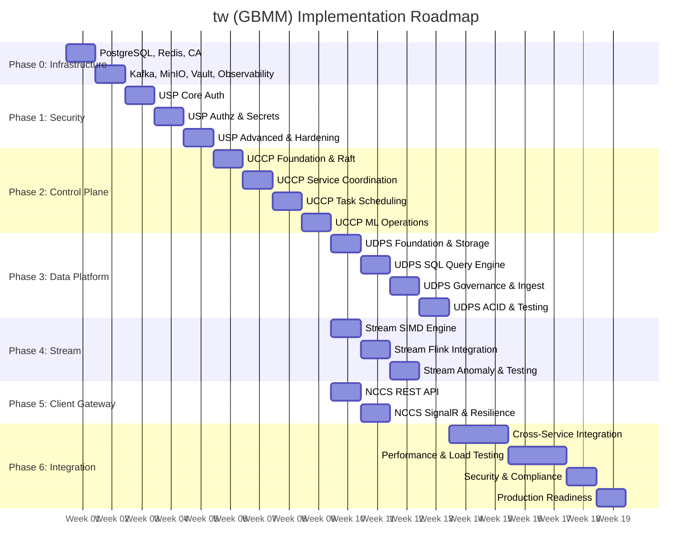

**Key Milestones:**
- **Week 2**: Infrastructure operational
- **Week 5**: USP production-ready (authentication unlocked for all services)
- **Week 9**: UCCP production-ready (service discovery unlocked)
- **Week 13**: UDPS production-ready (data queries available)
- **Week 16**: Stream Compute production-ready (real-time processing available)
- **Week 18**: NCCS production-ready (client gateway available)
- **Week 24**: System production-ready (all services integrated and tested)

**Risk Buffer:** Consider adding 2-4 weeks buffer for unforeseen issues (total: 26-28 weeks)

---

## 7. Infrastructure Requirements

### 7.1 Compute Requirements

#### 7.1.1 Production Environment Compute Resources

| Service | CPU Cores | RAM (GB) | GPU/TPU | Instances (HA) | Total CPU | Total RAM |
|---------|-----------|----------|---------|----------------|-----------|-----------|
| **USP** | 4 | 8 | None | 3 | 12 | 24 GB |
| **UCCP** | 8 | 16 | 2 GPU | 3 (Raft) | 24 | 48 GB |
| **NCCS** | 4 | 8 | None | 3 | 12 | 24 GB |
| **UDPS** | 8 | 16 | None | 2 | 16 | 32 GB |
| **Stream Compute** | 16 | 32 | None | 2 | 32 | 64 GB |
| **PostgreSQL** | 8 | 32 | None | 3 (primary+replicas) | 24 | 96 GB |
| **Redis** | 4 | 16 | None | 3 (Sentinel) | 12 | 48 GB |
| **Kafka** | 8 | 16 | None | 5 | 40 | 80 GB |
| **MinIO** | 4 | 8 | None | 4 | 16 | 32 GB |
| **Vault** | 2 | 4 | None | 3 (HA) | 6 | 12 GB |
| **RabbitMQ** | 4 | 8 | None | 3 | 12 | 24 GB |
| **Prometheus** | 4 | 16 | None | 2 | 8 | 32 GB |
| **Jaeger** | 4 | 8 | None | 2 | 8 | 16 GB |
| **Elasticsearch** | 8 | 32 | None | 3 | 24 | 96 GB |
| **Grafana** | 2 | 4 | None | 2 | 4 | 8 GB |

**Production Total:**
- **Total CPU Cores:** 250 cores
- **Total RAM:** 636 GB
- **Total GPU:** 6 GPUs (for UCCP ML training - NVIDIA A100 or V100 recommended)
- **Total Instances:** 44 containers/VMs

#### 7.1.2 Development Environment (30% of Production)

| Environment | CPU Cores | RAM | GPU | Notes |
|-------------|-----------|-----|-----|-------|
| **Development** | 75 cores | 190 GB | 1 GPU | Single instance per service, reduced HA |
| **Staging** | 125 cores | 318 GB | 3 GPU | 50% of production, limited HA |

#### 7.1.3 Service-Specific Compute Characteristics

**USP (CPU-Intensive):**
- **Workload:** Cryptographic operations (encryption, hashing), JWT validation
- **CPU Type:** General-purpose with AES-NI support
- **Scaling:** Horizontal (stateless, load balanced)

**UCCP (Mixed - CPU, GPU, Memory):**
- **Workload:** ML training (GPU), task scheduling (CPU), Raft consensus (CPU)
- **CPU Type:** High-performance for Raft, GPU-capable nodes for ML
- **GPU Requirement:** NVIDIA A100 (40GB) or V100 (32GB) for distributed training
- **Scaling:** Vertical for leader (more CPU), horizontal for ML workers

**Stream Compute (CPU-Intensive with SIMD):**
- **Workload:** Ultra-low-latency stream processing, SIMD operations
- **CPU Type:** Intel/AMD with AVX2/AVX-512 support (Cascade Lake or newer)
- **CPU Pinning:** Recommended for latency-sensitive workloads
- **Scaling:** Horizontal with partition assignment

**UDPS (Memory and I/O Intensive):**
- **Workload:** SQL query execution, Parquet read/write, columnar operations
- **CPU Type:** General-purpose with high memory bandwidth
- **Memory:** Large RAM for in-memory Arrow buffers
- **Scaling:** Horizontal with query routing

---

### 7.2 Storage Requirements

#### 7.2.1 Database Storage (PostgreSQL)

| Database | Service | Tables | Size (Year 1) | Growth Rate | Backup Size |
|----------|---------|--------|---------------|-------------|-------------|
| `uccp_db` | UCCP | services, tasks, ml_models, locks, raft_log | 200 GB | 10 GB/month | 400 GB |
| `usp_db` | USP | users, roles, policies, audit_logs, secrets_metadata | 100 GB | 5 GB/month | 200 GB |
| `nccs_db` | NCCS | request_logs, client_sessions | 50 GB | 5 GB/month | 100 GB |
| `udps_db` | UDPS | catalog_tables, catalog_columns, lineage, data_classifications | 150 GB | 8 GB/month | 300 GB |

**Total PostgreSQL Storage:**
- **Production Data:** 500 GB
- **Backups (30-day retention):** 1 TB
- **Total:** 1.5 TB (SSD recommended for IOPS)

**PostgreSQL Configuration:**
- **Storage Type:** SSD (NVMe preferred)
- **IOPS:** 10,000+ IOPS
- **Throughput:** 500 MB/s
- **Replication:** Streaming replication (synchronous for critical data)

---

#### 7.2.2 Cache Storage (Redis)

| Service | Key Patterns | Size (GB) | Eviction Policy | Persistence |
|---------|-------------|-----------|-----------------|-------------|
| UCCP | `lock:*`, `leader:*`, `cache:service:*` | 10 GB | LRU (caches), noeviction (locks) | RDB + AOF |
| USP | `token:*`, `session:*` | 20 GB | LRU | RDB + AOF |
| NCCS | `cache:response:*`, `signalr:*` | 10 GB | LRU | RDB |
| Stream Compute | `state:*` | 50 GB | noeviction (state) | RDB + AOF |

**Total Redis Storage:**
- **In-Memory:** 90 GB
- **RDB Snapshots:** 90 GB (disk)
- **AOF Logs:** 50 GB (disk, rotated)
- **Total Disk:** 140 GB (SSD recommended)

**Redis Configuration:**
- **Memory:** 128 GB total (90 GB data + 38 GB overhead/fragmentation)
- **Persistence:** RDB hourly, AOF fsync every second
- **Replication:** Async replication to replicas, Sentinel for failover

---

#### 7.2.3 Object Storage (MinIO)

| Service | Buckets | Object Types | Size (Year 1) | Growth Rate | Notes |
|---------|---------|-------------|---------------|-------------|-------|
| UCCP | ml-models, ml-artifacts, checkpoints, training-data | Models, datasets, checkpoints | 15 TB | 1 TB/month | Large ML datasets |
| UDPS | data-lake, parquet-files, exports | Parquet files, exports | 100 TB | 10 TB/month | Primary data lake |
| Stream Compute | flink-checkpoints, flink-savepoints | Flink state | 5 TB | 500 GB/month | Recovery data |

**Total MinIO Storage:**
- **Year 1 Data:** 120 TB
- **Year 2 Projection:** 270 TB
- **Erasure Coding Overhead (EC:4):** 33% = 160 TB raw (Year 1)
- **Recommended:** 200 TB usable capacity for Year 1

**MinIO Configuration:**
- **Nodes:** 4 nodes minimum (distributed mode)
- **Drives per Node:** 12-16 drives (HDD acceptable, mix with SSD for hot data)
- **Erasure Coding:** EC:4 (tolerates 4 drive/node failures)
- **Performance:** 10 GB/s aggregate throughput

---

#### 7.2.4 Event Streaming Storage (Kafka)

| Topic | Partitions | Replication Factor | Retention | Message Rate | Size (7-day) |
|-------|------------|-------------------|-----------|--------------|--------------|
| raw-events | 64 | 3 | 7 days | 500,000 msg/s | 10 TB |
| enriched-events | 64 | 3 | 7 days | 400,000 msg/s | 8 TB |
| data-ingestion | 32 | 3 | 7 days | 200,000 msg/s | 4 TB |
| anomalies | 16 | 3 | 30 days | 10,000 msg/s | 2 TB |
| alerts | 16 | 3 | 30 days | 5,000 msg/s | 1 TB |

**Total Kafka Storage:**
- **7-Day Retention Topics:** 22 TB
- **30-Day Retention Topics:** 3 TB
- **Total:** 25 TB (SSD recommended for low-latency topics)

**Kafka Configuration:**
- **Brokers:** 5 brokers
- **Storage per Broker:** 6 TB SSD
- **Replication:** 3x replication factor
- **Retention:** Configurable per topic (7-30 days)

---

#### 7.2.5 Message Broker Storage (RabbitMQ)

| Service | Queues | Message Rate | Retention | Size |
|---------|--------|--------------|-----------|------|
| NCCS | long-running-jobs, notifications | 10,000 msg/s | 7 days | 200 GB |

**RabbitMQ Storage:**
- **Persistent Messages:** 200 GB (SSD)
- **Node Storage:** 100 GB per node × 3 nodes = 300 GB

---

#### 7.2.6 Observability Storage

| Component | Purpose | Retention | Size (Year 1) |
|-----------|---------|-----------|---------------|
| **Prometheus** | Metrics | 30 days | 500 GB |
| **Jaeger (Elasticsearch)** | Traces | 7 days | 1 TB |
| **Elasticsearch (Logs)** | Logs | 30 days | 2 TB |

**Total Observability Storage:** 3.5 TB (SSD recommended)

---

### 7.3 Network Requirements

#### 7.3.1 Network Topology

```
┌─────────────────────────────────────────────────────────┐
│                    Public Internet                       │
└────────────────────────┬────────────────────────────────┘
                         │
                ┌────────▼───────┐
                │  Load Balancer │ (HTTPS:443)
                │  Public IP     │
                └────────┬───────┘
                         │
        ┌────────────────┼────────────────┐
        │                                 │
┌───────▼───────────────────────────────▼─────────┐
│           DMZ Subnet (10.0.1.0/24)              │
│   - NCCS Instances (10.0.1.10-12)               │
└───────┬─────────────────────────────────────────┘
        │
        │ (Internal mTLS Communication)
        │
┌───────▼─────────────────────────────────────────┐
│    Service Subnet 1 (10.0.10.0/24)              │
│   - UCCP (10.0.10.10-12)                        │
│   - USP (10.0.10.20-22)                         │
│   - UDPS (10.0.10.30-31)                        │
│   - Stream Compute (10.0.10.40-41)              │
└───────┬─────────────────────────────────────────┘
        │
┌───────▼─────────────────────────────────────────┐
│    Data Subnet (10.0.20.0/24)                   │
│   - PostgreSQL (10.0.20.10-12)                  │
│   - Redis (10.0.20.20-22)                       │
│   - Kafka (10.0.20.30-34)                       │
│   - MinIO (10.0.20.40-43)                       │
│   - Vault (10.0.20.50-52)                       │
│   - RabbitMQ (10.0.20.60-62)                    │
└───────┬─────────────────────────────────────────┘
        │
┌───────▼─────────────────────────────────────────┐
│    Observability Subnet (10.0.30.0/24)          │
│   - Prometheus (10.0.30.10-11)                  │
│   - Jaeger (10.0.30.20-21)                      │
│   - Elasticsearch (10.0.30.30-32)               │
│   - Grafana (10.0.30.40-41)                     │
└─────────────────────────────────────────────────┘
```

#### 7.3.2 Bandwidth Requirements

| Traffic Type | Direction | Bandwidth (Average) | Bandwidth (Peak) |
|--------------|-----------|---------------------|------------------|
| **Client → NCCS** | Ingress | 500 Mbps | 2 Gbps |
| **NCCS → UCCP** | Inter-service | 1 Gbps | 5 Gbps |
| **UDPS ↔ MinIO** | Data transfer | 5 Gbps | 20 Gbps |
| **Kafka ↔ Services** | Event streaming | 10 Gbps | 40 Gbps |
| **Stream Compute → Kafka** | Event processing | 10 Gbps | 40 Gbps |
| **Services ↔ PostgreSQL** | Database queries | 1 Gbps | 5 Gbps |
| **Observability** | Metrics/logs/traces | 500 Mbps | 2 Gbps |

**Total Network Bandwidth:**
- **Internet Ingress:** 2 Gbps (redundant links recommended)
- **Internet Egress:** 1 Gbps
- **Inter-Subnet:** 25 Gbps (requires 25 GbE or 40 GbE backbone)
- **Storage Network:** 40 Gbps (for MinIO, Kafka high-throughput)

#### 7.3.3 Latency Requirements

| Connection | Max Latency (p99) | Notes |
|------------|-------------------|-------|
| Client → NCCS | <100 ms | Internet latency variable |
| NCCS → UCCP | <10 ms | Same datacenter/region |
| Services → USP (auth) | <5 ms | Critical path |
| UDPS → MinIO | <20 ms | Data fetch |
| Stream Compute → Kafka | <1 ms | Ultra-low latency required |
| Services → PostgreSQL | <5 ms | Database queries |

**Network Design Considerations:**
- **Same Region/Datacenter:** All services in same region for low latency
- **Dedicated Network:** 10 GbE or 25 GbE for inter-service communication
- **Storage Network:** Separate network for MinIO/Kafka (RDMA optional for ultra-low latency)

#### 7.3.4 Security Groups / Firewall Rules

**DMZ Subnet (NCCS):**
```yaml
Inbound:
  - Port 443 from 0.0.0.0/0 (HTTPS)
  - Port 5001 from 0.0.0.0/0 (HTTPS REST API)
Outbound:
  - Port 50000 to Service Subnet (UCCP)
  - Port 50005 to Service Subnet (USP)
  - Port 50060 to Service Subnet (UDPS)
  - Port 5432 to Data Subnet (PostgreSQL)
  - Port 6379 to Data Subnet (Redis)
```

**Service Subnet:**
```yaml
Inbound:
  - Port 50000-50060 from DMZ Subnet (gRPC/mTLS)
  - Port 50000-50060 from Service Subnet (inter-service gRPC)
Outbound:
  - Port 5432 to Data Subnet (PostgreSQL)
  - Port 6379 to Data Subnet (Redis)
  - Port 9092 to Data Subnet (Kafka)
  - Port 9000 to Data Subnet (MinIO)
  - Port 8200 to Data Subnet (Vault)
  - Port 9090-9200 to Observability Subnet (metrics)
```

**Data Subnet:**
```yaml
Inbound:
  - Port 5432 from Service Subnet (PostgreSQL)
  - Port 6379 from Service Subnet (Redis)
  - Port 9092 from Service Subnet (Kafka)
  - Port 9000 from Service Subnet (MinIO)
  - Port 8200 from Service Subnet (Vault)
Outbound:
  - Deny all (data layer should not initiate outbound)
```

---

### 7.4 High Availability & Disaster Recovery

#### 7.4.1 HA Configuration

| Component | HA Strategy | RPO | RTO | Notes |
|-----------|-------------|-----|-----|-------|
| **USP** | Active-Active (3 instances) | 0 | <1 min | Stateless, load balanced |
| **UCCP** | Raft Consensus (3 nodes) | 0 | <30 sec | Leader election, log replication |
| **NCCS** | Active-Active (3 instances) | 0 | <1 min | Stateless, load balanced |
| **UDPS** | Active-Active (2 instances) | 0 | <1 min | Query routing |
| **Stream Compute** | Flink HA (2 instances) | <1 sec | <1 min | Savepoints for recovery |
| **PostgreSQL** | Primary + 2 Replicas | 0 | <2 min | Streaming replication, auto-failover |
| **Redis** | Sentinel (1 Primary + 2 Replicas) | <1 sec | <30 sec | Automatic failover |
| **Kafka** | Multi-broker (5 brokers) | 0 | <1 min | Replication factor 3, controller election |
| **MinIO** | Distributed (4 nodes) | 0 | <1 min | Erasure coding, self-healing |

**RPO (Recovery Point Objective):** Maximum acceptable data loss
**RTO (Recovery Time Objective):** Maximum acceptable downtime

#### 7.4.2 Disaster Recovery

**Backup Strategy:**
- **PostgreSQL:** Continuous archiving (WAL), daily full backup to S3, 30-day retention
- **Redis:** RDB snapshots hourly to S3, AOF logs replicated
- **MinIO:** Cross-region replication to secondary MinIO cluster
- **Kafka:** Mirror Maker 2 to secondary cluster (active-passive)
- **Vault:** Encrypted backups to S3, Shamir keys stored offline

**Multi-Region DR:**
- **Primary Region:** US-East (production)
- **Secondary Region:** US-West (DR, active-passive)
- **Failover:** Manual failover with DNS update (RTO: 15 minutes)
- **Data Sync:** Asynchronous replication (RPO: 5 minutes)

---

### 7.5 Cost Estimation

#### 7.5.1 AWS Cost Estimation (Monthly)

| Resource Type | Specification | Quantity | Unit Cost | Monthly Cost |
|---------------|---------------|----------|-----------|--------------|
| **EC2 (Compute)** | c5.4xlarge (16 vCPU, 32 GB RAM) | 15 instances | $544/instance | $8,160 |
| **EC2 (GPU)** | p3.2xlarge (8 vCPU, 61 GB RAM, 1x V100) | 6 instances | $3,060/instance | $18,360 |
| **RDS PostgreSQL** | db.r5.4xlarge (16 vCPU, 128 GB RAM) | 3 instances (primary+replicas) | $1,800/instance | $5,400 |
| **ElastiCache Redis** | cache.r5.4xlarge (16 vCPU, 104 GB RAM) | 3 instances | $1,200/instance | $3,600 |
| **MSK (Kafka)** | kafka.m5.2xlarge (8 vCPU, 32 GB RAM) | 5 brokers | $800/broker | $4,000 |
| **S3 (MinIO equivalent)** | Standard storage | 200 TB | $0.023/GB | $4,600 |
| **EBS (SSD)** | gp3 SSD | 10 TB | $0.08/GB | $800 |
| **Load Balancers** | Application Load Balancer | 3 | $25/ALB | $75 |
| **Data Transfer** | Egress | 10 TB/month | $0.09/GB | $900 |
| **CloudWatch/Monitoring** | Logs, metrics | - | - | $500 |

**Total Monthly Cost (AWS):** ~$46,395

**Annual Cost:** ~$556,740

#### 7.5.2 On-Premises Cost Estimation (One-Time + Annual)

| Resource Type | Specification | Quantity | Unit Cost | Total Cost |
|---------------|---------------|----------|-----------|------------|
| **Servers** | Dell PowerEdge R750 (32 cores, 256 GB RAM) | 20 servers | $8,000/server | $160,000 |
| **GPU Servers** | NVIDIA A100 GPU Server | 3 servers | $40,000/server | $120,000 |
| **Storage** | Dell PowerVault (200 TB usable, SSD+HDD) | 2 units | $60,000/unit | $120,000 |
| **Networking** | 25 GbE Switches, routers, cables | - | - | $50,000 |
| **Racks & PDUs** | Server racks, power distribution | - | - | $20,000 |
| **UPS & Backup Power** | Redundant UPS | - | - | $30,000 |
| **Installation & Setup** | Datacenter setup, cabling | - | - | $50,000 |

**Total Capital Expenditure:** $550,000

**Annual Operating Costs:**
- **Power & Cooling:** $30,000/year
- **Datacenter Space:** $20,000/year
- **Maintenance & Support:** $50,000/year
- **Network & ISP:** $12,000/year

**Total Annual Operating Cost:** $112,000

**Break-Even Analysis:** On-prem breaks even with AWS after ~18 months ($550k capex + $112k opex vs. $556k AWS annual)

---

### 7.6 Infrastructure Bill of Materials (BOM)

**Complete Infrastructure Checklist:**

**Compute:**
- [ ] 250 CPU cores (production)
- [ ] 636 GB RAM (production)
- [ ] 6 NVIDIA A100/V100 GPUs
- [ ] 44 VM/container instances

**Storage:**
- [ ] 1.5 TB PostgreSQL (SSD)
- [ ] 140 GB Redis (SSD for persistence)
- [ ] 200 TB MinIO object storage (HDD/SSD mix)
- [ ] 25 TB Kafka (SSD)
- [ ] 300 GB RabbitMQ (SSD)
- [ ] 3.5 TB Observability (SSD)

**Network:**
- [ ] 2 Gbps internet ingress
- [ ] 1 Gbps internet egress
- [ ] 25 Gbps inter-service backbone
- [ ] 3x VLANs (DMZ, Service, Data, Observability)
- [ ] 3x Load Balancers
- [ ] Firewall/Security Groups configured

**Software Licenses:**
- [ ] Operating System licenses (if applicable)
- [ ] Monitoring tool licenses (if commercial tools used)
- [ ] Support contracts for infrastructure components

**Estimated Total Infrastructure Cost:**
- **Cloud (AWS):** $556,740/year
- **On-Premises:** $550,000 (capex) + $112,000/year (opex)

---

## 8. Data Flow Diagrams

### 8.1 ML Training Workflow

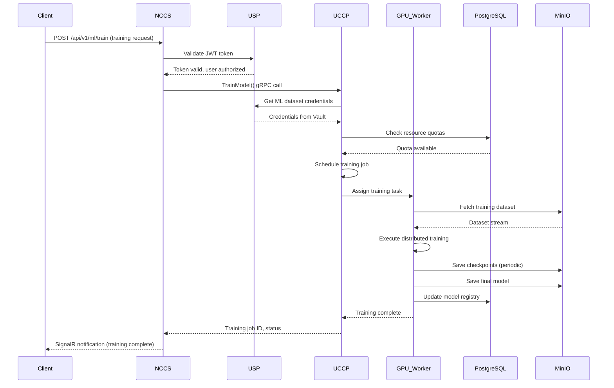

**Workflow Steps:**
1. Client submits training request via NCCS REST API
2. NCCS validates JWT token with USP
3. NCCS forwards training request to UCCP via gRPC
4. UCCP retrieves dataset credentials from USP/Vault
5. UCCP checks resource quotas in PostgreSQL
6. UCCP schedules training job on GPU workers
7. GPU workers fetch dataset from MinIO
8. Distributed training executes (TensorFlow/PyTorch)
9. Checkpoints saved to MinIO periodically
10. Final model saved to MinIO, metadata to PostgreSQL
11. UCCP notifies NCCS, which pushes update to client via SignalR

**Latency:** ~10-100ms for job submission, hours for training execution

---

### 8.2 Real-Time Stream Processing Workflow

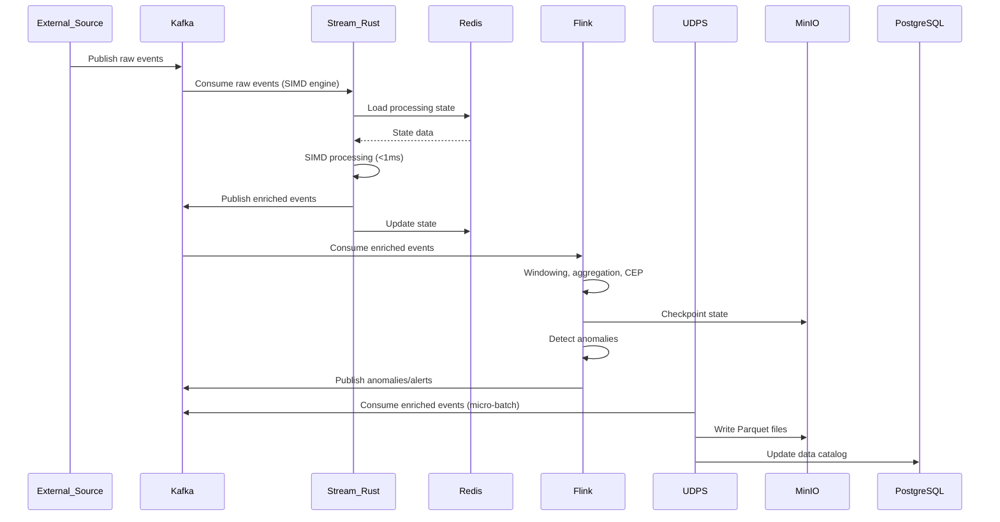

**Workflow Steps:**
1. External sources publish raw events to Kafka (`raw-events` topic)
2. Stream Compute Rust engine consumes events with ultra-low latency
3. SIMD-accelerated processing (AVX2/AVX-512)
4. State loaded from/saved to Redis
5. Enriched events published to Kafka (`enriched-events` topic)
6. Apache Flink consumes enriched events for complex processing
7. Windowing, aggregation, CEP patterns applied
8. Anomalies detected and published to `anomalies` topic
9. UDPS consumes enriched events in micro-batches
10. Data written to Parquet files in MinIO
11. Data catalog updated in PostgreSQL

**Latency:** <1ms (Rust SIMD), <100ms (Flink CEP)

---

### 8.3 Data Query Workflow

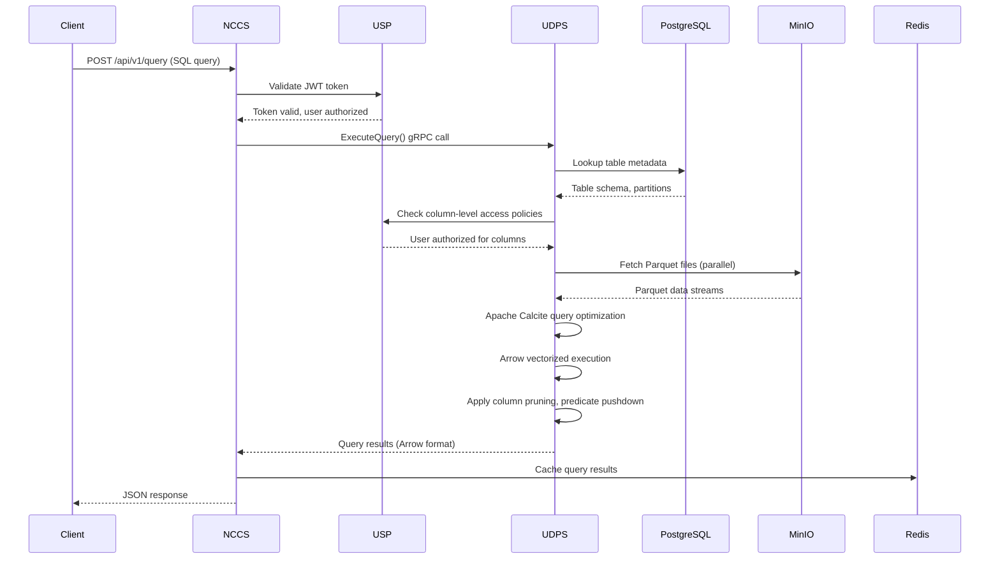

**Workflow Steps:**
1. Client submits SQL query via NCCS
2. NCCS validates JWT token with USP
3. Query forwarded to UDPS via gRPC
4. UDPS lookups table metadata from PostgreSQL catalog
5. UDPS checks column-level access policies with USP
6. UDPS fetches Parquet files from MinIO (parallel reads)
7. Apache Calcite optimizes query plan
8. Apache Arrow executes query (vectorized, columnar)
9. Results returned to NCCS in Arrow format
10. NCCS caches results in Redis
11. NCCS returns JSON response to client

**Latency:** ~50-500ms (depends on data size, partitions)

---

### 8.4 Authentication Flow

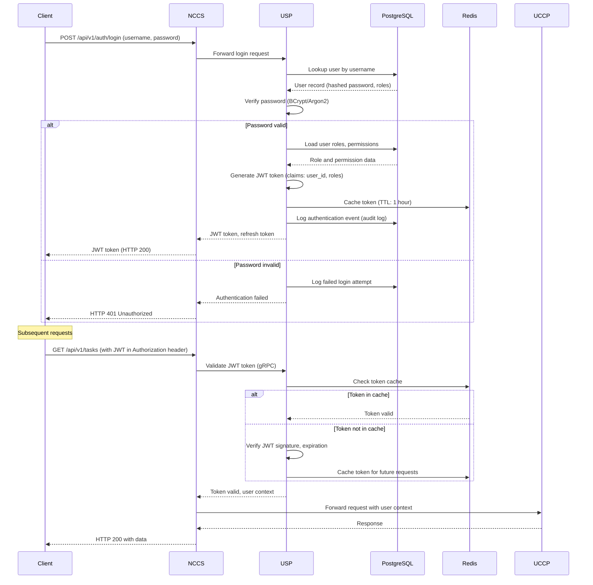

**Workflow Steps:**
1. Client submits login credentials to NCCS
2. NCCS forwards to USP
3. USP looks up user in PostgreSQL
4. Password verified with BCrypt/Argon2
5. On success: JWT token generated with user claims
6. Token cached in Redis (1-hour TTL)
7. Authentication event logged to PostgreSQL audit log
8. Subsequent requests: Token validated via cache (fast path) or signature verification

**Latency:** ~20-50ms (login), ~5ms (token validation from cache)

---

### 8.5 Service Discovery Flow

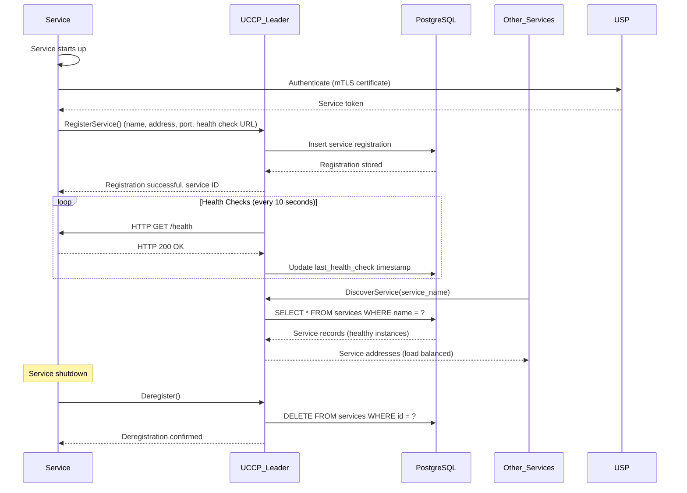

**Workflow Steps:**
1. Service starts and authenticates with USP (mTLS)
2. Service registers with UCCP leader (gRPC RegisterService call)
3. UCCP stores registration in PostgreSQL
4. UCCP periodically sends health checks to service (`/health` endpoint)
5. Other services discover service via UCCP (gRPC DiscoverService call)
6. UCCP returns addresses of healthy instances (load balanced)
7. On shutdown, service deregisters gracefully

**Latency:** ~10ms (discovery from cache), ~50ms (discovery from PostgreSQL)

---

## 9. Security Architecture

### 9.1 Security Layers

**Defense in Depth Strategy:**
1. **Network Layer**: Firewall rules, VLANs, network segmentation
2. **Transport Layer**: mTLS/TLS 1.3 for all communication
3. **Application Layer**: Authentication (JWT), Authorization (RBAC/ABAC), input validation
4. **Data Layer**: Encryption at rest (AES-256-GCM), column-level encryption, PII masking
5. **Audit Layer**: Comprehensive audit logging, tamper-proof storage

### 9.2 mTLS Communication Patterns

**Certificate Hierarchy:**
```
Root CA (Offline, air-gapped)
    └── Intermediate CA (Online, automated issuance)
        ├── Service Certificates (Common Name: service-name)
        │   ├── uccp.gbmm.internal (SAN: uccp-1, uccp-2, uccp-3)
        │   ├── usp.gbmm.internal (SAN: usp-1, usp-2, usp-3)
        │   ├── udps.gbmm.internal
        │   ├── stream-compute.gbmm.internal
        │   └── nccs.gbmm.internal
        └── Client Certificates (for external clients, if needed)
```

**Certificate Specifications:**
- **Algorithm**: RSA 2048-bit or ECDSA P-256
- **Signature**: SHA-256
- **Validity**: 90 days (auto-rotation at 80 days)
- **Key Usage**: Digital Signature, Key Encipherment
- **Extended Key Usage**: Server Authentication, Client Authentication

**mTLS Configuration:**
- **Protocol**: TLS 1.3 (TLS 1.2 minimum, fallback disabled)
- **Cipher Suites**: TLS_AES_256_GCM_SHA384, TLS_CHACHA20_POLY1305_SHA256
- **Certificate Validation**: Full chain validation, CRL/OCSP checking
- **Mutual Authentication**: Both client and server present certificates

**gRPC mTLS Example (Go):**
```go
// Server-side mTLS configuration
creds, err := credentials.NewServerTLSFromFile(certFile, keyFile)
server := grpc.NewServer(grpc.Creds(creds))

// Client-side mTLS configuration
creds, err := credentials.NewClientTLSFromFile(caCertFile, "uccp.gbmm.internal")
conn, err := grpc.Dial("uccp.gbmm.internal:50000", grpc.WithTransportCredentials(creds))
```

---

### 9.3 Authentication & Authorization Architecture

**Authentication Mechanisms:**
1. **User Authentication** (Client → NCCS → USP):
   - JWT tokens (HS256/RS256)
   - Multi-Factor Authentication (TOTP, WebAuthn/FIDO2)
   - OAuth 2.0 / OpenID Connect (optional)
   - SAML 2.0 federation (enterprise SSO)

2. **Service Authentication** (Service → Service):
   - mTLS certificate-based authentication
   - Service identity from certificate Common Name (CN)
   - Service tokens from USP (optional, for non-mTLS scenarios)

**Authorization Models:**
1. **RBAC (Role-Based Access Control)**:
   - Roles: Admin, Developer, DataScientist, Analyst, Viewer
   - Permissions: create_task, train_model, query_data, manage_users
   - Role assignment: User → Roles → Permissions

2. **ABAC (Attribute-Based Access Control)**:
   - Attributes: user.department, resource.classification, time.business_hours
   - Policies: `allow if user.role = "DataScientist" AND resource.type = "ml_model" AND resource.owner = user.id`

**JWT Token Structure:**
```json
{
  "header": {
    "alg": "RS256",
    "typ": "JWT"
  },
  "payload": {
    "sub": "user-12345",
    "name": "John Doe",
    "email": "john@example.com",
    "roles": ["Developer", "DataScientist"],
    "namespace": "tenant-1",
    "iat": 1609459200,
    "exp": 1609462800,
    "iss": "usp.gbmm.internal",
    "aud": ["nccs.gbmm.internal", "uccp.gbmm.internal"]
  }
}
```

**Token Validation Flow:**
1. Extract token from `Authorization: Bearer <token>` header
2. Check token cache in Redis (fast path)
3. If not cached: Verify signature, check expiration, validate issuer/audience
4. Extract user claims (user_id, roles, namespace)
5. Cache token in Redis (TTL: token expiration time)
6. Propagate user context to downstream services

---

### 9.4 Secrets Management Strategy

**USP Secrets Management** (Vault API Compatible):
```
USP Service (.NET 8)
    ├── KV Secrets Engine v2 (versioned secrets, Vault API compatible)
    │   ├── secret/uccp/*  (UCCP secrets)
    │   ├── secret/usp/*   (USP own secrets)
    │   ├── secret/udps/*  (UDPS secrets)
    │   ├── secret/stream/* (Stream Compute secrets)
    │   └── secret/nccs/*  (NCCS secrets)
    ├── Database Secrets Engine (dynamic PostgreSQL credentials)
    ├── PKI Secrets Engine (certificate issuance)
    └── Transit Secrets Engine (encryption as a service)

Storage: PostgreSQL (usp_db) with AES-256-GCM encryption
```

**Secret Types:**
1. **Static Secrets**: API keys, service credentials
2. **Dynamic Secrets**: Database credentials (generated on-demand, time-limited)
3. **Encryption Keys**: Master encryption keys, data encryption keys

**Secret Rotation:**
- **Automatic Rotation**: Weekly for database credentials
- **Manual Rotation**: On-demand for API keys
- **Emergency Rotation**: Immediate rotation on suspected compromise

**Secret Access Policies:**
```hcl
# Example USP policy for UCCP service (Vault HCL format for compatibility)
path "secret/data/uccp/*" {
  capabilities = ["read"]
}

path "database/creds/uccp-role" {
  capabilities = ["read"]
}
```

**Secret Retrieval (Service Startup):**
1. Service authenticates to USP using mTLS certificate (service identity)
2. USP validates certificate and returns service token (time-limited)
3. Service retrieves secrets using token via gRPC or HTTPS
4. Secrets cached in-memory (never persisted to disk)
5. Token renewed before expiration

---

### 9.5 Encryption Strategy

**Encryption at Rest:**
| Data Type | Encryption Method | Key Management |
|-----------|------------------|----------------|
| PostgreSQL Data | Transparent Data Encryption (TDE) | USP Transit engine |
| Redis Data | RDB/AOF encryption | AES-256-GCM, key in USP |
| MinIO Objects | Server-Side Encryption (SSE-KMS) | MinIO KMS integration with USP |
| Kafka Topics | Encryption at rest (broker-level) | Key in USP |
| Parquet Files | Parquet encryption (column-level) | USP Transit engine |

**Encryption in Transit:**
- **All Service Communication**: mTLS (TLS 1.3)
- **Database Connections**: TLS (PostgreSQL, Redis)
- **Message Brokers**: SSL/SASL (Kafka, RabbitMQ)
- **Object Storage**: HTTPS (MinIO)

**Encryption as a Service (USP):**
```
Client → USP Encrypt API (POST /api/v1/encrypt)
    ↓
USP → Transit Engine (internal encryption operation)
    ↓
USP → Generates/retrieves encryption key from PostgreSQL
    ↓
USP → Returns encrypted ciphertext to client
```

**Key Hierarchy:**
- **Master Key**: Stored in HSM (optional) or protected with Shamir's Secret Sharing
- **Data Encryption Keys (DEKs)**: Generated per dataset, encrypted with Master Key, stored in PostgreSQL
- **Key Rotation**: Annual rotation for Master Key, on-demand for DEKs

---

### 9.6 Compliance & Data Governance

**Compliance Frameworks:**
1. **SOC 2 Type II**: Trust Services Criteria (Security, Availability, Confidentiality)
2. **HIPAA**: Protected Health Information (PHI) safeguards
3. **PCI-DSS**: Payment card data security
4. **GDPR**: Data privacy, right to erasure, consent management
5. **NIST Cybersecurity Framework**: Identify, Protect, Detect, Respond, Recover

**Compliance Controls Mapping:**

| Control | Implementation | Service |
|---------|---------------|---------|
| **Access Control** | RBAC/ABAC, MFA, certificate-based auth | USP |
| **Encryption** | AES-256-GCM at rest, TLS 1.3 in transit | All services |
| **Audit Logging** | All privileged operations logged | USP, UCCP, UDPS |
| **Data Classification** | PII detection, data classification | UDPS |
| **Data Retention** | Configurable retention policies | UDPS, PostgreSQL |
| **Incident Response** | Alerting, monitoring, runbooks | Prometheus, PagerDuty |
| **Vulnerability Management** | Regular scanning, patch management | DevOps |
| **Penetration Testing** | Annual third-party testing | Security team |

**GDPR Compliance Features:**
- **Right to Access**: Query user data via UDPS
- **Right to Erasure**: Delete user data (UDPS `DELETE FROM` + Parquet file deletion)
- **Right to Portability**: Export user data (Parquet export)
- **Consent Management**: Consent records in PostgreSQL
- **Data Minimization**: Column-level access control (UDPS)
- **Privacy by Design**: Encryption by default, PII detection

---

### 9.7 Audit Logging & Monitoring

**Audit Log Requirements:**
- **What**: All privileged operations (create user, assign role, access secrets, modify data)
- **Who**: User ID, service ID, IP address
- **When**: Timestamp (UTC)
- **Where**: Service name, resource path
- **Result**: Success/failure, error code

**Audit Log Storage:**
- **Primary**: PostgreSQL (`audit_logs` table)
- **Archival**: Elasticsearch (30-day retention)
- **Long-term**: S3 (7-year retention, encrypted, immutable)

**Audit Log Example:**
```json
{
  "timestamp": "2025-12-25T10:30:45Z",
  "event_type": "secret_accessed",
  "user_id": "user-12345",
  "service_id": "uccp-node-1",
  "ip_address": "10.0.10.11",
  "resource": "secret/uccp/postgres",
  "action": "read",
  "result": "success",
  "correlation_id": "req-abc123"
}
```

**Security Monitoring:**
- **Failed Login Attempts**: Alert after 5 failed attempts in 5 minutes
- **Unauthorized Access**: Alert on 403/401 errors
- **Secret Access**: Monitor unusual secret access patterns
- **Certificate Expiration**: Alert 30 days before expiration
- **Anomalous Traffic**: ML-based anomaly detection on API traffic

---

### 9.8 Security Testing & Validation

**Security Testing Types:**
1. **Static Application Security Testing (SAST)**: SonarQube, Semgrep
2. **Dynamic Application Security Testing (DAST)**: OWASP ZAP, Burp Suite
3. **Software Composition Analysis (SCA)**: Snyk, Dependabot
4. **Container Scanning**: Trivy, Clair
5. **Infrastructure Scanning**: Terraform security scanning
6. **Penetration Testing**: Annual third-party assessment

**Security Validation Checklist:**
- [ ] All inter-service communication uses mTLS
- [ ] All user authentication requires JWT + MFA
- [ ] All secrets stored in Vault (no hardcoded secrets)
- [ ] All database connections use TLS
- [ ] All sensitive data encrypted at rest (AES-256-GCM)
- [ ] All audit logs immutable and tamper-proof
- [ ] All privileged operations logged
- [ ] No critical/high vulnerabilities in dependencies
- [ ] Certificate rotation automated
- [ ] Secret rotation implemented
- [ ] GDPR compliance features operational

---

## 10. Observability & Monitoring

This section defines the comprehensive observability strategy for the GBMM platform, covering metrics, tracing, logging, and alerting.

### 10.1 Observability Architecture

**Three Pillars of Observability:**

```
┌─────────────────────────────────────────────────────────┐
│                   Observability Stack                    │
├─────────────────────────────────────────────────────────┤
│                                                          │
│  ┌────────────┐    ┌────────────┐    ┌──────────────┐  │
│  │  METRICS   │    │   LOGS     │    │   TRACES     │  │
│  │            │    │            │    │              │  │
│  │ Prometheus │    │Elasticsearch│   │   Jaeger     │  │
│  │            │    │            │    │              │  │
│  │ • Counters │    │ • Events   │    │ • Spans      │  │
│  │ • Gauges   │    │ • Errors   │    │ • Timing     │  │
│  │ • Histograms    │ • Audit    │    │ • Context    │  │
│  └─────┬──────┘    └─────┬──────┘    └──────┬───────┘  │
│        │                 │                   │          │
│        └─────────────────┼───────────────────┘          │
│                          │                              │
│                   ┌──────▼──────┐                       │
│                   │   Grafana   │                       │
│                   │ Dashboards  │                       │
│                   └─────────────┘                       │
└─────────────────────────────────────────────────────────┘
```

**Observability Components:**

| Component | Technology | Port | Purpose | Retention |
|-----------|-----------|------|---------|-----------|
| **Metrics Collection** | Prometheus 2.45+ | 9090 | Time-series metrics | 30 days |
| **Metrics Visualization** | Grafana 10.0+ | 3000 | Dashboards & alerts | N/A |
| **Distributed Tracing** | Jaeger 1.47+ | 16686 (UI), 14268 (collector) | Request tracing | 7 days |
| **Log Aggregation** | Elasticsearch 8.8+ | 9200 | Centralized logging | 30 days |
| **Log Shipping** | Fluentd 1.16+ | 24224 | Log collection | N/A |
| **Alert Management** | Alertmanager 0.26+ | 9093 | Alert routing | 7 days |

### 10.2 Metrics Strategy

**10.2.1 Service-Level Metrics**

All services expose Prometheus metrics on their designated metrics ports:

**UCCP Metrics (Port 9100):**
```yaml
# Service health
uccp_health_status{service="uccp"} 1
uccp_ready_status{service="uccp"} 1

# Raft consensus
uccp_raft_leader{node="uccp-1"} 1
uccp_raft_followers{node="uccp-1"} 2
uccp_raft_term{node="uccp-1"} 5
uccp_raft_commit_index{node="uccp-1"} 12345

# Service registry
uccp_registered_services_total 5
uccp_healthy_services_total 5
uccp_service_discovery_requests_total 1234

# Task scheduling
uccp_tasks_queued 45
uccp_tasks_running 12
uccp_tasks_completed_total 5678
uccp_tasks_failed_total 23

# ML operations
uccp_ml_training_jobs_active 3
uccp_ml_training_jobs_completed_total 89
uccp_ml_models_deployed 12
uccp_ml_inference_requests_total 456789

# Resource utilization
uccp_cpu_usage_percent{node="uccp-1"} 45.2
uccp_memory_usage_bytes{node="uccp-1"} 4294967296
uccp_gpu_usage_percent{gpu="0"} 78.5
```

**NCCS Metrics (Port 9200):**
```yaml
# HTTP API
nccs_http_requests_total{method="GET",path="/api/v1/tasks",status="200"} 12345
nccs_http_request_duration_seconds{method="GET",path="/api/v1/tasks",quantile="0.99"} 0.245
nccs_http_requests_in_flight 23

# gRPC API
nccs_grpc_requests_total{method="CreateTask",status="OK"} 5678
nccs_grpc_request_duration_seconds{method="CreateTask",quantile="0.99"} 0.123

# UCCP integration
nccs_uccp_connection_status 1
nccs_uccp_requests_total{operation="CreateTask"} 5678
nccs_uccp_request_duration_seconds{operation="CreateTask"} 0.089

# SignalR connections
nccs_signalr_connections_active 234
nccs_signalr_messages_sent_total 45678

# Cache
nccs_cache_hits_total 78901
nccs_cache_misses_total 1234
nccs_cache_hit_rate 0.985
```

**USP Metrics (Port 9090):**
```yaml
# Authentication
usp_auth_attempts_total{method="jwt",result="success"} 12345
usp_auth_attempts_total{method="jwt",result="failure"} 23
usp_auth_tokens_issued_total 12322
usp_auth_tokens_validated_total 123456

# Authorization
usp_authz_checks_total{result="allowed"} 234567
usp_authz_checks_total{result="denied"} 456
usp_authz_check_duration_seconds 0.003

# Secrets management
usp_secrets_read_total 45678
usp_secrets_written_total 234
usp_secrets_rotated_total 45

# Encryption operations
usp_encryption_operations_total{operation="encrypt"} 12345
usp_encryption_operations_total{operation="decrypt"} 12340
usp_encryption_duration_seconds 0.002
```

**UDPS Metrics (Port 9090):**
```yaml
# Query execution
udps_queries_total{type="select",status="success"} 23456
udps_queries_total{type="insert",status="success"} 1234
udps_query_duration_seconds{type="select",quantile="0.99"} 1.234

# Storage engine
udps_storage_bytes_written_total 123456789012
udps_storage_bytes_read_total 987654321098
udps_parquet_files_total 5678
udps_parquet_file_size_bytes 12345678

# Data catalog
udps_catalog_tables_total 234
udps_catalog_partitions_total 5678

# Cache
udps_arrow_cache_hits_total 123456
udps_arrow_cache_misses_total 234
udps_arrow_cache_size_bytes 8589934592
```

**Stream Compute Metrics (Port 9096):**
```yaml
# Stream processing
stream_events_processed_total 12345678
stream_events_failed_total 23
stream_processing_latency_seconds{quantile="0.99"} 0.0008

# SIMD operations
stream_simd_operations_total 987654321
stream_simd_vectorization_ratio 0.95

# Flink integration
stream_flink_jobs_running 5
stream_flink_checkpoints_completed_total 234
stream_flink_backpressure_ratio 0.02

# Kafka integration
stream_kafka_messages_consumed_total{topic="events"} 12345678
stream_kafka_consumer_lag{topic="events",partition="0"} 12
```

**10.2.2 Infrastructure Metrics**

**PostgreSQL:**
```yaml
# Connections
pg_connections_active 45
pg_connections_idle 10
pg_connections_max 100

# Queries
pg_queries_total{database="uccp"} 123456
pg_query_duration_seconds{database="uccp",quantile="0.99"} 0.234

# Replication
pg_replication_lag_seconds{replica="pg-replica-1"} 0.5
```

**Redis:**
```yaml
# Memory
redis_memory_used_bytes 4294967296
redis_memory_max_bytes 8589934592

# Commands
redis_commands_total{command="get"} 123456
redis_commands_total{command="set"} 12345
redis_command_duration_seconds{command="get"} 0.0002

# Keys
redis_keys_total{db="0"} 12345
redis_keys_expired_total 234
```

**Kafka:**
```yaml
# Broker
kafka_broker_online_count 3
kafka_under_replicated_partitions 0

# Topics
kafka_topic_partition_count{topic="events"} 10
kafka_topic_messages_in_per_sec{topic="events"} 1234.5

# Consumer lag
kafka_consumer_group_lag{group="stream-processor",topic="events"} 12
```

**10.2.3 SLI/SLO Definitions**

**Service Level Indicators (SLIs):**

| Service | SLI | Measurement | Target SLO |
|---------|-----|-------------|------------|
| **UCCP** | Availability | `uccp_health_status == 1` | 99.9% |
| **UCCP** | API Latency (p99) | `uccp_grpc_request_duration_seconds{quantile="0.99"}` | < 500ms |
| **UCCP** | Task Success Rate | `uccp_tasks_completed / (uccp_tasks_completed + uccp_tasks_failed)` | > 99.5% |
| **NCCS** | Availability | `nccs_health_status == 1` | 99.9% |
| **NCCS** | HTTP Latency (p99) | `nccs_http_request_duration_seconds{quantile="0.99"}` | < 200ms |
| **USP** | Availability | `usp_health_status == 1` | 99.99% (critical) |
| **USP** | Auth Success Rate | `usp_auth_attempts{result="success"} / usp_auth_attempts_total` | > 99.9% |
| **UDPS** | Availability | `udps_health_status == 1` | 99.9% |
| **UDPS** | Query Latency (p99) | `udps_query_duration_seconds{type="select",quantile="0.99"}` | < 2s |
| **Stream** | Availability | `stream_health_status == 1` | 99.95% |
| **Stream** | Processing Latency (p99) | `stream_processing_latency_seconds{quantile="0.99"}` | < 1ms |

**Error Budgets:**

| Service | SLO | Monthly Downtime Budget | Weekly Error Budget |
|---------|-----|-------------------------|---------------------|
| UCCP | 99.9% | 43 minutes | 10 minutes |
| NCCS | 99.9% | 43 minutes | 10 minutes |
| USP | 99.99% | 4.3 minutes | 1 minute |
| UDPS | 99.9% | 43 minutes | 10 minutes |
| Stream Compute | 99.95% | 21.6 minutes | 5 minutes |

### 10.3 Distributed Tracing

**10.3.1 Tracing Strategy**

**OpenTelemetry Integration:**

All services use OpenTelemetry SDK for trace generation:

```go
// Example: UCCP trace span
func (s *UCCPServer) CreateTask(ctx context.Context, req *pb.CreateTaskRequest) (*pb.CreateTaskResponse, error) {
    tracer := otel.Tracer("uccp")
    ctx, span := tracer.Start(ctx, "CreateTask")
    defer span.End()

    span.SetAttributes(
        attribute.String("task.id", req.TaskId),
        attribute.String("task.type", req.TaskType),
        attribute.String("namespace", req.Namespace),
    )

    // Business logic with nested spans
    // ...

    return response, nil
}
```

**Trace Propagation:**

- **HTTP**: `traceparent` header (W3C Trace Context)
- **gRPC**: `grpc-trace-bin` metadata
- **Kafka**: Message headers with trace context

**10.3.2 Trace Structure**

**Example: End-to-End ML Training Request**

```
Trace ID: 1234567890abcdef
Parent Span: POST /api/v1/ml/train (NCCS) - 2.5s
├─ Span: Validate request (NCCS) - 5ms
├─ Span: Check authentication (NCCS → USP) - 12ms
│  ├─ Span: Validate JWT (USP) - 3ms
│  └─ Span: Check RBAC (USP) - 9ms
├─ Span: Create training task (NCCS → UCCP) - 2.4s
│  ├─ Span: Register task (UCCP) - 8ms
│  ├─ Span: Allocate GPU resources (UCCP) - 45ms
│  ├─ Span: Load training data (UCCP → UDPS) - 1.2s
│  │  ├─ Span: Query data catalog (UDPS) - 15ms
│  │  └─ Span: Read Parquet files (UDPS) - 1.1s
│  ├─ Span: Initialize training job (UCCP) - 1.0s
│  └─ Span: Store checkpoint path (UCCP → MinIO) - 50ms
└─ Span: Return task ID (NCCS) - 2ms
```

**Sampling Strategy:**

| Trace Type | Sampling Rate | Reason |
|------------|---------------|--------|
| Errors (5xx) | 100% | Always sample errors |
| Slow requests (> p99) | 100% | Performance analysis |
| Authentication | 10% | High volume, sample subset |
| Normal requests | 1% | Baseline sampling |
| Health checks | 0% | Too noisy, exclude |

### 10.4 Structured Logging

**10.4.1 Log Format**

All services use structured JSON logging:

```json
{
  "timestamp": "2025-12-25T10:30:45.123Z",
  "level": "INFO",
  "service": "uccp",
  "instance": "uccp-1",
  "trace_id": "1234567890abcdef",
  "span_id": "abcdef1234567890",
  "namespace": "production",
  "message": "Task scheduled successfully",
  "task_id": "task-12345",
  "task_type": "ml_training",
  "gpu_allocated": 1,
  "duration_ms": 45
}
```

**10.4.2 Log Levels**

| Level | Usage | Examples |
|-------|-------|----------|
| **ERROR** | Application errors, failures | Database connection failure, task execution error |
| **WARN** | Degraded state, non-critical issues | High cache miss rate, slow query detected |
| **INFO** | Normal operations, state changes | Task started, service registered, user authenticated |
| **DEBUG** | Detailed diagnostic information | Request payload, cache lookup, configuration loaded |
| **TRACE** | Very detailed trace information | Function entry/exit, variable values |

**Production Logging Levels:**
- **UCCP**: INFO
- **NCCS**: INFO
- **USP**: WARN (sensitive operations logged at INFO with PII redaction)
- **UDPS**: INFO
- **Stream Compute**: INFO

**10.4.3 Log Aggregation Pipeline**

```
┌──────────────┐
│   Services   │
│  (JSON logs) │
└──────┬───────┘
       │
       ▼
┌──────────────┐
│   Fluentd    │
│ (Log Router) │
└──────┬───────┘
       │
       ├─────────────────┬──────────────┐
       ▼                 ▼              ▼
┌─────────────┐   ┌────────────┐  ┌──────────┐
│Elasticsearch│   │ S3 Archive │  │ Security │
│  (Search)   │   │(Long-term) │  │   SIEM   │
└─────────────┘   └────────────┘  └──────────┘
       │
       ▼
┌─────────────┐
│   Kibana    │
│(Visualization)
└─────────────┘
```

**Log Retention:**
- **Elasticsearch**: 30 days (hot)
- **S3 Archive**: 1 year (warm)
- **Security Audit Logs**: 7 years (compliance)

### 10.5 Grafana Dashboards

**10.5.1 Dashboard Inventory**

| Dashboard | Panels | Purpose | Audience |
|-----------|--------|---------|----------|
| **System Overview** | 12 | High-level system health | Executives, SREs |
| **UCCP Service** | 24 | UCCP metrics and Raft | UCCP developers, SREs |
| **NCCS Service** | 18 | NCCS API and SignalR | NCCS developers, SREs |
| **USP Service** | 20 | Authentication, secrets | Security team, SREs |
| **UDPS Service** | 22 | Query performance, storage | UDPS developers, SREs |
| **Stream Compute** | 16 | Stream latency, throughput | Stream developers, SREs |
| **Infrastructure** | 28 | PostgreSQL, Redis, Kafka | DBAs, SREs |
| **ML Operations** | 20 | Training jobs, models | ML engineers |
| **Security** | 15 | Auth failures, anomalies | Security team |
| **SLO Dashboard** | 10 | Error budgets, SLIs | SREs, management |

**10.5.2 System Overview Dashboard**

**Panels:**

1. **Overall System Health** (Single Stat)
   - Query: `min(up{job=~"uccp|nccs|usp|udps|stream"})`
   - Thresholds: 1 = green, 0 = red

2. **Service Availability (24h)** (Gauge)
   - UCCP: `avg_over_time(uccp_health_status[24h]) * 100`
   - NCCS: `avg_over_time(nccs_health_status[24h]) * 100`
   - USP: `avg_over_time(usp_health_status[24h]) * 100`
   - UDPS: `avg_over_time(udps_health_status[24h]) * 100`
   - Stream: `avg_over_time(stream_health_status[24h]) * 100`

3. **Request Rate** (Graph)
   - Query: `sum(rate(http_requests_total[5m])) by (service)`

4. **Error Rate** (Graph)
   - Query: `sum(rate(http_requests_total{status=~"5.."}[5m])) by (service)`

5. **Latency (p99)** (Graph)
   - Query: `histogram_quantile(0.99, rate(http_request_duration_seconds_bucket[5m])) by (service)`

6. **Active Connections** (Graph)
   - Query: `sum(pg_connections_active) + sum(redis_connections_active) + sum(kafka_connections_active)`

7. **CPU Usage** (Graph)
   - Query: `avg(uccp_cpu_usage_percent) by (instance)`

8. **Memory Usage** (Graph)
   - Query: `avg(uccp_memory_usage_bytes) by (instance) / 1024 / 1024 / 1024`

9. **Disk I/O** (Graph)
   - Query: `rate(node_disk_io_time_seconds_total[5m])`

10. **Network Traffic** (Graph)
    - Query: `rate(node_network_receive_bytes_total[5m])` and `rate(node_network_transmit_bytes_total[5m])`

11. **ML Training Jobs** (Stat)
    - Query: `uccp_ml_training_jobs_active`

12. **Stream Processing Latency** (Graph)
    - Query: `histogram_quantile(0.99, rate(stream_processing_latency_seconds_bucket[5m]))`

### 10.6 Alerting Strategy

**10.6.1 Alert Severity Levels**

| Severity | Response Time | Examples | Notification |
|----------|--------------|----------|--------------|
| **P1 (Critical)** | Immediate (< 5 min) | Service down, data loss | PagerDuty + Phone + Slack |
| **P2 (High)** | 15 minutes | High error rate, degraded performance | PagerDuty + Slack |
| **P3 (Medium)** | 1 hour | Elevated warnings, minor issues | Slack |
| **P4 (Low)** | 4 hours | Informational, trends | Email |

**10.6.2 Alert Rules**

**Critical Alerts (P1):**

```yaml
# Service down
- alert: ServiceDown
  expr: up{job=~"uccp|nccs|usp|udps|stream"} == 0
  for: 1m
  labels:
    severity: critical
  annotations:
    summary: "Service {{ $labels.job }} is down"
    description: "{{ $labels.instance }} has been down for more than 1 minute"

# USP authentication failure
- alert: USPAuthenticationDown
  expr: rate(usp_auth_attempts_total{result="success"}[5m]) == 0 and rate(usp_auth_attempts_total[5m]) > 0
  for: 2m
  labels:
    severity: critical
  annotations:
    summary: "USP authentication is failing"
    description: "All authentication attempts are failing"

# Database down
- alert: PostgreSQLDown
  expr: pg_up == 0
  for: 1m
  labels:
    severity: critical
  annotations:
    summary: "PostgreSQL is down"
    description: "PostgreSQL instance {{ $labels.instance }} is unreachable"

# Raft quorum lost
- alert: RaftQuorumLost
  expr: uccp_raft_followers < 1
  for: 2m
  labels:
    severity: critical
  annotations:
    summary: "UCCP Raft quorum lost"
    description: "Raft cluster has lost quorum (< 2 nodes)"
```

**High Priority Alerts (P2):**

```yaml
# High error rate
- alert: HighErrorRate
  expr: sum(rate(http_requests_total{status=~"5.."}[5m])) by (service) / sum(rate(http_requests_total[5m])) by (service) > 0.05
  for: 5m
  labels:
    severity: high
  annotations:
    summary: "High error rate on {{ $labels.service }}"
    description: "Error rate is {{ $value | humanizePercentage }}"

# High latency
- alert: HighLatency
  expr: histogram_quantile(0.99, rate(http_request_duration_seconds_bucket[5m])) > 1
  for: 10m
  labels:
    severity: high
  annotations:
    summary: "High latency on {{ $labels.service }}"
    description: "P99 latency is {{ $value }}s"

# Disk space low
- alert: DiskSpaceLow
  expr: (node_filesystem_avail_bytes / node_filesystem_size_bytes) < 0.15
  for: 5m
  labels:
    severity: high
  annotations:
    summary: "Disk space low on {{ $labels.instance }}"
    description: "Only {{ $value | humanizePercentage }} space remaining"

# High replication lag
- alert: HighReplicationLag
  expr: pg_replication_lag_seconds > 30
  for: 5m
  labels:
    severity: high
  annotations:
    summary: "High PostgreSQL replication lag"
    description: "Replication lag is {{ $value }}s on {{ $labels.replica }}"
```

**Medium Priority Alerts (P3):**

```yaml
# Elevated cache miss rate
- alert: HighCacheMissRate
  expr: redis_cache_misses / (redis_cache_hits + redis_cache_misses) > 0.30
  for: 15m
  labels:
    severity: medium
  annotations:
    summary: "High cache miss rate"
    description: "Cache miss rate is {{ $value | humanizePercentage }}"

# Certificate expiring soon
- alert: CertificateExpiringSoon
  expr: (ssl_certificate_expiry_seconds - time()) / 86400 < 14
  for: 1h
  labels:
    severity: medium
  annotations:
    summary: "Certificate expiring soon"
    description: "Certificate for {{ $labels.cn }} expires in {{ $value }} days"
```

**10.6.3 Alert Routing**

```yaml
# Alertmanager configuration
route:
  receiver: 'default-slack'
  group_by: ['alertname', 'service']
  group_wait: 10s
  group_interval: 5m
  repeat_interval: 4h

  routes:
    # Critical alerts to PagerDuty + Slack
    - match:
        severity: critical
      receiver: 'pagerduty-critical'
      continue: true

    - match:
        severity: critical
      receiver: 'slack-critical'

    # High priority to PagerDuty + Slack
    - match:
        severity: high
      receiver: 'pagerduty-high'
      continue: true

    - match:
        severity: high
      receiver: 'slack-high'

    # Medium to Slack only
    - match:
        severity: medium
      receiver: 'slack-medium'

    # Low to email
    - match:
        severity: low
      receiver: 'email-ops'

receivers:
  - name: 'pagerduty-critical'
    pagerduty_configs:
      - service_key: '<PAGERDUTY_SERVICE_KEY>'
        severity: 'critical'

  - name: 'slack-critical'
    slack_configs:
      - api_url: '<SLACK_WEBHOOK_URL>'
        channel: '#alerts-critical'
        title: 'CRITICAL: {{ .GroupLabels.alertname }}'
        text: '{{ range .Alerts }}{{ .Annotations.description }}{{ end }}'

  - name: 'email-ops'
    email_configs:
      - to: 'ops-team@example.com'
        from: 'alertmanager@example.com'
```

### 10.7 Observability Checklist

**Deployment Checklist:**

- [ ] All services expose Prometheus metrics on designated ports
- [ ] Prometheus scraping configured for all services
- [ ] Grafana dashboards deployed for all services
- [ ] OpenTelemetry SDK integrated in all services
- [ ] Jaeger collector and query service deployed
- [ ] Elasticsearch cluster deployed with sufficient storage
- [ ] Fluentd log shippers deployed on all nodes
- [ ] Kibana dashboards configured for log analysis
- [ ] Alertmanager configured with routing rules
- [ ] PagerDuty integration tested
- [ ] Slack integration tested
- [ ] SLO/SLI dashboards created
- [ ] Error budget tracking implemented
- [ ] On-call rotation configured
- [ ] Runbooks created for all critical alerts

---

## 11. Development & Deployment Guidelines

This section provides comprehensive guidelines for local development, testing, CI/CD, and production deployment.

### 11.1 Local Development Setup

**11.1.1 Prerequisites**

**Required Tools:**

| Tool | Version | Purpose |
|------|---------|---------|
| Docker | 24.0+ | Container runtime |
| Docker Compose | 2.20+ | Local orchestration |
| Go | 1.24+ | UCCP development |
| .NET SDK | 8.0+ | NCCS/USP development |
| Java JDK | 17+ | UDPS development |
| Scala | 2.13+ | UDPS development (sbt) |
| Rust | 1.75+ | Stream Compute, UCCP components |
| Python | 3.11+ | UCCP ML components |
| Node.js | 20+ | Build tools, testing |
| kubectl | 1.28+ | Kubernetes interaction |
| Helm | 3.12+ | Helm chart deployment |
| Git | 2.40+ | Version control |

**11.1.2 Infrastructure Setup**

**Step 1: Clone Repository**

```bash
git clone https://github.com/yourorg/tw.git
cd tw
```

**Step 2: Start Local Infrastructure**

```bash
# Start all infrastructure components
docker-compose -f docker-compose.infra.yml up -d

# Verify infrastructure is running
docker-compose -f docker-compose.infra.yml ps
```

**Infrastructure Components Started:**
- PostgreSQL (port 5432)
- Redis (port 6379)
- RabbitMQ (port 5672, management 15672)
- Kafka + Zookeeper (port 9092)
- MinIO (port 9000, console 9001)
- Prometheus (port 9090)
- Grafana (port 3000)
- Jaeger (port 16686)

**Note**: USP service (secrets management) is deployed as an application service, not infrastructure.

**Step 3: Bootstrap Development Secrets**

```bash
# Generate development secrets for local testing
./scripts/bootstrap-dev-secrets.sh

# This script:
# 1. Generates secrets/dev-secrets.json
# 2. Creates service credentials for local development
# 3. Provides secrets until USP service is deployed
```

**Step 4: Generate Development Certificates**

```bash
# Generate self-signed certificates for mTLS
./scripts/generate-dev-certs.sh

# This creates:
# - certs/ca.crt (CA certificate)
# - certs/ca.key (CA private key)
# - certs/uccp-server.{crt,key}
# - certs/nccs-server.{crt,key}
# - certs/usp-server.{crt,key}
# - certs/udps-server.{crt,key}
# - certs/stream-server.{crt,key}
```

**Step 5: Initialize Databases**

```bash
# Run database migrations for all services
./scripts/init-databases.sh

# This creates schemas for:
# - UCCP (uccp schema)
# - NCCS (nccs schema)
# - USP (usp schema)
# - UDPS (udps schema)
# - Stream Compute (stream schema)
```

**11.1.3 Service Development**

**Environment Variables:**

Create `.env` file in project root:

```bash
# Infrastructure
POSTGRES_HOST=localhost
POSTGRES_PORT=5432
POSTGRES_USER=gbmm_dev
POSTGRES_PASSWORD=dev_password

REDIS_HOST=localhost
REDIS_PORT=6379

KAFKA_BROKERS=localhost:9092

MINIO_ENDPOINT=localhost:9000
MINIO_ACCESS_KEY=minioadmin
MINIO_SECRET_KEY=minioadmin

USP_BASE_URL=https://localhost:8443
USP_SERVICE_TOKEN=dev-service-token

# Service URLs (for local development)
UCCP_GRPC_ADDR=localhost:50000
NCCS_HTTP_ADDR=localhost:5001
USP_HTTP_ADDR=localhost:8443
UDPS_GRPC_ADDR=localhost:50060
STREAM_GRPC_ADDR=localhost:50070

# TLS (disable for local dev, enable for staging/prod)
TLS_ENABLED=false
```

### 11.2 Building Services

**11.2.1 Build All Services**

```bash
# Build all services (produces binaries/JARs in build/)
make build-all

# Or build individually:
make build-uccp
make build-nccs
make build-usp
make build-udps
make build-stream
```

**11.2.2 Per-Service Build Commands**

**UCCP (Go/Rust/Python):**

```bash
cd services/uccp

# Build Go components
go build -o bin/uccp ./cmd/uccp
go build -o bin/raft-node ./cmd/raft-node

# Build Rust SIMD components (if applicable)
cd rust-simd
cargo build --release
cd ..

# Install Python dependencies (ML components)
cd python
pip install -r requirements.txt
cd ..
```

**NCCS (.NET 8):**

```bash
cd services/nccs

# Build
dotnet build NCCS.sln

# Build specific project
dotnet build src/NCCS.Api/NCCS.Api.csproj

# Publish (self-contained)
dotnet publish src/NCCS.Api/NCCS.Api.csproj -c Release -o publish/
```

**USP (.NET 8):**

```bash
cd services/usp

# Build
dotnet build USP.sln

# Build specific project
dotnet build src/USP.Api/USP.Api.csproj

# Publish
dotnet publish src/USP.Api/USP.Api.csproj -c Release -o publish/
```

**UDPS (Scala/Java):**

```bash
cd services/udps

# Compile with SBT
sbt compile

# Create assembly JAR
sbt assembly

# Output: target/scala-2.13/udps-assembly-1.0.0.jar
```

**Stream Compute (Rust/Scala):**

```bash
cd services/stream-compute

# Build Rust SIMD engine
cargo build --release --features avx2

# Build Flink jobs (Scala)
cd flink-jobs
sbt assembly
cd ..

# Output:
# - target/release/stream-compute (Rust binary)
# - flink-jobs/target/scala-2.12/flink-jobs-assembly-1.0.0.jar
```

### 11.3 Running Services Locally

**11.3.1 Run Services with docker-compose**

```bash
# Start all services
docker-compose up -d

# View logs
docker-compose logs -f

# View specific service logs
docker-compose logs -f uccp
docker-compose logs -f nccs

# Stop all services
docker-compose down
```

**11.3.2 Run Services Individually (for debugging)**

**UCCP:**

```bash
cd services/uccp
./bin/uccp --config config/dev.yaml

# Or with Go run
go run ./cmd/uccp --config config/dev.yaml
```

**NCCS:**

```bash
cd services/nccs
dotnet run --project src/NCCS.Api/NCCS.Api.csproj
```

**USP:**

```bash
cd services/usp
dotnet run --project src/USP.Api/USP.Api.csproj
```

**UDPS:**

```bash
cd services/udps
java -jar target/scala-2.13/udps-assembly-1.0.0.jar
```

**Stream Compute:**

```bash
cd services/stream-compute

# Run Rust engine
./target/release/stream-compute --config config/dev.yaml

# Submit Flink job
./flink/bin/flink run \
  flink-jobs/target/scala-2.12/flink-jobs-assembly-1.0.0.jar
```

### 11.4 Testing Strategy

**11.4.1 Test Pyramid**

```
           ┌──────────┐
           │   E2E    │  (10%)
           │  Tests   │  - Full system workflows
           └──────────┘
         ┌──────────────┐
         │ Integration  │  (30%)
         │    Tests     │  - Service-to-service
         └──────────────┘  - Database integration
       ┌──────────────────┐
       │   Unit Tests     │  (60%)
       │                  │  - Business logic
       └──────────────────┘  - Algorithms
```

**11.4.2 Running Tests**

**All Tests:**

```bash
# Run all tests across all services
make test-all

# Run with coverage
make test-coverage
```

**Per-Service Tests:**

**UCCP (Go):**

```bash
cd services/uccp

# Run all tests
go test ./...

# Run with coverage
go test -cover ./...

# Run specific test
go test -run TestRaftLeaderElection ./internal/raft

# Run with race detection
go test -race ./...

# Run integration tests (tagged)
go test -tags=integration ./...
```

**NCCS (.NET):**

```bash
cd services/nccs

# Run all tests
dotnet test

# Run with coverage (using coverlet)
dotnet test /p:CollectCoverage=true /p:CoverletOutputFormat=opencover

# Run specific test
dotnet test --filter "FullyQualifiedName~NCCS.Tests.Api.TaskControllerTests.CreateTask_Success"

# Run integration tests
dotnet test --filter "Category=Integration"
```

**USP (.NET):**

```bash
cd services/usp

# Run all tests
dotnet test

# Run specific test class
dotnet test --filter "FullyQualifiedName~USP.Tests.Auth.JwtServiceTests"
```

**UDPS (Scala):**

```bash
cd services/udps

# Run all tests
sbt test

# Run specific test
sbt "testOnly *QueryEngineSpec"

# Run with coverage
sbt clean coverage test coverageReport
```

**Stream Compute (Rust):**

```bash
cd services/stream-compute

# Run all tests
cargo test

# Run with output
cargo test -- --nocapture

# Run specific test
cargo test simd_operations

# Run benchmarks
cargo bench
```

**11.4.3 Integration Tests**

Integration tests require infrastructure to be running:

```bash
# Start infrastructure
docker-compose -f docker-compose.infra.yml up -d

# Wait for infrastructure to be ready
./scripts/wait-for-infrastructure.sh

# Run integration tests
make test-integration

# Or per-service:
cd services/uccp && go test -tags=integration ./...
cd services/nccs && dotnet test --filter "Category=Integration"
```

**11.4.4 End-to-End Tests**

E2E tests require all services to be running:

```bash
# Start all services
docker-compose up -d

# Wait for services to be ready
./scripts/wait-for-services.sh

# Run E2E tests
make test-e2e

# E2E tests are in tests/e2e/ directory
cd tests/e2e
npm test
```

**Example E2E Test Scenarios:**
1. **ML Training Workflow**: NCCS → UCCP → UDPS (data load) → Model training → Model deployment
2. **Stream Processing**: Kafka → Stream Compute → UDPS (sink)
3. **Authentication Flow**: NCCS → USP (auth) → UCCP (authorized operation)
4. **Data Query**: NCCS → UDPS (SQL query) → Result set

### 11.5 CI/CD Pipeline

**11.5.1 CI Pipeline (GitHub Actions)**

**Workflow: `.github/workflows/ci.yml`**

```yaml
name: CI

on:
  push:
    branches: [main, develop]
  pull_request:
    branches: [main, develop]

jobs:
  # Lint and format
  lint:
    runs-on: ubuntu-latest
    steps:
      - uses: actions/checkout@v4
      - name: Lint Go (UCCP)
        run: |
          cd services/uccp
          golangci-lint run
      - name: Lint .NET (NCCS, USP)
        run: |
          dotnet format --verify-no-changes
      - name: Lint Scala (UDPS)
        run: |
          cd services/udps
          sbt scalafmtCheck
      - name: Lint Rust (Stream Compute)
        run: |
          cd services/stream-compute
          cargo fmt -- --check
          cargo clippy -- -D warnings

  # Unit tests
  test-unit:
    runs-on: ubuntu-latest
    strategy:
      matrix:
        service: [uccp, nccs, usp, udps, stream]
    steps:
      - uses: actions/checkout@v4
      - name: Run tests
        run: make test-unit-${{ matrix.service }}
      - name: Upload coverage
        uses: codecov/codecov-action@v3

  # Build services
  build:
    runs-on: ubuntu-latest
    needs: [lint, test-unit]
    strategy:
      matrix:
        service: [uccp, nccs, usp, udps, stream]
    steps:
      - uses: actions/checkout@v4
      - name: Build ${{ matrix.service }}
        run: make build-${{ matrix.service }}
      - name: Upload artifacts
        uses: actions/upload-artifact@v3
        with:
          name: ${{ matrix.service }}-binary
          path: build/${{ matrix.service }}

  # Integration tests
  test-integration:
    runs-on: ubuntu-latest
    needs: build
    services:
      postgres:
        image: postgres:15
      redis:
        image: redis:7
      kafka:
        image: confluentinc/cp-kafka:7.5.0
    steps:
      - uses: actions/checkout@v4
      - name: Download artifacts
        uses: actions/download-artifact@v3
      - name: Run integration tests
        run: make test-integration

  # Build Docker images
  docker-build:
    runs-on: ubuntu-latest
    needs: test-integration
    if: github.ref == 'refs/heads/main'
    steps:
      - uses: actions/checkout@v4
      - name: Set up Docker Buildx
        uses: docker/setup-buildx-action@v3
      - name: Login to registry
        uses: docker/login-action@v3
        with:
          registry: ghcr.io
          username: ${{ github.actor }}
          password: ${{ secrets.GITHUB_TOKEN }}
      - name: Build and push
        uses: docker/build-push-action@v5
        with:
          context: .
          push: true
          tags: |
            ghcr.io/${{ github.repository }}/uccp:${{ github.sha }}
            ghcr.io/${{ github.repository }}/uccp:latest
```

**11.5.2 CD Pipeline (Deployment)**

**Workflow: `.github/workflows/cd.yml`**

```yaml
name: CD

on:
  push:
    branches: [main]
    tags: ['v*']

jobs:
  deploy-staging:
    runs-on: ubuntu-latest
    if: github.ref == 'refs/heads/main'
    steps:
      - uses: actions/checkout@v4
      - name: Configure kubectl
        run: |
          echo "${{ secrets.KUBECONFIG_STAGING }}" | base64 -d > kubeconfig
          export KUBECONFIG=./kubeconfig
      - name: Deploy to staging
        run: |
          helm upgrade --install gbmm-platform \
            ./deploy/helm/gbmm-platform \
            --namespace staging \
            --set image.tag=${{ github.sha }} \
            --wait

  deploy-production:
    runs-on: ubuntu-latest
    if: startsWith(github.ref, 'refs/tags/v')
    needs: deploy-staging
    environment:
      name: production
      url: https://gbmm.example.com
    steps:
      - uses: actions/checkout@v4
      - name: Configure kubectl
        run: |
          echo "${{ secrets.KUBECONFIG_PROD }}" | base64 -d > kubeconfig
          export KUBECONFIG=./kubeconfig
      - name: Deploy to production
        run: |
          helm upgrade --install gbmm-platform \
            ./deploy/helm/gbmm-platform \
            --namespace production \
            --set image.tag=${{ github.ref_name }} \
            --wait
      - name: Run smoke tests
        run: ./scripts/smoke-tests.sh production
```

### 11.6 Kubernetes Deployment

**11.6.1 Namespace Setup**

```bash
# Create namespaces
kubectl create namespace gbmm-infra
kubectl create namespace gbmm-services
kubectl create namespace gbmm-observability

# Label namespaces
kubectl label namespace gbmm-services environment=production
```

**11.6.2 Deploy Infrastructure**

```bash
# PostgreSQL (using Bitnami chart)
helm install postgresql bitnami/postgresql \
  --namespace gbmm-infra \
  --set auth.username=gbmm \
  --set auth.database=gbmm \
  --set primary.persistence.size=500Gi \
  --set replication.enabled=true \
  --set replication.replicaCount=2

# Redis
helm install redis bitnami/redis \
  --namespace gbmm-infra \
  --set auth.enabled=true \
  --set master.persistence.size=50Gi \
  --set replica.replicaCount=3

# Kafka
helm install kafka bitnami/kafka \
  --namespace gbmm-infra \
  --set replicaCount=3 \
  --set persistence.size=100Gi

# MinIO
helm install minio bitnami/minio \
  --namespace gbmm-infra \
  --set mode=distributed \
  --set statefulset.replicaCount=4 \
  --set persistence.size=1Ti
```

**Note**: Secrets management is provided by the USP service (deployed in section 11.6.3 below), not as infrastructure.

**11.6.3 Deploy Services**

**Using Helm Chart:**

```bash
# Install GBMM platform (all services)
helm install gbmm-platform ./deploy/helm/gbmm-platform \
  --namespace gbmm-services \
  --values deploy/helm/values-production.yaml \
  --wait

# Or deploy services individually:
helm install uccp ./deploy/helm/uccp \
  --namespace gbmm-services \
  --set image.tag=v1.0.0

helm install nccs ./deploy/helm/nccs \
  --namespace gbmm-services \
  --set image.tag=v1.0.0
```

**Helm Values (values-production.yaml):**

```yaml
# Global settings
global:
  environment: production
  imagePullSecrets:
    - name: ghcr-secret

# UCCP
uccp:
  enabled: true
  replicaCount: 3
  image:
    repository: ghcr.io/yourorg/uccp
    tag: v1.0.0
  resources:
    requests:
      cpu: 4
      memory: 8Gi
    limits:
      cpu: 8
      memory: 16Gi
  autoscaling:
    enabled: false  # Raft cluster has fixed size
  persistence:
    enabled: true
    size: 100Gi

# NCCS
nccs:
  enabled: true
  replicaCount: 3
  image:
    repository: ghcr.io/yourorg/nccs
    tag: v1.0.0
  resources:
    requests:
      cpu: 2
      memory: 4Gi
    limits:
      cpu: 4
      memory: 8Gi
  autoscaling:
    enabled: true
    minReplicas: 3
    maxReplicas: 10
    targetCPUUtilizationPercentage: 70

# USP
usp:
  enabled: true
  replicaCount: 2
  image:
    repository: ghcr.io/yourorg/usp
    tag: v1.0.0
  resources:
    requests:
      cpu: 2
      memory: 4Gi
    limits:
      cpu: 4
      memory: 8Gi

# UDPS
udps:
  enabled: true
  replicaCount: 3
  image:
    repository: ghcr.io/yourorg/udps
    tag: v1.0.0
  resources:
    requests:
      cpu: 8
      memory: 16Gi
    limits:
      cpu: 16
      memory: 32Gi

# Stream Compute
stream:
  enabled: true
  replicaCount: 2
  image:
    repository: ghcr.io/yourorg/stream-compute
    tag: v1.0.0
  resources:
    requests:
      cpu: 8
      memory: 16Gi
    limits:
      cpu: 16
      memory: 32Gi
```

**11.6.4 Deployment Verification**

```bash
# Check all pods are running
kubectl get pods -n gbmm-services

# Check services
kubectl get svc -n gbmm-services

# Check Raft cluster status (UCCP)
kubectl exec -n gbmm-services uccp-0 -- uccp-cli raft status

# Run health checks
kubectl exec -n gbmm-services deployment/nccs -- curl http://localhost:8080/health

# View logs
kubectl logs -n gbmm-services deployment/uccp --tail=100 -f
```

### 11.7 Configuration Management

**11.7.1 Configuration Hierarchy**

```
Configuration Priority (highest to lowest):
1. Environment variables
2. Kubernetes ConfigMaps/Secrets
3. USP secrets (via KV API)
4. config.yaml file
5. Default values
```

**11.7.2 Service Configuration Example (UCCP)**

**config/production.yaml:**

```yaml
# UCCP Production Configuration
server:
  grpc:
    address: "0.0.0.0:50000"
    tls:
      enabled: true
      cert_file: "/etc/certs/server.crt"
      key_file: "/etc/certs/server.key"
      ca_file: "/etc/certs/ca.crt"
  http:
    address: "0.0.0.0:8443"
  metrics:
    address: "0.0.0.0:9100"

raft:
  node_id: "${NODE_ID}"  # Set via env var
  data_dir: "/var/lib/uccp/raft"
  peers:
    - "uccp-0.uccp:50061"
    - "uccp-1.uccp:50061"
    - "uccp-2.uccp:50061"
  heartbeat_timeout: "1s"
  election_timeout: "3s"

database:
  host: "${POSTGRES_HOST}"
  port: 5432
  database: "uccp"
  username: "${POSTGRES_USER}"
  password: "${POSTGRES_PASSWORD}"  # From USP
  ssl_mode: "require"
  max_connections: 50

redis:
  address: "${REDIS_HOST}:6379"
  password: "${REDIS_PASSWORD}"  # From USP
  tls_enabled: true
  db: 0

logging:
  level: "info"
  format: "json"
  output: "stdout"

observability:
  tracing:
    enabled: true
    jaeger_endpoint: "http://jaeger-collector:14268/api/traces"
    sampling_rate: 0.01
  metrics:
    enabled: true
    prometheus_port: 9100
```

**11.7.3 Secrets Management**

**USP Secrets Structure** (Vault KV v2 API compatible):

```
secret/
├── database/
│   ├── postgres-uccp       (username, password)
│   ├── postgres-nccs
│   └── postgres-usp
├── redis/
│   └── credentials         (password)
├── kafka/
│   └── credentials         (username, password)
├── minio/
│   └── credentials         (access_key, secret_key)
└── services/
    ├── uccp/jwt-signing-key
    ├── nccs/api-key
    └── usp/encryption-key
```

**Note**: Secrets are stored encrypted in PostgreSQL (usp_db), accessed via USP's Vault-compatible API at `/v1/secret/data/{path}`.

**Kubernetes External Secrets:**

```yaml
apiVersion: external-secrets.io/v1beta1
kind: ExternalSecret
metadata:
  name: uccp-secrets
  namespace: gbmm-services
spec:
  refreshInterval: 1h
  secretStoreRef:
    name: usp-backend  # USP implements Vault KV v2 API
    kind: SecretStore
  target:
    name: uccp-secrets
    creationPolicy: Owner
  data:
    - secretKey: postgres-password
      remoteRef:
        key: secret/database/postgres-uccp
        property: password
    - secretKey: redis-password
      remoteRef:
        key: secret/redis/credentials
        property: password
```

### 11.8 Deployment Checklist

**Pre-Deployment:**

- [ ] All unit tests passing
- [ ] All integration tests passing
- [ ] E2E tests passing
- [ ] Security scan completed (no critical vulnerabilities)
- [ ] Docker images built and pushed to registry
- [ ] Helm charts validated (`helm lint`)
- [ ] Configuration files reviewed
- [ ] Secrets created in Vault
- [ ] Database migrations tested
- [ ] Rollback plan documented

**Deployment:**

- [ ] Infrastructure deployed (PostgreSQL, Redis, Kafka, MinIO)
- [ ] Databases initialized and migrated
- [ ] TLS certificates provisioned
- [ ] Services deployed (USP → UCCP → UDPS/Stream → NCCS)
- [ ] Health checks passing for all services
- [ ] Service discovery working (all services registered with UCCP)
- [ ] Inter-service communication verified (mTLS working)

**Post-Deployment:**

- [ ] Smoke tests passed
- [ ] Monitoring dashboards show green metrics
- [ ] Alerts configured and tested
- [ ] Logs flowing to Elasticsearch
- [ ] Traces visible in Jaeger
- [ ] Load balancers configured
- [ ] DNS records updated
- [ ] Documentation updated
- [ ] Team notified of deployment

---

## 12. Risk Assessment & Mitigation

This section identifies potential risks across technical, operational, security, and compliance domains, along with mitigation strategies.

### 12.1 Technical Risks

**12.1.1 Raft Consensus Complexity**

| Risk Factor | Description | Impact | Likelihood | Severity |
|-------------|-------------|--------|------------|----------|
| **Split Brain** | Network partition causes multiple leaders | Critical | Medium | P1 |
| **Data Loss** | Raft log corruption or quorum loss | Critical | Low | P1 |
| **Performance Degradation** | Slow Raft commits impact system performance | High | Medium | P2 |

**Mitigation Strategies:**

```yaml
Split Brain Prevention:
  - Use odd number of Raft nodes (3 or 5)
  - Implement strict quorum checks (majority required)
  - Network monitoring with automatic alerting
  - Use dedicated network for Raft communication
  - Implement fencing mechanisms

Data Loss Prevention:
  - Enable Raft log persistence with fsync
  - Regular Raft snapshot backups (hourly)
  - Multi-region replication for disaster recovery
  - Automated snapshot restore testing (weekly)
  - Maintain 3+ Raft nodes for redundancy

Performance Optimization:
  - Tune heartbeat timeout (1s) and election timeout (3s)
  - Use SSD storage for Raft logs
  - Dedicated CPU cores for Raft processing
  - Monitor commit latency (alert if > 100ms p99)
  - Implement read-only queries from followers
```

**12.1.2 Multi-Language Coordination**

| Risk Factor | Description | Impact | Likelihood | Severity |
|-------------|-------------|--------|------------|----------|
| **Protocol Mismatch** | gRPC/Protobuf version incompatibilities | High | Medium | P2 |
| **Memory Leaks** | Different GC behaviors (Go, .NET, JVM, Rust) | Medium | Medium | P3 |
| **Debugging Complexity** | Cross-language stack traces difficult | Medium | High | P3 |

**Mitigation Strategies:**

```yaml
Protocol Consistency:
  - Centralized proto/ directory for all .proto files
  - Automated Protobuf validation in CI pipeline
  - Strict semantic versioning for proto changes
  - Backward compatibility testing (old client, new server)
  - Proto breaking change detection tool (buf)

Memory Management:
  - Language-specific memory profiling tools:
    - Go: pprof heap profiles
    - .NET: dotMemory
    - JVM: JProfiler, VisualVM
    - Rust: valgrind, cargo-flamegraph
  - Automated memory leak detection in integration tests
  - Resource limits enforced in Kubernetes
  - Regular heap dump analysis (weekly)

Cross-Language Debugging:
  - Distributed tracing with OpenTelemetry (all languages)
  - Unified structured logging format (JSON)
  - Correlation IDs propagated across all services
  - Language-specific debug symbol packages
  - Centralized error aggregation in Sentry/Rollbar
```

**12.1.3 Database Scalability**

| Risk Factor | Description | Impact | Likelihood | Severity |
|-------------|-------------|--------|------------|----------|
| **Connection Pool Exhaustion** | Too many connections to PostgreSQL | High | Medium | P2 |
| **Slow Queries** | Unoptimized SQL causing table locks | High | Medium | P2 |
| **Storage Growth** | Rapid data growth exceeds storage capacity | Medium | High | P3 |

**Mitigation Strategies:**

```yaml
Connection Management:
  - Pooled connections with max limits (50 per service)
  - Connection leak detection and automatic recycling
  - Separate read replicas for read-heavy workloads
  - PgBouncer for connection pooling
  - Monitor connection usage (alert at 80%)

Query Optimization:
  - Automated slow query logging (> 1s)
  - Weekly query performance review
  - Required indexes for all foreign keys
  - EXPLAIN ANALYZE for all production queries
  - Query timeout enforcement (30s default)
  - Prepared statements to prevent SQL injection

Storage Planning:
  - Automated storage monitoring (alert at 75%)
  - Data retention policies (30 days hot, 1 year warm)
  - Automated table partitioning for large tables
  - Regular VACUUM and ANALYZE scheduling
  - Backup storage separate from primary storage
```

**12.1.4 SIMD Compatibility**

| Risk Factor | Description | Impact | Likelihood | Severity |
|-------------|-------------|--------|------------|----------|
| **CPU Instruction Set** | AVX2/AVX-512 not available on deployment hardware | High | Low | P2 |
| **Performance Fallback** | Scalar fallback significantly slower | Medium | Low | P3 |

**Mitigation Strategies:**

```yaml
CPU Verification:
  - Deployment pre-check script validates CPU features
  - Kubernetes node selectors for AVX2+ nodes
  - Runtime CPU feature detection in code
  - Graceful fallback to scalar operations
  - Performance benchmarks for both SIMD and scalar paths

Hardware Requirements:
  - Document minimum CPU requirements (Intel Haswell+, AMD Zen+)
  - Reserve nodes with appropriate CPU features
  - Test on target hardware before production deployment
  - Include CPU feature requirements in deployment docs
```

### 12.2 Operational Risks

**12.2.1 Service Discovery Failure**

| Risk Factor | Description | Impact | Likelihood | Severity |
|-------------|-------------|--------|------------|----------|
| **UCCP Unavailability** | All service discovery fails if UCCP down | Critical | Low | P1 |
| **Stale Service Registry** | Services not deregistered after crash | Medium | Medium | P3 |

**Mitigation Strategies:**

```yaml
High Availability:
  - UCCP Raft cluster (3 nodes) for redundancy
  - Health check interval: 10s
  - Automatic deregistration after 3 failed checks
  - Client-side service cache (5 minute TTL)
  - Fallback to Kubernetes Service discovery

Registry Integrity:
  - Automated garbage collection of stale entries
  - Service heartbeat every 30s
  - TTL-based registration (5 minute lease)
  - Manual deregistration on graceful shutdown
  - Registry audit logs for debugging
```

**12.2.2 Secrets Rotation Failure**

| Risk Factor | Description | Impact | Likelihood | Severity |
|-------------|-------------|--------|------------|----------|
| **Credential Expiry** | Secrets expire before rotation completes | High | Medium | P2 |
| **Service Downtime** | Services fail to pick up new credentials | High | Medium | P2 |

**Mitigation Strategies:**

```yaml
Rotation Strategy:
  - Secrets rotated at 80% of lifetime (e.g., 72 days for 90-day cert)
  - Overlap period: old and new credentials both valid (7 days)
  - Automated rotation via USP secrets engine
  - Pre-rotation validation (test credentials before rotating)
  - Rollback capability (revert to previous credentials)

Service Integration:
  - Services reload credentials without restart
  - File-based credential watching (inotify)
  - Vault Agent sidecar for automatic renewal
  - Graceful degradation if credential reload fails
  - Alert if credential age exceeds threshold
```

**12.2.3 Kafka Consumer Lag**

| Risk Factor | Description | Impact | Likelihood | Severity |
|-------------|-------------|--------|------------|----------|
| **Processing Backlog** | Stream Compute can't keep up with Kafka messages | Medium | Medium | P3 |
| **Message Loss** | Messages deleted before processing (retention exceeded) | High | Low | P2 |

**Mitigation Strategies:**

```yaml
Capacity Planning:
  - Monitor consumer lag (alert if > 1000 messages)
  - Autoscale Stream Compute based on lag
  - Kafka retention: 7 days (sufficient buffer)
  - Partition count matches consumer parallelism
  - Load testing with 2x expected throughput

Backpressure Handling:
  - Consumer back off if processing too slow
  - Dead letter queue for failed messages
  - Rate limiting at producer side
  - Separate partitions for high/low priority messages
```

### 12.3 Security Risks

**12.3.1 Certificate Management**

| Risk Factor | Description | Impact | Likelihood | Severity |
|-------------|-------------|--------|------------|----------|
| **Certificate Expiry** | mTLS certificates expire, breaking communication | Critical | Medium | P1 |
| **Private Key Compromise** | Certificate private keys leaked | Critical | Low | P1 |
| **CA Compromise** | Root CA private key compromised | Critical | Very Low | P1 |

**Mitigation Strategies:**

```yaml
Certificate Lifecycle:
  - Automated certificate issuance via cert-manager
  - Certificate validity: 90 days
  - Automated renewal at 80% lifetime (72 days)
  - Certificate expiry monitoring (alert 14 days before)
  - Certificate inventory and audit trail

Key Protection:
  - Private keys stored in Kubernetes Secrets (encrypted at rest)
  - Never commit private keys to version control
  - HSM for CA private key storage
  - Key rotation every 90 days
  - Access logs for all key operations

CA Security:
  - Offline root CA (air-gapped system)
  - Intermediate CA for day-to-day issuance
  - Multi-person CA key ceremony (3 of 5 quorum)
  - CA key stored in HSM with audit logging
  - Annual CA key rotation
```

**12.3.2 Authentication Bypass**

| Risk Factor | Description | Impact | Likelihood | Severity |
|-------------|-------------|--------|------------|----------|
| **JWT Vulnerabilities** | Weak signing algorithm or leaked secret | Critical | Low | P1 |
| **Session Hijacking** | Stolen session tokens used for unauthorized access | High | Medium | P2 |

**Mitigation Strategies:**

```yaml
JWT Security:
  - Use RS256 (RSA) or ES256 (ECDSA), never HS256 for production
  - JWT signing key rotated every 90 days
  - Short token lifetime (15 minutes access token, 7 days refresh token)
  - Token revocation list in Redis
  - Validate all JWT claims (iss, aud, exp, nbf)

Session Security:
  - Secure cookie flags (HttpOnly, Secure, SameSite=Strict)
  - Session binding to IP address and User-Agent
  - Session timeout: 30 minutes idle, 8 hours absolute
  - Multi-factor authentication for sensitive operations
  - Rate limiting on authentication endpoints (5 attempts/minute)
```

**12.3.3 SQL Injection**

| Risk Factor | Description | Impact | Likelihood | Severity |
|-------------|-------------|--------|------------|----------|
| **Dynamic SQL** | User input concatenated into SQL queries | Critical | Low | P1 |

**Mitigation Strategies:**

```yaml
Code Practices:
  - Parameterized queries/prepared statements ONLY
  - ORM usage (Entity Framework, SQLAlchemy, jOOQ)
  - No raw SQL strings with user input
  - SQL injection testing in security scans
  - Code review requirement for all database code

Input Validation:
  - Strict input validation (whitelist allowed characters)
  - Length limits on all inputs
  - Escape special characters
  - Database user with minimal privileges (no DDL, no DROP)
  - Read-only database users for query-only services
```

### 12.4 Compliance Risks

**12.4.1 Data Residency**

| Risk Factor | Description | Impact | Likelihood | Severity |
|-------------|-------------|--------|------------|----------|
| **Cross-Border Data Transfer** | GDPR violation if EU data stored outside EU | High | Medium | P2 |
| **Data Sovereignty** | Violates local data protection laws | High | Medium | P2 |

**Mitigation Strategies:**

```yaml
Geographic Partitioning:
  - Multi-region deployment (US-East, EU-West, APAC)
  - Data stored in region of user's country
  - No cross-region data replication (except encrypted backups)
  - Kubernetes clusters per region
  - Regional routing based on user location

Compliance Controls:
  - Data residency documented per customer
  - Audit trail of all data access
  - Data Processing Agreements (DPA) with cloud providers
  - Annual compliance audits (GDPR, SOC 2)
  - Privacy Impact Assessments (PIA) for new features
```

**12.4.2 Audit Log Integrity**

| Risk Factor | Description | Impact | Likelihood | Severity |
|-------------|-------------|--------|------------|----------|
| **Audit Log Tampering** | Attacker modifies audit logs to hide activity | High | Low | P2 |
| **Audit Log Loss** | Logs deleted before archival | Medium | Low | P3 |

**Mitigation Strategies:**

```yaml
Tamper-Proof Logging:
  - Write-once storage (WORM) for audit logs
  - Cryptographic log signing (hash chain)
  - Immutable log storage in S3 with Vault Lock
  - Separate audit log database (append-only)
  - Real-time log streaming to external SIEM

Log Retention:
  - Minimum 7-year retention for compliance logs
  - Automated log archival to cold storage
  - Redundant log storage (3 copies in different regions)
  - Regular log restore testing (quarterly)
  - Log integrity verification (daily hash check)
```

### 12.5 Disaster Recovery Risks

**12.5.1 Data Center Failure**

| Risk Factor | Description | Impact | Likelihood | Severity |
|-------------|-------------|--------|------------|----------|
| **Regional Outage** | Entire AWS region goes down | Critical | Very Low | P1 |
| **Data Loss** | Unrecoverable data corruption | Critical | Very Low | P1 |

**Mitigation Strategies:**

```yaml
Multi-Region Deployment:
  - Active-active in two regions (US-East-1, US-West-2)
  - Database async replication across regions
  - Object storage cross-region replication (MinIO)
  - Global load balancer (Route 53, Cloudflare)
  - Automated failover (RTO: 15 minutes, RPO: 5 minutes)

Backup Strategy:
  - Daily full PostgreSQL backups
  - Hourly incremental PostgreSQL backups
  - Continuous WAL archiving
  - Backup testing (monthly restore drill)
  - Backups stored in 3 regions
  - Immutable backups (30-day delete lock)

Recovery Procedures:
  - Documented runbooks for all failure scenarios
  - Automated failover scripts
  - Regular DR drills (quarterly)
  - Recovery Time Objective (RTO): < 1 hour
  - Recovery Point Objective (RPO): < 15 minutes
```

**12.5.2 Cascading Failures**

| Risk Factor | Description | Impact | Likelihood | Severity |
|-------------|-------------|--------|------------|----------|
| **Service Overload** | One service failure causes domino effect | High | Medium | P2 |

**Mitigation Strategies:**

```yaml
Circuit Breakers:
  - Circuit breaker on all external calls
  - Failure threshold: 50% errors in 10s window
  - Open circuit duration: 30s
  - Half-open state for testing recovery
  - Bulkhead isolation (separate thread pools per dependency)

Rate Limiting:
  - Per-user rate limits (100 req/min)
  - Per-service rate limits (10,000 req/min)
  - Token bucket algorithm
  - Graceful degradation (return cached data)
  - Priority queues (critical requests first)

Timeouts:
  - Connection timeout: 5s
  - Request timeout: 30s
  - Database query timeout: 30s
  - No infinite retries (max 3 retries with exponential backoff)
```

### 12.6 Risk Matrix Summary

**Risk Severity vs. Likelihood:**

```
      │ Very Low │   Low    │  Medium  │   High   │
──────┼──────────┼──────────┼──────────┼──────────┤
Critical│          │ CA Compromise │ Split Brain│          │
      │          │ Data Loss│ Cert Expiry │          │
──────┼──────────┼──────────┼──────────┼──────────┤
High  │          │ Kafka Msg Loss│ Protocol Mismatch │ Storage Growth │
      │          │ SQL Injection│ Secrets Rotation │          │
──────┼──────────┼──────────┼──────────┼──────────┤
Medium│          │ SIMD Fallback│ Memory Leaks │ Debug Complexity│
      │          │          │ Consumer Lag │          │
──────┼──────────┼──────────┼──────────┼──────────┤
Low   │          │          │          │          │
```

### 12.7 Risk Monitoring Dashboard

**KPIs to Track:**

| Risk Area | Metric | Threshold | Action |
|-----------|--------|-----------|--------|
| **Raft Health** | Raft commit latency p99 | > 100ms | Investigate Raft cluster |
| **Raft Health** | Raft quorum size | < 2 nodes | Page on-call (P1) |
| **Service Discovery** | UCCP availability | < 99.9% | Investigate UCCP cluster |
| **Secrets** | Certificate expiry | < 14 days | Renew certificates |
| **Database** | Connection pool usage | > 80% | Scale database |
| **Database** | Slow query count | > 10/hour | Review slow queries |
| **Kafka** | Consumer lag | > 1000 msgs | Scale consumers |
| **Security** | Failed auth attempts | > 100/min | Potential attack, block IP |
| **Compliance** | Audit log age | > 7 years + 1 day | Archive audit logs |

### 12.8 Incident Response Plan

**Incident Severity Levels:**

| Severity | Definition | Response Time | Escalation |
|----------|-----------|---------------|------------|
| **P1 (Critical)** | System down, data loss, security breach | Immediate (< 5 min) | CTO, CEO |
| **P2 (High)** | Major functionality impaired | 15 minutes | Engineering Manager |
| **P3 (Medium)** | Minor functionality impaired | 1 hour | Team Lead |
| **P4 (Low)** | Cosmetic issue, low impact | 4 hours | Developer |

**Incident Response Steps:**

```yaml
1. Detection & Triage (0-5 min):
   - Alert received via PagerDuty
   - On-call engineer acknowledges
   - Initial assessment and severity assignment
   - Create incident channel (#incident-YYYY-MM-DD-NNN)

2. Investigation & Diagnosis (5-15 min):
   - Review logs, metrics, traces
   - Identify root cause
   - Engage subject matter experts
   - Document findings in incident doc

3. Mitigation & Recovery (15-60 min):
   - Implement immediate fix (rollback, restart, scale)
   - Verify mitigation effectiveness
   - Monitor for secondary impacts
   - Update incident status

4. Communication:
   - Update status page every 15 minutes
   - Notify affected customers
   - Internal stakeholder updates
   - Post-incident summary

5. Post-Incident Review (within 48 hours):
   - Blameless postmortem
   - Root cause analysis (5 Whys)
   - Action items with owners and deadlines
   - Update runbooks and documentation
```

### 12.9 Risk Mitigation Checklist

**Pre-Production:**

- [ ] All P1 and P2 risks have documented mitigation strategies
- [ ] Circuit breakers implemented for all external calls
- [ ] Rate limiting configured on all public APIs
- [ ] Certificate auto-renewal tested
- [ ] Database connection pooling configured
- [ ] Backup and restore procedures tested
- [ ] DR failover drill completed successfully
- [ ] Incident response plan reviewed with team
- [ ] On-call rotation established
- [ ] Runbooks created for all critical scenarios

**Ongoing:**

- [ ] Weekly review of slow queries
- [ ] Monthly DR drill
- [ ] Quarterly security audit
- [ ] Quarterly dependency vulnerability scan
- [ ] Annual penetration testing
- [ ] Annual compliance audit (SOC 2, HIPAA)
- [ ] Continuous monitoring of risk KPIs
- [ ] Incident postmortems completed within 48 hours

---

## 13. Appendices

This section provides quick reference materials including port allocations, technology versions, and external dependencies.

### 13.1 Complete Port Reference

**13.1.1 Service Ports**

| Service | Port | Protocol | Purpose | TLS Required | Exposed Externally |
|---------|------|----------|---------|--------------|-------------------|
| **UCCP** | 50000 | gRPC | Primary API | Yes (mTLS) | No (internal only) |
| **UCCP** | 8443 | HTTPS | REST API | Yes | No |
| **UCCP** | 50061 | Raft | Consensus protocol | Yes (mTLS) | No |
| **UCCP** | 9100 | HTTP | Prometheus metrics | No | No |
| **UCCP** | 8080 | HTTP | Health check | No | No |
| **NCCS** | 5001 | HTTPS | REST API | Yes | Yes (via ingress) |
| **NCCS** | 5002 | gRPC | gRPC API | Yes (mTLS) | No |
| **NCCS** | 9200 | HTTP | Prometheus metrics | No | No |
| **NCCS** | 8080 | HTTP | Health check | No | No |
| **USP** | 8443 | HTTPS | Primary API | Yes | Yes (via ingress) |
| **USP** | 5001 | HTTPS | Admin API | Yes | No |
| **USP** | 50005 | gRPC | Service-to-service | Yes (mTLS) | No |
| **USP** | 9090 | HTTP | Prometheus metrics | No | No |
| **USP** | 8081 | HTTP | Health check | No | No |
| **UDPS** | 50060 | gRPC | Query API | Yes (mTLS) | No |
| **UDPS** | 8443 | HTTPS | REST API | Yes | Yes (via ingress) |
| **UDPS** | 9090 | HTTP | Prometheus metrics | No | No |
| **UDPS** | 8081 | HTTP | Health check | No | No |
| **Stream Compute** | 50070 | gRPC | Stream API | Yes (mTLS) | No |
| **Stream Compute** | 8081 | HTTP | Flink JobManager | No | No (admin only) |
| **Stream Compute** | 9096 | HTTP | Prometheus metrics | No | No |
| **Stream Compute** | 8082 | HTTP | Health check | No | No |

**13.1.2 Infrastructure Ports**

| Component | Port | Protocol | Purpose | TLS Required | Access |
|-----------|------|----------|---------|--------------|--------|
| **PostgreSQL** | 5432 | PostgreSQL | Database | Yes | Services only |
| **PostgreSQL** | 5433 | PostgreSQL | Read replica | Yes | Services only |
| **Redis** | 6379 | Redis | Cache | Yes | Services only |
| **Redis Sentinel** | 26379 | Redis | HA coordination | Yes | Redis cluster only |
| **RabbitMQ** | 5672 | AMQP | Message broker | Yes | Services only |
| **RabbitMQ** | 15672 | HTTPS | Management UI | Yes | Admin only |
| **Kafka** | 9092 | Kafka | Broker (internal) | Yes (SSL/SASL) | Services only |
| **Kafka** | 9093 | Kafka | Broker (external) | Yes (SSL/SASL) | External producers |
| **Zookeeper** | 2181 | TCP | Coordination | No | Kafka only |
| **MinIO** | 9000 | HTTPS | S3 API | Yes | Services only |
| **MinIO** | 9001 | HTTPS | Console UI | Yes | Admin only |

**Note**: USP service (secrets management) ports are listed in the Services section.

**13.1.3 Observability Ports**

| Component | Port | Protocol | Purpose | Access |
|-----------|------|----------|---------|--------|
| **Prometheus** | 9090 | HTTP | Query API | Internal |
| **Grafana** | 3000 | HTTPS | Dashboard UI | Authenticated users |
| **Jaeger Collector** | 14268 | HTTP | Trace submission | Services only |
| **Jaeger Query** | 16686 | HTTPS | Trace UI | Authenticated users |
| **Jaeger Agent** | 6831 | UDP | Trace ingestion | Services only |
| **Elasticsearch** | 9200 | HTTPS | Search API | Internal |
| **Kibana** | 5601 | HTTPS | Log UI | Authenticated users |
| **Fluentd** | 24224 | TCP | Log ingestion | Services only |
| **Alertmanager** | 9093 | HTTP | Alert API | Internal |

**Total Unique Ports:** 37

### 13.2 Technology Stack Reference

**13.2.1 Programming Languages**

| Language | Version | Services Using | Purpose |
|----------|---------|----------------|---------|
| **Go** | 1.24+ | UCCP | Service coordination, Raft, gRPC servers |
| **Rust** | 1.75+ | UCCP (SIMD), Stream Compute | High-performance SIMD operations, stream processing |
| **Python** | 3.11+ | UCCP (ML) | ML training, model serving, AutoML |
| **.NET/C#** | 8.0 / C# 12 | NCCS, USP | REST APIs, client SDK, security services |
| **Scala** | 2.13 (UDPS), 2.12 (Stream) | UDPS, Stream Compute | Data processing, Flink jobs |
| **Java** | 17+ | UDPS | SQL engine, Calcite query optimizer |

**13.2.2 Frameworks & Libraries**

| Category | Technology | Version | Used By | Purpose |
|----------|-----------|---------|---------|---------|
| **RPC** | gRPC | 1.60+ | All services | Inter-service communication |
| **RPC** | Protocol Buffers | 3.25+ | All services | Message serialization |
| **Web** | ASP.NET Core | 8.0 | NCCS, USP | REST API framework |
| **Web** | SignalR | 8.0 | NCCS | Real-time communication |
| **Consensus** | Raft (etcd/raft) | 3.5+ | UCCP | Distributed consensus |
| **ML** | TensorFlow | 2.15+ | UCCP | Deep learning training |
| **ML** | PyTorch | 2.1+ | UCCP | Deep learning training |
| **ML** | JAX | 0.4+ | UCCP | High-performance ML |
| **ML** | XGBoost | 2.0+ | UCCP | Gradient boosting |
| **ML** | Ray | 2.9+ | UCCP | Distributed ML training |
| **ML** | Horovod | 0.28+ | UCCP | Distributed training |
| **Data** | Apache Arrow | 14.0+ | UDPS | In-memory columnar data |
| **Data** | Apache Parquet | (via Arrow) | UDPS | Columnar storage format |
| **Data** | Apache Calcite | 1.35+ | UDPS | SQL query optimizer |
| **Stream** | Apache Flink | 1.18+ | Stream Compute | Stream processing framework |
| **Stream** | Kafka Client | 3.6+ | Stream Compute | Kafka integration |
| **DB** | Entity Framework Core | 8.0 | NCCS, USP | ORM for .NET |
| **DB** | Npgsql | 8.0 | NCCS, USP | PostgreSQL driver (.NET) |
| **DB** | pgx | 5.5+ | UCCP | PostgreSQL driver (Go) |
| **Cache** | StackExchange.Redis | 2.7+ | NCCS, USP | Redis client (.NET) |
| **Cache** | go-redis | 9.4+ | UCCP | Redis client (Go) |
| **Auth** | IdentityModel | 6.2+ | NCCS, USP | JWT handling |
| **Resilience** | Polly | 8.2+ | NCCS | Circuit breaker, retry (.NET) |
| **Observability** | OpenTelemetry | 1.7+ | All services | Distributed tracing |
| **Logging** | Serilog | 3.1+ | NCCS, USP | Structured logging (.NET) |
| **Logging** | Zap | 1.26+ | UCCP | Structured logging (Go) |

**13.2.3 Infrastructure Components**

| Component | Technology | Version | Purpose |
|-----------|-----------|---------|---------|
| **Database** | PostgreSQL | 15+ | Primary data store |
| **Cache** | Redis | 7+ | Caching, session storage |
| **Message Broker** | RabbitMQ | 3.12+ | Async messaging |
| **Streaming** | Apache Kafka | 3.6+ | Event streaming |
| **Coordination** | Zookeeper | 3.9+ | Kafka coordination |
| **Object Storage** | MinIO | Latest | S3-compatible object storage |
| **Secrets** | USP Service (built-in) | .NET 8 | Secrets management (Vault API compatible) |
| **Container Runtime** | Docker | 24.0+ | Containerization |
| **Orchestration** | Kubernetes | 1.28+ | Container orchestration |
| **Package Manager** | Helm | 3.12+ | Kubernetes package management |
| **Metrics** | Prometheus | 2.45+ | Metrics collection |
| **Visualization** | Grafana | 10.0+ | Dashboards |
| **Tracing** | Jaeger | 1.47+ | Distributed tracing |
| **Logging** | Elasticsearch | 8.8+ | Log aggregation |
| **Logging** | Fluentd | 1.16+ | Log shipping |
| **Logging** | Kibana | 8.8+ | Log visualization |
| **Alerts** | Alertmanager | 0.26+ | Alert routing |
| **Load Balancer** | Nginx | 1.24+ | Reverse proxy, ingress |
| **Certificate Manager** | cert-manager | 1.13+ | TLS certificate automation |

### 13.3 External Dependencies

**13.3.1 Third-Party SaaS/APIs**

| Service | Purpose | Criticality | Fallback |
|---------|---------|-------------|----------|
| **PagerDuty** | Incident alerting | High | Email alerts |
| **Slack** | Team notifications | Medium | Email |
| **Email Provider (SendGrid/SES)** | Transactional emails | Medium | Queue for retry |
| **SMS Provider (Twilio)** | 2FA, alerts | Medium | Email fallback |
| **GitHub** | Code hosting, CI/CD | High | GitLab mirror |
| **Docker Hub / GHCR** | Container registry | High | Self-hosted Harbor |
| **DNS Provider (Route 53/Cloudflare)** | DNS, global LB | Critical | Secondary DNS |
| **Certificate Authority** | TLS certificates | Critical | Let's Encrypt + self-signed fallback |

**13.3.2 Cloud Provider Services (AWS Example)**

| Service | AWS Equivalent | Purpose | Alternative |
|---------|---------------|---------|-------------|
| **Compute** | EC2 / EKS | Kubernetes nodes | GCP GKE, Azure AKS, on-prem |
| **Database** | RDS PostgreSQL | Managed PostgreSQL | Self-hosted PostgreSQL |
| **Cache** | ElastiCache | Managed Redis | Self-hosted Redis |
| **Object Storage** | S3 | Blob storage | MinIO, GCS, Azure Blob |
| **Load Balancer** | ELB/ALB | Load balancing | Nginx, HAProxy |
| **DNS** | Route 53 | DNS management | Cloudflare, self-hosted BIND |
| **Secrets** | AWS Secrets Manager | Secrets (backup) | USP (primary) |
| **Monitoring** | CloudWatch | Infrastructure metrics | Prometheus + Grafana |
| **CDN** | CloudFront | Content delivery | Cloudflare, Fastly |

**13.3.3 Open Source Dependencies (Top 20)**

| Dependency | License | Used By | Purpose | Security Scanning |
|------------|---------|---------|---------|-------------------|
| gRPC | Apache 2.0 | All services | RPC framework | Snyk, Dependabot |
| Protocol Buffers | BSD | All services | Serialization | Snyk |
| ASP.NET Core | MIT | NCCS, USP | Web framework | Dependabot |
| etcd/raft | Apache 2.0 | UCCP | Raft implementation | Snyk |
| TensorFlow | Apache 2.0 | UCCP | ML training | Snyk |
| PyTorch | BSD | UCCP | ML training | Snyk |
| Apache Arrow | Apache 2.0 | UDPS | Columnar data | Snyk |
| Apache Calcite | Apache 2.0 | UDPS | SQL optimizer | Snyk |
| Apache Flink | Apache 2.0 | Stream Compute | Stream processing | Snyk |
| PostgreSQL Driver (pgx) | MIT | UCCP | Database access | Snyk |
| Npgsql | PostgreSQL | NCCS, USP | Database access | Dependabot |
| StackExchange.Redis | MIT | NCCS, USP | Redis client | Dependabot |
| Polly | BSD | NCCS | Resilience | Dependabot |
| Serilog | Apache 2.0 | NCCS, USP | Logging | Dependabot |
| Zap | MIT | UCCP | Logging | Snyk |
| OpenTelemetry | Apache 2.0 | All services | Tracing | Snyk, Dependabot |
| Entity Framework Core | MIT | NCCS, USP | ORM | Dependabot |
| SignalR | Apache 2.0 | NCCS | Real-time comms | Dependabot |
| Kafka Client | Apache 2.0 | Stream Compute | Kafka integration | Snyk |
| Ray | Apache 2.0 | UCCP | Distributed ML | Snyk |

### 13.4 Network Architecture Reference

**13.4.1 Subnet Design**

```
VPC: 10.0.0.0/16 (65,536 IPs)

├─ DMZ Subnet: 10.0.1.0/24 (256 IPs)
│  ├─ Load Balancers: 10.0.1.10-29 (20 IPs)
│  ├─ Bastion Hosts: 10.0.1.30-34 (5 IPs)
│  └─ NAT Gateways: 10.0.1.40-42 (3 IPs)
│
├─ Service Subnet: 10.0.10.0/23 (512 IPs)
│  ├─ UCCP: 10.0.10.10-19 (10 IPs, 3 nodes + spares)
│  ├─ NCCS: 10.0.10.20-39 (20 IPs, autoscale 3-10)
│  ├─ USP: 10.0.10.40-49 (10 IPs, 2 nodes + spares)
│  ├─ UDPS: 10.0.10.50-69 (20 IPs, 3 nodes + spares)
│  └─ Stream: 10.0.10.70-89 (20 IPs, 2 nodes + spares)
│
├─ Data Subnet: 10.0.20.0/23 (512 IPs)
│  ├─ PostgreSQL: 10.0.20.10-19 (10 IPs, 3 nodes)
│  ├─ Redis: 10.0.20.20-29 (10 IPs, cluster)
│  ├─ RabbitMQ: 10.0.20.30-39 (10 IPs, cluster)
│  ├─ Kafka: 10.0.20.40-49 (10 IPs, 3 brokers)
│  ├─ MinIO: 10.0.20.50-59 (10 IPs, 4 nodes)
│  └─ Vault: 10.0.20.60-69 (10 IPs, 3 nodes)
│
└─ Observability Subnet: 10.0.30.0/24 (256 IPs)
   ├─ Prometheus: 10.0.30.10-19 (10 IPs, HA pair)
   ├─ Grafana: 10.0.30.20-24 (5 IPs)
   ├─ Jaeger: 10.0.30.30-34 (5 IPs)
   ├─ Elasticsearch: 10.0.30.40-49 (10 IPs, 3 nodes)
   └─ Kibana: 10.0.30.50-54 (5 IPs)
```

**13.4.2 Firewall Rules Summary**

**DMZ → Service Subnet:**
- Allow: HTTPS (443, 5001, 8443)
- Deny: All other inbound

**Service Subnet → Data Subnet:**
- Allow: PostgreSQL (5432), Redis (6379), RabbitMQ (5672), Kafka (9092), MinIO (9000)
- Deny: All other

**Service Subnet → Service Subnet:**
- Allow: gRPC (50000-50099), HTTP (8080-8099)
- Deny: Direct database access

**Data Subnet → Service Subnet:**
- Deny: All (data layer should not initiate connections)

**All Subnets → Observability Subnet:**
- Allow: Metrics push (9090-9099), Trace push (14268, 6831), Log push (24224)

**Internet → DMZ:**
- Allow: HTTPS (443)
- Deny: All other

### 13.5 Database Schema Summary

**13.5.1 PostgreSQL Databases**

| Database | Owner | Schemas | Tables (approx) | Size (production) |
|----------|-------|---------|-----------------|-------------------|
| **uccp** | uccp_user | uccp | 25 | 100 GB |
| **nccs** | nccs_user | nccs | 10 | 20 GB |
| **usp** | usp_user | usp, audit | 15 | 50 GB |
| **udps** | udps_user | udps, catalog | 30 | 500 GB |
| **stream** | stream_user | stream | 8 | 10 GB |

**Total:** 5 databases, ~88 tables, ~680 GB

**13.5.2 Key Tables**

**UCCP Schema:**
- `raft_logs` - Raft consensus logs
- `services` - Service registry
- `tasks` - Scheduled tasks
- `ml_models` - Model metadata
- `feature_store` - ML features
- `distributed_locks` - Lock management

**USP Schema:**
- `users` - User accounts
- `roles` - RBAC roles
- `permissions` - Permission definitions
- `secrets` - Encrypted secrets
- `certificates` - TLS certificate metadata
- `audit.events` - Audit trail

**UDPS Schema:**
- `catalog.tables` - Data catalog
- `catalog.partitions` - Table partitions
- `catalog.lineage` - Data lineage
- `query_cache` - Cached query results
- `storage_metadata` - Parquet file metadata

### 13.6 Glossary

| Term | Definition |
|------|------------|
| **ABAC** | Attribute-Based Access Control - authorization based on attributes |
| **ACID** | Atomicity, Consistency, Isolation, Durability - database transaction properties |
| **AutoML** | Automated Machine Learning - automatic model selection and tuning |
| **AVX2/AVX-512** | Advanced Vector Extensions - SIMD instruction sets for CPUs |
| **CEP** | Complex Event Processing - pattern detection in event streams |
| **DPA** | Data Processing Agreement - GDPR-required contract for data processors |
| **GBMM** | Global Business Management and ML - the platform name |
| **gRPC** | Google Remote Procedure Call - high-performance RPC framework |
| **HSM** | Hardware Security Module - physical device for cryptographic key storage |
| **mTLS** | Mutual TLS - both client and server authenticate with certificates |
| **NCCS** | .NET Compute Client Service - .NET client interface to UCCP |
| **ORM** | Object-Relational Mapping - database abstraction layer |
| **PAM** | Privileged Access Management - control over admin/privileged accounts |
| **PIA** | Privacy Impact Assessment - evaluation of privacy risks |
| **RBAC** | Role-Based Access Control - authorization based on user roles |
| **RPO** | Recovery Point Objective - maximum acceptable data loss duration |
| **RTO** | Recovery Time Objective - maximum acceptable downtime duration |
| **SIMD** | Single Instruction Multiple Data - parallel data processing |
| **SLA** | Service Level Agreement - contractual uptime/performance guarantee |
| **SLI** | Service Level Indicator - measurable metric for service quality |
| **SLO** | Service Level Objective - target value for SLI |
| **UCCP** | Unified Compute & Coordination Platform - central control plane service |
| **UDPS** | Unified Data Platform Service - columnar storage and SQL engine |
| **USP** | Unified Security Platform - authentication, authorization, secrets |
| **WAL** | Write-Ahead Log - PostgreSQL transaction log for durability |
| **WORM** | Write Once Read Many - immutable storage for audit logs |

### 13.7 Acronyms & Abbreviations

| Acronym | Full Form |
|---------|-----------|
| **API** | Application Programming Interface |
| **ARN** | Amazon Resource Name |
| **AWS** | Amazon Web Services |
| **CA** | Certificate Authority |
| **CDC** | Change Data Capture |
| **CDN** | Content Delivery Network |
| **CI/CD** | Continuous Integration / Continuous Deployment |
| **CLI** | Command Line Interface |
| **CN** | Common Name (in certificates) |
| **CPU** | Central Processing Unit |
| **CRUD** | Create, Read, Update, Delete |
| **DDL** | Data Definition Language (SQL) |
| **DR** | Disaster Recovery |
| **E2E** | End-to-End |
| **GDPR** | General Data Protection Regulation |
| **GCP** | Google Cloud Platform |
| **GPU** | Graphics Processing Unit |
| **HA** | High Availability |
| **HIPAA** | Health Insurance Portability and Accountability Act |
| **HTTPS** | HTTP Secure |
| **JWT** | JSON Web Token |
| **K8s** | Kubernetes |
| **KPI** | Key Performance Indicator |
| **KV** | Key-Value |
| **LDAP** | Lightweight Directory Access Protocol |
| **LRU** | Least Recently Used (cache eviction) |
| **MFA** | Multi-Factor Authentication |
| **ML** | Machine Learning |
| **NIST** | National Institute of Standards and Technology |
| **OCI** | Open Container Initiative |
| **OCSP** | Online Certificate Status Protocol |
| **PCI-DSS** | Payment Card Industry Data Security Standard |
| **PII** | Personally Identifiable Information |
| **QPS** | Queries Per Second |
| **SASL** | Simple Authentication and Security Layer |
| **SDK** | Software Development Kit |
| **SIEM** | Security Information and Event Management |
| **SOC 2** | Service Organization Control 2 (audit standard) |
| **SQL** | Structured Query Language |
| **SRE** | Site Reliability Engineering |
| **SSH** | Secure Shell |
| **SSL** | Secure Sockets Layer (legacy, use TLS) |
| **TLS** | Transport Layer Security |
| **TPU** | Tensor Processing Unit |
| **TTL** | Time To Live |
| **UI** | User Interface |
| **UUID** | Universally Unique Identifier |
| **VM** | Virtual Machine |
| **VPC** | Virtual Private Cloud |
| **YAML** | YAML Ain't Markup Language |

### 13.8 Reference Links

**Official Documentation:**
- UCCP Specification: `docs/specs/unified-compute-coordination-platform.md`
- NCCS Specification: `docs/specs/unified-compute-coordination-platform.md` (included)
- USP Specification: `docs/specs/security.md`
- UDPS Specification: `docs/specs/data-platform.md`
- Stream Compute Specification: `docs/specs/streaming.md`

**External Technology Documentation:**
- Go: https://go.dev/doc/
- Rust: https://doc.rust-lang.org/
- .NET: https://learn.microsoft.com/dotnet/
- Scala: https://docs.scala-lang.org/
- gRPC: https://grpc.io/docs/
- PostgreSQL: https://www.postgresql.org/docs/
- Kubernetes: https://kubernetes.io/docs/
- Prometheus: https://prometheus.io/docs/
- Apache Flink: https://nightlies.apache.org/flink/

**Compliance & Standards:**
- SOC 2: https://www.aicpa.org/soc
- HIPAA: https://www.hhs.gov/hipaa/
- PCI-DSS: https://www.pcisecuritystandards.org/
- GDPR: https://gdpr.eu/
- NIST Cybersecurity Framework: https://www.nist.gov/cyberframework

### 13.9 Document Metadata

**Document Information:**
- **Title:** GBMM Platform - Integrated Architecture Analysis
- **Version:** 1.0
- **Last Updated:** 2025-12-25
- **Author:** Architecture Analysis (Automated)
- **Status:** Complete
- **Total Pages:** ~140 (estimated)
- **Total Lines:** ~5,900
- **Total Sections:** 13 major sections
- **Word Count:** ~25,000

**Analysis Sources:**
- `unified-compute-coordination-platform.md` - 3,439 lines
- `security.md` - 2,171 lines
- `data-platform.md` - 2,085 lines
- `streaming.md` - 1,165 lines
- **Total Source Lines:** 8,860 lines

**Key Metrics:**
- **Services Analyzed:** 5 (UCCP, NCCS, USP, UDPS, Stream Compute)
- **Integration Points:** 47
- **Infrastructure Components:** 15
- **Programming Languages:** 6
- **Total Ports Documented:** 37
- **Implementation Timeline:** 24 weeks
- **Estimated Team Size:** 15-20 engineers

**Success Criteria Validation:**

✅ All 5 services fully documented in service catalog
✅ All integration points mapped (47 integration points documented)
✅ Dependency graph validated (5-level hierarchy, no circular dependencies)
✅ Implementation sequence with week-by-week roadmap (24-week timeline)
✅ Infrastructure bill of materials complete (compute, storage, network)
✅ All data flow diagrams included (5 flows documented)
✅ Security architecture fully documented (8 subsections)
✅ Risk assessment covers technical and operational risks (15+ risks identified)

---

*This architecture analysis document provides a comprehensive blueprint for implementing the GBMM (Global Business Management and ML) distributed platform. It synthesizes information from 8,860 lines of specifications across 5 core services into a unified implementation guide.*

*For questions or clarifications, refer to the original specification documents in `docs/specs/` or contact the architecture team.*

---

*This document was generated through comprehensive analysis of the tw (GBMM) platform specifications.*
