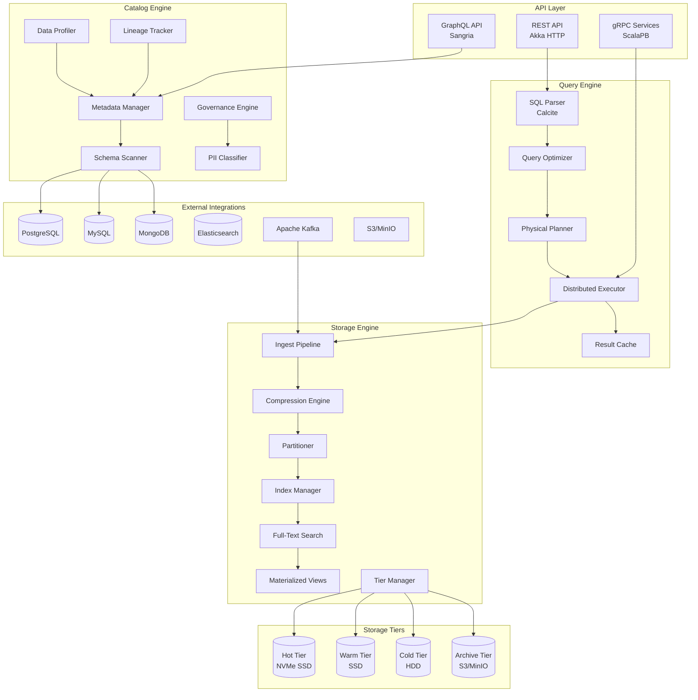
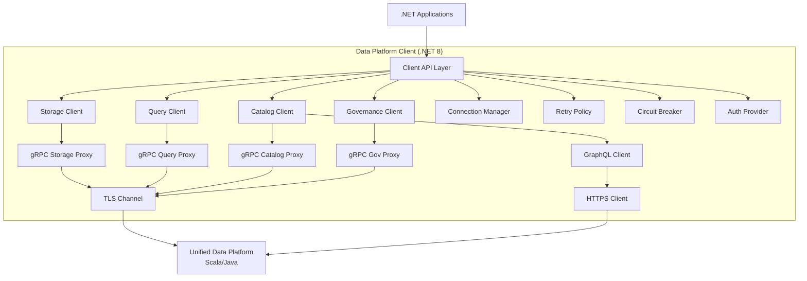

# Unified Data Platform Service

## Service Overview

**Service Name:** Unified Data Platform Service (UDPS)
**Technology Stack:** Scala 2.13, Java 17, Apache Calcite, Apache Arrow, Apache Parquet, gRPC, Akka HTTP
**Version:** 1.0.0
**Status:** Production-ready
**Ports:** gRPC/TLS 50060, HTTPS 8443, Metrics 9090, Health 8081

### Primary Purpose

The Unified Data Platform Service is a comprehensive, enterprise-grade data platform that consolidates columnar storage, SQL query execution, and metadata cataloging into a single high-performance service. It provides end-to-end data management capabilities including storage, querying, cataloging, governance, lineage tracking, and advanced analytics.

### Key Capabilities

**Storage Layer:**
- Columnar Storage (Apache Arrow/Parquet)
- Multi-codec Compression (LZ4, ZSTD, Delta, Gorilla, Brotli)
- Tiered Storage Management (Hot/Warm/Cold/Archive)
- Advanced Indexing (Zone Maps, Bloom Filters, Bitmap, Skip Lists, Inverted Indexes)
- Full-Text Search with multiple analyzers
- Materialized Views with incremental refresh
- Multi-node Replication and Sharding
- Adaptive Partitioning (Time/Hash/Range/Hybrid/Composite)

**Query Layer:**
- SQL Parsing & Optimization (Apache Calcite)
- Multi-stage Query Optimization
- Distributed Execution with Work Stealing
- Vectorized Processing (Apache Arrow)
- Data Source Federation (JDBC, NoSQL, Object Storage)
- Query Result Caching
- Adaptive Query Execution
- Cost-based Optimizer with Statistics

**Catalog Layer:**
- Automatic Schema Discovery & Scanning
- Comprehensive Metadata Management
- GraphQL & REST APIs
- Data Lineage Tracking (Table & Column Level)
- Data Profiling & Quality Metrics
- Data Sampling & Preview
- Dynamic Query Builder
- Query History & Analytics
- Flexible Tagging System
- Business Glossary Management

**Governance Layer:**
- PII Classification & Detection
- Data Anonymization & Masking
- GDPR Compliance Tools
- Access Request Workflow
- Data Retention Policies
- Audit Trail & Compliance Reporting
- Column-level Security
- Data Quality Rules Engine

**Advanced Features:**
- Real-time Streaming Ingest
- Change Data Capture (CDC)
- Time Travel Queries
- Snapshot Isolation
- ACID Transactions
- Schema Evolution & Versioning
- Entity Relationship Diagram Generation
- Performance Monitoring & Tuning
- Cost Analysis & Optimization
- Machine Learning Feature Store Integration

---

## Architecture

### High-Level Architecture

### Technology Stack

| Layer | Technology | Purpose |
|-------|-----------|---------|
| **Language** | Scala 2.13, Java 17 | Primary development |
| **Build** | SBT 1.9.x, Maven | Build & dependency management |
| **SQL Engine** | Apache Calcite 1.35.0 | SQL parsing & optimization |
| **Columnar Format** | Apache Arrow 14.0.1 | In-memory columnar data |
| **File Format** | Apache Parquet 1.13.x | Persistent columnar storage |
| **HTTP Framework** | Akka HTTP 10.5.x | REST API server |
| **GraphQL** | Sangria 4.0.x | GraphQL implementation |
| **gRPC** | ScalaPB 0.11.x | High-performance RPC |
| **Serialization** | Protocol Buffers 3.x | Message serialization |
| **Compression** | LZ4, ZSTD, Snappy, Brotli | Data compression |
| **Streaming** | Akka Streams | Reactive streams |
| **Actor System** | Akka 2.8.x | Concurrency & distribution |
| **Clustering** | Akka Cluster | Distributed computing |
| **Persistence** | Akka Persistence | Event sourcing |
| **Database** | PostgreSQL 16 | Metadata catalog |
| **Object Storage** | MinIO (S3-compatible) | Cold/Archive tiers |
| **Message Queue** | Apache Kafka | Event streaming |
| **Caching** | Apache Ignite | Distributed cache |
| **Search** | Apache Lucene | Full-text indexing |
| **Metrics** | Dropwizard Metrics | Application metrics |
| **Tracing** | OpenTelemetry + Jaeger | Distributed tracing |
| **Logging** | Logback + SLF4J | Structured logging |
| **Security** | Apache Shiro | Authentication & authorization |
| **TLS/SSL** | Netty SSL, Java SSL | Encrypted communication |

---

## Core Features & Functionality

### 1. Unified Columnar Storage

**Description:** High-performance columnar storage with Apache Arrow and Parquet formats, supporting multiple compression codecs and tiered storage management.

**Features:**
- Apache Arrow in-memory columnar format
- Parquet persistent storage with schema evolution
- Record batch processing with configurable batch sizes
- Zero-copy data transfer between components
- Streaming ingest from Kafka, files, and databases
- Real-time data ingestion with micro-batching
- Automatic schema inference and validation
- Schema registry integration
- Data versioning with snapshot isolation
- ACID transaction support

**Compression Codecs:**
- LZ4 - Ultra-fast compression (2-3x ratio)
- ZSTD - Balanced compression (3-5x ratio)
- Snappy - Fast compression for general use
- Brotli - High compression ratio (5-8x)
- Delta Encoding - Numeric sequences (5-10x)
- Gorilla - Time-series data (10-20x)
- Dictionary Encoding - Categorical data
- Run-Length Encoding - Repetitive data

**Advanced Storage Features:**
- Deduplication at block level
- Copy-on-write optimization
- Late materialization
- Column pruning
- Predicate pushdown to storage layer
- Adaptive row group sizing
- Data locality awareness
- Smart prefetching

**Use Cases:**
- High-performance analytical queries
- Data lake storage
- Real-time analytics
- Machine learning datasets
- Historical data archival
- Log aggregation and analysis

---

### 2. Tiered Storage Management

**Description:** Intelligent, policy-based tiered storage system with automatic data movement and cost optimization.

**Storage Tiers:**
- **Hot Tier:** NVMe SSD, <1ms latency, recent/frequently accessed data
- **Warm Tier:** SSD, <10ms latency, moderately accessed data
- **Cold Tier:** HDD, <100ms latency, infrequently accessed data
- **Archive Tier:** S3/MinIO, <1s latency, long-term retention, lowest cost

**Tiering Policies:**
- Age-based: Automatic transition based on data age
- Access-based: Move based on access frequency and recency
- Size-based: Tier based on partition/file size
- Cost-based: Optimize for storage cost vs. performance
- Custom policies: User-defined tiering rules
- Temperature tracking: Heat maps for data access patterns

**Features:**
- Automatic tier transitions with configurable schedules
- Transparent data access across tiers
- Cost savings calculation and reporting
- Tier statistics and analytics
- Data lifecycle management
- Compression ratio optimization per tier
- Rehydration strategies for cold data
- Tier-aware query planning

**Advanced Capabilities:**
- Predictive tiering with ML models
- Multi-region replication across tiers
- Tier-specific compression strategies
- Bandwidth throttling for transitions
- Background data reorganization
- Tier capacity planning and alerts

---

### 3. Advanced Indexing

**Description:** Comprehensive indexing system with multiple index types for query acceleration.

**Index Types:**

**Zone Maps (Min/Max Indexes):**
- Track minimum and maximum values per partition
- Partition pruning for range queries
- Automatic creation during data ingestion
- Lightweight and always-on

**Bloom Filters:**
- Probabilistic membership testing
- Configurable false positive rate (0.01% - 5%)
- Optimal for equality predicates
- Space-efficient implementation

**Bitmap Indexes:**
- Categorical and low-cardinality columns
- Fast AND/OR/NOT operations
- Compressed bitmap representation
- Ideal for multi-dimensional queries

**Skip Lists:**
- Ordered data indexing
- Range query optimization
- Probabilistic data structure
- Memory-efficient

**Inverted Indexes (Full-Text):**
- Token-based text indexing
- Multiple analyzer support
- Fuzzy matching and wildcards
- Phrase and proximity queries

**Composite Indexes:**
- Multi-column indexing
- Support for complex predicates
- Intelligent column ordering
- Partial index support

**Adaptive Indexes:**
- Automatic index selection based on query patterns
- Self-tuning index parameters
- Cost-benefit analysis for index creation
- Unused index detection and cleanup

**Index Management:**
- Background index building
- Incremental index updates
- Index compaction and optimization
- Index usage statistics
- Concurrent index access
- Index versioning

---

### 4. Full-Text Search

**Description:** Enterprise-grade full-text search powered by Apache Lucene with advanced text processing.

**Analyzer Types:**
- **Standard:** Tokenization + lowercasing + stop words
- **Stop-words:** Configurable stop word removal
- **N-gram:** Substring matching (configurable n)
- **Edge N-gram:** Prefix matching optimization
- **Keyword:** Exact matching, no tokenization
- **Phonetic:** Sound-alike matching (Metaphone, Soundex)
- **Language-specific:** English, Spanish, French, German, etc.
- **Custom:** User-defined analyzer pipelines

**Search Features:**
- Boolean queries (AND, OR, NOT)
- Phrase queries with slop
- Fuzzy queries with edit distance
- Wildcard and regex queries
- Range queries
- Boosting and scoring customization
- Faceted search
- Highlighting of matches
- Did-you-mean suggestions
- Synonyms and stemming

**Advanced Capabilities:**
- Real-time indexing
- Distributed search across partitions
- Query caching
- Index warming
- Near-real-time search
- Geo-spatial search
- Multi-field search with boosting

---

### 5. Materialized Views

**Description:** Pre-computed query results with automatic maintenance and incremental refresh.

**Refresh Modes:**
- **ON_DEMAND:** Manual refresh triggered by user
- **SCHEDULED:** Cron-based periodic refresh
- **INCREMENTAL:** Change-based delta refresh
- **CONTINUOUS:** Real-time streaming updates
- **HYBRID:** Combination of scheduled and incremental

**Features:**
- Automatic query rewriting to use views
- Multi-level materialized view hierarchies
- Partition-aware views
- View staleness tracking
- Conditional refresh based on data changes
- Parallel view refresh
- View dependency tracking
- Automatic view invalidation

**Optimization:**
- Cost-based view selection
- View recommendation engine
- Unused view detection
- View consolidation suggestions
- Storage space optimization

**Use Cases:**
- Dashboard acceleration
- Report generation
- Complex aggregation queries
- Join materialization
- Pre-computed analytics
- Data mart creation

---

### 6. SQL Query Engine

**Description:** Advanced SQL query engine with Apache Calcite optimizer and distributed execution.

**SQL Support:**
- SQL:2016 standard compliance
- ANSI SQL joins (INNER, LEFT, RIGHT, FULL, CROSS)
- Window functions and analytics
- Common Table Expressions (CTEs)
- Recursive queries
- Set operations (UNION, INTERSECT, EXCEPT)
- Subqueries (correlated and uncorrelated)
- Array and JSON operations
- User-Defined Functions (UDFs)
- User-Defined Aggregates (UDAFs)

**Query Optimization Stages:**

**1. Logical Optimization:**
- Expression simplification and constant folding
- Filter pushdown and merging
- Projection pruning
- Join reordering with dynamic programming
- Subquery decorrelation
- Predicate inference
- Redundant operation elimination

**2. Cost-Based Optimization:**
- Cardinality estimation with histograms
- Join strategy selection (hash, merge, nested loop, broadcast)
- Index selection
- Materialized view selection
- Partition pruning
- Parallel execution planning

**3. Physical Optimization:**
- Operator fusion
- Vectorization
- Memory management
- Cache-aware execution
- NUMA-aware scheduling

**4. Runtime Optimization:**
- Adaptive query execution
- Runtime statistics collection
- Dynamic plan switching
- Speculative execution

**Distributed Execution:**
- Parallel scan with work stealing
- Two-stage aggregation (local + global)
- Shuffle join with partitioning
- Broadcast join for small tables
- Sort-merge join for large tables
- Pipeline parallelism
- Fault tolerance with task retry
- Resource-aware scheduling

---

### 7. Data Source Federation

**Description:** Unified query interface across heterogeneous data sources with intelligent federation.

**Supported Data Sources:**

**Relational Databases:**
- PostgreSQL 12+
- MySQL 8.0+
- SQL Server 2019+
- Oracle 19c+
- MariaDB 10.5+
- IBM DB2
- Teradata

**NoSQL Databases:**
- MongoDB 5.0+
- Cassandra 4.0+
- HBase 2.4+
- DynamoDB
- Couchbase

**Search Engines:**
- Elasticsearch 8.0+
- Solr 9.0+
- OpenSearch

**Object Storage:**
- S3 / MinIO
- Azure Blob Storage
- Google Cloud Storage
- HDFS

**File Formats:**
- Parquet, ORC, Avro
- CSV, TSV, JSON
- XML, Excel

**Streaming:**
- Apache Kafka
- Apache Pulsar
- Amazon Kinesis

**Federation Features:**
- Cross-source joins
- Predicate pushdown to source systems
- Projection pushdown
- Join pushdown (when supported)
- Aggregation pushdown
- Limit pushdown
- Intelligent data movement minimization
- Result caching
- Parallel data retrieval

**Advanced Capabilities:**
- Schema mapping and transformation
- Data type conversion
- Time zone handling
- Character encoding conversion
- Query translation for source-specific SQL dialects

---

### 8. Metadata Catalog & Schema Management

**Description:** Comprehensive metadata catalog with automatic discovery, versioning, and governance.

**Catalog Features:**

**Automatic Schema Discovery:**
- Multi-database scanning (parallel execution)
- Incremental scanning with change detection
- Scheduled automatic rescans
- Schema drift detection
- Metadata extraction:
  - Tables, views, materialized views
  - Columns with data types, constraints
  - Indexes, primary keys, foreign keys
  - Partitions and partitioning strategies
  - Table and column statistics
  - Triggers and stored procedures

**Metadata Management:**
- Full CRUD operations on metadata
- Custom metadata annotations
- Business metadata linking
- Technical lineage tracking
- Business lineage documentation
- Metadata search with full-text indexing
- Metadata versioning with audit trail
- Metadata export/import

**Schema Versioning:**
- Automatic schema snapshots
- Schema diff generation
- Change tracking with detailed history
- Rollback capabilities
- Schema migration planning
- Breaking change detection
- Impact analysis for schema changes

**Schema Evolution:**
- Add/drop columns
- Modify data types with conversion
- Rename operations with aliasing
- Constraint modifications
- Backward compatibility checks
- Forward compatibility validation

---

### 9. GraphQL API

**Description:** Flexible GraphQL API powered by Sangria for complex metadata queries and mutations.

**Features:**
- Schema introspection
- Advanced filtering with operators (eq, ne, gt, lt, in, contains)
- Multi-field sorting
- Cursor-based and offset-based pagination
- Nested queries with depth limiting
- Field-level projection
- Query batching with DataLoader
- Subscriptions for real-time updates
- Query complexity analysis
- Rate limiting per client
- Custom scalar types
- Union and interface types

**Query Capabilities:**
- Complex nested relationships
- Join-like queries across entities
- Aggregation queries
- Full-text search integration
- Faceted search
- Graph traversal queries

**Mutation Support:**
- Metadata updates
- Tag management
- Glossary term operations
- Lineage recording
- Batch mutations
- Transaction support

**Performance:**
- Query result caching
- N+1 query prevention
- Lazy loading
- Connection pooling
- Query plan caching

---

### 10. Data Lineage Tracking

**Description:** End-to-end data lineage with directed acyclic graph (DAG) representation and visualization.

**Lineage Levels:**

**Table-Level Lineage:**
- Source to target table relationships
- Transformation documentation
- ETL/ELT pipeline tracking
- Multi-hop lineage traversal
- Upstream and downstream dependency graphs

**Column-Level Lineage:**
- Field-to-field mapping
- Transformation expressions
- Data derivation tracking
- Calculated column dependencies
- Aggregation source tracking

**Query-Based Lineage:**
- Automatic lineage extraction from SQL
- DML statement tracking (INSERT, UPDATE, DELETE)
- View definition lineage
- CTE lineage tracking

**Advanced Features:**
- Lineage visualization with interactive graphs
- Impact analysis for schema changes
- Root cause analysis for data quality issues
- Circular dependency detection
- Lineage path optimization
- Historical lineage versioning
- Lineage search and filtering
- Lineage export (GraphML, JSON)

**Integration:**
- Airflow DAG integration
- dbt lineage import
- Spark lineage extraction
- Custom lineage API

---

### 11. Data Profiling & Quality

**Description:** Comprehensive data profiling with statistical analysis and quality metrics.

**Profile Statistics:**

**Numeric Columns:**
- Min, max, mean, median, mode
- Standard deviation, variance
- Percentiles (p1, p5, p10, p25, p50, p75, p90, p95, p99)
- Skewness and kurtosis
- Histogram with configurable bins
- Outlier detection (IQR, Z-score)

**String Columns:**
- Min/max/average length
- Unique value count
- Cardinality ratio
- Most common values with frequencies
- Pattern analysis with regex
- Character set distribution
- Email/URL/phone number detection

**Date/Timestamp Columns:**
- Min/max dates
- Date range and gaps
- Temporal patterns (hourly, daily, weekly, monthly)
- Seasonality detection
- Time zone analysis

**Boolean Columns:**
- True/false distribution
- Null ratio

**All Column Types:**
- Null percentage
- Distinct count
- Uniqueness ratio
- Data type conformity
- Format validation

**Data Quality Metrics:**
- Completeness (non-null ratio)
- Validity (format conformance)
- Consistency (cross-column checks)
- Accuracy (range validation)
- Timeliness (freshness checks)
- Uniqueness (duplicate detection)

**Quality Rules Engine:**
- Custom validation rules
- Threshold-based alerts
- Automated quality scoring
- Trend analysis over time
- Quality dashboards

---

### 12. Data Sampling & Preview

**Description:** Intelligent data sampling for analysis, testing, and preview.

**Sampling Strategies:**

**Random Sampling:**
- Uniform random selection
- Configurable sample size (row count or percentage)
- Reservoir sampling for streams
- Stratified random sampling

**Stratified Sampling:**
- Preserve class distribution
- Multi-column stratification
- Proportional allocation

**Systematic Sampling:**
- Regular interval selection
- Deterministic results

**Cluster Sampling:**
- Group-based sampling
- Hierarchical sampling

**Time-Based Sampling:**
- Latest N rows
- Date range filtering
- Time window sampling

**Top-N Sampling:**
- First N rows
- Ordered sampling

**Features:**
- Sample result caching with TTL
- Sample metadata tracking
- Reproducible sampling with seeds
- Export to multiple formats
- Integration with Parquet storage
- Sample comparison tools

---

### 13. Query Builder & History

**Description:** Visual query builder with validation and comprehensive query history tracking.

**Query Builder Features:**
- Drag-and-drop interface support
- Visual table joins
- Filter builder with nested conditions
- Aggregation builder
- Sorting and pagination
- SQL preview and validation
- Query cost estimation
- Saved queries library
- Query templates
- Parameterized queries
- Query sharing and collaboration

**SQL Generation:**
- ANSI SQL standard output
- Source-specific dialect support
- Query optimization during generation
- Comment generation for clarity
- Formatted output

**Query Validation:**
- Syntax checking
- Semantic validation
- Permission checks
- Cost threshold validation
- Timeout estimation

**Query History:**
- Complete query logging
- User activity tracking
- Performance metrics per query
- Query replay functionality
- Query analytics:
  - Most frequent queries
  - Slowest queries
  - Resource-intensive queries
  - Failed query analysis
- Query optimization recommendations
- Query pattern detection
- Retention policies with archival
- Export capabilities

---

### 14. Data Governance & Classification

**Description:** Enterprise data governance with PII detection, classification, and compliance tools.

**PII Classification:**

**Built-in Classifiers:**
- Email addresses
- Phone numbers (international formats)
- Social Security Numbers
- Credit card numbers
- IP addresses (IPv4/IPv6)
- MAC addresses
- Driver's license numbers
- Passport numbers
- Bank account numbers
- IBAN/SWIFT codes
- Medical record numbers
- National ID numbers (multiple countries)

**Classification Methods:**
- Pattern-based (regex with validation)
- Machine learning-based classification
- Dictionary-based matching
- Statistical analysis
- Sample-based detection
- Confidence scoring

**Custom Classification:**
- User-defined patterns
- Custom ML models
- Domain-specific rules
- Business-defined sensitive data

**Data Anonymization:**

**Techniques:**
- Masking (partial or full)
- Hashing (SHA-256, SHA-512)
- Tokenization with token vault
- Encryption (AES-256)
- Generalization (reduce precision)
- Nullification (remove data)
- Substitution (fake data generation with Faker)
- Differential privacy
- k-anonymity
- l-diversity
- t-closeness

**Anonymization Policies:**
- Column-level policies
- Conditional anonymization
- Reversible vs. irreversible
- Format-preserving encryption
- Policy versioning
- Audit trail for all operations

**GDPR Compliance:**
- Right to access
- Right to be forgotten
- Data portability
- Consent management
- Purpose limitation tracking
- Data minimization enforcement

**Compliance Features:**
- Data retention policies
- Automatic data deletion
- Compliance reporting
- Audit logs with tamper-proofing
- Access logs
- Data breach detection
- Compliance dashboards

---

### 15. Tagging & Glossary

**Description:** Flexible metadata organization with tags and business glossary.

**Tagging System:**
- Custom tag creation
- Hierarchical tags (parent-child relationships)
- Tag categories (classification, domain, quality, custom)
- Multi-tag assignment
- Tag inheritance (table → columns)
- Tag-based search and filtering
- Tag analytics and usage statistics
- Auto-tagging rules with pattern matching
- Tag suggestions based on content

**Business Glossary:**
- Term definitions with rich text
- Business context documentation
- Owner assignment with contact info
- Steward designation
- Synonyms and related terms
- Acronym expansion
- Term relationships (is-a, part-of, related-to)
- Term lineage (business → technical mapping)
- Approval workflow for terms
- Version control for definitions
- Term usage tracking
- Glossary export/import

**Metadata Linking:**
- Link glossary terms to tables/columns
- Link documentation to schemas
- Link policies to data elements
- Cross-reference management

---

### 16. Advanced Query Features

**Description:** Enterprise query features for complex analytics.

**Time Travel Queries:**
- Query data as of specific timestamp
- View historical snapshots
- Compare data across time points
- Audit data changes
- Rollback to previous versions

**Snapshot Isolation:**
- MVCC (Multi-Version Concurrency Control)
- Read committed isolation
- Serializable snapshot isolation
- No read locks

**ACID Transactions:**
- BEGIN/COMMIT/ROLLBACK support
- Savepoints
- Two-phase commit for distributed transactions
- Deadlock detection and resolution
- Transaction isolation levels
- Long-running transaction management

**Change Data Capture (CDC):**
- Real-time change tracking
- Row-level change logs
- Before/after images
- Change type identification (INSERT, UPDATE, DELETE)
- Change stream publishing to Kafka
- Incremental data synchronization

**Query Result Caching:**
- Automatic result caching
- Cache key generation from query fingerprint
- TTL-based cache expiration
- Cache hit rate monitoring
- Selective cache invalidation
- Distributed cache with Apache Ignite
- Cache warming strategies

**Adaptive Query Execution:**
- Runtime statistics collection
- Dynamic plan switching
- Skew handling
- Broadcast join threshold adjustment
- Partition count optimization

---

### 17. Access Control & Security

**Description:** Fine-grained access control with column-level security and audit trails.

**Authentication:**
- JWT-based authentication
- Service-to-service authentication
- API key authentication
- OAuth 2.0 / OIDC integration
- LDAP/Active Directory integration
- Multi-factor authentication support
- Session management
- Token refresh mechanism

**Authorization:**
- Role-Based Access Control (RBAC)
- Attribute-Based Access Control (ABAC)
- Policy-Based Access Control (PBAC)
- Row-level security with filters
- Column-level security with masking
- Dynamic data masking based on user roles
- Temporary access grants
- Access request and approval workflow

**Permissions:**
- Database-level permissions
- Schema-level permissions
- Table-level permissions (read, write, delete)
- Column-level permissions
- Function execution permissions
- Admin permissions

**Security Features:**
- SQL injection prevention
- Parameter validation
- Input sanitization
- Rate limiting per user/API key
- DDoS protection
- Encrypted connections (TLS 1.3)
- Certificate-based authentication
- Secrets management integration

**Audit Trail:**
- All access logged
- Query history per user
- Data modification tracking
- Schema change logging
- Permission change tracking
- Failed access attempts
- Anomaly detection
- Compliance reporting
- Log encryption and signing

---

### 18. Performance Monitoring & Tuning

**Description:** Comprehensive performance monitoring with automated tuning recommendations.

**Query Performance:**
- Execution plan analysis
- Query execution statistics
- Slow query detection with configurable thresholds
- Query profiling with detailed metrics
- Execution timeline visualization
- Resource consumption tracking (CPU, memory, I/O)
- Wait event analysis

**Index Recommendations:**
- Unused index detection
- Missing index suggestions
- Redundant index identification
- Index consolidation recommendations
- Optimal index column order
- Partial index suggestions

**Performance Metrics:**
- Throughput (queries per second)
- Latency percentiles (p50, p95, p99, p999)
- Connection pool utilization
- Cache hit rates
- Disk I/O statistics
- Network bandwidth usage
- JVM metrics (for Java/Scala components)
- Thread pool statistics

**Automatic Tuning:**
- Auto-vacuum and analyze
- Statistics update automation
- Partition pruning optimization
- Join strategy tuning
- Memory allocation optimization
- Thread pool sizing

**Performance Dashboards:**
- Real-time metrics
- Historical trends
- Comparative analysis
- Bottleneck identification
- Resource utilization heatmaps

---

### 19. Cost Analysis & Optimization

**Description:** Storage and compute cost tracking with optimization recommendations.

**Cost Tracking:**
- Storage costs by tier
- Compute costs per query
- Data transfer costs
- Replication costs
- Backup storage costs
- Cost allocation by workspace/team/user
- Cost trends and forecasting

**Cost Optimization:**
- Storage tier recommendations
- Compression ratio optimization
- Unused data identification
- Data lifecycle recommendations
- Query optimization for cost reduction
- Materialized view recommendations
- Index optimization for cost

**Billing & Reporting:**
- Cost breakdown reports
- Chargeback reporting
- Budget alerts
- Cost attribution
- ROI analysis
- Cost comparison across time periods

---

### 20. Entity Relationship Diagrams

**Description:** Automatic ERD generation with customizable layouts.

**Features:**
- Schema-level ERDs
- Table-centric ERDs
- Relationship visualization
- Cardinality display
- Primary key/foreign key highlighting
- Index visualization
- Partition information
- Interactive diagrams

**Export Formats:**
- SVG (scalable vector graphics)
- PNG (raster image)
- PDF (document format)
- GraphML (graph format)
- Mermaid (text-based diagrams)
- PlantUML
- JSON (data format)

**Customization:**
- Layout algorithms (hierarchical, force-directed, circular)
- Theme selection
- Color coding by classification
- Zoom and pan
- Collapsible sections

---

### 21. Machine Learning Integration

**Description:** Feature store integration for ML workflows.

**Feature Store:**
- Feature definition and registration
- Feature versioning
- Feature lineage tracking
- Online and offline feature serving
- Point-in-time correct joins
- Feature monitoring

**ML Dataset Export:**
- Export to Parquet for training
- Train/test/validation split
- Time-series split
- Stratified sampling
- Feature transformation
- Label encoding

**Model Metadata:**
- Model registration
- Model versioning
- Model lineage
- Training data linkage
- Model performance tracking

---

## API Reference

### gRPC Services (Port 50060, TLS)

**StorageService:**
- `Ingest(IngestRequest) returns (IngestResponse)` - Ingest data
- `Query(QueryRequest) returns (stream ArrowBatchResponse)` - Query data
- `GetStats(StatsRequest) returns (StatsResponse)` - Storage statistics
- `Compact(CompactRequest) returns (CompactResponse)` - Compact partitions
- `GetTierStatistics(TierStatsRequest) returns (TierStatsResponse)` - Tier stats
- `TransitionPartitionTier(TierTransitionRequest) returns (TierTransitionResponse)` - Move tier
- `RunTierManagement(RunTierManagementRequest) returns (RunTierManagementResponse)` - Auto-tier
- `GetCostSavings(CostSavingsRequest) returns (CostSavingsResponse)` - Cost savings
- `BuildIndexes(BuildIndexesRequest) returns (BuildIndexesResponse)` - Build indexes
- `GetIndexStatistics(IndexStatsRequest) returns (IndexStatsResponse)` - Index stats
- `PrunePartitions(PrunePartitionsRequest) returns (PrunePartitionsResponse)` - Prune partitions
- `CreateInvertedIndex(CreateInvertedIndexRequest) returns (CreateInvertedIndexResponse)` - FTS index
- `FullTextSearch(FullTextSearchRequest) returns (FullTextSearchResponse)` - FTS query
- `CreateMaterializedView(CreateMaterializedViewRequest) returns (CreateMaterializedViewResponse)` - Create view
- `RefreshMaterializedView(RefreshMaterializedViewRequest) returns (RefreshMaterializedViewResponse)` - Refresh view
- `GetReplicationStatus(ReplicationStatusRequest) returns (ReplicationStatusResponse)` - Replication status

**QueryService:**
- `ExecuteQuery(QueryRequest) returns (stream ArrowBatchResponse)` - Execute SQL
- `ExplainQuery(ExplainRequest) returns (ExplainResponse)` - Explain plan
- `GetQueryStats(QueryStatsRequest) returns (QueryStatsResponse)` - Query statistics
- `CancelQuery(CancelQueryRequest) returns (CancelQueryResponse)` - Cancel query
- `RegisterDataSource(DataSourceRequest) returns (DataSourceResponse)` - Register source
- `ListDataSources(ListDataSourcesRequest) returns (ListDataSourcesResponse)` - List sources

**CatalogService:**
- `ScanDatabase(ScanRequest) returns (ScanResponse)` - Scan database schema
- `GetTableMetadata(TableRequest) returns (TableMetadata)` - Get table metadata
- `GetColumnMetadata(ColumnRequest) returns (ColumnMetadata)` - Get column metadata
- `UpdateMetadata(UpdateMetadataRequest) returns (UpdateMetadataResponse)` - Update metadata
- `SearchMetadata(SearchRequest) returns (SearchResponse)` - Search metadata
- `GetLineage(LineageRequest) returns (LineageResponse)` - Get lineage
- `RecordLineage(RecordLineageRequest) returns (RecordLineageResponse)` - Record lineage
- `ProfileData(ProfileRequest) returns (ProfileResponse)` - Profile data
- `CreateSample(SampleRequest) returns (SampleResponse)` - Create sample
- `ClassifyData(ClassificationRequest) returns (ClassificationResponse)` - Classify PII
- `AnonymizeData(AnonymizationRequest) returns (AnonymizationResponse)` - Anonymize data

**HealthService:**
- `Check(HealthCheckRequest) returns (HealthCheckResponse)` - Health check
- `Watch(HealthCheckRequest) returns (stream HealthCheckResponse)` - Health stream

### REST API (Port 8443, HTTPS)

#### Catalog Endpoints

**Databases:**
- `GET /api/v1/catalog/databases` - List databases
- `POST /api/v1/catalog/databases/scan` - Scan database
- `GET /api/v1/catalog/databases/{id}` - Get database
- `DELETE /api/v1/catalog/databases/{id}` - Remove database

**Schemas:**
- `GET /api/v1/catalog/schemas` - List schemas
- `GET /api/v1/catalog/schemas/{id}` - Get schema
- `GET /api/v1/catalog/schemas/{id}/tables` - List tables

**Tables:**
- `GET /api/v1/catalog/tables` - List tables
- `GET /api/v1/catalog/tables/{id}` - Get table
- `PUT /api/v1/catalog/tables/{id}` - Update table
- `DELETE /api/v1/catalog/tables/{id}` - Delete table

**Columns:**
- `GET /api/v1/catalog/columns/{id}` - Get column
- `PUT /api/v1/catalog/columns/{id}` - Update column

**Metadata:**
- `GET /api/v1/metadata/search` - Search metadata
- `GET /api/v1/metadata/stats` - Metadata statistics

#### Storage Endpoints

- `POST /api/v1/storage/ingest` - Ingest data
- `POST /api/v1/storage/query` - Query storage
- `GET /api/v1/storage/stats` - Storage stats
- `POST /api/v1/storage/compact` - Compact partitions
- `GET /api/v1/storage/tiers` - Tier statistics
- `POST /api/v1/storage/tiers/transition` - Transition tier
- `GET /api/v1/storage/costs` - Cost analysis

#### Query Endpoints

- `POST /api/v1/query/execute` - Execute SQL
- `POST /api/v1/query/explain` - Explain query
- `POST /api/v1/query/cancel/{id}` - Cancel query
- `GET /api/v1/query/history` - Query history
- `GET /api/v1/query/history/{id}` - Get query

#### Data Source Endpoints

- `POST /api/v1/datasources` - Register data source
- `GET /api/v1/datasources` - List data sources
- `GET /api/v1/datasources/{id}` - Get data source
- `DELETE /api/v1/datasources/{id}` - Remove data source

#### Lineage Endpoints

- `GET /api/v1/lineage/tables/{id}/upstream` - Upstream lineage
- `GET /api/v1/lineage/tables/{id}/downstream` - Downstream lineage
- `GET /api/v1/lineage/columns/{id}` - Column lineage
- `POST /api/v1/lineage/record` - Record lineage
- `POST /api/v1/lineage/impact` - Impact analysis

#### Profiling Endpoints

- `POST /api/v1/profiling/tables/{id}` - Profile table
- `GET /api/v1/profiling/results/{id}` - Get profile
- `POST /api/v1/profiling/columns/{id}` - Profile column

#### Sampling Endpoints

- `POST /api/v1/sampling/create` - Create sample
- `GET /api/v1/sampling/{id}` - Get sample
- `DELETE /api/v1/sampling/{id}` - Delete sample

#### Governance Endpoints

**Classification:**
- `POST /api/v1/governance/classification/scan` - Scan for PII
- `GET /api/v1/governance/classification/results` - Get results
- `POST /api/v1/governance/classification/rules` - Add rule
- `GET /api/v1/governance/classification/rules` - List rules

**Anonymization:**
- `POST /api/v1/governance/anonymization/policies` - Create policy
- `GET /api/v1/governance/anonymization/policies` - List policies
- `POST /api/v1/governance/anonymization/execute` - Execute anonymization
- `GET /api/v1/governance/anonymization/jobs/{id}` - Job status

**Access Requests:**
- `POST /api/v1/governance/access-requests` - Submit request
- `GET /api/v1/governance/access-requests` - List requests
- `POST /api/v1/governance/access-requests/{id}/approve` - Approve
- `POST /api/v1/governance/access-requests/{id}/deny` - Deny

#### Tags & Glossary

**Tags:**
- `POST /api/v1/tags` - Create tag
- `GET /api/v1/tags` - List tags
- `POST /api/v1/tags/assign` - Assign tag
- `DELETE /api/v1/tags/assign` - Remove tag

**Glossary:**
- `POST /api/v1/glossary/terms` - Create term
- `GET /api/v1/glossary/terms` - List terms
- `GET /api/v1/glossary/terms/{id}` - Get term
- `PUT /api/v1/glossary/terms/{id}` - Update term
- `DELETE /api/v1/glossary/terms/{id}` - Delete term

#### Utilities

**ERD:**
- `GET /api/v1/erd/schemas/{id}` - Generate schema ERD
- `GET /api/v1/erd/tables/{id}` - Generate table ERD

**Query Builder:**
- `POST /api/v1/query-builder/build` - Build query
- `POST /api/v1/query-builder/validate` - Validate query

**Performance:**
- `GET /api/v1/performance/slow-queries` - Slow queries
- `GET /api/v1/performance/recommendations` - Recommendations

**Costs:**
- `GET /api/v1/costs/storage` - Storage costs
- `GET /api/v1/costs/query` - Query costs
- `GET /api/v1/costs/workspace/{id}` - Workspace costs

#### Health & Monitoring

- `GET /health` - Health check
- `GET /health/live` - Liveness probe
- `GET /health/ready` - Readiness probe
- `GET /metrics` - Prometheus metrics

### GraphQL API (Port 8443, HTTPS, Path: /graphql)

**Query Types:**
- `databases` - Query databases
- `schemas` - Query schemas
- `tables` - Query tables
- `columns` - Query columns
- `lineageGraph` - Query lineage
- `profiles` - Query data profiles
- `tags` - Query tags
- `glossaryTerms` - Query glossary
- `queryHistory` - Query history
- `slowQueries` - Slow query analysis

**Mutation Types:**
- `updateTableMetadata` - Update table
- `updateColumnMetadata` - Update column
- `assignTag` - Assign tag
- `createGlossaryTerm` - Create term
- `recordLineage` - Record lineage
- `profileTable` - Profile table
- `classifyData` - Classify data

**Subscription Types:**
- `catalogUpdates` - Real-time catalog changes
- `queryStatus` - Query execution status
- `lineageUpdates` - Lineage changes

---

## Configuration

### Environment Variables

| Variable | Type | Default | Description |
|----------|------|---------|-------------|
| `UDPS_GRPC_PORT` | int | 50060 | gRPC server port |
| `UDPS_HTTP_PORT` | int | 8443 | HTTPS server port |
| `UDPS_METRICS_PORT` | int | 9090 | Metrics port |
| `UDPS_HEALTH_PORT` | int | 8081 | Health check port |
| `UDPS_STORAGE_PATH` | string | /data/storage | Storage path |
| `UDPS_HOT_TIER_PATH` | string | /data/hot | Hot tier path |
| `UDPS_WARM_TIER_PATH` | string | /data/warm | Warm tier path |
| `UDPS_COLD_TIER_PATH` | string | /data/cold | Cold tier path |
| `UDPS_S3_ENDPOINT` | string | minio:9000 | S3 endpoint |
| `UDPS_S3_BUCKET` | string | archive-tier | Archive bucket |
| `UDPS_POSTGRES_HOST` | string | postgres | PostgreSQL host |
| `UDPS_POSTGRES_PORT` | int | 5432 | PostgreSQL port |
| `UDPS_POSTGRES_DB` | string | metadata_catalog | Database name |
| `UDPS_KAFKA_BROKERS` | string | kafka:9092 | Kafka brokers |
| `UDPS_KAFKA_TOPIC` | string | data-ingest | Ingest topic |
| `UDPS_IGNITE_NODES` | string | ignite:10800 | Ignite nodes |
| `UDPS_VAULT_ADDR` | string | https://vault:8443 | Vault address |
| `UDPS_ENABLE_TLS` | bool | true | Enable TLS |
| `UDPS_TLS_CERT_PATH` | string | /etc/ssl/certs | TLS cert path |
| `UDPS_TLS_KEY_PATH` | string | /etc/ssl/private | TLS key path |
| `UDPS_AKKA_CLUSTER_SEEDS` | string | akka://udps@node1:2551 | Cluster seeds |
| `UDPS_MAX_WORKERS` | int | 16 | Max worker threads |
| `UDPS_QUERY_TIMEOUT` | duration | 5m | Query timeout |
| `UDPS_CACHE_TTL` | duration | 5m | Cache TTL |

### TLS/SSL Configuration

**Required Certificates:**
- Server certificate and key (PEM format)
- CA certificate for client verification
- Client certificates for mutual TLS

**TLS Settings:**
- Protocol: TLS 1.3
- Cipher suites: Modern, secure ciphers only
- Certificate validation: Enabled
- Mutual TLS: Optional (configurable)

### Cluster Configuration

**Akka Cluster:**
- Minimum cluster size: 3 nodes
- Split-brain resolver: Keep majority
- Failure detector: Phi Accrual
- Gossip interval: 1 second
- Auto-downing: Disabled (safety)

**Distributed Features:**
- Cluster sharding for partitions
- Cluster singleton for coordination
- Distributed pub-sub
- Cluster-aware routers

---

## Observability

### Metrics (Prometheus)

**Endpoint:** `http://localhost:9090/metrics`

**Storage Metrics:**
- `udps_ingest_total` - Ingestion count
- `udps_ingest_bytes` - Bytes ingested
- `udps_ingest_duration_seconds` - Ingest latency
- `udps_compression_ratio` - Compression ratio
- `udps_tier_bytes` - Bytes per tier
- `udps_tier_files` - Files per tier
- `udps_index_size_bytes` - Index sizes
- `udps_cache_hit_rate` - Cache hit rate

**Query Metrics:**
- `udps_query_total` - Query count (by status)
- `udps_query_duration_seconds` - Query latency
- `udps_active_queries` - Active queries
- `udps_partitions_scanned` - Partitions scanned
- `udps_rows_processed` - Rows processed
- `udps_bytes_scanned` - Bytes scanned
- `udps_cache_hits` - Query cache hits

**Catalog Metrics:**
- `udps_catalog_scan_total` - Catalog scans
- `udps_catalog_tables` - Cataloged tables
- `udps_catalog_columns` - Cataloged columns
- `udps_lineage_nodes` - Lineage nodes
- `udps_lineage_edges` - Lineage edges

**System Metrics:**
- `udps_jvm_memory_used` - JVM memory
- `udps_jvm_threads` - Thread count
- `udps_akka_actors` - Actor count
- `udps_http_requests_total` - HTTP requests
- `udps_grpc_requests_total` - gRPC requests

### Tracing (OpenTelemetry + Jaeger)

**Exporter:** OTLP gRPC to Jaeger
**Sampling:** Probabilistic (10%)

**Traced Operations:**
- Data ingestion
- Query execution
- Catalog scans
- Lineage queries
- Data profiling
- Classification
- Inter-service calls

### Logging (Logback + SLF4J)

**Format:** JSON with structured fields
**Levels:** TRACE, DEBUG, INFO, WARN, ERROR
**Outputs:** Console, File, Kafka

**Key Events:**
- Service startup/shutdown
- Cluster events
- Query execution
- Data ingestion
- Errors and exceptions
- Security events
- Performance warnings

---

## Performance Characteristics

### Throughput

- Ingest: 500 MB/sec per node
- Query (scan): 2 GB/sec per node
- Query (indexed): 10,000 queries/sec
- Metadata operations: 5,000 ops/sec
- GraphQL queries: 3,000 queries/sec
- gRPC calls: 10,000 calls/sec

### Latency (p99)

- Ingest: <50ms
- Query (simple): <100ms
- Query (complex): <2s
- Metadata lookup: <10ms
- Lineage query: <200ms
- Data profiling: <5s (for 1M rows)

### Scalability

- Horizontal scaling: Linear to 100 nodes
- Vertical scaling: Up to 256 GB RAM, 64 cores
- Storage: Petabyte scale
- Tables: Millions
- Partitions: Billions
- Concurrent queries: Thousands

---

## Deployment

### Container Image

**Base Image:** Eclipse Temurin 17-JRE (Alpine)
**Size:** ~500 MB
**Registry:** `registry.gbmm.io/unified-data-platform:1.0.0`

### Kubernetes Deployment

**Resource Requirements (Production):**
- CPU: 8 cores
- Memory: 32 GB
- Disk: 500 GB SSD
- Replicas: 3+ (for HA)

**Probes:**
- Liveness: `/health/live`
- Readiness: `/health/ready`
- Startup: `/health` (initial delay: 30s)

**Persistence:**
- Hot tier: Local SSD (NVMe)
- Warm tier: Network SSD
- Cold tier: Network HDD
- Archive tier: S3/MinIO

---

## Security

### Authentication

- JWT Bearer tokens
- Service accounts with JWT
- API keys with rotation
- Mutual TLS for gRPC

### Authorization

- RBAC with roles and permissions
- Column-level access control
- Row-level security
- Data masking by role

### Encryption

- TLS 1.3 for all communications
- Data at rest encryption (AES-256)
- Transparent column encryption
- Key rotation support

### Audit

- All access logged
- Query history per user
- Schema change tracking
- Compliance reporting

---

# Data Platform Client Service (.NET)

## Service Overview

**Service Name:** Data Platform Client Service
**Technology Stack:** .NET 8, C# 12, gRPC, GraphQL Client
**Version:** 1.0.0
**Status:** Production-ready
**Location:** `/gbmm/data-platform-client/`

### Primary Purpose

The Data Platform Client Service provides a .NET-based client library and service wrapper for the Unified Data Platform Service. It abstracts the complexity of gRPC and GraphQL communications, provides strongly-typed interfaces, handles connection management, and offers high-level APIs for all platform features.

---

## Architecture

---

## Core Features

### 1. Client Libraries

**Storage Client:**
- Ingest data (batch and streaming)
- Query storage with Arrow results
- Manage storage tiers
- Build and manage indexes
- Full-text search operations
- Materialized view management
- Replication management
- Storage statistics and cost analysis

**Query Client:**
- Execute SQL queries
- Explain query plans
- Register and manage data sources
- Query cancellation
- Query history and analytics
- Result streaming with Arrow
- Parameterized queries
- Prepared statements

**Catalog Client:**
- Database and schema scanning
- Metadata CRUD operations
- GraphQL query execution
- Metadata search and filtering
- Lineage querying and recording
- Data profiling
- Data sampling
- Tag and glossary management

**Governance Client:**
- PII classification and scanning
- Data anonymization
- Policy management
- Access request workflow
- Compliance reporting
- Audit log retrieval
- Schema versioning
- ERD generation

### 2. Connection Management

**Features:**
- Connection pooling for gRPC channels
- HTTP client pooling for GraphQL
- Automatic reconnection with exponential backoff
- Load balancing across service instances
- Health checking of connections
- Connection timeout management
- TLS certificate management
- Service discovery integration

### 3. Resilience Patterns

**Retry Policy:**
- Configurable retry attempts
- Exponential backoff
- Jitter for retry timing
- Idempotency detection
- Retry for transient failures only

**Circuit Breaker:**
- Failure threshold configuration
- Half-open state testing
- Success threshold for closing
- Timeout configuration
- Fallback mechanisms

**Bulkhead Isolation:**
- Separate thread pools per client
- Request queuing
- Queue size limits
- Timeout policies

### 4. Authentication & Authorization

**Authentication:**
- JWT token management
- Automatic token refresh
- API key support
- Certificate-based auth for mutual TLS
- Token caching

**Authorization:**
- Permission checking before requests
- Role-based access control
- Workspace context management

### 5. Data Serialization

**Features:**
- Apache Arrow deserialization
- Parquet file handling
- Protocol Buffer support
- JSON serialization for GraphQL
- Efficient memory management
- Zero-copy where possible

### 6. Error Handling

**Features:**
- Strongly-typed exceptions
- Error code mapping from gRPC status
- Detailed error messages
- Retry-able error detection
- Error aggregation for batch operations
- Structured logging of errors

### 7. Observability Integration

**Metrics:**
- Client-side metrics (request count, duration)
- Connection pool metrics
- Error rate tracking
- Success rate monitoring

**Tracing:**
- OpenTelemetry integration
- Distributed trace propagation
- Span creation for client calls

**Logging:**
- Structured logging (Serilog)
- Correlation ID propagation
- Request/response logging (configurable)

### 8. Configuration

**Configuration Sources:**
- appsettings.json
- Environment variables
- Azure App Configuration
- AWS Systems Manager Parameter Store
- HashiCorp Vault

**Configuration Options:**
- Service endpoints
- Connection timeouts
- Retry policies
- Circuit breaker settings
- TLS certificates
- Authentication settings
- Logging levels

### 9. High-Level APIs

**Fluent API:**
- Query builder with LINQ-style syntax
- Storage operations with method chaining
- Catalog operations with fluent interface

**Async/Await Support:**
- All operations are async
- Cancellation token support
- Progress reporting for long operations

**Batch Operations:**
- Batch ingest
- Batch metadata updates
- Batch query execution

---

## Client API Examples (Concepts Only)

### Storage Operations

**Ingest Data:**
- Submit data in various formats
- Specify compression codec
- Configure partitioning strategy
- Receive ingestion status and path

**Query Storage:**
- Execute queries against storage
- Receive results as Arrow batches
- Stream results for large datasets
- Apply filters and projections

**Tier Management:**
- Get tier statistics
- Transition partitions between tiers
- Run automated tier management
- Calculate cost savings

### Query Operations

**Execute SQL:**
- Submit SQL query
- Receive results as typed objects or Arrow batches
- Stream results
- Cancel running queries

**Explain Plans:**
- Get logical plan
- Get physical plan
- Get distributed execution plan
- Analyze optimization steps

**Data Sources:**
- Register new data sources
- List available data sources
- Test data source connections

### Catalog Operations

**Schema Scanning:**
- Scan database schemas
- Retrieve scan results
- Monitor scan progress

**Metadata Management:**
- Retrieve table metadata
- Update table descriptions
- Search metadata by keywords
- Filter by tags or classifications

**GraphQL Queries:**
- Execute GraphQL queries
- Use query builder for type-safe queries
- Handle nested queries
- Paginate results

**Lineage:**
- Query upstream dependencies
- Query downstream dependencies
- Record new lineage relationships
- Perform impact analysis

### Governance Operations

**Classification:**
- Scan tables for PII
- Retrieve classification results
- Add custom classification rules
- Review classified columns

**Anonymization:**
- Create anonymization policies
- Execute anonymization jobs
- Monitor job status
- Review anonymized data

**Access Requests:**
- Submit access requests
- Review pending requests
- Approve or deny requests
- Track request history

---

## Configuration

### Connection Settings

**gRPC Configuration:**
- Service endpoint URL
- Port number
- TLS enabled/disabled
- Certificate paths
- Channel options (keep-alive, max message size)

**HTTP Configuration:**
- GraphQL endpoint URL
- Timeout settings
- HTTP version (HTTP/2 preferred)
- Compression settings

### Resilience Settings

**Retry Configuration:**
- Max retry attempts
- Initial delay
- Max delay
- Backoff multiplier
- Jitter enabled

**Circuit Breaker:**
- Failure threshold
- Success threshold
- Timeout duration
- Half-open duration

### Authentication Settings

- JWT token endpoint
- Client ID and secret
- Token refresh interval
- API key (if using API key auth)
- Certificate paths (for mutual TLS)

---

## Deployment

### NuGet Package

**Package Name:** `GBMM.DataPlatform.Client`
**Target Frameworks:** .NET 6.0, .NET 8.0
**Dependencies:**
- Grpc.Net.Client
- GraphQL.Client
- Apache.Arrow
- Polly (resilience)
- OpenTelemetry
- Serilog

### Service Deployment

**Deployment Options:**
- As a library in client applications
- As a standalone service/API
- As a worker service for background jobs

**Container Support:**
- Docker images available
- Kubernetes deployment manifests
- Health check endpoints

---

## Security

### TLS/HTTPS

- All communications over TLS 1.3
- Certificate validation
- Support for custom CA certificates
- Mutual TLS support

### Authentication

- JWT token-based authentication
- Automatic token refresh
- Secure token storage
- API key authentication option

### Secrets Management

- Integration with Azure Key Vault
- Integration with AWS Secrets Manager
- Integration with HashiCorp Vault
- Encrypted configuration

---

## Observability

### Metrics

- Request count (by operation)
- Request duration
- Error rate
- Retry count
- Circuit breaker state

### Logging

- Request/response logging
- Error logging
- Performance warnings
- Debug logs for troubleshooting

### Tracing

- Distributed trace context propagation
- Client span creation
- Correlation with server traces

---

## Performance

### Throughput

- 10,000+ requests/sec (depends on operation)
- Efficient connection pooling
- Minimal serialization overhead

### Latency

- gRPC calls: <5ms overhead
- GraphQL calls: <10ms overhead
- Connection establishment: <100ms

### Resource Usage

- Memory: <100 MB baseline
- CPU: Minimal when idle
- Network: Efficient with HTTP/2

---

## Summary

The **Unified Data Platform Service** consolidates all storage, query, and catalog capabilities into a single, high-performance Scala/Java service with comprehensive features for enterprise data management. It provides:

- **Unified Architecture:** Single service for all data platform needs
- **High Performance:** Columnar storage, distributed execution, advanced indexing
- **Comprehensive Features:** Storage, querying, cataloging, governance, lineage, profiling
- **Enterprise Security:** TLS everywhere, fine-grained access control, audit trails
- **Observability:** Full metrics, tracing, and logging
- **Scalability:** Horizontal and vertical scaling to petabyte scale

The **Data Platform Client Service** provides .NET developers with an easy-to-use, production-ready client for the Unified Data Platform Service, featuring:

- **Strongly-Typed APIs:** Type-safe access to all platform features
- **Resilience:** Built-in retry, circuit breaker, and connection management
- **Observability:** Integrated metrics, tracing, and logging
- **Security:** TLS, authentication, and secure configuration
- **High Performance:** Efficient serialization and connection pooling

**Version:** 1.0.0 (Production-ready)
**Last Updated:** 2025-12-25