# Unified Security Platform

## Service Overview

**Service Name:** Unified Security Platform (USP)
**Technology Stack:** .NET 8, ASP.NET Core, C# 12
**Version:** 1.0.0
**Status:** Production-ready
**Ports:** HTTPS 8443 (Primary API), HTTPS 5001 (Legacy Auth API), gRPC 50005, Metrics 9090

### Primary Purpose

The Unified Security Platform is the comprehensive security backbone for the Security ecosystem, consolidating authentication, authorization, identity management, secrets management, encryption services, privileged access management, and compliance monitoring into a single, enterprise-grade platform.

### Key Capabilities

**Identity & Authentication:**
- JWT-based authentication with token refresh
- Multi-Factor Authentication (Email, TOTP, SMS, Push)
- WebAuthn/FIDO2 passwordless authentication
- OAuth 2.0, SAML 2.0, LDAP/Active Directory integration
- Passwordless magic links
- Biometric authentication support
- Risk-based adaptive authentication
- Device fingerprinting and trust management

**Authorization & Access Control:**
- Role-Based Access Control (RBAC)
- Attribute-Based Access Control (ABAC) with dynamic policy evaluation
- HCL-based fine-grained policy engine
- Flow-based authentication pipelines
- Column-level security
- Context-aware access decisions
- Time-based access control
- Location-based access restrictions

**Secrets Management:**
- Vault API compatible KV engine with versioning (native USP feature)
- Transit engine (encryption-as-a-service)
- PKI engine with full certificate lifecycle
- Shamir's Secret Sharing seal/unseal mechanism
- Automated credential rotation (databases, SSH, API keys, certificates)
- Secret scanning and leak detection
- Secret templates and inheritance
- Emergency access procedures

**Privileged Access Management (PAM):**
- Safe management for privileged accounts
- Account checkout/checkin workflows
- Session recording with video playback
- Dual control and split knowledge
- Just-In-Time (JIT) access provisioning
- Break-glass emergency access
- Privileged session monitoring
- Password storage and auto-rotation

**Encryption & Cryptography:**
- AES-256-GCM/CBC encryption
- RSA-2048/4096 asymmetric encryption
- ChaCha20-Poly1305 support
- ED25519 signing
- Key versioning and rotation
- Hardware Security Module (HSM) integration
- Quantum-resistant algorithm support (future)
- Data masking and tokenization

**User & Identity Lifecycle:**
- User provisioning and de-provisioning
- SCIM 2.0 for automated user management
- Workspace/tenant management
- Identity federation
- Account lifecycle automation
- Orphaned account detection
- Access certification and recertification

**API Security:**
- API key management with scopes
- mTLS (mutual TLS) support
- Rate limiting and throttling
- IP whitelisting/blacklisting
- Request signing and verification
- API threat protection

**Audit & Compliance:**
- Comprehensive encrypted audit trail
- Real-time security event monitoring
- Compliance reporting (SOC 2, HIPAA, PCI-DSS, ISO 27001, NIST)
- Threat analytics and anomaly detection
- Forensic investigation support
- Tamper-proof logging
- Log retention policies
- SIEM integration (Splunk, ELK, Datadog)

**Integration & Automation:**
- Webhooks for event-driven workflows
- Cloud sync (AWS Secrets Manager, Azure Key Vault, GCP Secret Manager)
- CI/CD pipeline integration
- Infrastructure-as-Code support
- Service mesh integration
- Zero Trust architecture support

---

## Architecture

### High-Level Component Diagram

```mermaid
graph TB
    subgraph "Unified Security Platform (.NET 8)"
        API[API Gateway Layer] --> Auth[Authentication Module]
        API --> AuthZ[Authorization Module]
        API --> Secrets[Secrets Management Module]
        API --> PAM[PAM Module]
        API --> Crypto[Cryptography Module]

        subgraph "Authentication Module"
            Auth --> JWT[JWT Service]
            Auth --> MFA[Multi-Factor Service]
            Auth --> WebAuthn[WebAuthn/FIDO2]
            Auth --> OAuth[OAuth 2.0 Provider]
            Auth --> SAML[SAML 2.0 Handler]
            Auth --> LDAP[LDAP Connector]
            Auth --> PWL[Passwordless Service]
            Auth --> Bio[Biometric Service]
            Auth --> Risk[Risk Engine]
            Auth --> Device[Device Trust]
        end

        subgraph "Authorization Module"
            AuthZ --> RBAC[RBAC Engine]
            AuthZ --> ABAC[ABAC Engine]
            AuthZ --> HCL[HCL Policy Engine]
            AuthZ --> Flow[Flow Execution]
            AuthZ --> ColSec[Column Security]
            AuthZ --> Context[Context Evaluator]
        end

        subgraph "Secrets Management Module"
            Secrets --> KV[KV Engine v2]
            Secrets --> Transit[Transit Engine]
            Secrets --> PKI[PKI Engine]
            Secrets --> DB[Database Engine]
            Secrets --> SSH[SSH Engine]
            Secrets --> Cloud[Cloud Sync]
            Secrets --> Scan[Secret Scanner]
            Secrets --> Template[Secret Templates]
        end

        subgraph "PAM Module"
            PAM --> Safe[Safe Manager]
            PAM --> Checkout[Checkout Service]
            PAM --> Recording[Session Recorder]
            PAM --> Dual[Dual Control]
            PAM --> JIT[JIT Provisioning]
            PAM --> Break[Break-Glass]
            PAM --> Monitor[Session Monitor]
        end

        subgraph "Cryptography Module"
            Crypto --> Seal[Seal Manager]
            Crypto --> KeyMgr[Key Manager]
            Crypto --> HSM[HSM Connector]
            Crypto --> Encrypt[Encryption Service]
            Crypto --> Sign[Signing Service]
            Crypto --> Mask[Data Masking]
        end

        subgraph "Core Services"
            Session[Session Manager] --> Redis[(Redis Cache)]
            Audit[Audit Service] --> AuditDB[(Encrypted Audit Log)]
            Threat[Threat Analytics] --> ML[ML Engine]
            Compliance[Compliance Engine] --> Reports[Report Generator]
            Webhook[Webhook Manager] --> Queue[Event Queue]
            SCIM[SCIM Provider] --> Sync[User Sync]
        end

        API --> Session
        API --> Audit
        API --> Threat
        API --> Compliance
        API --> Webhook
        API --> SCIM

        Seal --> Master[(Master Key Storage)]
        KV --> Crypto
        Transit --> Crypto
        Checkout --> Recording

        subgraph "Data Persistence"
            MainDB[(PostgreSQL<br/>unified_security_db)]
        end

        Auth --> MainDB
        AuthZ --> MainDB
        Secrets --> MainDB
        PAM --> MainDB
        Session --> MainDB

        API --> RabbitMQ[RabbitMQ Events]
        API --> Metrics[Prometheus/OpenTelemetry]
    end

    Clients[Applications & Services] --> API
    External[External IdPs] --> OAuth
    External --> SAML
    AD[Active Directory] --> LDAP
    CloudProviders[Cloud Secret Stores] --> Cloud
    SIEMSystems[SIEM Platforms] --> RabbitMQ
    HSMDevice[HSM Device] --> HSM
```



### Technology Stack

| Component | Technology | Purpose |
|-----------|-----------|---------|
| **Framework** | ASP.NET Core 8.0 | Web API and gRPC framework |
| **Identity** | ASP.NET Core Identity | Core user/role management |
| **ORM** | Entity Framework Core 8.0 | Database operations |
| **Database** | PostgreSQL 16 | Unified data persistence |
| **Cache** | Redis 7 | Session storage, token cache |
| **Validation** | FluentValidation | Request validation |
| **Logging** | Serilog | Structured logging |
| **Metrics** | Prometheus + OpenTelemetry | Observability |
| **Tracing** | Jaeger | Distributed tracing |
| **Messaging** | RabbitMQ | Event streaming |
| **Cryptography** | BouncyCastle, .NET Crypto | Encryption algorithms |
| **WebAuthn** | Fido2NetLib | FIDO2 implementation |
| **SAML** | Sustainsys.Saml2 | SAML protocol |
| **LDAP** | System.DirectoryServices.Protocols | Directory integration |
| **gRPC** | Grpc.AspNetCore | Service-to-service comm |
| **HSM** | PKCS#11 interface | Hardware security |

### Design Patterns

- **Result Pattern** - Consistent error handling across all modules
- **Repository Pattern** - Unified data access layer
- **Service Layer Pattern** - Business logic separation
- **Engine Pattern** - Pluggable secret engines and auth providers
- **Strategy Pattern** - Multiple authentication/encryption strategies
- **Factory Pattern** - Provider and connector instantiation
- **Chain of Responsibility** - Policy evaluation pipeline
- **State Machine** - Seal/unseal, session, and flow state management
- **Observer Pattern** - Event-driven audit and webhooks
- **Command Pattern** - Privileged action execution with audit

---

## Core Features & Functionality

### 1. Unified Authentication System

**Description:** Comprehensive multi-protocol authentication supporting all modern authentication methods with risk-based adaptive controls.

**Features:**
- **JWT Authentication** - Primary mechanism with HS256/RS256 signing, configurable expiration, refresh token rotation
- **Multi-Factor Authentication** - TOTP, Email OTP, SMS OTP, Push notifications, Hardware tokens, Biometric verification
- **WebAuthn/FIDO2** - Platform authenticators (Windows Hello, Touch ID, Face ID), Security keys (YubiKey, Titan), Attestation verification
- **OAuth 2.0 Integration** - Google, GitHub, Microsoft, Facebook, Custom providers, PKCE support, Dynamic client registration
- **SAML 2.0 SSO** - Enterprise IdP integration, SP and IdP initiated flows, Attribute mapping, Just-In-Time provisioning
- **LDAP/Active Directory** - Direct bind authentication, Group synchronization, Nested group support, Multi-forest support
- **Passwordless Authentication** - Magic links, QR code authentication, SMS authentication links, Email-based one-time login
- **Biometric Authentication** - Fingerprint, Face recognition, Iris scanning, Voice recognition (via mobile SDKs)
- **Certificate-Based Authentication** - X.509 client certificates, Smart card authentication, PIV/CAC card support
- **Risk-Based Adaptive Authentication** - IP reputation checking, Device fingerprinting, Behavioral analytics, Geolocation-based risk, Velocity checks, Impossible travel detection
- **Device Trust Management** - Device registration and recognition, Trusted device whitelisting, Device compliance checking, Device-based MFA bypass, Device health attestation

**Authentication Flow Selection:**
```
User Login Request → Risk Assessment
    ↓
Low Risk: Password only
Medium Risk: Password + MFA
High Risk: Password + MFA + Additional verification
Critical: Denied or Break-glass required
```

**Use Cases:**
- Standard user authentication across all applications
- High-security administrative access
- Federated enterprise SSO
- Mobile app authentication
- Service-to-service authentication
- Emergency access scenarios
- Adaptive security based on threat level

**Technical Implementation:**
- Multi-provider authentication pipeline
- Unified token format across all methods
- Session correlation and tracking
- Cross-provider account linking
- Implementation: `IUnifiedAuthService`, `AuthenticationController`

**Endpoints:**
- `POST /api/v1/auth/login` - Standard login
- `POST /api/v1/auth/login/mfa` - MFA-protected login
- `POST /api/v1/auth/login/webauthn` - WebAuthn login
- `POST /api/v1/auth/login/certificate` - Certificate login
- `POST /api/v1/auth/refresh` - Token refresh
- `POST /api/v1/auth/logout` - Session termination
- `POST /api/v1/auth/logout-all` - Revoke all sessions
- `GET /api/v1/auth/risk-score` - Get current session risk
- `POST /api/v1/auth/step-up` - Step-up authentication

---

### 2. Advanced Multi-Factor Authentication (MFA)

**Description:** Enterprise-grade MFA supporting multiple delivery methods with backup procedures and recovery mechanisms.

**Features:**
- **TOTP (Time-Based OTP)** - RFC 6238 compliant, 30-second window, 6-8 digit codes, Multiple authenticator apps supported
- **Email OTP** - Configurable code length, Custom email templates, Rate limiting, Expiration controls
- **SMS OTP** - Multiple SMS providers (Twilio, AWS SNS, custom), International number support, Fallback providers
- **Push Notifications** - Mobile push approval, Contextual approval details, Location verification, Number matching for phishing prevention
- **Hardware Tokens** - YubiKey OTP, Hardware TOTP tokens, U2F/FIDO2 keys
- **Backup Codes** - One-time use recovery codes, Secure generation and hashing, Configurable quantity, Regeneration workflows
- **Biometric Verification** - Mobile biometric confirmation, Continuous authentication
- **Voice Call OTP** - Automated voice delivery, Multi-language support
- **MFA Policies** - Per-user enforcement, Per-role enforcement, Per-application enforcement, Geographic enforcement, Time-based enforcement
- **MFA Device Management** - Multiple devices per user, Device naming and organization, Device trust levels, Last used tracking
- **Adaptive MFA** - Risk-based MFA requirements, Trusted location bypass, Trusted device bypass, Time-based requirements

**MFA Enrollment Process:**
```
User initiates enrollment → Select MFA method
    ↓
Generate secret/send code → User confirms receipt
    ↓
Verify initial code → Enable MFA for account
    ↓
Generate backup codes → Store securely
```

**Use Cases:**
- Mandatory MFA for privileged accounts
- Conditional MFA based on access level
- Compliance requirements (SOC 2, HIPAA, PCI-DSS)
- Protecting sensitive operations
- Geographic access control
- After-hours access verification

**Technical Implementation:**
- Centralized MFA orchestration
- Multiple provider support with failover
- QR code generation for TOTP enrollment
- Encrypted secret storage
- MFA bypass for emergency access
- Implementation: `IMFAService`, `MFAController`, `MFAPolicyEngine`

**Endpoints:**
- `POST /api/v1/mfa/enroll/{method}` - Enroll MFA method
- `POST /api/v1/mfa/verify` - Verify MFA code
- `POST /api/v1/mfa/send-code` - Request new code
- `GET /api/v1/mfa/methods` - List available methods
- `GET /api/v1/mfa/devices` - List user's MFA devices
- `DELETE /api/v1/mfa/devices/{id}` - Remove device
- `POST /api/v1/mfa/backup-codes/generate` - Generate backup codes
- `POST /api/v1/mfa/backup-codes/verify` - Use backup code
- `GET /api/v1/mfa/policies` - Get MFA policies
- `POST /api/v1/mfa/trust-device` - Mark device as trusted

---

### 3. Unified Authorization Engine

**Description:** Hybrid authorization system combining RBAC, ABAC, and HCL-based policies for maximum flexibility and security.

**Features:**

**A. Role-Based Access Control (RBAC):**
- Hierarchical role structure
- Role inheritance
- Permission bundling
- Dynamic role assignment
- Workspace-scoped roles
- Temporary role grants

**Built-in Roles:**
- `PlatformAdmin` - Full platform control
- `SystemAdmin` - System configuration
- `SecurityAdmin` - Security policy management
- `AuthAdmin` - User and authentication management
- `SecretsAdmin` - Secrets management administration
- `CatalogAdmin` - Data catalog administration
- `PAMAdmin` - Privileged access management
- `ComplianceOfficer` - Compliance and audit access
- `WorkspaceOwner` - Workspace administration
- `WorkspaceAdmin` - Workspace management
- `DataEngineer` - Data operations
- `DataAnalyst` - Read-only analytics
- `Developer` - Development access
- `User` - Standard user access
- `Viewer` - Read-only access
- `Auditor` - Audit log access only

**Built-in Permissions:**
- `platform:manage`, `platform:view`
- `users:create`, `users:read`, `users:update`, `users:delete`
- `roles:manage`, `permissions:assign`
- `secrets:read`, `secrets:write`, `secrets:delete`, `secrets:rotate`
- `policies:create`, `policies:update`, `policies:delete`
- `catalog:view`, `catalog:edit`, `catalog:delete`
- `workspace:create`, `workspace:manage`, `workspace:delete`
- `pam:checkout`, `pam:manage-safes`, `pam:view-sessions`
- `audit:read`, `audit:export`
- `compliance:view-reports`, `compliance:generate-reports`
- `data:import`, `data:export`, `data:transform`
- `api-keys:create`, `api-keys:revoke`
- `certificates:issue`, `certificates:revoke`

**B. Attribute-Based Access Control (ABAC):**
- **Subject Attributes** - User role, department, clearance level, job function, geographic location, employment type
- **Resource Attributes** - Data classification, sensitivity level, owner, department, workspace, tags, lifecycle stage
- **Action Attributes** - Operation type (read/write/delete), bulk operations, export operations
- **Environment Attributes** - Time of day, day of week, IP address, geolocation, network zone, device compliance state
- **Dynamic Policy Evaluation** - Real-time attribute evaluation, Complex boolean logic, Nested conditions
- **Policy Combining Algorithms** - Deny-overrides, Permit-overrides, First-applicable

**Example ABAC Policy:**
```
Policy: Sensitive Data Access
IF (subject.clearance >= "confidential"
    AND resource.classification <= subject.clearance
    AND action IN ["read", "write"]
    AND environment.location IN subject.authorized_locations
    AND environment.time BETWEEN 08:00 AND 18:00
    AND device.compliance_status == "compliant")
THEN PERMIT
ELSE DENY
```

**C. HCL Policy Engine:**
- HashiCorp Configuration Language support
- Path-based access control
- Capability-based permissions
- Wildcards and templating
- Policy versioning
- Policy testing and simulation

**Example HCL Policy:**
```hcl
path "secret/data/prod/*" {
  capabilities = ["read", "list"]
  required_parameters = ["approval_id"]
  allowed_parameters = {
    "version" = ["1", "2", "3"]
  }
  denied_parameters = {
    "force" = []
  }
}

path "secret/data/dev/*" {
  capabilities = ["create", "read", "update", "delete", "list"]
}

path "pki/issue/server" {
  capabilities = ["create", "update"]
  max_wrapping_ttl = "1h"
}
```

**D. Flow-Based Authorization:**
- Multi-stage authorization workflows
- Conditional stage execution
- Policy-driven flow routing
- Approval workflows
- Time-delayed authorization
- Revocable authorizations

**Flow Example:**
```
Request: Access Prod Database
    ↓
Stage 1: Check user role (must be DataEngineer or higher)
    ↓
Stage 2: Check time window (business hours only)
    ↓
Stage 3: Require manager approval (dual control)
    ↓
Stage 4: Require MFA verification
    ↓
Stage 5: Grant time-limited access (4 hours)
```

**E. Column-Level Security:**
- Fine-grained column access control
- Role-based column visibility
- Dynamic data masking
- Query-time enforcement
- Redaction rules
- Tokenization support

**Use Cases:**
- Enterprise role-based access
- Dynamic access based on context
- Compliance-driven access control
- Data classification enforcement
- Multi-tenant isolation
- Temporary privilege elevation
- Geographic access restrictions

**Technical Implementation:**
- Unified policy evaluation engine
- Policy caching for performance
- Audit trail for all authorization decisions
- Policy conflict resolution
- Default-deny architecture
- Implementation: `IAuthorizationEngine`, `RBACService`, `ABACEngine`, `HCLPolicyEngine`, `AuthorizationController`

**Endpoints:**
- `POST /api/v1/authz/check` - Check authorization
- `POST /api/v1/authz/check-batch` - Batch authorization check
- `GET /api/v1/authz/permissions` - Get user permissions
- `POST /api/v1/authz/simulate` - Simulate policy evaluation
- `POST /api/v1/roles` - Create role
- `GET /api/v1/roles` - List roles
- `POST /api/v1/roles/{id}/permissions` - Assign permissions
- `POST /api/v1/policies/abac` - Create ABAC policy
- `POST /api/v1/policies/hcl` - Create HCL policy
- `GET /api/v1/policies` - List all policies
- `POST /api/v1/flows` - Create authorization flow
- `POST /api/v1/flows/{id}/execute` - Execute flow

---

### 4. Enterprise Secrets Management (Vault API Compatible)

**Description:** Native enterprise secrets management with HashiCorp Vault API compatibility for ease of migration, supporting multiple secret engines and automated lifecycle management.

**Note:** USP provides secrets management natively. It is not a client to HashiCorp Vault - it IS the secrets provider. USP implements the Vault KV v2 API for compatibility and familiarity. All secrets are stored encrypted in PostgreSQL (usp_db) using AES-256-GCM encryption.

**A. KV Engine v2:**
- Path-based secret organization
- Unlimited secret versioning
- Soft delete with recovery
- Permanent destruction
- Metadata tracking (timestamps, versions, deleted status)
- Check-And-Set (CAS) for optimistic locking
- TTL-based auto-expiration
- Secret templates
- Secret inheritance
- Bulk secret operations

**B. Transit Engine:**
- Encryption-as-a-Service
- Decryption service
- Data signing and verification
- HMAC generation
- Key rotation with automatic re-wrapping
- Convergent encryption
- Batch encrypt/decrypt operations
- Key versioning
- Algorithm support: AES-256-GCM, ChaCha20-Poly1305, RSA-2048/4096, ED25519

**C. PKI Engine:**
- Internal Certificate Authority
- Root CA and Intermediate CA management
- Certificate issuance with templates
- Certificate revocation (CRL + OCSP)
- Certificate renewal
- Certificate templates and roles
- ACME protocol support
- Certificate monitoring and alerting
- Certificate lifecycle automation
- Multi-tier CA hierarchies

**D. Database Engine:**
- Dynamic database credential generation
- Static credential rotation
- Connection management
- Database-specific plugins: PostgreSQL, MySQL, SQL Server, MongoDB, Redis, Oracle, Cassandra, Elasticsearch
- Connection pooling
- Credential lease management
- Automatic cleanup
- Read replica support

**E. SSH Engine:**
- SSH key pair generation
- SSH certificate signing
- SSH CA management
- One-time password (OTP) SSH access
- Key rotation
- Host key verification
- Certificate templates

**F. Secret Templates:**
- Reusable secret structures
- Variable substitution
- Validation rules
- Default values
- Required fields enforcement

**G. Secret Scanning:**
- Repository scanning (Git)
- Code commit hooks
- Pattern-based detection
- Custom regex rules
- False positive management
- Remediation workflows
- Automated rotation on detection
- Integration with CI/CD pipelines

**Use Cases:**
- Application configuration management
- Database credential storage and rotation
- API key management
- Certificate lifecycle management
- Encryption key management
- Secret sprawl prevention
- Compliance and audit requirements
- Multi-cloud secret synchronization

**Technical Implementation:**
- Secrets encrypted at rest with AES-256-CBC
- Master key protection via Shamir's Secret Sharing
- Path-based access control via HCL policies
- Audit logging for all secret operations
- High availability and replication support
- Implementation: `IKVEngine`, `ITransitEngine`, `IPKIEngine`, `IDatabaseEngine`, `ISSHEngine`, `SecretsController`, `TransitController`, `PKIController`

**Endpoints:**

**KV Engine:**
- `GET /v1/secret/data/{path}` - Read secret
- `POST /v1/secret/data/{path}` - Write secret
- `DELETE /v1/secret/data/{path}` - Soft delete
- `DELETE /v1/secret/metadata/{path}` - Permanent delete
- `POST /v1/secret/undelete/{path}` - Restore secret
- `GET /v1/secret/metadata/{path}` - Get metadata
- `POST /v1/secret/destroy/{path}` - Destroy versions

**Transit Engine:**
- `POST /v1/transit/encrypt/{key}` - Encrypt data
- `POST /v1/transit/decrypt/{key}` - Decrypt data
- `POST /v1/transit/sign/{key}` - Sign data
- `POST /v1/transit/verify/{key}` - Verify signature
- `POST /v1/transit/hmac/{key}` - Generate HMAC
- `POST /v1/transit/rotate/{key}` - Rotate key
- `POST /v1/transit/rewrap/{key}` - Re-encrypt with new key

**PKI Engine:**
- `POST /v1/pki/root/generate` - Generate root CA
- `POST /v1/pki/intermediate/generate` - Generate intermediate CA
- `POST /v1/pki/issue/{role}` - Issue certificate
- `POST /v1/pki/revoke` - Revoke certificate
- `GET /v1/pki/crl` - Get CRL
- `GET /v1/pki/ca` - Get CA cert

**Database Engine:**
- `POST /v1/database/config/{name}` - Configure database
- `GET /v1/database/creds/{role}` - Get dynamic credentials
- `POST /v1/database/rotate-root/{name}` - Rotate root credentials

**SSH Engine:**
- `POST /v1/ssh/keys/generate` - Generate SSH key
- `POST /v1/ssh/sign/{role}` - Sign SSH certificate
- `POST /v1/ssh/issue/{role}` - Issue SSH OTP

---

### 5. Comprehensive Privileged Access Management (PAM)

**Description:** Enterprise PAM solution providing complete privileged account lifecycle management, session monitoring, and compliance enforcement.

**A. Safe Management:**
- Hierarchical safe organization
- Safe templates
- Access control per safe (RBAC)
- Safe metadata and tagging
- Safe lifecycle management
- Safe search and discovery
- Bulk safe operations
- Safe analytics and reporting

**B. Privileged Account Management:**
- Account discovery and onboarding
- Account classification
- Account ownership tracking
- Account lifecycle automation
- Password complexity enforcement
- Password history tracking
- Account health monitoring
- Orphaned account detection

**C. Account Checkout/Checkin:**
- Request-based checkout workflow
- Exclusive access enforcement
- Time-limited checkout periods
- Automatic checkin on timeout
- Checkout reason tracking
- Checkout history
- Multi-account checkout
- Favorite accounts
- Recent accounts tracking

**Checkout Workflow:**
```
User requests account → Optional approval (dual control)
    ↓
Account checked out → Credentials revealed
    ↓
Time-limited access → Session monitoring
    ↓
User checks in OR timeout → Password auto-rotated (optional)
    ↓
Audit log updated → Session recording available
```

**D. Session Recording & Monitoring:**
- Real-time session monitoring
- Video session recording (MP4/WebM)
- Keystroke logging
- Command logging
- Screen recording
- Session metadata capture
- Playback controls (pause, speed, timeline)
- Session search and indexing
- Session analytics
- Suspicious activity detection
- Integration with proxy/bastion hosts

**E. Dual Control (Split Knowledge):**
- Multi-approver workflows
- Approval policies (any-of, all-of, majority)
- Approval delegation
- Approval expiration
- Emergency override
- Approval audit trail
- Notification workflows
- Integration with ticketing systems

**F. Just-In-Time (JIT) Access:**
- Temporary privilege elevation
- Time-bound access grants
- Auto-provisioning
- Auto-deprovisioning
- Access justification requirements
- Manager approval integration
- JIT access templates
- Emergency access escalation

**G. Break-Glass Access:**
- Emergency override mechanism
- High-severity incident response
- Immediate access provision
- Comprehensive audit trail
- Post-access review workflows
- Alert notifications
- Video evidence capture
- Executive approval logging

**H. Password Storage & Rotation:**
- Automatic password rotation
- Scheduled rotation policies
- Rotation on checkout/checkin
- Rotation verification
- Rollback on failure
- Notification on rotation
- Password strength requirements
- Password expiration tracking

**I. Privileged Session Proxy:**
- SSH proxy with recording
- RDP proxy with recording
- Web application proxy
- Database proxy
- Protocol translation
- Session isolation
- Network segmentation enforcement

**J. Access Analytics:**
- Privilege usage patterns
- Anomaly detection
- Dormant account identification
- Over-privileged account detection
- Access trend analysis
- Compliance dashboards
- Risk scoring

**Use Cases:**
- Administrative account management
- Production system access
- Database administrator access
- Cloud infrastructure access
- Third-party vendor access
- Merger & acquisition scenarios
- Compliance audits
- Forensic investigations

**Technical Implementation:**
- Encrypted credential storage
- Video recording with encryption at rest
- Real-time session streaming
- Workflow engine for approvals
- Integration with ticketing systems
- SIEM integration for alerts
- Implementation: `IPAMService`, `SafeManager`, `CheckoutService`, `SessionRecordingService`, `DualControlService`, `JITService`, `BreakGlassService`, `PAMController`

**Endpoints:**

**Safe Management:**
- `POST /api/v1/pam/safes` - Create safe
- `GET /api/v1/pam/safes` - List safes
- `PUT /api/v1/pam/safes/{id}` - Update safe
- `DELETE /api/v1/pam/safes/{id}` - Delete safe
- `POST /api/v1/pam/safes/{id}/accounts` - Add account to safe

**Account Management:**
- `POST /api/v1/pam/accounts` - Create privileged account
- `GET /api/v1/pam/accounts` - List accounts
- `PUT /api/v1/pam/accounts/{id}` - Update account
- `DELETE /api/v1/pam/accounts/{id}` - Delete account
- `POST /api/v1/pam/accounts/{id}/rotate-password` - Rotate password
- `GET /api/v1/pam/accounts/{id}/history` - Account history

**Checkout/Checkin:**
- `POST /api/v1/pam/checkout` - Request checkout
- `POST /api/v1/pam/checkin` - Checkin account
- `GET /api/v1/pam/checked-out` - List checked-out accounts
- `POST /api/v1/pam/checkout/{id}/extend` - Extend checkout time

**Session Recording:**
- `GET /api/v1/pam/sessions` - List sessions
- `GET /api/v1/pam/sessions/{id}` - Get session details
- `GET /api/v1/pam/sessions/{id}/recording` - Get recording
- `GET /api/v1/pam/sessions/{id}/live` - Live session view
- `POST /api/v1/pam/sessions/{id}/terminate` - Terminate session

**Dual Control:**
- `POST /api/v1/pam/approvals/request` - Request approval
- `POST /api/v1/pam/approvals/{id}/approve` - Approve request
- `POST /api/v1/pam/approvals/{id}/deny` - Deny request
- `GET /api/v1/pam/approvals/pending` - Pending approvals

**JIT Access:**
- `POST /api/v1/pam/jit/request` - Request JIT access
- `GET /api/v1/pam/jit/active` - Active JIT sessions
- `DELETE /api/v1/pam/jit/{id}` - Revoke JIT access

**Break-Glass:**
- `POST /api/v1/pam/break-glass/activate` - Activate break-glass
- `GET /api/v1/pam/break-glass/history` - Break-glass history
- `POST /api/v1/pam/break-glass/{id}/review` - Post-access review

---

### 6. Advanced Cryptography & Key Management

**Description:** Enterprise cryptographic services with HSM integration, key lifecycle management, and quantum-resistant algorithms.

**Features:**

**A. Encryption Algorithms:**
- AES-128/192/256 (CBC, GCM, CTR modes)
- ChaCha20-Poly1305
- RSA-2048/3072/4096
- Elliptic Curve (P-256, P-384, P-521, Ed25519)
- Quantum-resistant (Kyber, Dilithium) - future support

**B. Key Management:**
- Centralized key storage
- Key versioning
- Automated key rotation
- Key expiration and renewal
- Key usage tracking
- Key access policies
- Key import/export (wrapped)
- Key backup and recovery
- Bring Your Own Key (BYOK)

**C. Hardware Security Module (HSM) Integration:**
- PKCS#11 interface
- Key generation in HSM
- Signing operations in HSM
- Encryption operations in HSM
- HSM failover
- Multiple HSM support
- Cloud HSM integration (AWS CloudHSM, Azure Dedicated HSM, Google Cloud HSM)

**D. Seal/Unseal Mechanism:**
- Shamir's Secret Sharing
- Configurable threshold (e.g., 3 of 5, 5 of 7)
- Multiple seal key holders
- Auto-seal with cloud KMS
- Manual seal for security events
- Seal status monitoring
- Key ceremony procedures

**E. Data Protection:**
- Field-level encryption
- Column-level encryption
- File encryption
- Disk encryption key management
- Encryption at rest
- Encryption in transit (TLS)
- Transparent Data Encryption (TDE) key management

**F. Data Masking & Tokenization:**
- Format-preserving encryption (FPE)
- Static data masking
- Dynamic data masking
- Tokenization (reversible and irreversible)
- Redaction
- Pseudonymization
- Anonymization

**G. Digital Signatures:**
- RSA signatures
- ECDSA signatures
- Ed25519 signatures
- Timestamp signatures
- Blind signatures
- Multi-signature support

**H. Cryptographic Attestation:**
- Key attestation
- Identity attestation
- Remote attestation
- Trusted execution environment (TEE) support

**Use Cases:**
- Data-at-rest encryption
- Application-level encryption
- Database field encryption
- Secure communication
- Digital signatures for documents
- Code signing
- Blockchain key management
- IoT device key management

**Technical Implementation:**
- Master key protected by Shamir's Secret Sharing
- Key hierarchy (master key → encryption keys → data encryption keys)
- Key derivation functions (KDF)
- Nonce-based encryption
- Authenticated encryption (AEAD)
- Implementation: `ICryptographyService`, `IKeyManager`, `ISealManager`, `IHSMConnector`, `CryptoController`

**Endpoints:**
- `POST /api/v1/crypto/encrypt` - Encrypt data
- `POST /api/v1/crypto/decrypt` - Decrypt data
- `POST /api/v1/crypto/sign` - Sign data
- `POST /api/v1/crypto/verify` - Verify signature
- `POST /api/v1/crypto/keys/generate` - Generate key
- `POST /api/v1/crypto/keys/rotate` - Rotate key
- `GET /api/v1/crypto/keys` - List keys
- `POST /api/v1/crypto/mask` - Mask data
- `POST /api/v1/crypto/tokenize` - Tokenize data
- `POST /api/v1/crypto/detokenize` - Detokenize data
- `GET /v1/sys/seal-status` - Seal status
- `POST /v1/sys/unseal` - Unseal vault
- `POST /v1/sys/seal` - Seal vault

---

### 7. Automated Credential Rotation

**Description:** Comprehensive credential lifecycle automation with support for databases, SSH keys, API keys, certificates, and cloud credentials.

**Features:**

**A. Database Credential Rotation:**
- PostgreSQL, MySQL, SQL Server, Oracle, MongoDB, Redis, Cassandra, Elasticsearch
- Static credential rotation
- Dynamic credential generation
- Root credential rotation
- Connection verification before/after rotation
- Rollback on failure
- Dependent service notification
- Zero-downtime rotation

**B. SSH Key Rotation:**
- SSH key pair rotation
- Authorized keys management
- Certificate-based SSH
- Multi-host key distribution
- Key usage tracking
- Host key verification

**C. API Key Rotation:**
- Service account API key rotation
- Multi-key support (blue/green rotation)
- Key revocation
- Key usage analytics
- Integration with API gateway

**D. Certificate Rotation:**
- TLS/SSL certificate renewal
- Automatic certificate deployment
- Certificate expiration monitoring
- Certificate chain validation
- ACME protocol integration (Let's Encrypt)
- Private CA certificate rotation

**E. Cloud Credential Rotation:**
- AWS IAM credential rotation
- Azure service principal rotation
- GCP service account key rotation
- Multi-cloud support
- Least privilege credential generation

**F. Token Rotation:**
- JWT refresh token rotation
- OAuth token rotation
- Personal access token rotation
- Session token rotation

**G. Rotation Policies:**
- Scheduled rotation (daily, weekly, monthly)
- Event-triggered rotation (on compromise, on checkout)
- Compliance-driven rotation (90-day policy)
- Risk-based rotation
- Rotation windows (maintenance windows)

**H. Rotation Verification:**
- Pre-rotation connectivity test
- Post-rotation validation
- Automatic rollback on failure
- Notification on success/failure
- Audit trail

**I. Rotation Orchestration:**
- Multi-service coordination
- Dependency management
- Blue/green credential deployment
- Canary testing
- Progressive rollout

**Use Cases:**
- Compliance with password rotation policies
- Reduce credential exposure window
- Automated database password management
- Certificate lifecycle automation
- Emergency credential rotation on breach
- DevOps credential management

**Technical Implementation:**
- Job scheduler for automated rotation
- Database-specific connectors
- Cloud provider SDKs
- Notification service integration
- Rollback mechanisms
- Implementation: `IRotationService`, `IDatabaseRotationService`, `ISSHRotationService`, `ICertificateRotationService`, `RotationController`

**Endpoints:**
- `POST /api/v1/rotation/policies` - Create rotation policy
- `GET /api/v1/rotation/policies` - List policies
- `POST /api/v1/rotation/execute` - Trigger rotation
- `GET /api/v1/rotation/jobs` - List rotation jobs
- `GET /api/v1/rotation/jobs/{id}` - Job status
- `POST /api/v1/rotation/rollback/{id}` - Rollback rotation
- `GET /api/v1/rotation/history` - Rotation history
- `POST /api/v1/rotation/test` - Test rotation

---

### 8. User Lifecycle & Identity Management

**Description:** Complete identity lifecycle management with automated provisioning, deprovisioning, and access certification.

**Features:**

**A. User Provisioning:**
- Automated user creation
- Attribute mapping
- Default role assignment
- Welcome workflows
- Email verification
- Initial password setup
- Multi-tenant user creation

**B. User Deprovisioning:**
- Automated account disabling
- Access revocation
- Resource cleanup
- Session termination
- Audit trail preservation
- Data retention policies
- Offboarding workflows

**C. SCIM 2.0 Provider:**
- Full SCIM 2.0 compliance
- User resource management
- Group resource management
- Bulk operations
- Filter and search
- Patch operations
- Integration with HR systems (Workday, BambooHR, ADP)
- Identity provider synchronization (Okta, Azure AD, OneLogin)

**D. Identity Federation:**
- SAML identity federation
- OIDC federation
- Cross-domain identity management
- Account linking
- Just-In-Time provisioning
- Attribute transformation

**E. Workspace/Tenant Management:**
- Multi-tenant isolation
- Workspace creation
- Member management
- Role assignment per workspace
- Workspace-specific policies
- Resource quotas
- Workspace analytics

**F. Access Certification:**
- Periodic access reviews
- Manager attestation
- Role recertification
- Orphaned account detection
- Excessive privilege detection
- Certification campaigns
- Automated revocation

**G. User Self-Service:**
- Password reset
- Profile management
- MFA device management
- Session management
- Access request
- Approval tracking

**Use Cases:**
- Employee onboarding/offboarding
- Contractor lifecycle management
- Cross-organization collaboration
- Compliance with access reviews
- Identity consolidation
- Multi-tenant SaaS applications

**Technical Implementation:**
- Integration with HR systems
- Event-driven provisioning
- Workflow engine for approvals
- SCIM 2.0 protocol implementation
- Implementation: `IUserLifecycleService`, `ISCIMProvider`, `IWorkspaceService`, `ICertificationService`, `UserController`, `SCIMController`, `WorkspaceController`

**Endpoints:**

**User Management:**
- `POST /api/v1/users` - Create user
- `GET /api/v1/users` - List users
- `GET /api/v1/users/{id}` - Get user
- `PUT /api/v1/users/{id}` - Update user
- `DELETE /api/v1/users/{id}` - Delete user (soft delete)
- `POST /api/v1/users/{id}/disable` - Disable user
- `POST /api/v1/users/{id}/enable` - Enable user
- `POST /api/v1/users/{id}/roles` - Assign roles

**SCIM:**
- `GET /api/v1/scim/Users` - List users (SCIM)
- `POST /api/v1/scim/Users` - Create user (SCIM)
- `GET /api/v1/scim/Users/{id}` - Get user (SCIM)
- `PUT /api/v1/scim/Users/{id}` - Update user (SCIM)
- `PATCH /api/v1/scim/Users/{id}` - Partial update (SCIM)
- `DELETE /api/v1/scim/Users/{id}` - Delete user (SCIM)
- `GET /api/v1/scim/Groups` - List groups (SCIM)

**Workspace:**
- `POST /api/v1/workspaces` - Create workspace
- `GET /api/v1/workspaces` - List workspaces
- `POST /api/v1/workspaces/{id}/members` - Add member
- `DELETE /api/v1/workspaces/{id}/members/{userId}` - Remove member

**Access Certification:**
- `POST /api/v1/certification/campaigns` - Start campaign
- `GET /api/v1/certification/campaigns` - List campaigns
- `POST /api/v1/certification/reviews/{id}/approve` - Approve access
- `POST /api/v1/certification/reviews/{id}/revoke` - Revoke access

---

### 9. Comprehensive Audit & Compliance

**Description:** Enterprise audit logging, threat analytics, and compliance reporting with support for multiple regulatory frameworks.

**Features:**

**A. Audit Logging:**
- Encrypted audit trail
- Tamper-proof logging
- Append-only storage
- High-volume ingestion
- Structured logging format
- Correlation IDs
- Full request/response capture
- User attribution
- Geolocation tracking

**Logged Events:**
- All authentication attempts (success/failure)
- Authorization decisions
- Secret access (read/write/delete)
- Policy changes
- Role assignments
- User lifecycle events
- PAM checkout/checkin
- Session creation/termination
- MFA enrollments/verifications
- Password changes
- Rotation events
- Certificate issuance/revocation
- Administrative actions
- Configuration changes
- System events (seal/unseal)

**B. Audit Search & Query:**
- Full-text search
- Time-range queries
- User-based filtering
- Action-based filtering
- Resource-based filtering
- Complex boolean queries
- Saved searches
- Export capabilities

**C. Threat Analytics:**
- Anomaly detection via machine learning
- Privilege abuse detection
- Impossible travel detection
- Brute force attempt detection
- Account takeover detection
- Insider threat indicators
- Lateral movement detection
- Data exfiltration detection
- Risk scoring
- Alert generation
- Integration with SIEM

**D. Compliance Reporting:**
- SOC 2 Type II compliance reports
- HIPAA compliance reports
- PCI-DSS compliance reports
- ISO 27001 compliance reports
- NIST Cybersecurity Framework mapping
- GDPR compliance reports
- CCPA compliance reports
- Custom report templates
- Scheduled report generation
- Evidence collection
- Audit trail exports

**E. Retention Policies:**
- Configurable retention periods
- Archival to cold storage
- Automatic purging
- Legal hold support
- Immutable storage

**F. Real-Time Monitoring:**
- Live audit stream
- Dashboard visualization
- Alert rules
- Webhook notifications
- Email notifications
- Slack/Teams integration

**G. Forensic Analysis:**
- Incident investigation tools
- Timeline reconstruction
- User activity playback
- Session replay
- Evidence preservation
- Chain of custody

**Use Cases:**
- Security incident investigation
- Compliance audits
- Access pattern analysis
- Threat hunting
- Insider threat detection
- Regulatory compliance
- Evidence for legal proceedings

**Technical Implementation:**
- High-throughput log ingestion
- Time-series database for audit logs
- Encryption at rest for audit data
- Machine learning models for anomaly detection
- Integration with external SIEM platforms
- Implementation: `IAuditService`, `IThreatAnalyticsService`, `IComplianceService`, `AuditController`, `ComplianceController`, `ThreatAnalyticsController`

**Endpoints:**

**Audit:**
- `GET /api/v1/audit/logs` - Query audit logs
- `GET /api/v1/audit/logs/{id}` - Get log entry
- `POST /api/v1/audit/search` - Advanced search
- `GET /api/v1/audit/export` - Export logs
- `GET /api/v1/audit/stream` - Live audit stream
- `POST /api/v1/audit/retention` - Configure retention

**Threat Analytics:**
- `GET /api/v1/threat/anomalies` - List anomalies
- `GET /api/v1/threat/anomalies/{id}` - Get anomaly details
- `POST /api/v1/threat/anomalies/{id}/investigate` - Mark for investigation
- `GET /api/v1/threat/risk-scores` - User risk scores
- `GET /api/v1/threat/alerts` - Active alerts

**Compliance:**
- `POST /api/v1/compliance/reports/generate` - Generate report
- `GET /api/v1/compliance/reports` - List reports
- `GET /api/v1/compliance/reports/{id}` - Download report
- `GET /api/v1/compliance/frameworks` - List supported frameworks
- `GET /api/v1/compliance/status` - Compliance status

---

### 10. API Security & Management

**Description:** Comprehensive API security with key management, rate limiting, threat protection, and API gateway integration.

**Features:**

**A. API Key Management:**
- API key generation
- Scoped permissions
- Key rotation
- Key revocation
- Usage tracking
- Key expiration
- Multiple keys per user/service
- Key naming and organization

**B. API Authentication:**
- API key authentication
- JWT bearer token
- OAuth 2.0 client credentials
- mTLS (mutual TLS)
- HMAC signatures
- API key + signature
- Certificate-based authentication

**C. Rate Limiting & Throttling:**
- Per-user rate limits
- Per-API key rate limits
- IP-based rate limits
- Tiered rate limits
- Burst allowances
- Sliding window algorithm
- Token bucket algorithm
- Distributed rate limiting (Redis)

**D. IP Access Control:**
- IP whitelisting
- IP blacklisting
- CIDR range support
- Geo-blocking
- Dynamic IP lists
- Threat intelligence integration

**E. API Threat Protection:**
- SQL injection detection
- XSS protection
- CSRF protection
- Request payload validation
- Response filtering
- Bot detection
- DDoS mitigation
- Anomalous API usage detection

**F. API Gateway Integration:**
- Kong integration
- NGINX integration
- AWS API Gateway integration
- Azure API Management integration
- Envoy proxy integration

**G. Request Signing:**
- HMAC-SHA256 signatures
- Request timestamp validation
- Nonce-based replay protection
- Signature verification

**Use Cases:**
- Service-to-service authentication
- Third-party API access
- Partner integrations
- Mobile app backend
- IoT device authentication
- Microservices security

**Technical Implementation:**
- High-performance key validation
- Distributed cache for rate limits
- Webhook delivery with signing
- Implementation: `IAPIKeyService`, `IRateLimitService`, `IAPIThreatProtectionService`, `APIController`

**Endpoints:**
- `POST /api/v1/api-keys` - Create API key
- `GET /api/v1/api-keys` - List API keys
- `DELETE /api/v1/api-keys/{id}` - Revoke API key
- `PUT /api/v1/api-keys/{id}/rotate` - Rotate API key
- `GET /api/v1/api-keys/{id}/usage` - Get usage stats
- `POST /api/v1/api-keys/{id}/rate-limits` - Set rate limits
- `POST /api/v1/api-keys/{id}/ip-whitelist` - Configure IP whitelist

---

### 11. Cloud Integration & Synchronization

**Description:** Multi-cloud secret synchronization and integration with cloud-native security services.

**Features:**

**A. AWS Integration:**
- AWS Secrets Manager synchronization
- AWS Systems Manager Parameter Store sync
- AWS KMS integration for envelope encryption
- AWS CloudHSM integration
- IAM credential rotation
- Lambda function credential injection

**B. Azure Integration:**
- Azure Key Vault synchronization
- Azure Managed Identity integration
- Azure Dedicated HSM integration
- Service principal rotation

**C. Google Cloud Integration:**
- Google Secret Manager synchronization
- Google Cloud KMS integration
- Google Cloud HSM integration
- Service account key rotation

**D. Multi-Cloud Sync:**
- Bidirectional synchronization
- Conflict resolution
- Sync scheduling
- Selective sync (by path/tag)
- Sync audit trail
- Encryption in transit

**E. Hybrid Cloud Support:**
- On-premises to cloud sync
- Cloud-to-cloud sync
- Edge location sync
- Air-gapped environment support

**Use Cases:**
- Multi-cloud deployments
- Hybrid cloud architectures
- Cloud migration scenarios
- Disaster recovery across clouds
- Compliance with data residency requirements

**Technical Implementation:**
- Cloud provider SDKs
- Secure sync protocols
- Conflict detection and resolution
- Implementation: `ICloudSyncService`, `IAWSConnector`, `IAzureConnector`, `IGCPConnector`, `CloudSyncController`

**Endpoints:**
- `POST /api/v1/cloud-sync/configure` - Configure sync
- `POST /api/v1/cloud-sync/sync` - Trigger sync
- `GET /api/v1/cloud-sync/status` - Sync status
- `GET /api/v1/cloud-sync/conflicts` - List conflicts
- `POST /api/v1/cloud-sync/conflicts/{id}/resolve` - Resolve conflict

---

### 12. Integration & Automation

**Description:** Event-driven integrations, webhooks, and automation capabilities for seamless platform integration.

**Features:**

**A. Webhooks:**
- Event subscription
- Webhook endpoint configuration
- Event filtering
- Payload customization
- Retry logic with exponential backoff
- Webhook signature (HMAC)
- Webhook authentication
- Delivery status tracking

**Webhook Events:**
- `user.created`, `user.updated`, `user.deleted`
- `secret.read`, `secret.written`, `secret.deleted`
- `policy.created`, `policy.updated`, `policy.deleted`
- `role.assigned`, `role.revoked`
- `session.created`, `session.terminated`
- `mfa.enabled`, `mfa.disabled`
- `rotation.completed`, `rotation.failed`
- `certificate.issued`, `certificate.revoked`, `certificate.expiring`
- `pam.checkout`, `pam.checkin`
- `seal.sealed`, `seal.unsealed`
- `anomaly.detected`
- `compliance.report.generated`

**B. Event Streaming:**
- RabbitMQ event publishing
- Kafka event streaming
- Event replay
- Event filtering
- Dead letter queues

**C. SIEM Integration:**
- Splunk HTTP Event Collector (HEC)
- Elastic Stack integration
- Datadog integration
- Generic syslog
- CEF (Common Event Format)
- LEEF (Log Event Extended Format)
- Real-time event forwarding

**D. Ticketing System Integration:**
- Jira integration
- ServiceNow integration
- PagerDuty integration
- Automated ticket creation
- Approval workflows

**E. CI/CD Integration:**
- Jenkins plugin
- GitHub Actions
- GitLab CI
- Azure DevOps
- Secret injection into builds
- Dynamic secret generation for pipelines

**F. Infrastructure-as-Code:**
- Terraform provider
- Ansible module
- Pulumi integration
- Secret management in IaC
- Automated rotation triggers

**G. Service Mesh Integration:**
- Istio integration
- Linkerd integration
- Consul Connect integration
- Certificate provisioning for service mesh
- mTLS credential management

**Use Cases:**
- Automated incident response
- Compliance workflow automation
- Secret provisioning in CI/CD
- Service mesh certificate automation
- Security orchestration

**Technical Implementation:**
- Event bus architecture
- Webhook delivery worker pools
- Integration adapters
- Implementation: `IWebhookService`, `ISIEMConnector`, `ICICDIntegration`, `WebhookController`, `IntegrationController`

**Endpoints:**
- `POST /api/v1/webhooks` - Create webhook
- `GET /api/v1/webhooks` - List webhooks
- `PUT /api/v1/webhooks/{id}` - Update webhook
- `DELETE /api/v1/webhooks/{id}` - Delete webhook
- `GET /api/v1/webhooks/{id}/deliveries` - Delivery history
- `POST /api/v1/webhooks/{id}/test` - Test webhook
- `POST /api/v1/integrations/siem/configure` - Configure SIEM
- `GET /api/v1/integrations` - List integrations

---

### 13. Session & Device Management

**Description:** Advanced session tracking, device trust, and session security controls.

**Features:**

**A. Session Management:**
- Session creation and tracking
- Session metadata (IP, user-agent, geolocation, device)
- Concurrent session limits
- Session timeout configuration
- Idle timeout
- Absolute timeout
- Activity tracking
- Session revocation (individual or all)
- Session takeover detection

**B. Device Trust:**
- Device registration
- Device fingerprinting
- Trusted device management
- Device compliance checking
- Device health attestation
- Device-based conditional access
- Device revocation
- Device analytics

**C. Session Security:**
- Secure session tokens
- HTTP-only cookies
- SameSite cookie protection
- Token rotation
- Session fixation prevention
- Session hijacking detection

**D. Cross-Device Continuity:**
- Session handoff
- Multi-device support
- Device synchronization

**Use Cases:**
- User session monitoring
- Device-based access control
- Security incident detection
- Cross-device user experience

**Technical Implementation:**
- Redis for session storage
- Device fingerprinting algorithms
- Geolocation services
- Implementation: `ISessionService`, `IDeviceTrustService`, `SessionController`, `DeviceController`

**Endpoints:**
- `GET /api/v1/sessions` - List active sessions
- `GET /api/v1/sessions/{id}` - Get session details
- `DELETE /api/v1/sessions/{id}` - Revoke session
- `DELETE /api/v1/sessions` - Revoke all sessions
- `GET /api/v1/devices` - List devices
- `POST /api/v1/devices/{id}/trust` - Mark device as trusted
- `DELETE /api/v1/devices/{id}` - Remove device

---

### 14. Risk-Based Security Controls

**Description:** Continuous risk assessment and adaptive security controls based on real-time risk evaluation.

**Features:**

**A. Risk Scoring:**
- User risk scores
- Session risk scores
- Account risk scores
- Resource risk scores
- Continuous risk calculation
- Risk score history

**B. Risk Factors:**
- Authentication method strength
- MFA status
- Device trust level
- Location/geolocation
- Impossible travel detection
- Time of day / day of week
- IP reputation
- Behavioral anomalies
- Access patterns
- Resource sensitivity

**C. Adaptive Security:**
- Risk-based MFA requirements
- Risk-based session timeout
- Risk-based approval workflows
- Risk-based monitoring intensity
- Automatic lockout on high risk

**D. Behavioral Analytics:**
- User behavior profiling
- Peer group analysis
- Access pattern analysis
- Anomaly detection
- Machine learning models

**Use Cases:**
- Dynamic security posture
- Adaptive authentication
- Insider threat detection
- Account takeover prevention
- Zero Trust enforcement

**Technical Implementation:**
- Real-time risk calculation
- Machine learning for anomaly detection
- Behavioral baselines
- Implementation: `IRiskService`, `IBehavioralAnalyticsService`, `RiskController`

**Endpoints:**
- `GET /api/v1/risk/score` - Get current risk score
- `GET /api/v1/risk/users/{id}/score` - Get user risk score
- `GET /api/v1/risk/sessions/{id}/score` - Get session risk score
- `GET /api/v1/risk/factors` - Get risk factors
- `POST /api/v1/risk/policies` - Create risk policy

---

## API Reference

### Authentication & Identity

| Method | Endpoint | Description | Auth Required |
|--------|----------|-------------|---------------|
| POST | `/api/v1/auth/register` | Register new user | No |
| POST | `/api/v1/auth/login` | Standard login | No |
| POST | `/api/v1/auth/login/mfa` | MFA login | No |
| POST | `/api/v1/auth/login/webauthn` | WebAuthn login | No |
| POST | `/api/v1/auth/logout` | Logout | Yes |
| POST | `/api/v1/auth/refresh` | Refresh token | Yes (Refresh) |
| GET | `/api/v1/auth/me` | Current user info | Yes |
| POST | `/api/v1/auth/change-password` | Change password | Yes |
| POST | `/api/v1/auth/forgot-password` | Request password reset | No |
| POST | `/api/v1/auth/reset-password` | Reset password | No |

### Multi-Factor Authentication

| Method | Endpoint | Description | Auth Required |
|--------|----------|-------------|---------------|
| POST | `/api/v1/mfa/enroll/{method}` | Enroll MFA method | Yes |
| POST | `/api/v1/mfa/verify` | Verify MFA code | Yes |
| POST | `/api/v1/mfa/send-code` | Send OTP | Yes |
| GET | `/api/v1/mfa/methods` | List available methods | Yes |
| GET | `/api/v1/mfa/devices` | List user devices | Yes |
| DELETE | `/api/v1/mfa/devices/{id}` | Remove device | Yes |
| POST | `/api/v1/mfa/backup-codes/generate` | Generate backup codes | Yes |

### Authorization

| Method | Endpoint | Description | Auth Required |
|--------|----------|-------------|---------------|
| POST | `/api/v1/authz/check` | Check authorization | Yes |
| POST | `/api/v1/authz/check-batch` | Batch check | Yes |
| GET | `/api/v1/authz/permissions` | Get permissions | Yes |
| POST | `/api/v1/roles` | Create role | Yes (Admin) |
| GET | `/api/v1/roles` | List roles | Yes |
| POST | `/api/v1/policies/abac` | Create ABAC policy | Yes (Admin) |
| POST | `/api/v1/policies/hcl` | Create HCL policy | Yes (Admin) |

### Secrets API (Vault Compatible)

| Method | Endpoint | Description | Auth Required |
|--------|----------|-------------|---------------|
| GET | `/v1/secret/data/{path}` | Read secret | Yes (Token) |
| POST | `/v1/secret/data/{path}` | Write secret | Yes (Token) |
| DELETE | `/v1/secret/data/{path}` | Delete secret | Yes (Token) |
| POST | `/v1/transit/encrypt/{key}` | Encrypt | Yes (Token) |
| POST | `/v1/transit/decrypt/{key}` | Decrypt | Yes (Token) |
| POST | `/v1/pki/issue/{role}` | Issue cert | Yes (Token) |
| GET | `/v1/sys/seal-status` | Seal status | No |
| POST | `/v1/sys/unseal` | Unseal | No |

### PAM

| Method | Endpoint | Description | Auth Required |
|--------|----------|-------------|---------------|
| POST | `/api/v1/pam/safes` | Create safe | Yes (Admin) |
| GET | `/api/v1/pam/safes` | List safes | Yes |
| POST | `/api/v1/pam/checkout` | Checkout account | Yes |
| POST | `/api/v1/pam/checkin` | Checkin account | Yes |
| GET | `/api/v1/pam/sessions` | List sessions | Yes |
| GET | `/api/v1/pam/sessions/{id}/recording` | Get recording | Yes (Admin) |
| POST | `/api/v1/pam/approvals/request` | Request approval | Yes |
| POST | `/api/v1/pam/jit/request` | Request JIT access | Yes |
| POST | `/api/v1/pam/break-glass/activate` | Break-glass | Yes |

### Credential Rotation

| Method | Endpoint | Description | Auth Required |
|--------|----------|-------------|---------------|
| POST | `/api/v1/rotation/policies` | Create policy | Yes (Admin) |
| POST | `/api/v1/rotation/execute` | Trigger rotation | Yes (Admin) |
| GET | `/api/v1/rotation/jobs` | List jobs | Yes |
| GET | `/api/v1/rotation/history` | History | Yes |

### Audit & Compliance

| Method | Endpoint | Description | Auth Required |
|--------|----------|-------------|---------------|
| GET | `/api/v1/audit/logs` | Query logs | Yes (Admin) |
| POST | `/api/v1/audit/search` | Search logs | Yes (Admin) |
| GET | `/api/v1/audit/export` | Export logs | Yes (Admin) |
| GET | `/api/v1/threat/anomalies` | List anomalies | Yes (Admin) |
| POST | `/api/v1/compliance/reports/generate` | Generate report | Yes (Admin) |
| GET | `/api/v1/compliance/reports` | List reports | Yes (Admin) |

### User Management

| Method | Endpoint | Description | Auth Required |
|--------|----------|-------------|---------------|
| POST | `/api/v1/users` | Create user | Yes (Admin) |
| GET | `/api/v1/users` | List users | Yes (Admin) |
| PUT | `/api/v1/users/{id}` | Update user | Yes (Admin) |
| DELETE | `/api/v1/users/{id}` | Delete user | Yes (Admin) |
| POST | `/api/v1/users/{id}/roles` | Assign roles | Yes (Admin) |

### SCIM

| Method | Endpoint | Description | Auth Required |
|--------|----------|-------------|---------------|
| GET | `/api/v1/scim/Users` | List users | Yes (SCIM Token) |
| POST | `/api/v1/scim/Users` | Create user | Yes (SCIM Token) |
| PUT | `/api/v1/scim/Users/{id}` | Update user | Yes (SCIM Token) |
| PATCH | `/api/v1/scim/Users/{id}` | Partial update | Yes (SCIM Token) |
| DELETE | `/api/v1/scim/Users/{id}` | Delete user | Yes (SCIM Token) |

### Webhooks & Integration

| Method | Endpoint | Description | Auth Required |
|--------|----------|-------------|---------------|
| POST | `/api/v1/webhooks` | Create webhook | Yes (Admin) |
| GET | `/api/v1/webhooks` | List webhooks | Yes (Admin) |
| DELETE | `/api/v1/webhooks/{id}` | Delete webhook | Yes (Admin) |
| POST | `/api/v1/integrations/siem/configure` | Configure SIEM | Yes (Admin) |

### Health & System

| Method | Endpoint | Description | Auth Required |
|--------|----------|-------------|---------------|
| GET | `/health` | Health check | No |
| GET | `/health/live` | Liveness | No |
| GET | `/health/ready` | Readiness | No |
| GET | `/health/detailed` | Detailed health | Yes (Admin) |

---

## Data Models

### ApplicationUser
```
Unified user model combining ASP.NET Identity with extended attributes:
- Basic: Id, Username, Email, FirstName, LastName, PhoneNumber
- Security: PasswordHash, SecurityStamp, LockoutEnabled, AccessFailedCount
- MFA: IsMfaEnabled, MfaSecret, MfaMethods[], BackupCodes[]
- Sessions: ActiveSessions[], LastLoginAt, LastIPAddress
- Risk: RiskScore, BehaviorProfile
- Devices: TrustedDevices[]
- Workspace: WorkspaceMemberships[]
- PAM: CheckedOutAccounts[]
```

### Secret
```
Path-based secret with versioning:
- Id, Path, EncryptedData, Version
- CreatedAt, UpdatedAt, DeletedAt
- CreatedBy, UpdatedBy
- Metadata (custom key-value pairs)
- TTL, ExpiresAt
```

### PrivilegedAccount
```
PAM account model:
- Id, SafeId, Name, Username, Platform, Address
- EncryptedPassword, EncryptedSSHKey
- CheckedOut, CheckedOutBy, CheckedOutAt, CheckOutExpiresAt
- RotationPolicy, LastRotatedAt
- Metadata
```

### AuditLog
```
Comprehensive audit entry:
- Id, Timestamp, UserId, SessionId
- Action, Resource, ResourceId
- Result (Success/Failure), ErrorMessage
- IPAddress, UserAgent, Geolocation
- RiskScore, Anomaly
- EncryptedDetails
```

### Policy
```
Unified policy model:
- Id, Name, Type (RBAC/ABAC/HCL)
- PolicyContent (HCL or JSON)
- Version, Active
- CreatedAt, UpdatedAt
- Evaluation statistics
```

---

## Configuration & Deployment

### Environment Variables

| Variable | Type | Default | Description |
|----------|------|---------|-------------|
| `ASPNETCORE_ENVIRONMENT` | string | Production | Environment |
| `ASPNETCORE_URLS` | string | https://+:8443 | Primary HTTPS port |
| `LEGACY_AUTH_PORT` | int | 5001 | Legacy auth API port |
| `GRPC_PORT` | int | 50005 | gRPC port |
| `METRICS_PORT` | int | 9090 | Prometheus metrics |
| `ConnectionStrings__MainDatabase` | string | (from USP) | PostgreSQL connection |
| `Redis__ConnectionString` | string | (from USP) | Redis connection |
| `RabbitMQ__Host` | string | rabbitmq | Message queue host |
| `Shamir__Threshold` | int | 3 | Unseal keys required |
| `Shamir__Shares` | int | 5 | Total unseal keys |
| `Jwt__Issuer` | string | security-usp | JWT issuer |
| `Jwt__Audience` | string | security-api | JWT audience |
| `Jwt__ExpirationMinutes` | int | 60 | Access token TTL |
| `HSM__Enabled` | bool | false | Enable HSM integration |
| `HSM__PKCS11Library` | string | - | PKCS#11 library path |

### TLS Configuration

**Mandatory TLS/HTTPS:**
- All HTTP endpoints (8443, 5001)
- gRPC endpoints (50005) with TLS
- PostgreSQL connections (TLS)
- Redis connections (TLS)
- RabbitMQ connections (AMQPS)
- External integrations (HTTPS)

**Certificates:**
- Primary: `/app/certs/usp-primary.pfx`
- gRPC: `/app/certs/usp-grpc.pfx`
- Client certificates for mTLS: `/app/certs/client-ca.crt`

### Deployment Ports

| Port | Protocol | Purpose |
|------|----------|---------|
| 8443 | HTTPS | Primary API (Secrets, PAM, Auth) |
| 5001 | HTTPS | Legacy Auth API |
| 50005 | gRPC/TLS | Service-to-service |
| 9090 | HTTP | Prometheus metrics |
| 4317 | gRPC | OpenTelemetry traces |

### Health Checks

| Endpoint | Purpose | Kubernetes Probe |
|----------|---------|------------------|
| `/health` | Overall health | - |
| `/health/live` | Liveness | Liveness |
| `/health/ready` | Readiness | Readiness |
| `/health/detailed` | Component details | - |

**Health Components:**
- Database connectivity
- Redis connectivity
- RabbitMQ connectivity
- Seal status
- HSM status (if enabled)
- Coordinator service registration

---

## Observability

### Prometheus Metrics

**Authentication:**
- `usp_login_attempts_total{result, method}` - Login attempts
- `usp_mfa_verifications_total{method, result}` - MFA verifications
- `usp_active_sessions` - Current active sessions
- `usp_tokens_issued_total` - JWT tokens issued

**Authorization:**
- `usp_authz_checks_total{result}` - Authorization checks
- `usp_policy_evaluations_total{type, result}` - Policy evaluations

**Secrets:**
- `usp_secrets_total` - Total secrets
- `usp_secret_operations_total{operation}` - Secret operations
- `usp_transit_operations_total{operation}` - Transit operations
- `usp_certificates_issued_total` - Certificates issued
- `usp_rotation_jobs_total{status}` - Rotation jobs

**PAM:**
- `usp_pam_checkouts_total` - Account checkouts
- `usp_pam_checked_out` - Currently checked out
- `usp_pam_sessions_recorded_total` - Session recordings
- `usp_pam_jit_access_active` - Active JIT sessions

**Audit:**
- `usp_audit_logs_total` - Audit log entries
- `usp_anomalies_detected_total` - Anomalies detected

**System:**
- `usp_seal_status` - Seal status (0=sealed, 1=unsealed)
- `usp_uptime_seconds` - Service uptime

### Structured Logging

All logs in JSON format with standard fields:
- `Timestamp`, `Level`, `Message`
- `ServiceName`, `ServiceVersion`
- `UserId`, `SessionId`, `CorrelationId`, `TraceId`
- `Action`, `Resource`, `Result`
- `IPAddress`, `UserAgent`
- `Duration` (for operations)

### Distributed Tracing

OpenTelemetry traces exported to Jaeger:
- All authentication flows
- Authorization checks
- Secret operations
- PAM workflows
- Rotation jobs
- External API calls

---

## Security

### Defense in Depth

**Layer 1 - Network:**
- TLS 1.3 for all communication
- mTLS for service-to-service
- IP whitelisting
- DDoS protection

**Layer 2 - Authentication:**
- Multi-factor authentication
- Risk-based authentication
- Device trust
- Certificate-based auth

**Layer 3 - Authorization:**
- RBAC + ABAC + HCL policies
- Least privilege enforcement
- Default deny
- Just-In-Time access

**Layer 4 - Data:**
- Encryption at rest (AES-256)
- Encryption in transit (TLS 1.3)
- Field-level encryption
- Data masking

**Layer 5 - Audit:**
- Comprehensive audit trail
- Tamper-proof logging
- Real-time monitoring
- Anomaly detection

### Encryption Standards

- **Data at Rest:** AES-256-CBC/GCM
- **Data in Transit:** TLS 1.3
- **Password Hashing:** Argon2id
- **Token Signing:** HS256, RS256
- **Key Derivation:** PBKDF2, HKDF

### Compliance

**Supported Frameworks:**
- SOC 2 Type II
- HIPAA
- PCI-DSS
- ISO 27001
- NIST Cybersecurity Framework
- GDPR
- CCPA
- FedRAMP (future)

---

## Performance

### Throughput Targets

- **Authentication:** 2,000 req/sec
- **Authorization:** 15,000 req/sec
- **Secret reads:** 10,000 req/sec
- **Secret writes:** 2,000 req/sec
- **Transit operations:** 5,000 req/sec
- **Audit log ingestion:** 50,000 events/sec

### Latency Targets (p99)

- **Login:** < 200ms
- **Authorization check:** < 10ms
- **Secret read:** < 50ms
- **Transit encrypt:** < 30ms
- **PAM checkout:** < 500ms
- **Policy evaluation:** < 5ms

### Scalability

- **Horizontal Scaling:** Stateless design with shared state in Redis/PostgreSQL
- **Vertical Scaling:** Benefits from multi-core for crypto operations
- **Database:** Connection pooling, read replicas
- **Caching:** Redis for sessions, tokens, policies
- **Load Balancing:** Round-robin, least-connections

---

## Development Guide

### Build
```bash
cd security/unified-security-platform
dotnet restore
dotnet build
```

### Run
```bash
dotnet run
```

### Test
```bash
dotnet test
```

### Database Migrations
```bash
dotnet ef migrations add MigrationName
dotnet ef database update
```

---

## Related Services

**Integrated With:**
- All Security microservices (authentication/authorization consumer)
- Coordination Service (service registration)
- Email Service (MFA delivery)
- Monitoring & Observability (metrics, logs, traces)

**External Integrations:**
- Cloud providers (AWS, Azure, GCP)
- SIEM platforms (Splunk, ELK, Datadog)
- HR systems (Workday, BambooHR)
- Ticketing systems (Jira, ServiceNow)
- Identity providers (Okta, Azure AD, Ping)

---

## Summary

The **Unified Security Platform** is a comprehensive, enterprise-grade security service consolidating all authentication, authorization, secrets management, privileged access management, encryption, and compliance capabilities into a single, cohesive platform. Built on .NET 8, it provides:

**Unified Identity & Access:**
- 15+ authentication methods
- Hybrid RBAC/ABAC/HCL authorization
- Risk-based adaptive security
- Advanced MFA with multiple delivery methods

**Enterprise Secrets Management:**
- Vault API compatible (native USP implementation)
- Multi-engine architecture (KV, Transit, PKI, Database, SSH)
- Automated credential rotation
- Cloud synchronization

**Comprehensive PAM:**
- Safe management and checkout workflows
- Session recording and monitoring
- Dual control and JIT access
- Break-glass emergency access

**Advanced Security:**
- Enterprise-grade encryption (AES, RSA, ECC)
- HSM integration
- Threat analytics with ML
- Comprehensive audit trail

**Integration & Automation:**
- Webhooks and event streaming
- SIEM integration
- CI/CD integration
- Multi-cloud support

**Compliance & Governance:**
- SOC 2, HIPAA, PCI-DSS, ISO 27001 support
- Automated compliance reporting
- Access certification
- Forensic capabilities

All communication secured with TLS/HTTPS, supporting both REST API and gRPC for maximum flexibility and performance.

**Version:** 1.0.0 (Production-ready)
**Maintainer:** Security Platform Team
**Last Updated:** 2025-12-25