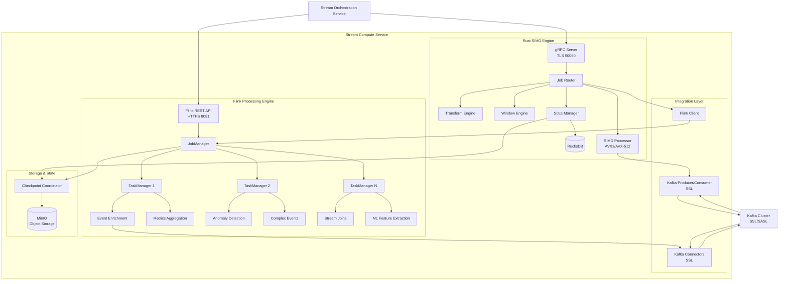
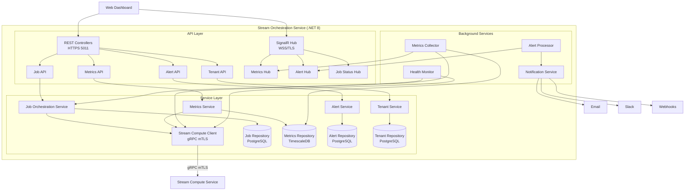
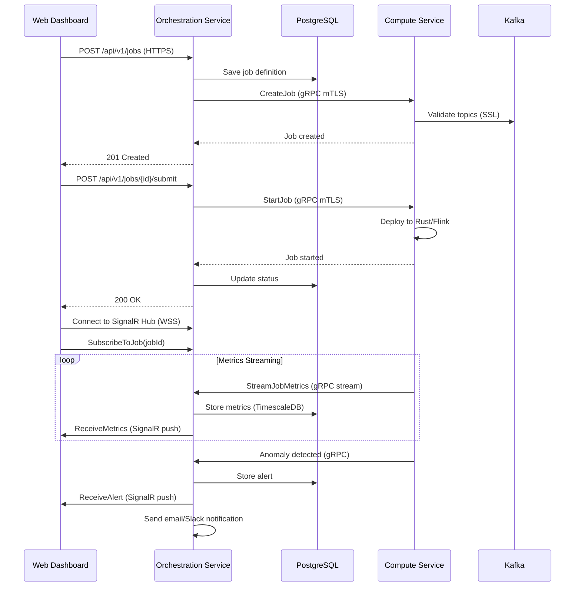

# Unified Streaming Platform Architecture

I'll create a combined streaming platform with two main services:

1. **Stream Compute Service** (Rust + Scala/Java) - Unified processing engine
2. **Stream Orchestration Service** (.NET 8) - Client service for management and real-time metrics

---

# Stream Compute Service

## Service Overview

**Service Name:** Stream Compute Service
**Technology Stack:** Rust, Scala 2.12, Apache Flink, gRPC, Kafka
**Version:** 1.0.0
**Status:** Production-ready
**Ports:** gRPC 50060 (TLS), Flink JobManager 8081 (HTTPS), Metrics 9096 (HTTPS), Health 8082 (HTTPS)
**Location:** `/gbmm/stream-compute-service/`

### Primary Purpose

The Stream Compute Service is a unified streaming platform that combines ultra-low-latency SIMD-accelerated processing (Rust) with advanced Flink-based stream processing (Scala/Java), providing comprehensive event processing, metrics aggregation, anomaly detection, and real-time transformations.

### Key Capabilities

**Rust SIMD Engine:**
- SIMD-accelerated transformations (AVX2/AVX-512)
- Ultra-low-latency processing (<1ms p99)
- Custom stream transformations
- Advanced windowing operations
- State management with RocksDB
- Exactly-once semantics

**Flink Processing Engine:**
- Event enrichment and categorization
- Statistical metrics aggregation
- Multi-strategy anomaly detection
- Complex event processing (CEP)
- Stateful stream joins
- Temporal analytics

**Unified Features:**
- Kafka integration with SSL/TLS
- mTLS for all gRPC communication
- Multi-tenant job isolation
- Distributed tracing (OpenTelemetry)
- Comprehensive metrics (Prometheus)
- Dynamic job scaling
- State snapshots and recovery

---

## Architecture



---

## Core Features & Functionality

### 1. Unified Job Management

**Job Types:**
- **SIMD Jobs**: Ultra-low-latency transformations, filters, windowing
- **Flink Jobs**: Complex aggregations, enrichment, anomaly detection, CEP
- **Hybrid Jobs**: Combined SIMD preprocessing + Flink analytics

**gRPC API Methods (mTLS):**
```protobuf
service StreamComputeService {
  // Job Lifecycle
  rpc CreateJob(CreateJobRequest) returns (CreateJobResponse);
  rpc StartJob(StartJobRequest) returns (StartJobResponse);
  rpc StopJob(StopJobRequest) returns (StopJobResponse);
  rpc PauseJob(PauseJobRequest) returns (PauseJobResponse);
  rpc ResumeJob(ResumeJobRequest) returns (ResumeJobResponse);
  rpc UpdateJob(UpdateJobRequest) returns (UpdateJobResponse);
  rpc DeleteJob(DeleteJobRequest) returns (DeleteJobResponse);
  rpc GetJobStatus(GetJobStatusRequest) returns (GetJobStatusResponse);
  rpc ListJobs(ListJobsRequest) returns (ListJobsResponse);
  
  // Job Operations
  rpc ScaleJob(ScaleJobRequest) returns (ScaleJobResponse);
  rpc TriggerSavepoint(SavepointRequest) returns (SavepointResponse);
  rpc RestoreFromSavepoint(RestoreRequest) returns (RestoreResponse);
  rpc GetJobCheckpoints(CheckpointRequest) returns (CheckpointResponse);
  
  // Metrics & Monitoring
  rpc GetJobMetrics(JobMetricsRequest) returns (JobMetricsResponse);
  rpc StreamJobMetrics(StreamMetricsRequest) returns (stream MetricsUpdate);
  rpc GetSystemMetrics(SystemMetricsRequest) returns (SystemMetricsResponse);
  rpc GetPerformanceProfile(ProfileRequest) returns (ProfileResponse);
  
  // Configuration
  rpc UpdateJobConfig(ConfigUpdateRequest) returns (ConfigUpdateResponse);
  rpc ValidateJobConfig(ConfigValidateRequest) returns (ConfigValidateResponse);
  rpc GetJobTopology(TopologyRequest) returns (TopologyResponse);
  
  // Health & Diagnostics
  rpc HealthCheck(HealthCheckRequest) returns (HealthCheckResponse);
  rpc GetDiagnostics(DiagnosticsRequest) returns (DiagnosticsResponse);
  rpc GetJobLogs(LogRequest) returns (stream LogEntry);
  rpc GetBackpressureMetrics(BackpressureRequest) returns (BackpressureResponse);
}
```

**Job Lifecycle:**
```
CREATED → VALIDATING → DEPLOYING → STARTING → RUNNING 
    ↓         ↓           ↓            ↓          ↓
  FAILED   FAILED     FAILED      FAILED    → PAUSED → RESUMING
                                              ↓
                                          STOPPING → STOPPED
                                              ↓
                                          RESTARTING
```

### 2. SIMD Processing Engine (Rust)

**SIMD Instruction Sets:**
- AVX2 (256-bit vectors)
- AVX-512 (512-bit vectors, auto-detected)
- Runtime CPU feature detection
- Automatic scalar fallback

**SIMD Operations:**
- **Arithmetic**: XOR, AND, OR, ADD, SUB, MUL, DIV, MOD
- **Aggregations**: SUM, MIN, MAX, AVG, MEDIAN, PERCENTILE
- **Statistical**: STDDEV, VARIANCE, COVARIANCE, CORRELATION
- **String**: HASH, CONTAINS, MATCHES_REGEX, LEVENSHTEIN
- **Compression**: DELTA_ENCODING, RLE, DICTIONARY_ENCODING
- **Bitwise**: POPCOUNT, LEADING_ZEROS, TRAILING_ZEROS

**Transform Operations:**
- **Filter**: 15+ operators (EQ, NE, GT, GTE, LT, LTE, IN, NOT_IN, CONTAINS, STARTS_WITH, ENDS_WITH, REGEX, IS_NULL, IS_NOT_NULL, BETWEEN)
- **Map**: 20+ functions (type conversions, string operations, hashing, encoding)
- **Format**: JSON, AVRO, PROTOBUF, PARQUET, ORC, CSV, MSGPACK, ARROW
- **Project**: Column selection, renaming, nested field extraction
- **Enrich**: Dictionary lookups, external API calls, cache-backed enrichment
- **Deduplication**: Bloom filter, exact match with TTL
- **Join**: Stream-stream, stream-table joins with time constraints

**Advanced Windowing:**
- **Tumbling**: Fixed non-overlapping windows
- **Sliding**: Overlapping windows with configurable slide
- **Session**: Gap-based windows (idle timeout)
- **Count**: Event count-based windows
- **Global**: Single window for entire stream
- **Custom**: User-defined window logic

**Aggregation Types:**
- COUNT, SUM, AVG, MIN, MAX, FIRST, LAST
- STDDEV, VARIANCE, PERCENTILE (P50, P90, P95, P99)
- TOP_N, BOTTOM_N, DISTINCT_COUNT
- CUSTOM (user-defined aggregation functions)

**State Management:**
- RocksDB backend with configurable TTL
- Incremental checkpointing to MinIO
- State snapshots for recovery
- State migration support
- Queryable state via gRPC

**Performance Features:**
- Zero-copy deserialization
- Lock-free concurrent processing
- Memory-mapped I/O for state
- Adaptive batching
- Backpressure handling

### 3. Flink Processing Engine (Scala/Java)

**Event Enrichment:**
- Contextual information injection
- Category classification (Authentication, Security, Data, Query, ML, System, User)
- Priority assignment (1-7 scale)
- Correlation ID generation
- Metadata augmentation
- External system lookups
- Cache-backed enrichment strategies

**Metrics Aggregation:**
- Time-windowed statistics (1min, 5min, 15min, 1hr, configurable)
- Multi-dimensional aggregations
- Percentile calculations (P50, P75, P90, P95, P99)
- Moving averages (SMA, EMA, WMA)
- Rate calculations (per-second, per-minute)
- Histogram generation
- Cardinality estimation (HyperLogLog)

**Anomaly Detection:**
- **Statistical Anomaly Detection**:
  - Z-score based (configurable σ threshold)
  - Modified Z-score (MAD-based)
  - IQR (Interquartile Range) method
  - Seasonal decomposition
  - Minimum sample requirement

- **Spike Detection**:
  - Sudden increase detection (configurable multiplier)
  - Rate of change monitoring
  - Gradient analysis
  - Peak identification

- **Pattern-Based Detection**:
  - Behavioral baseline comparison
  - Time-series forecasting (ARIMA, exponential smoothing)
  - Deviation from expected patterns
  - Trend analysis

- **Machine Learning Detection**:
  - Isolation Forest
  - One-class SVM
  - Autoencoder-based
  - Ensemble methods

**Severity Classification:**
- CRITICAL: >10% deviation or >5x spike
- HIGH: 5-10% deviation or 3-5x spike
- MEDIUM: 2-5% deviation or 2-3x spike
- LOW: <2% deviation

**Deduplication:**
- 5-minute sliding window
- Composite key matching
- Hash-based fingerprinting

**Complex Event Processing (CEP):**
- Pattern detection across event streams
- Temporal constraints
- Sequence matching
- Event correlation
- Missing event detection

**Stream Joins:**
- Windowed joins (tumbling, sliding, session)
- Interval joins with time bounds
- State-backed joins
- Broadcast joins
- Cogroup operations

**ML Feature Extraction:**
- Real-time feature computation
- Feature vector generation
- Temporal features (lag, lead, rolling stats)
- Categorical encoding
- Feature normalization
- Feature store integration

### 4. Kafka Integration

**SSL/TLS Configuration:**
- mTLS authentication
- Certificate rotation support
- Per-topic encryption
- SASL/SCRAM authentication
- ACL-based authorization

**Consumer Features:**
- Consumer group management
- Offset tracking and commits
- Rebalance handling
- Consumer lag monitoring
- Partition assignment strategies
- Fetch optimization

**Producer Features:**
- Batching and compression (GZIP, Snappy, LZ4, ZSTD)
- Idempotent writes
- Transaction support
- Custom partitioning
- Retry policies with exponential backoff

**Topic Management:**
- Dynamic topic creation
- Topic compaction
- Retention policies
- Replication factor configuration

**Monitoring:**
- Consumer lag per partition
- Producer throughput
- Error rates
- Rebalance frequency

### 5. State & Checkpointing

**State Backends:**
- **RocksDB**: Disk-based, large state support
- **Memory**: In-memory HashMap
- **Hybrid**: Hot data in memory, cold in RocksDB

**Checkpoint Configuration:**
- Interval: Configurable (default 1 minute)
- Timeout: Configurable (default 10 minutes)
- Concurrent checkpoints: 1 (configurable)
- Min pause between checkpoints: 30 seconds
- Checkpoint storage: MinIO with versioning

**Savepoint Features:**
- Manual savepoint triggers
- Savepoint metadata tracking
- State migration on restore
- Incremental savepoints
- Savepoint expiration policies

**Recovery:**
- Automatic recovery from latest checkpoint
- Manual recovery from specific savepoint
- State schema evolution
- Backward compatibility

### 6. Security & TLS

**gRPC Security:**
- mTLS for all gRPC communication
- Client certificate validation
- Certificate pinning
- TLS 1.3 with strong cipher suites

**Flink REST API:**
- HTTPS with TLS 1.3
- JWT authentication
- Role-based access control
- API key authentication

**Kafka Security:**
- SSL/TLS encryption
- SASL authentication (PLAIN, SCRAM-SHA-256, SCRAM-SHA-512)
- ACL authorization
- Certificate-based authentication

**Secret Management:**
- HashiCorp Vault integration
- Kubernetes Secrets support
- Environment variable encryption
- Secret rotation

### 7. Error Handling & Resilience

**Error Strategies:**
- **SKIP**: Drop failed events, continue processing
- **RETRY**: Configurable retries with exponential backoff
- **DEAD_LETTER**: Send to DLQ topic with error metadata
- **FAIL**: Stop processing, trigger alerting
- **CIRCUIT_BREAKER**: Temporary failure isolation

**Delivery Guarantees:**
- **AT_MOST_ONCE**: No retries, fastest
- **AT_LEAST_ONCE**: Retries enabled, possible duplicates
- **EXACTLY_ONCE**: Idempotent processing, no duplicates

**Failure Recovery:**
- Automatic restart with backoff
- State restoration from checkpoint
- Partial failure handling
- Cascading failure prevention

**Backpressure:**
- Automatic backpressure propagation
- Rate limiting
- Buffer management
- Flow control

### 8. Multi-Tenancy & Isolation

**Tenant Isolation:**
- Namespace-based separation
- Resource quotas per tenant
- Network isolation
- State isolation

**Resource Management:**
- CPU/Memory limits per job
- TaskManager slot allocation
- Parallelism constraints
- Fair scheduling

**Security Boundaries:**
- Tenant-specific certificates
- Isolated Kafka consumer groups
- Separate state backends
- Audit logging per tenant

---

## Performance Metrics

**SIMD Performance:**
- Events: 10M events/sec (AVX-512), 5M events/sec (AVX2)
- Bytes: 10 GB/sec throughput
- Latency: p99 < 500μs (sub-millisecond)
- SIMD speedup: 16-64x vs scalar

**Flink Performance:**
- Events: 1M events/sec per job
- Aggregation: 100K windows/sec
- Anomaly detection: 50K metrics/sec
- Join throughput: 500K events/sec

**End-to-End Latency:**
- SIMD jobs: p99 < 1ms
- Flink jobs: p99 < 100ms (with windowing)
- Hybrid jobs: p99 < 150ms

**Resource Usage:**
- Rust engine: 2 GB RAM, 2 CPU cores (base)
- Flink JobManager: 4 GB RAM, 2 CPU cores
- Flink TaskManager: 8 GB RAM, 4 CPU cores (per TM)

---

## Observability

### Metrics (Prometheus)

**Job Metrics:**
- `stream_events_processed_total{job, tenant, engine}`
- `stream_bytes_processed_total{job, tenant, engine}`
- `stream_events_per_second{job, tenant, engine}`
- `stream_latency_microseconds{job, tenant, percentile, engine}`
- `stream_error_total{job, tenant, error_type}`
- `stream_backpressure_ratio{job, operator}`

**SIMD Metrics:**
- `simd_operations_total{operation, instruction_set}`
- `simd_speedup_ratio{operation, instruction_set}`
- `simd_vector_width{instruction_set}`

**Flink Metrics:**
- `flink_jobs_running{tenant}`
- `flink_checkpoint_duration_ms{job}`
- `flink_checkpoint_size_bytes{job}`
- `flink_kafka_lag{topic, partition, group}`

**Window Metrics:**
- `stream_window_created_total{job, window_type}`
- `stream_window_fired_total{job, window_type}`
- `stream_late_events_total{job}`

**Anomaly Metrics:**
- `anomaly_detected_total{job, severity, type}`
- `anomaly_false_positive_rate{job}`
- `anomaly_detection_latency_ms{job}`

### Distributed Tracing

**OpenTelemetry Integration:**
- Trace context propagation
- Span annotations for all operations
- Error recording
- Resource attributes (job, tenant, engine)
- Jaeger/Zipkin export

**Key Spans:**
- Job submission
- Event processing
- SIMD operations
- Kafka produce/consume
- Checkpoint creation
- Anomaly detection

### Logging

**Structured Logging:**
- JSON format
- Correlation IDs
- Tenant context
- Log levels: TRACE, DEBUG, INFO, WARN, ERROR, FATAL

**Log Categories:**
- Job lifecycle events
- Performance warnings
- Error conditions
- State operations
- Kafka operations
- Anomaly detections

---

## Configuration & Deployment

### Environment Variables

| Variable | Type | Default | Description |
|----------|------|---------|-------------|
| **gRPC/TLS** |
| `GRPC_PORT` | int | 50060 | gRPC server port |
| `GRPC_TLS_CERT` | path | /certs/server.crt | Server certificate |
| `GRPC_TLS_KEY` | path | /certs/server.key | Server private key |
| `GRPC_TLS_CA` | path | /certs/ca.crt | CA certificate |
| `GRPC_MTLS_ENABLED` | bool | true | Require client certificates |
| **Flink** |
| `FLINK_JOBMANAGER_URL` | string | https://localhost:8081 | JobManager HTTPS URL |
| `FLINK_PARALLELISM` | int | 4 | Default parallelism |
| `FLINK_TASKMANAGERS` | int | 3 | Number of TaskManagers |
| `FLINK_SLOTS_PER_TM` | int | 4 | Slots per TaskManager |
| **Kafka** |
| `KAFKA_BOOTSTRAP_SERVERS` | string | (required) | Kafka brokers |
| `KAFKA_SSL_ENABLED` | bool | true | Enable SSL/TLS |
| `KAFKA_SSL_KEYSTORE` | path | /certs/keystore.jks | Client keystore |
| `KAFKA_SSL_TRUSTSTORE` | path | /certs/truststore.jks | Client truststore |
| `KAFKA_SASL_MECHANISM` | string | SCRAM-SHA-512 | SASL mechanism |
| **State & Checkpointing** |
| `ROCKSDB_PATH` | path | /data/rocksdb | RocksDB state path |
| `CHECKPOINT_INTERVAL_MS` | int | 60000 | Checkpoint interval |
| `CHECKPOINT_STORAGE` | string | minio | Storage backend |
| `MINIO_ENDPOINT` | string | https://minio:9000 | MinIO URL |
| `MINIO_ACCESS_KEY` | string | (vault) | MinIO credentials |
| `MINIO_SECRET_KEY` | string | (vault) | MinIO credentials |
| **SIMD** |
| `ENABLE_SIMD` | bool | true | Enable SIMD |
| `SIMD_INSTRUCTION_SET` | string | auto | AVX2, AVX512, or auto-detect |
| **Observability** |
| `METRICS_PORT` | int | 9096 | Prometheus port |
| `HEALTH_PORT` | int | 8082 | Health check port |
| `OTEL_ENDPOINT` | string | https://jaeger:4317 | Tracing endpoint |
| `LOG_LEVEL` | string | INFO | Logging level |
| **Security** |
| `VAULT_ADDR` | string | https://vault:8200 | Vault URL |
| `VAULT_TOKEN` | string | (required) | Vault token |
| `ENABLE_AUDIT_LOG` | bool | true | Audit logging |

### Deployment

**Container Ports:**
- 50060: gRPC (TLS)
- 8081: Flink REST API (HTTPS)
- 9096: Prometheus metrics (HTTPS)
- 8082: Health checks (HTTPS)
- 6123: Flink internal (TLS)

**Health Checks:**
- Liveness: `/health/live` (every 10s)
- Readiness: `/health/ready` (every 5s)
- Startup: `/health/startup` (initial)

**Resource Requirements:**
- **Rust Engine**: 4 CPU, 8 GB RAM
- **Flink JobManager**: 2 CPU, 4 GB RAM
- **Flink TaskManager**: 4 CPU, 8 GB RAM (per TM)

---

## API Reference Summary

**Job Management:** 15 gRPC methods
**Metrics & Monitoring:** 6 gRPC methods (including streaming)
**Configuration:** 3 gRPC methods
**Health & Diagnostics:** 4 gRPC methods
**Flink REST API:** Full Flink REST API access via HTTPS

---

# Stream Orchestration Service

## Service Overview

**Service Name:** Stream Orchestration Service
**Technology Stack:** .NET 8, SignalR, C# 12, gRPC Client
**Version:** 1.0.0
**Status:** Production-ready
**Ports:** HTTPS 5011, WSS (SignalR over TLS)
**Location:** `/gbmm/stream-orchestration-service/`

### Primary Purpose

The Stream Orchestration Service is the client-facing service that orchestrates the Stream Compute Service, providing REST APIs for job management, real-time metrics delivery via SignalR WebSockets, and a comprehensive dashboard interface.

### Key Capabilities

- **Unified Job Orchestration** - Manage SIMD, Flink, and hybrid jobs
- **Real-time Metrics Streaming** - SignalR WebSockets with TLS
- **Job Lifecycle Management** - Create, update, start, stop, scale jobs
- **Metrics Aggregation** - Historical metrics storage and querying
- **Alert Management** - Anomaly alert subscriptions and notifications
- **Multi-tenant Support** - Tenant isolation and resource quotas
- **Dashboard Integration** - Web UI backend APIs
- **Audit Logging** - Comprehensive audit trail

---

## Architecture



---

## Core Features & Functionality

### 1. Job Orchestration

**Job Management:**
- Create job definitions (SIMD, Flink, Hybrid)
- Submit jobs to compute service
- Update job configurations (with zero-downtime updates)
- Pause/resume jobs
- Scale job parallelism
- Delete jobs

**Job Templates:**
- Pre-configured job templates
- Template versioning
- Template validation
- Custom template creation

**Job Validation:**
- Configuration validation before submission
- Resource quota checking
- Dependency verification
- Dry-run mode

**Job Scheduling:**
- Cron-based scheduling
- Event-driven triggers
- Dependency-based execution
- Scheduled maintenance windows

**REST Endpoints:**
- `POST /api/v1/jobs` - Create job
- `GET /api/v1/jobs` - List jobs (with filtering, pagination)
- `GET /api/v1/jobs/{id}` - Get job details
- `PUT /api/v1/jobs/{id}` - Update job
- `DELETE /api/v1/jobs/{id}` - Delete job
- `POST /api/v1/jobs/{id}/submit` - Submit job
- `POST /api/v1/jobs/{id}/cancel` - Cancel job
- `POST /api/v1/jobs/{id}/pause` - Pause job
- `POST /api/v1/jobs/{id}/resume` - Resume job
- `POST /api/v1/jobs/{id}/scale` - Scale job
- `POST /api/v1/jobs/{id}/savepoint` - Create savepoint
- `POST /api/v1/jobs/{id}/restore` - Restore from savepoint
- `GET /api/v1/jobs/{id}/topology` - Get job topology
- `GET /api/v1/jobs/{id}/logs` - Stream job logs
- `POST /api/v1/jobs/{id}/validate` - Validate configuration

### 2. Real-time Metrics Streaming (SignalR)

**SignalR Hubs:**

**Metrics Hub:**
- `SubscribeToJob(jobId)` - Subscribe to job metrics
- `UnsubscribeFromJob(jobId)` - Unsubscribe from job
- `SubscribeToTenant(tenantId)` - Subscribe to all tenant jobs
- `ReceiveMetrics(metrics)` - Server → Client metrics push
- `ReceiveAggregatedMetrics(metrics)` - Server → Client aggregated metrics

**Alert Hub:**
- `SubscribeToAlerts(tenantId, severity)` - Subscribe to alerts
- `UnsubscribeFromAlerts()` - Unsubscribe
- `ReceiveAlert(alert)` - Server → Client alert push
- `AcknowledgeAlert(alertId)` - Client → Server alert ack

**Job Status Hub:**
- `SubscribeToJobStatus(jobId)` - Subscribe to job status changes
- `ReceiveStatusChange(jobId, status)` - Server → Client status update
- `ReceiveJobEvent(jobId, event)` - Server → Client job events

**Features:**
- Automatic reconnection with exponential backoff
- Connection state management
- Message buffering during disconnection
- Heartbeat monitoring
- Connection metrics

**Security:**
- JWT authentication for WebSocket connections
- Per-tenant connection isolation
- Rate limiting per connection
- Connection timeout policies

### 3. Metrics Management

**Metrics Collection:**
- Real-time metrics polling from compute service (configurable interval: 1-60s)
- Batch metrics ingestion
- Metrics downsampling for long-term storage
- Metrics retention policies (raw: 7 days, 1min agg: 30 days, 1hr agg: 1 year)

**Metrics Storage:**
- TimescaleDB for time-series data
- Automatic compression
- Continuous aggregation
- Hypertable optimization

**Metrics Querying:**
- Time-range queries
- Aggregation queries (avg, min, max, percentiles)
- Multi-dimensional filtering
- Metric comparison across jobs

**REST Endpoints:**
- `GET /api/v1/jobs/{id}/metrics` - Get current metrics
- `GET /api/v1/jobs/{id}/metrics/history` - Get historical metrics
- `GET /api/v1/jobs/{id}/metrics/timeseries` - Get time-series data
- `GET /api/v1/jobs/{id}/metrics/aggregated` - Get aggregated metrics
- `GET /api/v1/tenants/{id}/metrics/summary` - Get tenant-wide metrics
- `POST /api/v1/metrics/query` - Custom metrics query (PromQL-like)

### 4. Alert Management

**Alert Sources:**
- Anomaly alerts from compute service
- Performance threshold alerts (latency, throughput, error rate)
- Resource alerts (CPU, memory, disk)
- Job lifecycle alerts (failures, restarts)
- SLA violation alerts

**Alert Processing:**
- Alert deduplication (configurable window)
- Alert correlation (related alerts grouped)
- Alert enrichment (context injection)
- Severity escalation
- Auto-acknowledgment rules

**Notification Channels:**
- Email (SMTP with TLS)
- Slack webhooks
- Microsoft Teams
- PagerDuty integration
- Custom webhooks
- In-app notifications

**Alert Rules:**
- Threshold-based rules
- Rate-of-change rules
- Anomaly-based rules
- Composite rules (multiple conditions)
- Time-based suppression

**REST Endpoints:**
- `GET /api/v1/alerts` - List alerts (with filtering)
- `GET /api/v1/alerts/{id}` - Get alert details
- `POST /api/v1/alerts/{id}/acknowledge` - Acknowledge alert
- `POST /api/v1/alerts/{id}/resolve` - Resolve alert
- `POST /api/v1/alert-rules` - Create alert rule
- `GET /api/v1/alert-rules` - List alert rules
- `PUT /api/v1/alert-rules/{id}` - Update alert rule
- `DELETE /api/v1/alert-rules/{id}` - Delete alert rule

### 5. Multi-Tenancy

**Tenant Management:**
- Tenant registration and onboarding
- Tenant configuration (quotas, limits, defaults)
- Tenant isolation
- Tenant-specific secrets

**Resource Quotas:**
- Max concurrent jobs per tenant
- Max CPU/memory per tenant
- Max Kafka topics per tenant
- Max storage per tenant
- Rate limits (API calls, metrics ingestion)

**REST Endpoints:**
- `POST /api/v1/tenants` - Create tenant
- `GET /api/v1/tenants` - List tenants
- `GET /api/v1/tenants/{id}` - Get tenant details
- `PUT /api/v1/tenants/{id}` - Update tenant
- `DELETE /api/v1/tenants/{id}` - Delete tenant
- `GET /api/v1/tenants/{id}/quotas` - Get tenant quotas
- `PUT /api/v1/tenants/{id}/quotas` - Update tenant quotas
- `GET /api/v1/tenants/{id}/usage` - Get tenant resource usage

### 6. Audit Logging

**Audit Events:**
- API calls (who, what, when, from where)
- Job lifecycle events
- Configuration changes
- Authentication/authorization events
- Resource access
- Alert actions

**Audit Storage:**
- PostgreSQL for structured events
- Immutable audit trail
- Retention policies
- Compliance exports (CSV, JSON)

**Audit Query:**
- Time-range queries
- User/action filtering
- Compliance reports
- Security investigations

**REST Endpoints:**
- `GET /api/v1/audit/logs` - Query audit logs
- `GET /api/v1/audit/reports` - Generate audit reports
- `POST /api/v1/audit/export` - Export audit logs

### 7. Health & Diagnostics

**Health Checks:**
- Compute service connectivity
- Database connectivity
- Kafka connectivity
- SignalR hub health
- Background service health

**Diagnostics:**
- Connection pool statistics
- gRPC client statistics
- SignalR connection statistics
- Cache hit rates
- Performance counters

**REST Endpoints:**
- `GET /health` - Overall health
- `GET /health/live` - Liveness probe
- `GET /health/ready` - Readiness probe
- `GET /api/v1/diagnostics` - System diagnostics
- `GET /api/v1/diagnostics/connections` - Connection statistics

### 8. Security

**Authentication:**
- JWT bearer tokens
- OAuth 2.0 / OpenID Connect
- API key authentication
- Service-to-service authentication

**Authorization:**
- Role-based access control (RBAC)
- Resource-level permissions
- Tenant-based isolation
- Operation-level authorization

**TLS/HTTPS:**
- TLS 1.3 for all APIs
- HTTPS-only (no HTTP)
- Strong cipher suites
- Certificate validation

**gRPC Security:**
- mTLS for compute service communication
- Certificate-based authentication
- Channel encryption

**Secret Management:**
- Integration with HashiCorp Vault
- Kubernetes Secrets support
- Secret rotation
- Encryption at rest

---

## Data Models

### Job
```csharp
{
  Id: Guid,
  TenantId: Guid,
  Name: string,
  Description: string,
  Type: JobType (SIMD, Flink, Hybrid),
  Configuration: JobConfiguration,
  Status: JobStatus,
  CreatedAt: DateTime,
  UpdatedAt: DateTime,
  CreatedBy: string,
  Tags: Dictionary<string, string>
}
```

### JobConfiguration
```csharp
{
  Engine: EngineType (Rust, Flink),
  Parallelism: int,
  KafkaTopics: KafkaTopicConfig,
  Transformations: List<Transformation>,
  WindowConfig: WindowConfiguration,
  StateConfig: StateConfiguration,
  ErrorHandling: ErrorHandlingConfig,
  ResourceLimits: ResourceLimits
}
```

### JobMetrics
```csharp
{
  JobId: Guid,
  Timestamp: DateTime,
  EventsProcessed: long,
  BytesProcessed: long,
  EventsPerSecond: double,
  BytesPerSecond: double,
  Latency: LatencyMetrics,
  ErrorCount: long,
  BackpressureRatio: double,
  KafkaLag: Dictionary<string, long>,
  WindowsCreated: long,
  SIMDOperations: long,
  SIMDSpeedup: double
}
```

### Alert
```csharp
{
  Id: Guid,
  TenantId: Guid,
  JobId: Guid?,
  Type: AlertType,
  Severity: Severity,
  Title: string,
  Description: string,
  DetectedAt: DateTime,
  AcknowledgedAt: DateTime?,
  ResolvedAt: DateTime?,
  Metadata: Dictionary<string, object>
}
```

### Tenant
```csharp
{
  Id: Guid,
  Name: string,
  Description: string,
  Quotas: TenantQuotas,
  Configuration: TenantConfiguration,
  CreatedAt: DateTime,
  Status: TenantStatus,
  ContactEmail: string
}
```

---

## Observability

### Metrics (Prometheus)

| Metric | Type | Description |
|--------|------|-------------|
| `orchestration_api_requests_total` | Counter | API requests by endpoint |
| `orchestration_api_duration_ms` | Histogram | API latency |
| `orchestration_jobs_total` | Gauge | Total jobs by status |
| `orchestration_signalr_connections` | Gauge | Active connections |
| `orchestration_metrics_collected_total` | Counter | Metrics collected |
| `orchestration_alerts_generated_total` | Counter | Alerts generated by severity |
| `orchestration_grpc_calls_total` | Counter | gRPC calls to compute service |
| `orchestration_grpc_duration_ms` | Histogram | gRPC call latency |

### Distributed Tracing

- Trace propagation to compute service
- HTTP/gRPC/SignalR span creation
- Database query spans
- External service call spans

### Logging

- Structured JSON logging
- Correlation IDs across services
- Log levels: Trace, Debug, Info, Warning, Error, Critical
- Log aggregation (Elasticsearch, Loki)

---

## Configuration & Deployment

### Environment Variables

| Variable | Type | Default | Description |
|----------|------|---------|-------------|
| `ASPNETCORE_URLS` | string | https://+:5011 | Listen URLs |
| `COMPUTE_SERVICE_URL` | string | (required) | Stream Compute gRPC endpoint |
| `COMPUTE_SERVICE_CERT` | path | /certs/client.crt | Client certificate |
| `COMPUTE_SERVICE_KEY` | path | /certs/client.key | Client key |
| `COMPUTE_SERVICE_CA` | path | /certs/ca.crt | CA certificate |
| `DATABASE_CONNECTION` | string | (required) | PostgreSQL connection |
| `TIMESCALEDB_CONNECTION` | string | (required) | TimescaleDB connection |
| `METRICS_POLLING_INTERVAL_MS` | int | 5000 | Metrics collection interval |
| `SIGNALR_SCALE_OUT` | string | Redis | Scale-out provider |
| `REDIS_CONNECTION` | string | (vault) | Redis for SignalR backplane |
| `VAULT_ADDR` | string | https://vault:8200 | Vault URL |
| `JWT_SECRET_KEY` | string | (vault) | JWT signing key |
| `SMTP_HOST` | string | (vault) | Email server |
| `SLACK_WEBHOOK_URL` | string | (vault) | Slack webhook |

### Deployment

**Container Ports:**
- 5011: HTTPS (REST + SignalR)
- 9090: Prometheus metrics

**Health Checks:**
- `/health` - Overall health
- `/health/live` - Liveness
- `/health/ready` - Readiness

**Resource Requirements:**
- CPU: 2 cores
- Memory: 4 GB RAM
- Disk: 20 GB (logs, cache)

---

## Performance

**Throughput:**
- API requests: 5,000 req/sec
- SignalR messages: 50,000 msg/sec
- Metrics ingestion: 100,000 metrics/sec

**Latency:**
- API (p99): < 100ms
- SignalR delivery (p99): < 50ms
- gRPC to compute (p99): < 20ms

---

## Summary

The **Stream Orchestration Service** provides comprehensive client-facing APIs, real-time metrics delivery, and job orchestration for the unified streaming platform, acting as the management layer for the Stream Compute Service.

**Version:** 1.0.0
**Last Updated:** 2025-12-25

---

# Integration Flow



---

This unified platform provides enterprise-grade stream processing with SIMD acceleration, comprehensive Flink capabilities, and real-time orchestration—all secured with TLS/mTLS and designed for multi-tenant, production deployments.