```mermaid
graph TB
    subgraph "UCCP Cluster (Multi-Region)"
        subgraph "Control Plane"
            Leader[Leader Node<br/>Raft Leader]
            Follower1[Follower Node 1]
            Follower2[Follower Node 2]
            
            Leader <--> Follower1
            Leader <--> Follower2
            Follower1 <--> Follower2
        end
        
        subgraph "Core Services Layer"
            ServiceRegistry[Service Registry<br/>& Discovery]
            LockManager[Distributed Lock<br/>Manager]
            EventBus[Event Bus<br/>Pub/Sub]
            LeaderElection[Leader Election<br/>Service]
            
            Leader --> ServiceRegistry
            Leader --> LockManager
            Leader --> EventBus
            Leader --> LeaderElection
        end
        
        subgraph "Resource Management Layer"
            TaskScheduler[Task Scheduler]
            WorkerRegistry[Worker Registry<br/>& Health Monitor]
            QuotaManager[Quota Manager<br/>& Enforcer]
            LoadBalancer[Load Balancer<br/>Multi-Strategy]
            GPUScheduler[GPU/TPU<br/>Scheduler]
            AutoScaler[Auto-scaler<br/>Predictive]
            
            TaskScheduler --> WorkerRegistry
            TaskScheduler --> QuotaManager
            TaskScheduler --> LoadBalancer
            TaskScheduler --> GPUScheduler
            AutoScaler --> WorkerRegistry
        end
        
        subgraph "Compute Layer"
            RayCluster[Ray Cluster<br/>Head + Workers]
            ObjectStore[Distributed Object Store<br/>Multi-tier Cache]
            TaskExecutor[Task Executor<br/>& DAG Engine]
            StreamProcessor[Stream Processor]
            
            TaskScheduler --> RayCluster
            RayCluster --> ObjectStore
            RayCluster --> TaskExecutor
            TaskExecutor --> StreamProcessor
        end
        
        subgraph "ML Operations Layer"
            Training[Distributed Training<br/>Multi-Framework]
            Serving[Model Serving<br/>A/B Testing]
            FeatureStore[Feature Store<br/>Online/Offline]
            AutoML[AutoML Engine<br/>Multi-Algorithm]
            ExperimentTracking[Experiment Tracking<br/>MLflow Compatible]
            ModelRegistry[Model Registry<br/>& Governance]
            PipelineOrch[Pipeline Orchestrator]
            Explainability[Explainability<br/>Engine]
            FederatedLearning[Federated Learning<br/>Coordinator]
            
            RayCluster --> Training
            RayCluster --> Serving
            FeatureStore --> OnlineStore[(Redis<br/>Online Features)]
            FeatureStore --> OfflineStore[(Parquet/Delta<br/>Offline Features)]
            Training --> ExperimentTracking
            ExperimentTracking --> ModelRegistry
            PipelineOrch --> Training
            PipelineOrch --> Serving
        end
        
        subgraph "Observability Layer"
            MetricsCollector[Metrics Collector<br/>Prometheus]
            LogAggregator[Log Aggregator<br/>ElasticSearch]
            TraceCollector[Trace Collector<br/>Jaeger]
            AlertManager[Alert Manager<br/>Multi-Channel]
            DashboardProvisioner[Dashboard Provisioner<br/>Grafana]
            ProfileCollector[Profiling Collector]
            AnomalyDetector[Anomaly Detector<br/>ML-based]
            
            MetricsCollector --> PrometheusDB[(Prometheus<br/>TSDB)]
            LogAggregator --> ElasticDB[(ElasticSearch)]
            TraceCollector --> JaegerDB[(Jaeger<br/>Storage)]
            AlertManager --> Slack[Slack]
            AlertManager --> PagerDuty[PagerDuty]
            AlertManager --> Webhook[Webhooks]
            AlertManager --> Email[Email/SMS]
        end
        
        subgraph "Storage Layer"
            MetadataStore[(PostgreSQL<br/>Metadata)]
            RaftStore[(BoltDB<br/>Raft Logs)]
            ArtifactStore[(MinIO/S3<br/>Artifacts)]
            CacheStore[(Redis<br/>Distributed Cache)]
            VectorStore[(Milvus<br/>Vector DB)]
        end
        
        Leader --> MetadataStore
        Leader --> RaftStore
        ExperimentTracking --> ArtifactStore
        ObjectStore --> CacheStore
        FeatureStore --> VectorStore
    end
    
    subgraph "External Integrations"
        VaultService[HashiCorp Vault<br/>Secrets]
        CertManager[Cert Manager<br/>TLS Certificates]
        OIDC[OIDC Provider<br/>Auth0/Keycloak]
        CloudProviders[Cloud Providers<br/>AWS/GCP/Azure]
        K8s[Kubernetes<br/>Orchestration]
    end
    
    Leader --> VaultService
    Leader --> CertManager
    ServiceRegistry --> OIDC
    AutoScaler --> CloudProviders
    AutoScaler --> K8s
    
    subgraph "Client Services"
        ClientServices[.NET/Java/Python<br/>Client Libraries]
        WebUI[Web Dashboard<br/>React/TypeScript]
        CLI[CLI Tools<br/>uccp-cli]
    end
    
    ClientServices --> Leader
    WebUI --> Leader
    CLI --> Leader
```

```mermaid
graph TB
    subgraph "Client Applications"
        BlazorApp[Blazor WebAssembly<br/>SPA]
        MvcApp[MVC/Razor Pages<br/>Web App]
        ConsoleApp[Console/CLI<br/>Application]
        DesktopApp[WPF/WinForms<br/>Desktop App]
        MobileApp[MAUI<br/>Mobile App]
    end
    
    subgraph ".NET Compute Client Service"
        subgraph "API Layer"
            RestAPI[REST API<br/>ASP.NET Core]
            GraphQLAPI[GraphQL API<br/>Hot Chocolate]
            GrpcWebAPI[gRPC-Web API]
            SignalRHub[SignalR Hubs<br/>Real-time]
        end
        
        subgraph "Client SDK Layer"
            UCCPClient[UCCP Client<br/>gRPC]
            RestClient[HTTP Client<br/>Typed Clients]
            SignalRClient[SignalR Client]
        end
        
        subgraph "Business Logic Layer"
            CoordinationService[Coordination<br/>Service Manager]
            ComputeService[Compute<br/>Service Manager]
            MLService[ML Operations<br/>Service Manager]
            ResourceService[Resource<br/>Service Manager]
            MonitoringService[Monitoring<br/>Service Manager]
            
            UCCPClient --> CoordinationService
            UCCPClient --> ComputeService
            UCCPClient --> MLService
            UCCPClient --> ResourceService
            UCCPClient --> MonitoringService
        end
        
        subgraph "Infrastructure Layer"
            CacheManager[Cache Manager<br/>Redis/Memory]
            QueueManager[Message Queue<br/>Manager]
            AuthManager[Auth Manager<br/>JWT/OAuth]
            MetricsCollector[Metrics Collector<br/>Prometheus]
            LoggingService[Logging Service<br/>Serilog]
            TracingService[Tracing Service<br/>OpenTelemetry]
        end
        
        subgraph "Background Services"
            HealthMonitor[Health Monitor<br/>Service]
            CacheRefresh[Cache Refresh<br/>Service]
            MetricsExporter[Metrics Exporter<br/>Service]
            TaskPoller[Task Status<br/>Poller]
            EventProcessor[Event Processor<br/>Service]
            ScheduledJobs[Scheduled Jobs<br/>Quartz.NET]
        end
        
        subgraph "Data Layer"
            EFCore[Entity Framework<br/>Core]
            Repository[Repository<br/>Pattern]
            UnitOfWork[Unit of Work<br/>Pattern]
            
            Repository --> EFCore
            UnitOfWork --> EFCore
        end
        
        RestAPI --> CoordinationService
        RestAPI --> ComputeService
        RestAPI --> MLService
        GraphQLAPI --> CoordinationService
        SignalRHub --> EventProcessor
        
        CoordinationService --> CacheManager
        ComputeService --> QueueManager
        MLService --> CacheManager
        
        MetricsCollector --> MetricsExporter
        LoggingService --> ElasticSearch[(ElasticSearch<br/>Logs)]
        TracingService --> Jaeger[(Jaeger<br/>Traces)]
        
        EFCore --> PostgreSQL[(PostgreSQL<br/>Metadata)]
        CacheManager --> Redis[(Redis<br/>Cache)]
        QueueManager --> RabbitMQ[(RabbitMQ<br/>Messages)]
    end
    
    subgraph "External Services"
        UCCP[Unified Compute &<br/>Coordination Platform]
        Vault[HashiCorp Vault<br/>Secrets]
        IdentityProvider[Identity Provider<br/>Auth0/Keycloak]
        EmailService[Email Service<br/>SendGrid]
        SMSService[SMS Service<br/>Twilio]
    end
    
    UCCPClient --> UCCP
    AuthManager --> Vault
    AuthManager --> IdentityProvider
    BackgroundServices -.-> EmailService
    BackgroundServices -.-> SMSService
    
    BlazorApp --> RestAPI
    BlazorApp --> SignalRHub
    MvcApp --> RestAPI
    ConsoleApp --> RestClient
    DesktopApp --> UCCPClient
    MobileApp --> RestAPI
```

# Unified Compute & Coordination Platform (UCCP)

## Service Overview

**Service Name:** Unified Compute & Coordination Platform (UCCP)
**Technology Stack:** Go 1.24, Rust (core components), Python 3.11+ (ML modules)
**Version:** 1.0.0
**Status:** Production-ready
**Ports:** gRPC/TLS 50000, HTTPS 8443, Raft 50061, Metrics 9100
**Location:** `/gbmm/uccp/`

### Primary Purpose

The Unified Compute & Coordination Platform is the central backbone service for the GBMM platform, providing comprehensive distributed computing, service coordination, ML operations, resource management, and observability capabilities in a single, highly-available, secure service.

### Key Capabilities

**Coordination & Discovery:**
- Service registration and discovery with health tracking
- Raft-based distributed consensus for strong consistency
- Distributed locking with lease management
- Leader election with automatic failover
- Topic-based pub/sub event bus
- Metadata management and versioning

**Resource Management:**
- Intelligent task scheduling with priority queues
- Dynamic worker/node registry with health monitoring
- Multi-strategy load balancing (least-load, round-robin, resource-aware)
- Per-namespace and per-user quota management
- GPU scheduling with type awareness (NVIDIA, AMD, Intel)
- TPU and custom accelerator support
- Auto-scaling with predictive scaling algorithms
- Container and VM resource orchestration

**Distributed Compute:**
- Ray-based distributed task execution
- Remote function decoration and execution
- Distributed object store with multi-tier caching
- Task result streaming and checkpointing
- Batch and streaming job support
- DAG-based workflow execution
- Spot instance and preemptible resource management

**ML Operations:**
- Distributed training (TensorFlow, PyTorch, XGBoost, JAX, MXNet)
- Model serving with A/B testing and shadow deployments
- Feature store with online/offline capabilities (Feast integration)
- AutoML with multiple search algorithms (Optuna, Ray Tune, HyperOpt, BOHB)
- Experiment tracking and model registry (MLflow integration)
- Model versioning, lineage tracking, and governance
- ML pipeline orchestration and scheduling
- Reinforcement learning environment management
- Model explainability (SHAP, LIME, Integrated Gradients)
- Federated learning support
- Model compression and quantization
- Neural architecture search (NAS)

**Monitoring & Observability:**
- Prometheus-compatible metrics collection and storage
- Structured log aggregation with full-text search
- Distributed tracing with OpenTelemetry and Jaeger
- Real-time alerting with multi-channel notifications
- Grafana dashboard auto-provisioning
- Performance profiling (CPU, memory, GPU)
- Anomaly detection and predictive alerting
- Service mesh observability
- Cost tracking and attribution
- Security event monitoring

**Security & Compliance:**
- mTLS for all service-to-service communication
- JWT-based authentication and authorization
- Role-based access control (RBAC)
- Attribute-based access control (ABAC)
- Secrets management integration (HashiCorp Vault)
- Audit logging with tamper-proof storage
- Data encryption at rest and in transit (AES-256, TLS 1.3)
- Certificate rotation and management
- Compliance reporting (SOC 2, HIPAA, GDPR)
- Network policies and segmentation

**Additional Capabilities:**
- Multi-tenancy with strong isolation
- Multi-region and multi-cloud support
- Disaster recovery and backup management
- Data lifecycle management
- Workflow versioning and rollback
- Rate limiting and throttling
- Circuit breaker pattern implementation
- Bulkhead isolation
- Chaos engineering integration
- Blue-green and canary deployments

---

## Architecture



---

## Core Features & Functionality

### 1. Service Registration & Discovery

**Features:**
- Dynamic service registration with comprehensive metadata
- Health-based service discovery with multi-criteria filtering
- TTL-based lease management with automatic renewal
- Service versioning and capability matching
- Service dependency graph tracking
- Blue-green deployment support
- Canary deployment detection
- Service mesh integration
- DNS-based service discovery
- Cross-region service federation

**Registration Metadata:**
- Service name, version, and type
- Network address and ports
- Protocol support (gRPC, HTTP/2, WebSocket)
- Resource requirements and limits
- Health check endpoints
- Capabilities and feature flags
- SLA requirements
- Region and availability zone
- Labels and annotations
- Service dependencies

**Health Monitoring:**
- Active health checks (HTTP, TCP, gRPC)
- Passive health tracking via heartbeats
- Circuit breaker integration
- Failure detection and automatic deregistration
- Health score calculation
- Gradual traffic shifting on degradation

**Discovery Features:**
- Filter by health status, version, region
- Load-aware service selection
- Proximity-based routing
- Service weight and priority
- Client-side load balancing support
- Service catalog with search

---

### 2. Raft Consensus & Distributed Coordination

**Features:**
- HashiCorp Raft implementation for strong consistency
- Multi-Raft groups for horizontal scaling
- BoltDB and RocksDB persistence options
- Log replication with compression
- Snapshot and log compaction
- Automatic leader election with split-brain prevention
- Pre-vote protocol for stability
- Leadership transfer
- Non-voting members for read scaling
- Witness nodes for quorum

**Raft Configuration:**
- Cluster size: 3, 5, or 7 nodes (configurable)
- Election timeout: 1-10 seconds (adaptive)
- Heartbeat interval: 100-500ms
- Snapshot threshold: configurable (default 10,000 entries)
- Log retention policy
- Batch log replication
- Pipeline optimization

**Consistency Guarantees:**
- Linearizable reads from leader
- Lease-based read optimization
- Follower reads with bounded staleness
- Read-your-writes consistency
- Causal consistency for sessions

---

### 3. Distributed Locking

**Features:**
- Named locks with hierarchical namespaces
- TTL-based automatic lock release
- Lock wait timeout with fair queuing (FIFO/priority)
- Lock renewal and extension
- Read/write lock support
- Reentrant locks
- Lock monitoring and deadlock detection
- Lock transfer between owners
- Lock priority and preemption
- Distributed semaphores
- Barrier synchronization

**Lock Types:**
- Exclusive locks (write locks)
- Shared locks (read locks)
- Reentrant locks
- Try locks (non-blocking)
- Timed locks
- Distributed semaphores
- Count-down latches
- Cyclic barriers

**Advanced Features:**
- Lock statistics and monitoring
- Lock contention metrics
- Lock wait time histograms
- Automated deadlock resolution
- Lock lease management
- Fencing tokens for safety

---

### 4. Leader Election

**Features:**
- Campaign-based leader election
- Automatic failover with configurable timeout
- Leadership term tracking and history
- Multiple independent election groups
- Election priorities and weights
- Split-brain prevention
- Observer nodes
- Leadership transfer for maintenance
- Election metrics and monitoring

**Election Strategies:**
- First-come-first-served
- Priority-based election
- Resource-aware election
- Geographic preference
- Custom election algorithms

---

### 5. Event Bus (Pub/Sub)

**Features:**
- Topic-based messaging with hierarchical topics
- Wildcard subscriptions
- Message filtering and routing
- Server-side streaming (gRPC)
- Persistent and ephemeral topics
- Message ordering guarantees
- At-least-once and exactly-once delivery
- Message replay from offset
- Topic partitioning for scalability
- Consumer groups
- Dead letter queues
- Message TTL and expiration

**Advanced Pub/Sub:**
- Message transformation and enrichment
- Event sourcing integration
- CQRS pattern support
- Saga pattern coordination
- Event versioning
- Schema registry integration
- Message deduplication
- Backpressure management

---

### 6. Task Scheduling & Execution

**Scheduling Strategies:**
- Priority-based scheduling (FIFO, priority queue)
- Fair scheduling across users/namespaces
- Resource-aware scheduling (bin packing, best fit)
- Locality-aware scheduling
- GPU/TPU affinity scheduling
- Topology-aware scheduling
- Gang scheduling for distributed jobs
- Backfilling for resource utilization
- Preemptible task support
- Spot instance scheduling

**Task Features:**
- Task dependencies (DAG execution)
- Retry policies with exponential backoff
- Timeout management
- Task checkpointing and resume
- Task migration for load balancing
- Task prioritization and preemption
- Resource reservation
- Task affinity and anti-affinity
- Multi-tenant isolation
- Cost-aware scheduling

**Task Types:**
- Batch jobs
- Streaming jobs
- Interactive queries
- Cron-based scheduled tasks
- Event-triggered tasks
- Pipeline tasks
- Map-reduce jobs
- Spark jobs

**Execution Modes:**
- Synchronous execution
- Asynchronous execution with futures
- Streaming execution
- Distributed execution
- Container-based execution
- VM-based execution
- Serverless execution

---

### 7. Worker Registry & Management

**Worker Features:**
- Dynamic worker registration
- Resource capacity reporting (CPU, memory, GPU, TPU, disk, network)
- Real-time resource availability updates
- Worker labels and taints
- Node pools and worker groups
- Worker health monitoring
- Automatic worker draining
- Worker cordoning and uncordoning
- Worker version tracking
- Worker capabilities discovery

**Health Monitoring:**
- Active health checks
- Resource utilization monitoring
- Performance metrics tracking
- Failure detection and quarantine
- Automatic recovery procedures
- Health score computation
- SLO compliance tracking

**Worker Types:**
- Dedicated workers
- Spot/preemptible workers
- GPU/TPU workers
- High-memory workers
- Network-optimized workers
- Storage-optimized workers
- Hybrid workers (multiple resource types)

---

### 8. Resource Quotas & Limits

**Quota Types:**
- Namespace-level quotas
- User-level quotas
- Team/group quotas
- Project quotas
- Global quotas

**Resource Limits:**
- CPU cores (soft and hard limits)
- Memory (bytes)
- GPU count and hours
- TPU count and hours
- Disk storage
- Network bandwidth
- Request rate limits
- Concurrent task limits
- API call quotas

**Quota Features:**
- Quota enforcement at scheduling time
- Usage tracking and reporting
- Quota alerts and notifications
- Quota bursting (temporary overages)
- Priority-based quota allocation
- Quota inheritance
- Quota templates
- Dynamic quota adjustment
- Cost-based quotas

**Fair Share:**
- Dominant resource fairness (DRF)
- Weighted fair queuing
- Hierarchical fair sharing
- Starvation prevention

---

### 9. GPU & Accelerator Scheduling

**Supported Accelerators:**
- NVIDIA GPUs (all compute capabilities)
- AMD GPUs (ROCm)
- Intel GPUs (oneAPI)
- Google TPUs
- AWS Trainium/Inferentia
- Graphcore IPUs
- Cerebras WSE
- Custom accelerators

**GPU Features:**
- GPU type and model awareness
- GPU memory tracking
- Multi-GPU allocation
- GPU topology awareness (NVLink, PCIe)
- MIG (Multi-Instance GPU) support
- Time-slicing and MPS (Multi-Process Service)
- GPU exclusive allocation
- GPU sharing with isolation
- GPU health monitoring
- GPU driver version compatibility

**Scheduling Strategies:**
- Best-fit GPU allocation
- GPU fragmentation prevention
- GPU utilization optimization
- Multi-GPU gang scheduling
- GPU affinity for data locality
- Cross-node GPU allocation (NVSwitch)

---

### 10. Distributed Object Store

**Features:**
- Redis and S3-compatible backends
- Multi-tier caching (in-memory, SSD, HDD)
- Object versioning and lineage
- Automatic garbage collection
- Object sharing across tasks
- Zero-copy data transfer
- Distributed reference counting
- Object eviction policies (LRU, LFU, TTL)
- Object serialization (pickle, Arrow, custom)
- Compression support (gzip, zstd, lz4)

**Object Store Capabilities:**
- Store arbitrary Python objects
- Store NumPy arrays and DataFrames
- Store ML models and checkpoints
- Store intermediate results
- Object metadata tagging
- Object access control
- Object lifecycle management
- Cross-region replication
- Object encryption

**Performance Optimizations:**
- Object prefetching
- Async I/O
- Batched operations
- Memory pooling
- RDMA support for high-speed networks

---

### 11. ML Training

**Supported Frameworks:**
- TensorFlow / TensorFlow 2.x / Keras
- PyTorch / PyTorch Lightning
- JAX / Flax
- MXNet
- XGBoost / LightGBM / CatBoost
- Scikit-learn
- Hugging Face Transformers
- ONNX Runtime
- TensorRT
- Custom frameworks

**Distributed Training Strategies:**
- Data parallelism
- Model parallelism
- Pipeline parallelism
- Tensor parallelism
- Zero Redundancy Optimizer (ZeRO)
- Megatron-LM integration
- DeepSpeed integration
- Horovod integration
- Mixed precision training (AMP)
- Gradient accumulation
- Sharded data parallel

**Training Features:**
- Multi-GPU training
- Multi-node training
- Fault tolerance with checkpointing
- Elastic training (dynamic workers)
- Hyperparameter tuning integration
- Experiment tracking integration
- Model versioning
- Training metrics monitoring
- Resource utilization tracking
- Cost tracking
- Training job scheduling
- Priority-based preemption

**Advanced Training:**
- Curriculum learning
- Transfer learning automation
- Meta-learning support
- Few-shot learning
- Continual learning
- Multi-task learning
- Neural architecture search
- Knowledge distillation
- Model pruning and quantization

---

### 12. Model Serving

**Serving Capabilities:**
- TensorFlow SavedModel serving
- PyTorch TorchScript serving
- ONNX model serving
- TensorRT optimization
- OpenVINO optimization
- Custom model serving
- Multi-model serving
- Ensemble serving
- Cascade serving

**Deployment Features:**
- A/B testing with traffic splitting
- Shadow deployments for validation
- Canary deployments with gradual rollout
- Blue-green deployments
- Multi-version serving
- Model warming and preloading
- Batch prediction
- Real-time prediction
- Streaming prediction
- Edge deployment

**Serving Optimizations:**
- Request batching (dynamic batching)
- Model caching
- GPU sharing for inference
- Model quantization (INT8, FP16)
- Model pruning
- TensorRT acceleration
- ONNX Runtime optimization
- Graph optimization
- Kernel fusion

**Advanced Serving:**
- Adaptive batching
- Request prioritization
- Rate limiting per client
- Circuit breaker for unhealthy models
- Fallback models
- Model monitoring (drift, performance)
- Explainability on demand
- Feature transformation pipelines
- Pre/post-processing hooks

---

### 13. Feature Store

**Architecture:**
- Online store (Redis, DynamoDB) for low-latency serving
- Offline store (Parquet, Delta Lake, Hudi) for training
- Feature registry with versioning
- Feature computation engine
- Feature monitoring

**Feature Management:**
- Feature registration and discovery
- Feature versioning and lineage
- Feature validation and testing
- Feature documentation
- Feature ownership and governance
- Feature sharing across teams
- Feature deprecation policies

**Feature Engineering:**
- Point-in-time correct joins
- Time-travel queries
- Feature aggregations (streaming, batch)
- Feature transformations
- Feature derivation
- Feature selection
- Feature importance tracking
- Feature drift detection

**Materialization:**
- Incremental materialization
- Scheduled materialization
- On-demand materialization
- Backfill support
- Multi-region materialization
- Feature freshness guarantees

**Feature Serving:**
- Low-latency online retrieval (<10ms p99)
- Batch feature retrieval
- Streaming feature retrieval
- Feature caching
- Feature preprocessing
- Feature normalization
- Missing value handling

---

### 14. AutoML

**Search Algorithms:**
- Bayesian Optimization (Optuna, SMAC)
- Tree-structured Parzen Estimator (TPE)
- Genetic Algorithms
- Particle Swarm Optimization
- Random Search
- Grid Search
- Hyperband
- BOHB (Bayesian Optimization HyperBand)
- Population-Based Training (PBT)
- ASHA (Asynchronous Successive Halving)

**AutoML Components:**
- Automated feature engineering
- Feature selection
- Model selection
- Hyperparameter optimization
- Architecture search (NAS)
- Ensemble learning
- Transfer learning
- Meta-learning

**Search Space:**
- Continuous hyperparameters
- Discrete hyperparameters
- Categorical hyperparameters
- Conditional hyperparameters
- Hierarchical search spaces
- Custom constraints

**Optimization Features:**
- Multi-objective optimization
- Constraint satisfaction
- Early stopping strategies
- Parallel trial execution
- Distributed search
- Resource-aware scheduling
- Cost-aware optimization
- Experiment tracking integration

---

### 15. Experiment Tracking (MLflow Compatible)

**Tracking Capabilities:**
- Run tracking with parameters, metrics, artifacts
- Experiment organization and grouping
- Run comparison and visualization
- Metric versioning and history
- Artifact storage and retrieval
- Tag-based organization
- Parent-child run relationships
- Run notes and descriptions

**Logged Information:**
- Hyperparameters
- Metrics (scalars, images, histograms)
- Artifacts (models, plots, files)
- Source code version (Git)
- Environment information
- System metrics
- Custom metadata

**Auto-logging:**
- Framework-specific auto-logging
- Automatic parameter capture
- Automatic metric logging
- Automatic artifact logging
- System resource logging

**Integration:**
- MLflow UI compatibility
- REST API compatibility
- Python client compatibility
- CLI compatibility
- Programmatic access

---

### 16. Model Registry & Governance

**Registry Features:**
- Model registration and versioning
- Model lifecycle stages (staging, production, archived)
- Model lineage and provenance tracking
- Model metadata management
- Model search and discovery
- Model comparison
- Model approval workflows
- Model deprecation policies

**Governance:**
- Model access control
- Model approval gates
- Compliance tracking (GDPR, CCPA)
- Audit logging
- Model risk scoring
- Bias and fairness metrics
- Model documentation requirements
- Model testing requirements
- Model monitoring requirements

**Model Metadata:**
- Training dataset information
- Feature dependencies
- Model performance metrics
- Model resource requirements
- Model size and format
- Model framework and version
- Model signature (input/output schema)
- Model tags and labels

---

### 17. ML Pipeline Orchestration

**Pipeline Features:**
- DAG-based workflow definition
- Pipeline versioning
- Pipeline scheduling (cron, event-triggered)
- Pipeline parameters and templating
- Conditional execution
- Loop support
- Sub-pipeline invocation
- Pipeline retry and error handling
- Pipeline monitoring and alerting

**Pipeline Steps:**
- Data ingestion
- Data validation
- Feature engineering
- Model training
- Model evaluation
- Model deployment
- Model monitoring
- Data quality checks
- Model quality gates

**Pipeline Integrations:**
- Kubeflow Pipelines compatibility
- Airflow integration
- Argo Workflows integration
- Prefect integration
- Custom step types

**Pipeline Execution:**
- Local execution
- Distributed execution
- Container-based execution
- Serverless execution
- Hybrid execution

---

### 18. Model Explainability

**Explanation Methods:**
- SHAP (SHapley Additive exPlanations)
- LIME (Local Interpretable Model-agnostic Explanations)
- Integrated Gradients
- Attention visualization
- Saliency maps
- Grad-CAM
- Layer-wise Relevance Propagation
- Counterfactual explanations
- Anchor explanations
- Influence functions

**Explanation Scope:**
- Global model explanations
- Local prediction explanations
- Feature importance
- Interaction effects
- Decision rules
- Example-based explanations

**Supported Models:**
- Tree-based models
- Neural networks
- Linear models
- Ensemble models
- Black-box models

---

### 19. Monitoring & Observability

**Metrics Collection:**
- Prometheus-compatible metrics
- Custom metrics
- Business metrics
- Infrastructure metrics
- Application metrics
- ML-specific metrics (model performance, drift)
- Cost metrics
- SLI/SLO metrics

**Log Aggregation:**
- Structured logging (JSON)
- Full-text search
- Log correlation with traces
- Log sampling and filtering
- Log retention policies
- Log archival
- Compliance logging
- Security event logging

**Distributed Tracing:**
- OpenTelemetry integration
- Jaeger backend
- Zipkin compatibility
- Span relationships and dependencies
- Trace sampling
- Trace correlation with logs and metrics
- Performance profiling from traces
- Service dependency mapping

**Alerting:**
- Rule-based alerting (PromQL)
- Anomaly detection-based alerting
- Multi-condition alerts
- Alert aggregation and grouping
- Alert routing by severity/team
- Alert escalation policies
- Alert suppression and inhibition
- Alert acknowledgment
- Alert history and analytics

**Notification Channels:**
- Slack
- PagerDuty
- Email
- SMS
- Webhooks
- Microsoft Teams
- Discord
- Custom integrations

**Dashboards:**
- Grafana integration
- Pre-built dashboards for all components
- Custom dashboard support
- Dashboard templates
- Dashboard versioning
- Dashboard sharing
- Embedded dashboards
- Mobile dashboard support

**Profiling:**
- CPU profiling
- Memory profiling
- GPU profiling
- Network profiling
- I/O profiling
- Continuous profiling
- Flame graphs
- Profile comparison

**Anomaly Detection:**
- Statistical anomaly detection
- ML-based anomaly detection
- Seasonal pattern detection
- Trend analysis
- Forecasting
- Root cause analysis

---

### 20. Security & Compliance

**Authentication:**
- mTLS for service-to-service communication
- JWT-based authentication
- OAuth 2.0 / OpenID Connect integration
- SAML 2.0 support
- LDAP/Active Directory integration
- API key authentication
- Multi-factor authentication (MFA)
- Certificate-based authentication

**Authorization:**
- Role-based access control (RBAC)
- Attribute-based access control (ABAC)
- Policy-based access control (PBAC)
- Fine-grained permissions
- Namespace-level isolation
- Resource-level permissions
- Dynamic permission evaluation
- Permission inheritance

**Encryption:**
- TLS 1.3 for all network communication
- AES-256 encryption at rest
- Customer-managed encryption keys (CMEK)
- Hardware security module (HSM) integration
- Key rotation policies
- Envelope encryption
- Field-level encryption

**Secrets Management:**
- HashiCorp Vault integration
- AWS Secrets Manager integration
- Azure Key Vault integration
- GCP Secret Manager integration
- Kubernetes Secrets integration
- Secret versioning
- Secret rotation
- Secret access auditing

**Audit Logging:**
- Comprehensive audit trail
- Tamper-proof audit logs
- Audit log retention policies
- Audit log search and analysis
- Compliance reporting
- Access logs
- Change logs
- Security event logs

**Network Security:**
- Network policies
- Service mesh integration
- VPC/VNET isolation
- Private endpoints
- IP allowlisting
- DDoS protection
- Web Application Firewall (WAF)
- API rate limiting

**Compliance:**
- SOC 2 Type II compliance
- HIPAA compliance
- GDPR compliance
- PCI DSS compliance
- FedRAMP compliance
- ISO 27001 certification
- Compliance scanning
- Vulnerability scanning
- Security benchmarking (CIS)

---

### 21. Multi-Tenancy

**Isolation:**
- Namespace-based isolation
- Resource isolation
- Network isolation
- Storage isolation
- Compute isolation
- Soft multi-tenancy (shared resources)
- Hard multi-tenancy (dedicated resources)

**Tenant Management:**
- Tenant onboarding/offboarding
- Tenant configuration
- Tenant quotas and limits
- Tenant monitoring
- Tenant billing and chargeback
- Cross-tenant resource sharing (opt-in)

---

### 22. High Availability & Disaster Recovery

**High Availability:**
- Multi-node Raft cluster
- Automatic failover
- Leader election
- Health checking
- Load balancing
- Geographic distribution
- Zone-aware deployment
- Rolling updates
- Zero-downtime upgrades

**Disaster Recovery:**
- Automated backups
- Point-in-time recovery
- Cross-region replication
- Backup encryption
- Backup retention policies
- Disaster recovery testing
- Recovery time objective (RTO) guarantees
- Recovery point objective (RPO) guarantees

**Data Durability:**
- Multi-region data replication
- Synchronous and asynchronous replication
- Quorum-based writes
- Conflict resolution
- Data checksums and validation

---

### 23. Scalability & Performance

**Horizontal Scaling:**
- Automatic horizontal scaling
- Scale-out compute workers
- Scale-out storage
- Sharding and partitioning
- Load balancing

**Vertical Scaling:**
- Automatic resource adjustment
- Memory scaling
- CPU scaling
- Storage scaling

**Performance Optimizations:**
- Request batching
- Connection pooling
- Cache warming
- Query optimization
- Index optimization
- Compression
- Zero-copy operations
- SIMD vectorization
- GPU acceleration
- Async I/O

**Caching:**
- Multi-level caching
- Distributed caching
- Cache invalidation
- Cache coherency
- Cache preloading
- Cache metrics

---

### 24. Developer Experience

**APIs:**
- gRPC API with TLS
- REST API with HTTPS
- WebSocket API
- GraphQL API
- SDK support (Python, Go, Rust, .NET, Java, JavaScript)

**CLI Tools:**
- Comprehensive CLI (uccp-cli)
- Interactive mode
- Scripting support
- Auto-completion
- Configuration management

**Web UI:**
- Modern React/TypeScript dashboard
- Real-time updates
- Interactive visualizations
- Mobile-responsive design
- Dark mode support

**Documentation:**
- API documentation (OpenAPI/Swagger)
- Tutorials and guides
- Architecture documentation
- Best practices
- Troubleshooting guides
- Migration guides

**Developer Tools:**
- Local development environment
- Docker Compose setup
- Kubernetes Helm charts
- Terraform modules
- Testing utilities
- Debugging tools
- Performance profiling tools

---

## gRPC API Reference

**Service Discovery:**
- Register
- Deregister
- Discover
- Heartbeat
- ListServices
- GetServiceMetadata
- UpdateServiceMetadata

**Distributed Coordination:**
- AcquireLock
- ReleaseLock
- RenewLock
- TryLock
- AcquireReadLock
- AcquireSemaphore
- WaitBarrier
- ElectLeader
- GetLeader
- TransferLeadership

**Event Bus:**
- Subscribe
- Unsubscribe
- Publish
- CreateTopic
- DeleteTopic
- ListTopics
- GetTopicMetadata

**Task Scheduling:**
- ScheduleTask
- CancelTask
- GetTaskStatus
- ListTasks
- UpdateTaskPriority
- ResumeTask
- GetTaskLogs
- GetTaskMetrics

**Worker Management:**
- RegisterWorker
- DeregisterWorker
- UpdateWorkerResources
- ListWorkers
- GetWorkerStatus
- DrainWorker
- CordonWorker

**Resource Management:**
- GetClusterResources
- SetQuota
- GetQuota
- ListQuotas
- GetResourceUsage

**Compute Execution:**
- SubmitTask
- GetResult
- StreamResults
- RegisterFunction
- CreateObjectStore
- GetObject
- DeleteObject
- PutObject
- ListObjects

**ML Operations:**
- StartTraining
- GetTrainingStatus
- CancelTraining
- DeployModel
- UndeployModel
- PredictBatch
- PredictStream
- RegisterModel
- GetModelMetadata
- ListModels
- TransitionModelStage
- CreateExperiment
- LogMetric
- LogParameter
- LogArtifact
- GetRun
- SearchRuns
- RegisterFeature
- GetOnlineFeatures
- GetOfflineFeatures
- MaterializeFeatures

**Monitoring:**
- RecordMetric
- RecordMetrics
- QueryMetrics
- IngestLogs
- QueryLogs
- StartTrace
- EndTrace
- RecordSpan
- CreateAlert
- GetAlerts
- AcknowledgeAlert
- GetDashboard

**Administration:**
- GetHealth
- GetMetrics
- GetVersion
- UpdateConfiguration
- GetConfiguration
- TriggerBackup
- RestoreBackup
- RotateCertificates
- RevokeToken

---

## Data Structures

**ServiceRegistration:**
- ID, ServiceName, Type, Version
- Address, Port, Protocol
- Metadata, Capabilities, Labels
- TTL, HealthCheck, LastSeen
- Region, Zone, Healthy

**Worker:**
- ID, Address, Labels, Taints
- Resources (Total, Available, Allocated)
- GPUs (Type, Count, Memory, Utilization)
- Status, Health, LastSeen
- Capabilities, Version

**Task:**
- ID, Name, Type, Priority
- Resources (CPU, Memory, GPU, Disk)
- Status, WorkerID, StartTime
- EndTime, RetryCount, Checkpoints
- Dependencies, Affinity, Toleration

**Lock:**
- Name, Owner, Type
- AcquiredAt, TTL, Renewed
- WaitQueue, Priority

**Model:**
- Name, Version, Framework
- Stage, CreatedAt, UpdatedAt
- Signature, Size, Format
- Metadata, Tags, Owner

**Experiment:**
- ID, Name, CreatedAt
- Tags, Metadata
- ArtifactLocation

**Run:**
- ID, ExperimentID, Name
- Parameters, Metrics, Artifacts
- StartTime, EndTime, Status
- SourceVersion, User

---

## Configuration & Deployment

### Environment Variables

| Variable | Type | Default | Description |
|----------|------|---------|-------------|
| `NODE_ID` | string | (required) | Unique Raft node ID |
| `GRPC_PORT` | int | 50000 | gRPC server port |
| `HTTPS_PORT` | int | 8443 | HTTPS API port |
| `RAFT_PORT` | int | 50061 | Raft consensus port |
| `METRICS_PORT` | int | 9100 | Prometheus metrics port |
| `TLS_CERT_FILE` | string | (required) | TLS certificate path |
| `TLS_KEY_FILE` | string | (required) | TLS private key path |
| `TLS_CA_FILE` | string | (required) | TLS CA certificate path |
| `ENABLE_MTLS` | bool | true | Enable mutual TLS |
| `RAFT_DIR` | string | /data/raft | Raft data directory |
| `JOIN_ADDRESS` | string | - | Leader address for cluster join |
| `VAULT_ADDR` | string | (required) | Vault server URL |
| `VAULT_TOKEN` | string | (required) | Vault access token |
| `VAULT_SECRET_PATH` | string | secret/uccp | Vault secret path |
| `POSTGRES_URL` | string | (required) | PostgreSQL connection string |
| `REDIS_URL` | string | (required) | Redis connection string |
| `S3_ENDPOINT` | string | (required) | S3/MinIO endpoint |
| `S3_ACCESS_KEY` | string | (required) | S3 access key |
| `S3_SECRET_KEY` | string | (required) | S3 secret key |
| `S3_BUCKET` | string | uccp | S3 bucket name |
| `ELASTICSEARCH_URL` | string | (required) | ElasticSearch endpoint |
| `PROMETHEUS_URL` | string | http://prometheus:9090 | Prometheus URL |
| `GRAFANA_URL` | string | https://grafana:3000 | Grafana URL |
| `JAEGER_ENDPOINT` | string | https://jaeger:14268 | Jaeger collector |
| `RAY_ADDRESS` | string | ray://ray-head:10001 | Ray cluster address |
| `ENABLE_TRACING` | bool | true | Enable distributed tracing |
| `LOG_LEVEL` | string | INFO | Log level |
| `LOG_FORMAT` | string | json | Log format (json/text) |
| `ENABLE_PROFILING` | bool | false | Enable continuous profiling |
| `AUTH_PROVIDER` | string | jwt | Auth provider (jwt/oidc/saml) |
| `OIDC_ISSUER_URL` | string | - | OIDC issuer URL |
| `ENABLE_AUDIT_LOG` | bool | true | Enable audit logging |
| `AUDIT_LOG_BACKEND` | string | postgres | Audit log backend |
| `MAX_WORKERS` | int | 1000 | Maximum concurrent workers |
| `MAX_TASKS_PER_WORKER` | int | 100 | Max tasks per worker |
| `TASK_TIMEOUT` | duration | 1h | Default task timeout |
| `ENABLE_AUTO_SCALING` | bool | true | Enable auto-scaling |
| `MIN_WORKERS` | int | 1 | Minimum workers |
| `MAX_WORKERS_SCALING` | int | 100 | Maximum workers (auto-scaling) |
| `SCALING_METRIC` | string | cpu | Scaling metric |
| `SCALING_THRESHOLD` | float | 0.8 | Scaling threshold |
| `ENABLE_GPU_SCHEDULING` | bool | true | Enable GPU scheduling |
| `ENABLE_COST_TRACKING` | bool | true | Enable cost tracking |
| `CLOUD_PROVIDER` | string | - | Cloud provider (aws/gcp/azure) |
| `REGION` | string | - | Deployment region |
| `AVAILABILITY_ZONES` | string | - | Availability zones (comma-separated) |

---

### Deployment Architectures

**Single-Region Deployment:**
- 3-node Raft cluster in single region
- Single data center
- Local redundancy

**Multi-Region Deployment:**
- Raft cluster across regions
- Cross-region replication
- Global load balancing
- Geo-distributed data

**Hybrid Cloud Deployment:**
- Control plane in private cloud
- Compute workers in public cloud
- Secure connectivity (VPN/DirectConnect)

**Edge Deployment:**
- Central control plane
- Edge compute nodes
- Hierarchical coordination

---

### High Availability Setup

**3-Node Cluster:**
- Cluster size: 3 nodes
- Quorum: 2 nodes
- Can tolerate: 1 node failure
- Recommended for: Development, small production

**5-Node Cluster:**
- Cluster size: 5 nodes
- Quorum: 3 nodes
- Can tolerate: 2 node failures
- Recommended for: Production

**7-Node Cluster:**
- Cluster size: 7 nodes
- Quorum: 4 nodes
- Can tolerate: 3 node failures
- Recommended for: Mission-critical production

---

### Security Configuration

**TLS Certificate Management:**
- Automatic certificate generation (cert-manager)
- Certificate rotation (Let's Encrypt)
- Custom CA support
- Certificate monitoring
- Certificate revocation lists (CRL)

**mTLS Configuration:**
- Client certificate verification
- Certificate-based authentication
- Certificate pinning
- Strong cipher suites (TLS 1.3)

**Secrets Management:**
- Vault integration for all secrets
- Automatic secret rotation
- Secret versioning
- Secret access auditing
- Secret encryption at rest

---

## Observability

### Metrics

**System Metrics:**
- `uccp_node_state` - Raft node state
- `uccp_raft_term` - Current Raft term
- `uccp_raft_commit_index` - Raft commit index
- `uccp_raft_last_log_index` - Last log index
- `uccp_services_registered` - Registered services
- `uccp_services_healthy` - Healthy services
- `uccp_workers_total` - Total workers
- `uccp_workers_healthy` - Healthy workers
- `uccp_tasks_pending` - Pending tasks
- `uccp_tasks_running` - Running tasks
- `uccp_tasks_completed_total` - Completed tasks (by status)
- `uccp_locks_held` - Active locks
- `uccp_event_subscribers` - Event subscribers
- `uccp_cluster_cpu_total` - Total cluster CPU
- `uccp_cluster_cpu_available` - Available CPU
- `uccp_cluster_memory_total` - Total cluster memory
- `uccp_cluster_memory_available` - Available memory
- `uccp_cluster_gpu_total` - Total GPUs
- `uccp_cluster_gpu_available` - Available GPUs

**API Metrics:**
- `uccp_grpc_requests_total` - Total gRPC requests (by method)
- `uccp_grpc_duration_seconds` - gRPC request duration
- `uccp_grpc_active_connections` - Active gRPC connections
- `uccp_http_requests_total` - Total HTTP requests
- `uccp_http_duration_seconds` - HTTP request duration
- `uccp_websocket_connections` - Active WebSocket connections

**ML Metrics:**
- `uccp_training_jobs_total` - Total training jobs (by status)
- `uccp_training_duration_seconds` - Training duration
- `uccp_models_registered_total` - Total registered models
- `uccp_model_deployments_total` - Total model deployments
- `uccp_predictions_total` - Total predictions (by model)
- `uccp_prediction_latency_seconds` - Prediction latency
- `uccp_feature_store_reads_total` - Feature store reads
- `uccp_feature_store_read_latency_seconds` - Feature read latency
- `uccp_experiments_total` - Total experiments
- `uccp_runs_total` - Total runs

**Resource Metrics:**
- `uccp_quota_cpu_limit` - CPU quota limit (by namespace)
- `uccp_quota_cpu_used` - CPU quota used
- `uccp_quota_memory_limit` - Memory quota limit
- `uccp_quota_memory_used` - Memory quota used
- `uccp_quota_gpu_limit` - GPU quota limit
- `uccp_quota_gpu_used` - GPU quota used

**Performance Metrics:**
- `uccp_object_store_operations_total` - Object store operations
- `uccp_object_store_size_bytes` - Object store size
- `uccp_cache_hit_ratio` - Cache hit ratio
- `uccp_gc_duration_seconds` - Garbage collection duration

**Cost Metrics:**
- `uccp_cost_total` - Total cost (by resource type)
- `uccp_cost_per_namespace` - Cost by namespace
- `uccp_cost_per_user` - Cost by user
- `uccp_spot_instance_interruptions_total` - Spot interruptions

---

### Health Endpoints

| Endpoint | Description |
|----------|-------------|
| `GET /health` | Overall health status |
| `GET /health/live` | Liveness probe |
| `GET /health/ready` | Readiness probe |
| `GET /health/detailed` | Component-level health |
| `GET /health/raft` | Raft cluster health |
| `GET /health/storage` | Storage connectivity |
| `GET /health/cache` | Cache connectivity |

---

### Logging

**Log Levels:**
- TRACE - Very detailed debugging
- DEBUG - Debugging information
- INFO - Informational messages
- WARN - Warning messages
- ERROR - Error messages
- FATAL - Fatal errors

**Log Structure (JSON):**
- `timestamp` - ISO 8601 timestamp
- `level` - Log level
- `service` - Service name
- `node_id` - Node ID
- `trace_id` - Distributed trace ID
- `span_id` - Span ID
- `message` - Log message
- `fields` - Additional structured data
- `caller` - Source file and line
- `stack_trace` - Stack trace (errors)

**Log Categories:**
- System logs
- Audit logs
- Security logs
- Application logs
- Access logs
- Performance logs
- Debug logs

---

### Tracing

**Trace Context:**
- Trace ID propagation
- Span relationships
- Baggage items
- Sampling decisions

**Instrumentation:**
- Automatic instrumentation (gRPC, HTTP)
- Custom span creation
- Span tags and logs
- Span events

**Trace Analysis:**
- Service dependency graphs
- Latency analysis
- Error tracking
- Performance bottlenecks

---

### Alerts

**Pre-configured Alerts:**
- High CPU usage (>80%)
- High memory usage (>85%)
- High GPU usage (>90%)
- Disk space low (<10%)
- Service down
- Raft leader election
- Task failure rate high
- Model prediction latency high
- Feature store latency high
- Quota exceeded
- Worker unhealthy
- Certificate expiring soon
- Backup failure
- Replication lag
- Anomaly detected

---

## Performance Characteristics

**Throughput:**
- Service discovery: 10,000 req/sec
- Task scheduling: 1,000 tasks/sec
- Distributed task execution: 10,000 tasks/sec
- Metrics ingestion: 100,000 metrics/sec
- Log ingestion: 50,000 logs/sec
- Object store operations: 50,000 ops/sec
- Feature store online reads: 100,000 reads/sec
- Model predictions: 10,000 predictions/sec (depending on model)

**Latency (p99):**
- Service discovery: <10ms
- Lock acquisition: <50ms
- Task submission: <20ms
- Object store get: <5ms (cache hit), <20ms (cache miss)
- Feature store online read: <10ms
- Model prediction: <100ms (varies by model)
- Metrics recording: <5ms
- Log ingestion: <10ms

**Scalability:**
- Maximum services: 100,000+
- Maximum workers: 10,000+
- Maximum concurrent tasks: 100,000+
- Maximum registered models: 100,000+
- Maximum experiments: 1,000,000+
- Cluster size: Up to 100 nodes (Raft)
- Horizontal scaling: Unlimited (compute workers)

---

## Development Guide

### Prerequisites

- Go 1.24+
- Rust 1.70+
- Python 3.11+
- Protocol Buffers compiler
- Docker and Docker Compose
- Kubernetes (optional)

### Build

**Build all components:**
```
make build-all
```

**Build specific components:**
```
make build-core       # Go/Rust core
make build-ml         # Python ML modules
make build-proto      # Protocol buffers
```

### Local Development

**Start local cluster:**
```
docker-compose up -d
```

**Run single node:**
```
./uccp --config config.yaml
```

**Run 3-node cluster:**
```
./scripts/start-cluster.sh
```

### Testing

**Unit tests:**
```
make test-unit
```

**Integration tests:**
```
make test-integration
```

**E2E tests:**
```
make test-e2e
```

**Load tests:**
```
make test-load
```

**Security tests:**
```
make test-security
```

---

## Client SDKs

**Supported Languages:**
- Python (official)
- Go (official)
- Rust (official)
- .NET (official)
- Java (community)
- JavaScript/TypeScript (community)
- Ruby (community)

**SDK Features:**
- Automatic connection management
- Retry logic with exponential backoff
- Request batching
- Connection pooling
- TLS/mTLS support
- Automatic token refresh
- Streaming support
- Async/await support

---

## Migration & Upgrade

**Upgrade Strategy:**
- Rolling upgrade support
- Zero-downtime upgrades
- Backward compatibility guarantees
- Data migration tools
- Configuration migration tools

**Version Compatibility:**
- Client-server version skew support (N-1 versions)
- API versioning
- Feature flags for gradual rollout

---

## Disaster Recovery

**Backup:**
- Automated daily backups
- Continuous backup options
- Backup encryption
- Backup verification
- Incremental backups

**Restore:**
- Point-in-time restore
- Full cluster restore
- Selective restore
- Cross-region restore

**RPO/RTO:**
- RPO: <1 minute (with continuous backup)
- RTO: <15 minutes (single region), <1 hour (cross-region)

---

## Best Practices

**Service Registration:**
- Use descriptive service names
- Include version in metadata
- Set appropriate TTL (30-60 seconds)
- Implement graceful shutdown
- Send heartbeats reliably

**Task Scheduling:**
- Set appropriate resource requirements
- Use priority for critical tasks
- Implement retry logic
- Use checkpointing for long-running tasks
- Monitor task execution

**Resource Management:**
- Set realistic quotas
- Monitor quota usage
- Request only needed resources
- Clean up completed tasks

**Security:**
- Rotate certificates regularly
- Use strong passwords
- Enable audit logging
- Follow least privilege principle
- Regular security audits

**Monitoring:**
- Set up alerts for critical metrics
- Monitor resource utilization
- Track cost metrics
- Review logs regularly
- Use distributed tracing

**ML Operations:**
- Version all models
- Track experiments thoroughly
- Use feature store for consistency
- Monitor model performance
- Implement gradual rollouts

---

## Troubleshooting

**Common Issues:**

**Raft cluster not forming:**
- Verify node IDs are unique
- Check network connectivity on Raft port
- Ensure odd number of nodes
- Verify persistent storage is writable

**Service registration failing:**
- Check TLS certificates
- Verify token validity
- Ensure network connectivity
- Check quota limits

**Task scheduling delays:**
- Check worker availability
- Verify resource quotas
- Monitor cluster resource usage
- Check task priorities

**High latency:**
- Check network latency
- Monitor resource utilization
- Review cache hit rates
- Analyze distributed traces

**Model serving slow:**
- Check batch size configuration
- Verify GPU utilization
- Monitor request queue depth
- Review model optimization

---

## Support & Resources

**Documentation:**
- Architecture documentation
- API reference
- Admin guide
- Developer guide
- Troubleshooting guide

**Community:**
- GitHub repository
- Slack channel
- Forum
- Stack Overflow tag

**Support:**
- Email support
- Ticket system
- Enterprise support (SLA)

---

## Roadmap

**Planned Features:**
- Enhanced AutoML capabilities
- More ML framework support
- Advanced scheduling algorithms
- Improved cost optimization
- Enhanced security features
- More cloud provider integrations
- Edge computing support
- Quantum computing integration
- Advanced anomaly detection
- Self-healing capabilities

---

## Summary

The **Unified Compute & Coordination Platform (UCCP)** provides a comprehensive, secure, and scalable foundation for distributed computing, ML operations, and service coordination in the GBMM ecosystem. With its unified architecture, advanced features, and production-ready capabilities, UCCP simplifies infrastructure management while providing enterprise-grade reliability, security, and performance.

**Key Highlights:**
- All-in-one platform for compute, coordination, and ML
- TLS/HTTPS everywhere with mTLS support
- Multi-language support (Go, Rust, Python)
- Production-ready with HA and DR
- Comprehensive observability
- Enterprise security and compliance
- Extensive ML capabilities
- Cloud-native and Kubernetes-friendly

**Version:** 1.0.0
**Last Updated:** 2025-01-25


# .NET Compute Client Service (NCCS)

## Service Overview

**Service Name:** .NET Compute Client Service (NCCS)
**Technology Stack:** .NET 8.0, C# 12, ASP.NET Core, gRPC
**Version:** 1.0.0
**Status:** Production-ready
**Ports:** HTTPS 5001, gRPC/TLS 5002, Metrics 9200
**Location:** `/gbmm/dotnet-compute-client/`

### Primary Purpose

The .NET Compute Client Service provides a comprehensive, production-ready .NET interface to the Unified Compute & Coordination Platform (UCCP), enabling .NET developers to leverage distributed computing, ML operations, service coordination, and resource management capabilities through idiomatic C# APIs, REST endpoints, and SignalR real-time communication.

### Key Capabilities

**UCCP Integration:**
- Full UCCP API coverage through gRPC client
- Type-safe C# API wrappers
- Async/await pattern support
- Connection pooling and management
- Automatic retry with exponential backoff
- Circuit breaker implementation
- Request batching and optimization
- Streaming support (Server streaming, Client streaming, Bidirectional)
- mTLS client certificate authentication
- Token-based authentication and refresh

**REST API Gateway:**
- RESTful HTTP API for UCCP operations
- OpenAPI/Swagger documentation
- API versioning (v1, v2)
- Content negotiation (JSON, XML, MessagePack)
- Response caching
- Rate limiting and throttling
- CORS support
- API key authentication
- OAuth 2.0 integration
- Request/response compression

**Real-time Communication:**
- SignalR hubs for live updates
- Real-time task status notifications
- Live metrics streaming
- Log tailing
- Event broadcasting
- Presence detection
- User group management
- Automatic reconnection

**Client SDK:**
- NuGet package for .NET applications
- Fluent API design
- Strongly-typed models
- LINQ support for queries
- Reactive Extensions (Rx.NET) support
- Dependency injection support
- Configuration binding
- Health checks integration
- Distributed tracing integration

**Caching Layer:**
- Redis-based distributed caching
- Memory cache for frequently accessed data
- Cache-aside pattern implementation
- Cache invalidation strategies
- Cache stampede prevention
- Sliding and absolute expiration
- Cache warming
- Cache metrics and monitoring

**Message Queue Integration:**
- RabbitMQ producer/consumer
- Azure Service Bus integration
- AWS SQS integration
- Event-driven architecture support
- Message routing and filtering
- Dead letter queue handling
- Message retry policies
- Poison message handling

**Background Services:**
- Hosted services for long-running operations
- Scheduled jobs (Quartz.NET integration)
- Periodic cache refresh
- Health check monitoring
- Metrics collection
- Log aggregation
- Automated cleanup tasks
- Certificate renewal monitoring

**Authentication & Authorization:**
- ASP.NET Core Identity integration
- JWT token generation and validation
- Refresh token support
- Role-based authorization
- Policy-based authorization
- Claims-based authorization
- API key management
- Multi-factor authentication support

**Data Management:**
- Entity Framework Core for metadata
- Repository pattern implementation
- Unit of Work pattern
- Database migrations
- Seed data management
- Database health checks
- Connection resiliency
- Read/write splitting support

**Observability:**
- Application Insights integration
- Serilog structured logging
- OpenTelemetry tracing
- Prometheus metrics export
- Health check endpoints
- Application Performance Monitoring (APM)
- Distributed correlation
- Custom metrics

**Resilience:**
- Polly policies for retry, circuit breaker, timeout
- Bulkhead isolation
- Fallback strategies
- Chaos engineering support
- Health-based load balancing
- Graceful degradation
- Request hedging

**Additional Features:**
- Blazor WebAssembly UI components
- MVC/Razor Pages admin interface
- GraphQL API (Hot Chocolate)
- gRPC-Web support for browser clients
- WebSocket support
- Server-Sent Events (SSE)
- Long polling fallback
- Excel/CSV export capabilities
- PDF generation
- Email notification service
- SMS notification service
- Webhook management
- Audit logging
- GDPR compliance tools

---

## Architecture



---

## Core Features & Functionality

### 1. UCCP Client Integration

**gRPC Client Features:**
- Strongly-typed service clients
- Automatic channel management
- Connection pooling
- Load balancing across UCCP nodes
- Automatic failover
- Deadline propagation
- Metadata propagation
- Interceptor pipeline
- Error handling and retry
- Streaming support
- Cancellation token support

**Client Configuration:**
- Multiple UCCP endpoint support
- Client-side load balancing
- Service discovery integration
- TLS/mTLS configuration
- Certificate pinning
- Token provider integration
- Custom headers
- Compression options
- Keep-alive settings
- Channel credential rotation

**API Coverage:**
- Complete service discovery operations
- Distributed coordination (locks, leader election)
- Event bus pub/sub
- Task scheduling and execution
- Worker management
- Resource quota management
- ML training and serving
- Feature store operations
- Experiment tracking
- Model registry operations
- Monitoring and metrics
- Logging and tracing

---

### 2. REST API Gateway

**API Design:**
- RESTful principles
- Resource-based URIs
- HTTP verbs (GET, POST, PUT, DELETE, PATCH)
- HATEOAS links
- Pagination support (offset, cursor)
- Filtering and sorting
- Field selection (sparse fieldsets)
- Include/expand relationships
- Batch operations
- Bulk operations

**Endpoints:**

**Service Discovery:**
- `POST /api/v1/services` - Register service
- `DELETE /api/v1/services/{id}` - Deregister service
- `GET /api/v1/services` - List services
- `GET /api/v1/services/{id}` - Get service details
- `POST /api/v1/services/{id}/heartbeat` - Send heartbeat
- `GET /api/v1/services/discover?name={name}` - Discover services

**Distributed Coordination:**
- `POST /api/v1/locks` - Acquire lock
- `DELETE /api/v1/locks/{name}` - Release lock
- `PUT /api/v1/locks/{name}/renew` - Renew lock
- `POST /api/v1/elections` - Start leader election
- `GET /api/v1/elections/{group}` - Get current leader

**Event Bus:**
- `POST /api/v1/events/subscribe` - Subscribe to topic
- `POST /api/v1/events/publish` - Publish event
- `GET /api/v1/events/topics` - List topics

**Task Management:**
- `POST /api/v1/tasks` - Submit task
- `GET /api/v1/tasks/{id}` - Get task status
- `DELETE /api/v1/tasks/{id}` - Cancel task
- `GET /api/v1/tasks` - List tasks
- `GET /api/v1/tasks/{id}/logs` - Get task logs
- `GET /api/v1/tasks/{id}/result` - Get task result

**Worker Management:**
- `POST /api/v1/workers` - Register worker
- `DELETE /api/v1/workers/{id}` - Deregister worker
- `GET /api/v1/workers` - List workers
- `GET /api/v1/workers/{id}` - Get worker details
- `PUT /api/v1/workers/{id}/resources` - Update resources

**Resource Management:**
- `GET /api/v1/resources/cluster` - Get cluster resources
- `POST /api/v1/quotas` - Set quota
- `GET /api/v1/quotas/{namespace}` - Get quota
- `GET /api/v1/resources/usage` - Get resource usage

**ML Operations:**
- `POST /api/v1/ml/training` - Start training job
- `GET /api/v1/ml/training/{id}` - Get training status
- `POST /api/v1/ml/models` - Register model
- `GET /api/v1/ml/models` - List models
- `POST /api/v1/ml/models/{id}/deploy` - Deploy model
- `POST /api/v1/ml/predict` - Make prediction
- `POST /api/v1/ml/experiments` - Create experiment
- `POST /api/v1/ml/experiments/{id}/runs` - Create run
- `POST /api/v1/ml/runs/{id}/metrics` - Log metrics
- `GET /api/v1/ml/features` - Get features
- `POST /api/v1/ml/features/online` - Get online features

**Monitoring:**
- `POST /api/v1/metrics` - Record metrics
- `GET /api/v1/metrics/query` - Query metrics
- `POST /api/v1/logs` - Ingest logs
- `GET /api/v1/logs` - Query logs
- `GET /api/v1/alerts` - Get alerts
- `GET /api/v1/dashboards/{id}` - Get dashboard

**Administration:**
- `GET /api/v1/health` - Health check
- `GET /api/v1/version` - Get version
- `GET /api/v1/config` - Get configuration
- `PUT /api/v1/config` - Update configuration

**API Features:**
- OpenAPI 3.0 specification
- Swagger UI documentation
- ReDoc documentation
- API versioning (URL, header)
- Content negotiation
- CORS configuration
- Rate limiting (per client, per endpoint)
- Request/response compression (gzip, brotli)
- ETag support for caching
- Conditional requests (If-Match, If-None-Match)
- Partial responses
- API key authentication
- JWT bearer authentication
- OAuth 2.0 (Authorization Code, Client Credentials)
- Request validation
- Response transformation
- Custom error handling
- Localization support

---

### 3. SignalR Real-time Communication

**Hubs:**

**TaskHub:**
- Real-time task status updates
- Task completion notifications
- Task logs streaming
- Task metrics streaming

**MetricsHub:**
- Live metrics streaming
- Dashboard updates
- Alert notifications
- Performance monitoring

**EventHub:**
- Event broadcasting
- Topic-based subscriptions
- Event filtering
- Event replay

**MonitoringHub:**
- Log tailing
- Trace updates
- Health status changes
- Worker status updates

**Hub Features:**
- Automatic reconnection
- Connection state management
- User authentication
- Group management
- User presence
- Typed hub proxies
- Streaming from server
- Streaming to server
- Hub filters
- Hub authorization

**Transport Support:**
- WebSockets (preferred)
- Server-Sent Events (fallback)
- Long polling (fallback)
- Automatic transport selection

---

### 4. Client SDK (NuGet Package)

**Package: GBMM.ComputeClient**

**Core Components:**

**ServiceDiscoveryClient:**
- Service registration
- Service discovery
- Health monitoring
- Metadata management

**CoordinationClient:**
- Distributed locking
- Leader election
- Event pub/sub

**ComputeClient:**
- Task submission
- Task monitoring
- Result retrieval
- Object store operations

**ResourceClient:**
- Worker management
- Resource monitoring
- Quota management

**MLClient:**
- Training job management
- Model deployment
- Predictions
- Experiment tracking
- Feature store access

**MonitoringClient:**
- Metrics recording
- Log ingestion
- Alerting
- Tracing

**SDK Features:**
- Fluent API design
- Builder pattern
- Factory pattern
- Dependency injection
- Configuration binding
- Options pattern
- Strongly-typed configuration
- Named clients
- Typed HTTP clients
- HttpClientFactory integration
- Polly integration
- Retry policies
- Circuit breaker
- Timeout policies
- Caching policies
- Logging integration
- Tracing integration
- Health checks
- Metrics collection

**Usage Patterns:**
- Async/await throughout
- Cancellation token support
- IAsyncEnumerable streaming
- LINQ query support
- Reactive Extensions (Rx.NET)
- Channel-based streaming
- Progress reporting
- Batch operations

---

### 5. Caching Layer

**Cache Providers:**
- Memory cache (IMemoryCache)
- Distributed cache (IDistributedCache)
- Redis cache
- SQL Server cache
- NCache (enterprise)

**Caching Strategies:**
- Cache-aside (lazy loading)
- Read-through
- Write-through
- Write-behind (write-back)
- Refresh-ahead

**Cache Features:**
- Absolute expiration
- Sliding expiration
- Cache entry dependencies
- Cache priorities
- Cache tags
- Cache key prefixes
- Cache serialization (JSON, MessagePack, Protobuf)
- Cache compression
- Cache encryption
- Cache metrics

**Cache Invalidation:**
- Time-based expiration
- Event-based invalidation
- Manual invalidation
- Pattern-based invalidation
- Dependency-based invalidation
- Cache stampede prevention (lock mechanism)

**Distributed Cache Patterns:**
- Multi-level caching (L1: memory, L2: Redis)
- Cache warming on startup
- Background cache refresh
- Probabilistic cache warming

---

### 6. Message Queue Integration

**Supported Queues:**
- RabbitMQ
- Azure Service Bus
- AWS SQS/SNS
- Redis Pub/Sub
- Apache Kafka
- MSMQ

**Messaging Patterns:**
- Point-to-point (queues)
- Publish-subscribe (topics)
- Request-reply
- Competing consumers
- Message routing
- Message transformation

**Message Features:**
- Message serialization
- Message compression
- Message encryption
- Message priority
- Message TTL
- Message scheduling
- Message batching
- Message transactions

**Error Handling:**
- Retry policies
- Dead letter queues
- Poison message handling
- Circuit breaker
- Error logging
- Alert notifications

**Event-Driven Architecture:**
- Domain events
- Integration events
- Event sourcing support
- Saga pattern
- Outbox pattern
- Event replay

---

### 7. Background Services

**Hosted Services:**

**HealthCheckService:**
- Periodic health checks of UCCP
- Service availability monitoring
- Automatic failover triggering
- Health metrics collection

**CacheRefreshService:**
- Scheduled cache warming
- Periodic cache refresh
- Cache statistics collection
- Cache cleanup

**MetricsCollectorService:**
- Application metrics collection
- Custom metrics aggregation
- Metrics batching
- Metrics export to Prometheus

**TaskPollerService:**
- Poll task statuses
- Update local cache
- Trigger notifications
- Handle task completions

**EventProcessorService:**
- Event consumption from queue
- Event processing
- Event routing
- Event archival

**CertificateMonitorService:**
- Monitor certificate expiration
- Alert on upcoming expirations
- Trigger renewal workflows
- Validate certificate chains

**ScheduledJobsService (Quartz.NET):**
- Cron-based job scheduling
- Recurring jobs
- One-time jobs
- Job chaining
- Job persistence
- Job clustering
- Misfire handling

**Service Features:**
- Graceful startup
- Graceful shutdown
- Cancellation token support
- Exception handling
- Logging integration
- Metrics integration
- Health check integration

---

### 8. Authentication & Authorization

**Authentication Schemes:**
- JWT Bearer tokens
- API keys
- Client certificates (mTLS)
- OAuth 2.0
- OpenID Connect
- Windows Authentication
- Basic Authentication (dev only)

**Token Management:**
- Token generation
- Token validation
- Token refresh
- Token revocation
- Token encryption
- Claims transformation
- Role claims
- Permission claims

**Authorization Policies:**
- Role-based policies
- Claims-based policies
- Resource-based policies
- Custom policies
- Policy requirements
- Policy handlers

**UCCP Authentication:**
- Service-to-service tokens
- User impersonation
- Scoped tokens
- Token caching
- Automatic token refresh

---

### 9. Data Management

**Entity Framework Core:**
- Code-first approach
- Database migrations
- Seed data
- Fluent API configuration
- Conventions
- Value converters
- Global query filters
- Owned entity types
- Table splitting
- Entity splitting

**Repositories:**
- Generic repository pattern
- Specific repositories
- Async operations
- LINQ support
- Specification pattern
- Pagination support
- Filtering and sorting
- Projection support

**Unit of Work:**
- Transaction management
- Change tracking
- SaveChanges optimization
- Concurrency handling

**Database Support:**
- PostgreSQL (primary)
- SQL Server
- MySQL
- SQLite (testing)
- In-memory (testing)

**Data Features:**
- Connection resiliency
- Retry on failure
- Query splitting
- Compiled queries
- No-tracking queries
- Lazy loading (disabled by default)
- Eager loading
- Explicit loading
- Database functions
- Raw SQL queries

---

### 10. Observability

**Logging (Serilog):**
- Structured logging
- Log levels (Verbose, Debug, Information, Warning, Error, Fatal)
- Log enrichers (correlation ID, user ID, request path)
- Multiple sinks (Console, File, Elasticsearch, Seq, Application Insights)
- Log filtering
- Log sampling
- Log batching
- Log compression

**Tracing (OpenTelemetry):**
- Automatic instrumentation
- Custom spans
- Span attributes
- Span events
- Context propagation
- Trace sampling
- Trace exporters (Jaeger, Zipkin, OTLP)

**Metrics (Prometheus/AppMetrics):**
- Counter metrics
- Gauge metrics
- Histogram metrics
- Summary metrics
- Custom metrics
- Metric labels
- Metric prefixes
- Metrics endpoint (/metrics)

**Application Insights:**
- Request tracking
- Dependency tracking
- Exception tracking
- Performance counters
- Custom events
- Custom metrics
- Live metrics stream
- Application map

**Health Checks:**
- ASP.NET Core health checks
- UCCP connectivity check
- Database connectivity check
- Cache connectivity check
- Queue connectivity check
- Disk space check
- Memory check
- Custom health checks
- Health check UI

**Performance Monitoring:**
- Request duration
- Response time
- Throughput
- Error rate
- Resource utilization
- Database query performance
- Cache hit rate
- Queue depth

---

### 11. Resilience

**Polly Policies:**

**Retry Policy:**
- Retry count
- Exponential backoff
- Jitter
- Retry conditions
- On retry actions

**Circuit Breaker Policy:**
- Failure threshold
- Duration of break
- On break actions
- On reset actions
- Half-open state

**Timeout Policy:**
- Optimistic timeout
- Pessimistic timeout
- Timeout duration
- On timeout actions

**Bulkhead Policy:**
- Max parallelization
- Max queued actions
- On bulkhead rejected actions

**Fallback Policy:**
- Fallback action
- On fallback actions

**Combined Policies:**
- Policy wrapping
- Policy registry
- Context data
- Policy keys

**Chaos Engineering:**
- Chaos policies (Simmy)
- Inject faults
- Inject latency
- Inject exceptions
- Inject behaviors
- Chaos scenarios

---

### 12. Web UI Components

**Blazor Components:**
- Service registry viewer
- Task dashboard
- Worker monitoring
- Resource utilization charts
- ML model registry
- Experiment tracking UI
- Real-time metrics
- Log viewer
- Alert dashboard
- Configuration editor

**Component Features:**
- Reusable components
- Component parameters
- Event callbacks
- Two-way binding
- Component lifecycle
- Cascading values
- Component libraries (MudBlazor, Radzen)
- Charts and visualizations (ApexCharts, Plotly)

**MVC/Razor Pages:**
- Admin dashboard
- User management
- Configuration management
- Audit log viewer
- Report generation
- System monitoring

---

### 13. GraphQL API

**Schema:**
- Type definitions
- Queries
- Mutations
- Subscriptions
- Custom scalars
- Input types
- Enums
- Interfaces
- Unions

**Resolvers:**
- Field resolvers
- Data loaders (N+1 problem prevention)
- Batch data loaders
- Authorization directives
- Custom directives

**Features:**
- Introspection
- Schema stitching
- Schema federation
- Playground UI
- Voyager UI
- Performance monitoring
- Query complexity analysis
- Depth limiting
- Pagination (cursor-based, offset-based)

---

### 14. Additional Features

**Excel/CSV Export:**
- EPPlus integration
- ClosedXML integration
- CSV helper
- Export services
- Template-based exports
- Styled exports

**PDF Generation:**
- iText integration
- QuestPDF integration
- Template-based PDFs
- Charts in PDFs
- Dynamic content

**Email Service:**
- SendGrid integration
- SMTP support
- Template-based emails
- HTML emails
- Attachments
- Email queue
- Email retry
- Email tracking

**SMS Service:**
- Twilio integration
- Template-based SMS
- SMS queue
- SMS retry
- Delivery status tracking

**Webhook Management:**
- Webhook registration
- Webhook delivery
- Webhook retry
- Webhook signatures
- Webhook logs

**Audit Logging:**
- Entity change tracking
- Action auditing
- User activity tracking
- Audit log queries
- Audit reports
- Compliance exports

---

## API Documentation

**OpenAPI/Swagger:**
- Auto-generated from controllers
- XML comments integration
- Request/response examples
- Authentication flows
- Interactive API testing
- Code generation support

**Documentation Site:**
- API reference
- Getting started guide
- Tutorials
- SDK documentation
- Release notes
- Migration guides

---

## Configuration

**Configuration Sources:**
- appsettings.json
- appsettings.{Environment}.json
- Environment variables
- Command-line arguments
- Azure App Configuration
- AWS Systems Manager Parameter Store
- User secrets (development)
- HashiCorp Vault

**Configuration Sections:**

**UCCPClient:**
- Endpoints (multiple for HA)
- TLS settings
- Authentication settings
- Timeout settings
- Retry settings
- Channel options

**Cache:**
- Provider (Memory, Redis, SQL Server)
- Connection string
- Expiration settings
- Serialization settings

**MessageQueue:**
- Provider (RabbitMQ, Azure Service Bus, AWS SQS)
- Connection string
- Queue names
- Retry settings

**Database:**
- Connection string
- Provider
- Migration settings
- Retry settings

**Authentication:**
- JWT settings (key, issuer, audience)
- OAuth settings
- API key settings

**Logging:**
- Log level
- Sinks configuration
- Enrichers configuration

**Metrics:**
- Prometheus settings
- AppMetrics settings

**Features:**
- Feature flags
- Feature toggles

---

## Deployment

**Deployment Options:**
- IIS
- Kestrel (standalone)
- Docker container
- Kubernetes
- Azure App Service
- AWS Elastic Beanstalk
- On-premises

**Docker:**
- Multi-stage build
- Minimal base image (Alpine)
- Health checks
- Environment variables
- Volume mounts

**Kubernetes:**
- Deployment manifest
- Service manifest
- ConfigMap
- Secret
- Horizontal Pod Autoscaler
- Ingress
- Network policies

**Ports:**
- 5001: HTTPS API
- 5002: gRPC/TLS
- 9200: Prometheus metrics
- 8080: Health checks (HTTP)

**Environment Variables:**

| Variable | Type | Description |
|----------|------|-------------|
| `ASPNETCORE_ENVIRONMENT` | string | Environment (Development, Staging, Production) |
| `ASPNETCORE_URLS` | string | Listening URLs |
| `UCCP__Endpoints__0` | string | Primary UCCP endpoint |
| `UCCP__Endpoints__1` | string | Secondary UCCP endpoint |
| `UCCP__TLS__CertificatePath` | string | Client certificate path |
| `UCCP__TLS__KeyPath` | string | Client key path |
| `UCCP__TLS__CAPath` | string | CA certificate path |
| `UCCP__Authentication__Scheme` | string | Auth scheme (JWT, ApiKey, Certificate) |
| `UCCP__Authentication__Token` | string | Auth token |
| `ConnectionStrings__Default` | string | Database connection string |
| `Cache__Provider` | string | Cache provider |
| `Cache__ConnectionString` | string | Cache connection string |
| `MessageQueue__Provider` | string | Queue provider |
| `MessageQueue__ConnectionString` | string | Queue connection string |
| `Vault__Address` | string | Vault server URL |
| `Vault__Token` | string | Vault token |
| `Logging__LogLevel__Default` | string | Default log level |
| `ApplicationInsights__InstrumentationKey` | string | App Insights key |

---

## Security

**TLS/HTTPS:**
- TLS 1.3 support
- HTTPS enforcement
- HTTP Strict Transport Security (HSTS)
- Certificate pinning
- Certificate validation

**Authentication:**
- JWT with RS256/HS256
- Token expiration
- Refresh tokens
- Secure cookie storage
- Anti-forgery tokens

**Data Protection:**
- ASP.NET Core Data Protection
- Key management
- Key rotation
- Encryption at rest
- PII redaction in logs

**Input Validation:**
- Model validation
- Data annotations
- Fluent validation
- Anti-XSS filters
- SQL injection prevention
- Command injection prevention

**Security Headers:**
- Content Security Policy (CSP)
- X-Frame-Options
- X-Content-Type-Options
- Referrer-Policy
- Permissions-Policy

**Dependency Management:**
- NuGet package auditing
- Vulnerability scanning
- Automated updates
- License compliance

---

## Performance

**Throughput:**
- REST API: 10,000 req/sec
- gRPC: 20,000 req/sec
- SignalR: 100,000 concurrent connections

**Latency (p99):**
- REST API: <50ms
- gRPC: <20ms
- Database query: <10ms
- Cache access: <5ms

**Optimization:**
- Response caching
- Response compression
- Connection pooling
- Async I/O
- Minimal allocations
- Span<T> usage
- ArrayPool usage
- Object pooling
- JIT compilation optimizations

---

## Monitoring

**Metrics Exposed:**
- `nccs_http_requests_total` - Total HTTP requests
- `nccs_http_request_duration_seconds` - HTTP request duration
- `nccs_grpc_requests_total` - Total gRPC requests
- `nccs_grpc_request_duration_seconds` - gRPC request duration
- `nccs_uccp_calls_total` - Total UCCP calls
- `nccs_uccp_errors_total` - UCCP call errors
- `nccs_cache_hits_total` - Cache hits
- `nccs_cache_misses_total` - Cache misses
- `nccs_database_calls_total` - Database calls
- `nccs_message_queue_messages_total` - Queue messages
- `nccs_active_connections` - Active connections
- `nccs_background_jobs_running` - Running background jobs

**Health Checks:**
- `GET /health` - Overall health
- `GET /health/ready` - Readiness
- `GET /health/live` - Liveness
- `GET /health/startup` - Startup

**Dashboards:**
- Grafana dashboards for all metrics
- Real-time monitoring
- Historical trends
- Alert visualization

---

## Development

**Prerequisites:**
- .NET 8.0 SDK
- Visual Studio 2022 / VS Code / Rider
- Docker Desktop
- SQL Server / PostgreSQL
- Redis

**Project Structure:**
```
GBMM.ComputeClient/
├── src/
│   ├── GBMM.ComputeClient.API/          # ASP.NET Core API
│   ├── GBMM.ComputeClient.Core/         # Domain models, interfaces
│   ├── GBMM.ComputeClient.Infrastructure/ # Infrastructure implementations
│   ├── GBMM.ComputeClient.Application/  # Business logic
│   ├── GBMM.ComputeClient.SDK/          # Client SDK (NuGet)
│   ├── GBMM.ComputeClient.Blazor/       # Blazor UI
│   └── GBMM.ComputeClient.Shared/       # Shared DTOs, contracts
├── tests/
│   ├── GBMM.ComputeClient.UnitTests/
│   ├── GBMM.ComputeClient.IntegrationTests/
│   └── GBMM.ComputeClient.E2ETests/
├── docker/
├── k8s/
└── docs/
```

**Build:**
```
dotnet build
```

**Run:**
```
dotnet run --project src/GBMM.ComputeClient.API
```

**Test:**
```
dotnet test
```

**Publish:**
```
dotnet publish -c Release
```

**Docker Build:**
```
docker build -t gbmm/compute-client:latest .
```

---

## Testing

**Unit Tests:**
- xUnit framework
- Moq for mocking
- FluentAssertions
- AutoFixture for test data
- Test coverage >80%

**Integration Tests:**
- WebApplicationFactory
- Test containers (Testcontainers)
- In-memory database
- WireMock for HTTP mocking

**E2E Tests:**
- Playwright
- Selenium (legacy)
- API tests with RestSharp

**Performance Tests:**
- BenchmarkDotNet
- K6 load testing
- NBomber load testing

**Security Tests:**
- OWASP ZAP
- SonarQube
- Snyk vulnerability scanning

---

## NuGet Packages

**Main Package:**
- `GBMM.ComputeClient` - Complete SDK

**Sub-packages:**
- `GBMM.ComputeClient.Abstractions` - Interfaces and contracts
- `GBMM.ComputeClient.Core` - Core client implementation
- `GBMM.ComputeClient.Extensions.DependencyInjection` - DI extensions
- `GBMM.ComputeClient.Extensions.Caching` - Caching extensions
- `GBMM.ComputeClient.Extensions.Resilience` - Polly integration

**Installation:**
```
dotnet add package GBMM.ComputeClient
```

---

## Client SDK Usage Examples (Conceptual)

**Service Registration:**
Register a .NET service with UCCP through the client.

**Distributed Locking:**
Acquire distributed locks for coordination.

**Task Submission:**
Submit compute tasks to UCCP.

**ML Model Deployment:**
Deploy ML models through the client.

**Real-time Notifications:**
Subscribe to SignalR events for live updates.

**Caching:**
Use distributed caching for performance.

**Background Jobs:**
Schedule recurring jobs with Quartz.NET.

---

## Best Practices

**Configuration:**
- Use strongly-typed configuration
- Store secrets in Vault
- Use environment-specific settings
- Validate configuration on startup

**Error Handling:**
- Use global exception handler
- Log all errors
- Return appropriate HTTP status codes
- Provide meaningful error messages
- Don't expose sensitive information

**Performance:**
- Use async/await correctly
- Implement caching strategically
- Use connection pooling
- Minimize allocations
- Profile regularly

**Security:**
- Never log sensitive data
- Validate all inputs
- Use parameterized queries
- Implement rate limiting
- Keep dependencies updated

**Testing:**
- Write tests first (TDD)
- Test edge cases
- Mock external dependencies
- Use integration tests
- Maintain high code coverage

**Logging:**
- Use structured logging
- Include correlation IDs
- Log at appropriate levels
- Don't log PII
- Use log sampling for high-volume

---

## Troubleshooting

**Common Issues:**

**UCCP Connection Failed:**
- Verify endpoints are correct
- Check TLS certificates
- Verify network connectivity
- Check authentication tokens

**High Latency:**
- Check network latency
- Review cache hit rates
- Analyze slow queries
- Check UCCP performance

**Memory Leaks:**
- Dispose disposables
- Unsubscribe from events
- Check object pooling
- Review async operations

**SignalR Disconnections:**
- Check WebSocket support
- Review network stability
- Implement reconnection logic
- Check server timeout settings

---

## Roadmap

**Planned Features:**
- Enhanced Blazor components
- Additional cloud provider integrations
- Advanced caching strategies
- More ML operation support
- GraphQL subscriptions
- Improved developer tools
- Performance optimizations
- Additional security features

---

## Summary

The **.NET Compute Client Service (NCCS)** provides a comprehensive, production-ready .NET interface to the Unified Compute & Coordination Platform (UCCP). With its rich feature set including REST API, SignalR real-time communication, client SDK, caching, message queuing, and extensive observability, NCCS enables .NET developers to leverage the full power of UCCP through idiomatic C# APIs and modern architectural patterns.

**Key Highlights:**
- Complete UCCP integration via gRPC
- RESTful API with OpenAPI documentation
- SignalR for real-time updates
- Comprehensive NuGet SDK
- Production-ready resilience patterns
- Enterprise security features
- Extensive observability
- Modern .NET 8.0 architecture
- Clean architecture principles
- Comprehensive testing support

**Version:** 1.0.0
**Last Updated:** 2025-01-25
